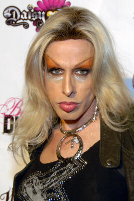

Transgender actress and Hollywood insider who described her early career as being caught in a "tornado of cocaine and pedophilia," was planning a tell-all memoir threatening to expose closeted elites and industry secrets, and died on September 11, 2016 — when all news cycles were consumed by 9/11 memorial coverage.

| Field | Details |
|-------|---------|
| **Full Name** | Alexis Arquette (born Robert Arquette) |
| **Born** | July 28, 1969, Los Angeles, California |
| **Died** | September 11, 2016 |
| **Age at Death** | 47 |
| **Location of Death** | Los Angeles, California |
| **Cause of Death** | Cardiac arrest due to myocarditis stemming from HIV; contributing factors included bacterial endocarditis and cardiomyopathy |
| **Official Ruling** | Natural causes (HIV-related complications) |
| **Category** | Celebrity / Public Figure — Whistleblower |

## Assessment: UNCERTAIN — But Worthy of Documentation

Alexis Arquette's death from HIV-related cardiac arrest after nearly three decades of documented illness is medically plausible, and her family did not dispute the cause. However, her case deserves serious documentation for three reasons: she described her own early career in Hollywood as marked by a "tornado of cocaine and pedophilia"; she was actively building a tell-all memoir threatening to "stop this town" by exposing closeted elites and Hollywood's hidden culture; and she died on September 11, 2016 — the one day each year when her death would receive minimal media attention. The pattern of Hollywood insiders who knew too much dying before their full stories could be published is a documented phenomenon across this investigation. Whether Arquette was a natural death or not, what she knew deserves to be on record.

## Circumstances of Death

Alexis Arquette died on September 11, 2016, at Cedars-Sinai Medical Center in Los Angeles. She was 47 years old. She had been living with HIV for approximately 29 years, having reportedly contracted the virus around 1987 at approximately age 18.

In the weeks before her death, she suffered a serious bacterial infection. She was subsequently placed in a medically induced coma. Her entire family gathered around her bedside in her final days. Her sister Patricia Arquette wrote publicly that the family "held her and sang her David Bowie's 'Starman' as she punched through the veil to the other side."

The official cause of death was not disclosed at the time of her passing. Ten days later, her death certificate was released, listing the cause as: **cardiac arrest, due to myocarditis, due to HIV** — with contributing conditions of bacterial endocarditis and cardiomyopathy (which she had been living with for approximately three years).

The death certificate documentation is consistent with the trajectory of long-term HIV illness. No family member publicly alleged foul play. The medical record, taken alone, does not constitute grounds for suspicion.

What does constitute grounds for documentation is what Arquette knew, what she was planning to say, and when she died.

## Background

### Family and Early Life

Alexis Arquette was the fourth of five children born to Lewis Arquette — an actor, director, and grandson of vaudeville and silent film comedian Cliff Arquette (Charlie Weaver) — and Brenda Olivia "Mardi" Nowak, an actress. The Arquette siblings — Rosanna, Richmond, Patricia, David, and Alexis — all became actors. The family is one of the most connected in Hollywood history.

In the early 1970s, the Arquette family lived on the Skymont Subud commune in Virginia's Shenandoah Valley — a commune that was described by some as cult-like, though the family maintained it was a spiritual community. The children lived in a cabin without running water, electricity, or indoor plumbing. Multiple Arquette siblings have spoken about enduring physical abuse and substance abuse within the household during this period. Patricia Arquette has spoken publicly about the family's turbulent and traumatic childhood.

### Hollywood Entry as a Minor

Arquette's first documented entertainment industry exposure came at approximately **age 12**, when she appeared in the music video "She's a Beauty" by The Tubes in 1982. This was a professional adult entertainment environment involving a child.

Her first film role was in *Down and Out in Beverly Hills* (1986), when she was 16-17. She went on to appear in over 40 films, including *Pulp Fiction* (1994), *The Wedding Singer* (1998), and *Bride of Chucky* (1998). She performed in Hollywood's underground as a female impersonator under the stage name "Eva Destruction" before her public transition.

### Describing Her Early Career: "A Tornado of Cocaine and Pedophilia"

In a 1993 interview for the UK Channel 4 show *The Word* — when she was 23 and speaking about her early years in Hollywood — Arquette described her first role as "an underage MTV darling caught in a tornado of cocaine and pedophilia."

This is not a vague allusion or an outsider's accusation. This is Alexis Arquette, a child who entered Hollywood's professional environment at age 12, describing in her own words what that environment was. She was embedded in Hollywood from childhood. She knew the culture from the inside.

The documentary record of that era confirms the broader environment she was describing. The Digital Entertainment Network (DEN), which operated in the late 1990s when Arquette was an established Hollywood adult, was a major entertainment company that was later exposed as a venue for the sexual abuse of teenage boys. Its founder, Marc Collins-Rector, was convicted in 2004 on charges related to transporting minors across state lines for sex. The 2014 documentary *An Open Secret* documented the DEN operation in detail, including the parties attended by Hollywood's gay A-list at Collins-Rector's mansion. Arquette, as a prominent figure in Hollywood's gay and transgender community throughout the 1990s and 2000s, moved in overlapping circles.

## The Planned Tell-All Memoir: "This Town Will Come to a Stop"

In the months before her death, Arquette was actively considering writing a tell-all memoir. Multiple sources in media reported on this after her death.

According to a friend quoted by *The Shade Room*, Arquette stated: **"She told me she was gearing up, and it was draining her because she knew she could blow the lid off a lot of closeted gay men and women and their respective marriages."** The same friend reported Arquette said: **"I'm not quite ready for that kind of battle. But when I do write my book, and uncover all the hypocrisy, this town will come to a stop."**

According to reporting by *New Zealand Herald* and *The Shade Room*, Hollywood figures were actively aware of the threat. They were reportedly concerned that "Alexis' unfinished writings may end up being published online or in some other form."

The memoir was never completed. The unfinished writings, if they existed in document form, have not been published.

### The Will Smith and Jada Pinkett Smith Accusations (January 2016)

Eight months before her death, Arquette publicly demonstrated that she was willing to use what she knew. In January 2016, during the Oscar diversity controversy, she posted a detailed Facebook rant accusing Will Smith of hypocrisy and making claims about Smith's sexuality, claiming his first marriage ended when his wife allegedly walked in on him "servicing his Sugar Daddy." She also claimed Smith refused to film a required kissing scene with Anthony Rapp in *Six Degrees of Separation* and persuaded the director to shoot around it.

These posts were subsequently deleted. Smith's first wife publicly denied the allegations. But the episode demonstrated Arquette's willingness to name names — and the kind of information she was prepared to publish if she wrote the book she was planning.

### The Jared Leto Claims (2014)

In 2014, Arquette publicly claimed she had been sexually intimate with actor Jared Leto before her transition, and alleged similar encounters with another transgender woman she knew. These claims were made in interviews with *Frontiers Magazine* and *OUT Magazine*. Whether true or false, they established Arquette as someone who documented the private sexual behavior of Hollywood's powerful figures and was willing to discuss it publicly.

## The DEN Network and the Hollywood Abuse Environment She Navigated

The Digital Entertainment Network (DEN), founded by Marc Collins-Rector with co-founders Chad Shackley and Brock Pierce, operated from a Los Angeles mansion in the late 1990s. As documented in *An Open Secret* (2014) and in BuzzFeed investigative reporting:

- DEN held regular parties attended by Hollywood's gay A-list
- Collins-Rector and others were alleged to have sexually assaulted teenage boys at these parties
- In 2000, a New Jersey federal grand jury indicted Collins-Rector on charges of transporting minors across state lines for sex
- Collins-Rector was convicted in 2004 and subsequently renounced his U.S. citizenship, leaving the country
- Pierce (later a major cryptocurrency figure) and Shackley were separately named in civil litigation

Arquette, as a prominent transgender actress and member of Hollywood's LGBTQ community from the late 1980s through the 2000s, moved through the same social circles where these operations occurred. What specific knowledge she had of DEN or similar operations is not publicly documented. But her 1993 description of Hollywood as a "tornado of cocaine and pedophilia" — delivered years before DEN even existed — describes a systemic culture, not an isolated incident.

## Why This Death Raises Questions

- **She described Hollywood as a "tornado of cocaine and pedophilia" from personal experience.** This was not a theory — this was an insider account from a child who entered the industry at 12 and survived it.

- **She was actively planning a memoir that Hollywood figures feared.** According to multiple sources, the planned book would have contained information damaging enough that "this town will come to a stop." Hollywood stars were reportedly monitoring whether her unfinished writings would be published posthumously.

- **She died on September 11.** This is the one day per year when every major media outlet is consumed by 9/11 anniversary coverage. The death of a 47-year-old transgender actress received almost no media coverage on that date. Whether this was coincidence or design cannot be determined from available evidence — but it is worth noting.

- **She had been sick for years, but the timing of the final collapse aligns with the period when her memoir threat was most credible.** In early 2016, she publicly demonstrated her willingness to name names with the Will Smith Facebook posts. The memoir discussions intensified in 2016. She died in September 2016 before the book was written.

- **She grew up in an environment described by the family as involving physical abuse and adult misconduct.** She entered Hollywood professionally at age 12 — the exact age when the industry's exploitation of children typically begins.

- **The pattern.** Arquette joins a documented pattern of Hollywood figures who were preparing to expose the industry's culture of abuse and died before they could publish. See [Isaac Kappy](Isaac_Kappy.md), [Chris Cornell](Chris_Cornell.md), [Chester Bennington](Chester_Bennington.md), and [Avicii (Tim Bergling)](Avicii_Tim_Bergling.md).

## The Counterargument

The counterargument is straightforward and medically documented:

- Arquette had been living with HIV for 29 years — contracted in 1987 before modern antiretroviral therapies were developed.
- She had developed cardiomyopathy approximately three years before her death — a serious, progressive cardiac condition associated with long-term HIV.
- She suffered a bacterial infection three weeks before her death, which precipitated the final cardiac cascade.
- The death certificate provides a clear, medically coherent chain of causation.
- Her family did not dispute the ruling or express any suspicion of foul play.
- The September 11 date is significant culturally but is also simply the date she died — dozens of public figures die each year on 9/11 without foul play.
- The planned memoir targeted closeted gay celebrities, not a pedophile trafficking network — and there is no documented evidence she had specific knowledge of organized trafficking operations rather than the Hollywood culture of hypocrisy and secrecy she had described for decades.
- No credible source — journalistic, forensic, or familial — has alleged that her death was anything other than the documented medical outcome of a three-decade HIV battle.

## Social Media Claims and X.com Coverage

Arquette's death circulates actively on X (formerly Twitter) as a suspicious death, though the claims divide into two distinct tracks — one focused on Hollywood outing, the other on child trafficking.

**The dominant claim — murdered for exposing closeted celebrities:** The most widespread narrative holds that she was killed specifically for threatening to publicly out closeted gay Hollywood figures, centered on her January 2016 Facebook posts about Will Smith and Jada Pinkett Smith. Posts state directly: "they had Alexis Arquette KILLED for going public about Will Smith being a 100% gay man." Other posts frame her death within a broader "Hellywood demons" narrative, claiming she had access to information that "would have stopped the town." These accounts were the most viral and high-engagement of the X posts referencing her death. **Note on defamation:** These are unverified social media claims. No credible source has established that Will Smith or any other living person had involvement in Arquette's death, which has documented medical causation. These claims are documented here as circulating public claims only, not as established facts.

**The fringe claim — Monica Peterson's USB drive:** A smaller but more directly trafficking-relevant claim circulates primarily in accounts focused on Chris Cornell's death. These posts allege that Arquette was about to hand a USB drive containing [Monica Petersen](Monica_Petersen.md)'s Haiti child sex trafficking investigation files to Chris Cornell (who died in May 2017 and is labeled "murdered" in these communities). Under this theory, Arquette serves as the connective link between Petersen's Haiti trafficking research and Cornell's alleged anti-trafficking work, placing her inside the same network of "suicided" investigators that includes Cornell, Chester Bennington, Avicii, Anthony Bourdain, and Kate Spade. No documentary evidence for the USB drive claim has been produced or corroborated by any independent source. It is documented here as a claim circulating within these communities, not as an established fact.

**"Suicided whistleblower" lists:** Arquette appears routinely on social media compilations of celebrities who allegedly knew too much and were killed — lists that also include Cornell, Bennington, Avicii, Bourdain, and Monica Petersen. Posts in this vein state: "their child sex trafficking rings are way too precious to them, and they will eliminate anyone who gets in the way." These lists treat her as part of a broader pattern of elite suppression rather than singling out any specific motive for her death.

**No direct quotes verified:** X searches returned no posts containing verified quotes from Arquette herself about child sex trafficking, pedophilia rings, or organized trafficking operations. The gender-related quotes circulating on X (about biology and chromosomes) are unrelated to trafficking. Her 1993 "tornado of cocaine and pedophilia" interview quote, documented in this profile's Background section, is not widely cited in these posts — suggesting the social media claims rest more on her associations than on her documented statements.

## Key Quotes

> "She told me she was gearing up, and it was draining her because she knew she could blow the lid off a lot of closeted gay men and women and their respective marriages. She said, 'I'm not quite ready for that kind of battle. But when I do write my book, and uncover all the hypocrisy, this town will come to a stop.'"
> — Friend of Arquette, as reported by [The Shade Room](https://theshaderoom.com/22478-2/) (2016)

> "Our brother Robert, who became our brother Alexis, who became our sister Alexis, who became our brother Alexis, taught us tolerance and acceptance. We learned what real bravery is through watching her journey of living as a trans woman."
> — Patricia Arquette, family statement, September 2016

> "When Jada comes out as Gay and her beard husband admits his first marriage ended when she walked in to him butt servicing his Sugar Daddy.. then I will listen to them."
> — Alexis Arquette, Facebook post, January 2016 (subsequently deleted), as reported by [Greg in Hollywood](https://greginhollywood.com/alexis-arquette-goes-after-will-smith-and-jada-pinkett-smith-in-facebook-rant-outing-is-healthy-125161)

## Broader Pattern: Hollywood Insiders Who Died Before the Full Story

Arquette's case sits within a documented cluster of entertainment industry figures who spoke publicly about abuse, were preparing exposés, or were known to hold damaging information — and died before their accounts were fully published:

- **[Isaac Kappy](Isaac_Kappy.md)** — Actor who publicly named Hollywood figures as pedophiles in 2018, said "if I die, it wasn't suicide," fell from an Arizona bridge in May 2019
- **[Chris Cornell](Chris_Cornell.md)** — Musician who backed a child trafficking documentary, found hanged in his hotel room in May 2017; his wife disputes the suicide ruling
- **[Chester Bennington](Chester_Bennington.md)** — Close friend of Cornell, found hanged in July 2017 on what would have been Cornell's birthday, same method
- **[Avicii (Tim Bergling)](Avicii_Tim_Bergling.md)** — Music producer who was working on a documentary about child sex trafficking, died in Oman at age 28 in 2018
- **[Mark Salling](Mark_Salling.md)** — Actor found dead before trial on child pornography charges

## See Also

- [Isaac Kappy](Isaac_Kappy.md) — Actor who publicly named Hollywood pedophiles, fell from a bridge
- [Chris Cornell](Chris_Cornell.md) — Musician supporting trafficking documentary, found hanged
- [Chester Bennington](Chester_Bennington.md) — Found hanged on Cornell's birthday, same method
- [Avicii (Tim Bergling)](Avicii_Tim_Bergling.md) — Worked on trafficking documentary, died at 28
- [Anthony Bourdain](Anthony_Bourdain.md) — Vocal against Hollywood abusers, found hanged in France
- [Peaches Geldof](Peaches_Geldof.md) — Publicly named Scientology-linked child abusers, dead at 25
- [Monica Petersen](Monica_Petersen.md) — Haiti trafficking researcher whose work is alleged in fringe accounts to have been connected to Arquette via a USB drive passed to Chris Cornell

## Other Shocking Stories

- [Nancy Schaefer](Nancy_Schaefer.md): Georgia state senator who exposed CPS child trafficking. Shot in the back while asleep. The gun had no traceable ownership.
- [Isaac Kappy](Isaac_Kappy.md): Named Hollywood executives as pedophiles on camera. Said if he died, it wasn't suicide. Fell from a bridge.
- [Tracy Twyman](Tracy_Twyman.md): Picked up another researcher's work on elite pedophilia. Left a dead man's switch. Found dead at home.
- [Natacha Jaitt](Natacha_Jaitt.md): Argentine model who named powerful pedophiles on live television. Found dead at a party months later.

## Sources

- [Alexis Arquette — Wikipedia](https://en.wikipedia.org/wiki/Alexis_Arquette)
- [Alexis Arquette had HIV, died of cardiac arrest — CNN](https://www.cnn.com/2016/09/21/entertainment/alexis-arquette-cause-of-death)
- ["A Tear in the Ocean": The Final Days of Alexis Arquette — The Hollywood Reporter](https://www.hollywoodreporter.com/movies/movie-news/final-days-alexis-arquette-a-928507/)
- [Actress Alexis Arquette Dies From AIDS-Related Illness; Allegedly Considering Tell-All Book Before Death — The Shade Room](https://theshaderoom.com/22478-2/)
- [Alexis Arquette was planning a tell-all memoir before she died — NZ Herald](https://www.nzherald.co.nz/entertainment/alexis-arquette-was-planning-a-tell-all-memoir-before-she-died/PBIEAPZEPFJTFT55SDCXJDBFAQ/)
- [Alexis Arquette Was Writing Tell-All Book to Expose Hollywood's Closeted Gays — Hollywood Street King](https://hollywoodstreetking.com/alexis-arquette-tell-all-book-closeted-gays/)
- [Alexis Arquette's deathbed secrets stun Hollywood — New Idea](https://www.newidea.com.au/celebrity/alexis-arquette-s-deathbed-secrets-stun-hollywood/)
- [Alexis Arquette goes after Will Smith and Jada Pinkett Smith in Facebook rant — Greg In Hollywood](https://greginhollywood.com/alexis-arquette-goes-after-will-smith-and-jada-pinkett-smith-in-facebook-rant-outing-is-healthy-125161)
- [Marc Collins-Rector — Wikipedia](https://en.wikipedia.org/wiki/Marc_Collins-Rector)
- [An Open Secret — Wikipedia (DEN and Marc Collins-Rector)](https://en.wikipedia.org/wiki/An_Open_Secret)
- [Found: The Elusive Man At The Heart Of The Hollywood Sex Abuse Scandal — BuzzFeed News](https://www.buzzfeednews.com/article/ellievhall/found-the-elusive-man-at-the-heart-of-the-hollywood-sex-abus)
- [How Trans Performer Alexis Arquette Kept Hollywood on Its Toes — Vice](https://www.vice.com/en/article/how-trans-performer-alexis-arquette-kept-hollywood-on-its-toes/)
- [Tragic Details About The Arquette Family — Nicki Swift](https://www.nickiswift.com/738174/tragic-details-about-the-arquette-family/)
- [Alexis Arquette: Planning to "Out" Several Gay Celebrities at Time of Death? — The Hollywood Gossip](https://www.thehollywoodgossip.com/2016/09/alexis-arquette-planning-to-out-several-gay-celebrities-at-time/)

*This information was built by Grok and Claude AI research.*
