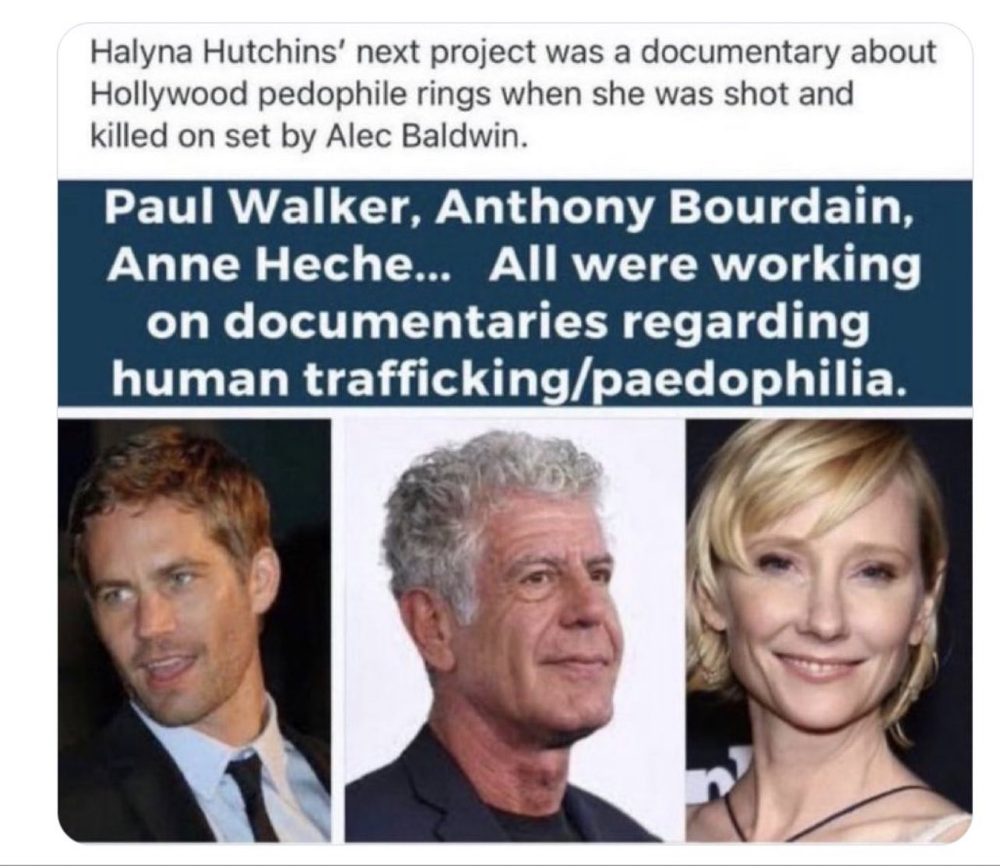

# Anne Heche
Actress who claimed promoting trafficking film, died in fiery car crash in 2022 cluster.

| Field | Details |
|-------|---------|
| **Full Name** | Anne Celeste Heche |
| **Born** | May 25, 1969 |
| **Died** | August 11, 2022 |
| **Age at Death** | 53 |
| **Location of Death** | Mar Vista, Los Angeles, California |
| **Cause of Death** | Inhalation injury and thermal injuries sustained in a car crash |
| **Official Ruling** | Accidental |
| **Category** | Celebrity / Public Figure |

## Viral Image: Trafficking Documentary Deaths

*Image circulating on social media claims: "Halyna Hutchins' next project was a documentary about Hollywood pedophile rings when she was shot and killed on set by Alec Baldwin. Paul Walker, Anthony Bourdain, Anne Heche... All were working on documentaries regarding human trafficking/paedophilia." Source: [@thematrixb0t on X](https://x.com/thematrixb0t/status/2044984371694997806), April 17, 2026. Note: These claims have been disputed by fact-checkers including [Newsweek](https://www.newsweek.com/fact-check-were-anne-heche-paul-walker-filming-child-abuse-documentaries-1735950) and [PolitiFact](https://www.politifact.com/factchecks/2022/aug/16/instagram-posts/no-anne-heche-wasnt-murdered-because-she-was-worki/).*

See also: [Paul Walker](Paul_Walker.md) | [Anthony Bourdain](Anthony_Bourdain.md)

## Assessment: UNCERTAIN
Heche's death falls within the documented 2022 cluster of Epstein-adjacent deaths, and her role in a trafficking-themed film shortly before the crash provided a surface-level narrative hook. However, the coroner's toxicology report established cocaine and marijuana impairment at the time of the crash, and no verified evidence connects her to any actual investigation of Epstein-linked networks. The "knew too much" framing appears to be driven by the film's subject matter rather than documented knowledge on Heche's part.

## Connection to Epstein Network
X users claim Heche was promoting or involved in films exposing "the horrors of child sex trafficking" shortly before her fiery car crash. She starred in *Girl in Room 13* (Lifetime, 2022), a film about a mother rescuing her daughter from human trafficking. Viral posts on X and TikTok claim this film was about Epstein's network specifically, though Lifetime confirmed the film was not Epstein-related and it was debunked as such. She is grouped with the musicians and celebrities from the 2017–2018 cluster as another figure allegedly silenced for threatening to expose elite trafficking networks connected to [Epstein](Jeffrey_Epstein.md).

Some posts also tie her death to a congresswoman's recent death (who had been pushing anti-trafficking bills) and to broader Hollywood pedophilia exposure. The recurring claim across platforms is that "she knew too much."

## Circumstances of Death
On August 5, 2022, Heche drove her Mini Cooper at high speed into a two-story home in the Mar Vista neighborhood of Los Angeles, causing a massive fire that engulfed both the vehicle and the residence. Witnesses and doorbell camera footage showed the car traveling erratically before impact. Heche was pulled from the burning vehicle and transported to Grossman Burn Center at West Hills Hospital. She was declared brain dead on August 11 and taken off life support on August 12. The LA County coroner ruled the death accidental, attributing it to inhalation injury and thermal injuries sustained in the crash. Toxicology found cocaine and marijuana in her system at the time of the crash, indicating impairment.

## Background
Anne Heche was an actress known for roles across three decades in film and television, including *Donnie Brasco* (1997), *Wag the Dog* (1997), and multiple television productions. She had been publicly open about being sexually abused by her father as a child and had spoken about the lasting psychological trauma in interviews and in her posthumous memoir *Call Me Anne* (2023). She had a documented history of erratic public behavior attributed to mental health struggles stemming from that abuse.

In 2022, Heche starred in *Girl in Room 13*, a Lifetime film about a mother rescuing her daughter from human traffickers. Lifetime confirmed the film was not based on or connected to Epstein's network. No verified evidence connects Heche to any specific investigation of Epstein-linked networks. The online narrative appears to be based primarily on her role in the trafficking-themed film, the timing of her death during a period of renewed Epstein-related scrutiny, and her personal history as an abuse survivor.

## Why This Death Possibly Raises Questions
- Timing aligns with renewed Epstein file discussions and the 2022 cluster (Brunel, Middleton, Hoffenberg deaths)
- Crash described as erratic and suspicious — her car traveled at high speed into a residence and burst into flames
- Starred in *Girl in Room 13*, a trafficking film, shortly before her death — fueling "knew too much" narratives
- Linked on social media to a congresswoman's death (anti-trafficking legislation) and broader Hollywood pedophilia claims
- Users say she "knew too much" like others and was eliminated to stop exposure
- Posts ask why so many trafficking whistleblowers and promoters die suddenly
- Her history of speaking about childhood sexual abuse by her father gave her personal motivation to expose trafficking

## The Counterargument
The coroner's toxicology report documented cocaine and marijuana impairment, providing a straightforward cause for the erratic driving. PolitiFact found no evidence linking her death to any Epstein-related investigation. Lifetime publicly stated her film was not an Epstein exposé. Heche had a documented history of erratic behavior and mental health struggles. Multiple fact-checkers (PolitiFact, Newsweek, Logically Facts) concluded the murder framing was not supported by evidence.

## Part of the 2022 Death Cluster
Anne Heche's death in August 2022 occurred during a year with multiple Epstein-connected deaths:
- [Jean-Luc Brunel](Jean_Luc_Brunel.md) — February 2022 (hanging in prison)
- [Mark Middleton](Mark_Middleton.md) — May 2022 (hanging + shotgun)
- [Steven Hoffenberg](Steven_Hoffenberg.md) — August 2022 (found dead in apartment)
- Anne Heche — August 2022 (car crash)
- [Kenneth Starr](Kenneth_Starr.md) — September 2022 (surgical complications)
- [Nikolai Mushegian](Nikolai_Mushegian.md) — October 2022 (drowning)

## Key Quotes from Media Coverage

> "I was born into a family culture of abuse. It took years to come to terms with that, and honestly, it's a lifetime's work that will always be ongoing."
> — Anne Heche, in her posthumous memoir *Call Me Anne* (2023), via [Entertainment Tonight](https://www.etonline.com/anne-heches-posthumous-memoir-revelations-her-ellen-degeneres-relationship-history-of-abuse-and)

> "He raped me, he stuck his dick in my mouth, he fondled me, he put me on all fours, and had sex with me."
> — Anne Heche describing her father's abuse, interview with Barbara Walters (2001), via [ABC News](https://abcnews.go.com/2020/story?id=124037&page=1)

> "We found no evidence to support the claim that she was murdered, much less because she was working on a movie about sex offender [Jeffrey Epstein](Jeffrey_Epstein.md)'s crimes."
> — [PolitiFact fact-check](https://www.politifact.com/factchecks/2022/aug/16/instagram-posts/no-anne-heche-wasnt-murdered-because-she-was-worki/) on viral claims linking her death to the trafficking film

> "She knew too much!!!"
> — Viral refrain on TikTok and X following Heche's death, as reported by [Vice](https://www.vice.com/en/article/tiktok-sex-trafficking-anne-heche-death/)

## See Also

- [Jean-Luc Brunel](Jean_Luc_Brunel.md)
- [Mark Middleton](Mark_Middleton.md)
- [Steven Hoffenberg](Steven_Hoffenberg.md)
- [Kenneth Starr](Kenneth_Starr.md)
## Other Shocking Stories

- [Vitaly Churkin](Vitaly_Churkin.md): Russian UN Ambassador. Sudden cardiac event. Cause of death withheld by State Department. Autopsy results sealed.
- [Aaron Swartz](Aaron_Swartz.md): Built the tool that protects whistleblowers. Faced 35 years for downloading research papers. MIT took Epstein's money.
- [Efrain "Stone" Reyes](Efrain_Stone_Reyes.md): Epstein's cellmate who knew what happened that night. Talked to investigators. Dead within months.
- [Jenny Moore](Jenny_Moore.md): Journalist investigating child trafficking. Filed an FBI report. Found dead in a DC hotel weeks later.

## Sources
- LA County coroner's report and toxicology findings
- LAPD investigation report
- Family statements
- X/Twitter threads linking her death to trafficking exposure
- [Entertainment Tonight: Anne Heche's 'Devastated' Director & Co-Star Speak Out About Her Hospitalization](https://www.etonline.com/anne-heches-devastated-director-co-star-speak-out-about-her-hospitalization-and-upcoming-film)
- [LGBTQ Nation: TikTok conspiracy theorists think Anne Heche was murdered for child trafficking film](https://www.lgbtqnation.com/2022/08/tiktok-conspiracy-theorists-think-anne-heche-murdered-child-trafficking-film/)
- [PolitiFact: No, Anne Heche wasn't murdered because she was working on a movie about Epstein](https://www.politifact.com/factchecks/2022/aug/16/instagram-posts/no-anne-heche-wasnt-murdered-because-she-was-worki/)
- [Vice: Conspiracy Theorists on TikTok Are Saying Anne Heche Was Murdered](https://www.vice.com/en/article/tiktok-sex-trafficking-anne-heche-death/)
- [Newsweek: Fact Check — Were Anne Heche, Paul Walker Filming Child Abuse Documentaries?](https://www.newsweek.com/fact-check-were-anne-heche-paul-walker-filming-child-abuse-documentaries-1735950)
- [Hollywood Reporter: Lifetime Reacts to Anne Heche Crash, Provides Update on Her Movie](https://www.hollywoodreporter.com/tv/tv-news/anne-heche-lifetime-movie-girl-in-room-13-1235197212/)
- [Daily Wire: Anne Heche Was Working On Sex Trafficking Film Before Death](https://www.dailywire.com/news/anne-heche-was-working-on-sex-trafficking-film-before-death)
- [Logically Facts: False — Anne Heche's death was not deliberately caused](https://www.logicallyfacts.com/en/fact-check/false-anne-heche-s-death-was-deliberately-caused-because-she-made-a-film-about-human-trafficking)
- [Fox News: Anne Heche — A look at her troubled past and trauma in her own words](https://www.foxnews.com/entertainment/anne-heche-troubled-past-trauma-own-words)
- [Entertainment Tonight: Anne Heche's Posthumous Memoir Revelations](https://www.etonline.com/anne-heches-posthumous-memoir-revelations-her-ellen-degeneres-relationship-history-of-abuse-and)
- [Wikipedia: Anne Heche](https://en.wikipedia.org/wiki/Anne_Heche)
- [Wikipedia: Girl in Room 13 (2022 film)](https://en.wikipedia.org/wiki/Girl_in_Room_13_(2022_film))

*This information was built by Grok and Claude AI research.*

**Status:** Deceased (2022)
