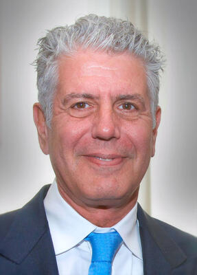

# Anthony Bourdain
Celebrity chef and vocal abuse advocate, found hanged in France with no warning signs.

| Field | Details |
|-------|---------|
| **Full Name** | Anthony Michael Bourdain |
| **Born** | June 25, 1956 |
| **Died** | June 8, 2018 |
| **Age at Death** | 61 |
| **Location of Death** | Le Chambard hotel, Kaysersberg, Alsace, France |
| **Cause of Death** | Hanging |
| **Official Ruling** | Suicide |
| **Category** | Celebrity / Public Figure |

## Assessment: SUSPICIOUS
Bourdain was a vocal public advocate against powerful abusers and died by hanging within the 2017–2018 cluster alongside Cornell, Bennington, Avicii, and Spade. The absence of warning signs reported by his closest friend, combined with a contested relationship timeline, gives the death suspicious elements beyond mere coincidence of method. No verified connection to the Epstein network has been established, but the pattern of the cluster and his advocacy role continue to draw scrutiny.

## Connection to Epstein Network
X posts routinely include Bourdain in the "Silent Children" group, claiming he was collaborating on or supporting the documentary exposing child sex trafficking rings connected to Epstein and elite networks. His outspoken criticism of powerful figures — including Harvey Weinstein after the #MeToo revelations — and his girlfriend Asia Argento's role as a Weinstein accuser are cited as evidence he was threatening powerful interests.

## Circumstances of Death
Anthony Bourdain was found dead in his room at Le Chambard hotel in Kaysersberg, Alsace, France, on the morning of June 8, 2018. He had been filming an episode of CNN's "Parts Unknown" with his close friend Eric Ripert. Ripert found him unresponsive when Bourdain failed to appear for breakfast. He had hanged himself using the belt of his hotel bathrobe. French authorities conducted a full investigation; the Bas-Rhin prosecutor confirmed the death as suicide. A toxicology report released in late June 2018 found no narcotics in his system. There were no signs of forced entry and no signs of a struggle. Ripert told Bourdain's mother that Tony had been "in a dark mood these past couple of days."

## Background
Anthony Bourdain was a celebrity chef, author, and television personality best known for CNN's "Parts Unknown," in which he traveled the world exploring food and culture. He previously wrote the bestselling book "Kitchen Confidential" (2000). He was one of the most vocal public supporters of the #MeToo movement and had been publicly critical of powerful figures accused of sexual abuse, particularly in support of his then-girlfriend Asia Argento's accusations against Harvey Weinstein.

Bourdain had a documented personal history with depression and substance use; he was open in interviews about his prior heroin addiction and the emotional weight of his intense travel schedule. In the days before his death, Argento was photographed with another man in Rome, which was widely reported as a break-up. Friends and colleagues expressed shock at his death, saying there were no clear warning signs publicly visible. His mother said he had shown no indication of suicidal thoughts.

The claimed involvement with "The Silent Children" documentary — a central element of the online conspiracy narrative — has not been verified and has been disputed by fact-checkers. No direct connection between Bourdain and the Epstein network has been established.

## Why This Death Possibly Raises Questions
- Fits the exact 2017–2018 suicide cluster with [Avicii](Avicii_Tim_Bergling.md), [Cornell](Chris_Cornell.md), and [Bennington](Chester_Bennington.md)
- All allegedly silenced for the same documentary project
- Repeated hanging method — matching [Epstein](Jeffrey_Epstein.md), [Brunel](Jean_Luc_Brunel.md), [Cornell](Chris_Cornell.md), [Bennington](Chester_Bennington.md), [Middleton](Mark_Middleton.md), and [Bowers](Thomas_Bowers.md)
- Users argue the sheer number of similar deaths among those "exposing" Epstein-linked networks cannot be coincidence
- His public advocacy against powerful abusers (Weinstein, etc.) is interpreted as extending to Epstein-adjacent networks
- Found by close friend Eric Ripert, who said there were no warning signs

## Part of the 2017–2018 Death Cluster
- [Chris Cornell](Chris_Cornell.md) — May 18, 2017 (hanging)
- [Chester Bennington](Chester_Bennington.md) — July 20, 2017 (hanging)
- [Avicii](Avicii_Tim_Bergling.md) — April 20, 2018 (self-inflicted wounds)
- [Kate Spade](Kate_Spade.md) — June 5, 2018 (hanging)
- Anthony Bourdain — June 8, 2018 (hanging)

## The Counterargument

- Bourdain had a documented personal history with depression and substance use; he was open in interviews about his prior heroin addiction and the emotional weight of his intense travel schedule.
- Friends and colleagues, including Eric Ripert, noted that Bourdain had been in a dark mood in the days leading up to his death — suggesting emotional deterioration rather than an external act.
- The break-up with Asia Argento in the days before his death was widely reported and provides a credible personal precipitant; Argento was photographed with another man shortly before Bourdain died.
- French authorities conducted a full investigation and confirmed the death as suicide; toxicology results showed no narcotics, consistent with an impulsive act rather than a struggle.
- There were no signs of forced entry, no signs of a struggle, and no physical evidence suggesting anyone else was present in the hotel room.
- The "Silent Children" documentary claim — that Bourdain was killed to silence a trafficking exposé — has been investigated by fact-checkers and found to have no verified basis; no such documentary has been confirmed.
- No direct connection between Bourdain and the Epstein network has been established; his inclusion in the death cluster rests primarily on the hanging method and the timing, both of which have mundane explanations.

## Key Quotes from Media Coverage

> "Anthony was a dear friend. He was an exceptional human being, so inspiring and generous. One of the great storytellers of our time who connected with so many."
> -- Eric Ripert, who found Bourdain's body, [TIME: Eric Ripert Speaks Out After Finding Anthony Bourdain Dead](https://time.com/5306636/eric-ripert-statement-anthony-bourdain-death/)

> "He had everything. Success beyond his wildest dreams. Money beyond his wildest dreams."
> -- Gladys Bourdain, Anthony's mother, [Yahoo: Anthony Bourdain's Shocked Mother Speaks Out After Son's Apparent Suicide](https://www.yahoo.com/entertainment/anthony-bourdain-shocked-mother-speaks-012619425.html)

> "Tony had been in a dark mood these past couple of days."
> -- Eric Ripert to Gladys Bourdain, [Euronews: Anthony Bourdain's mother speaks out about his tragic death](https://www.euronews.com/culture/2018/06/11/anthony-bourdain-s-mother-remembers-him-feisty-talented-t130641)

> "His suicide appeared to be an impulsive act.. Toxicology results were negative for narcotics."
> -- French prosecutor Christian de Rocquigny du Fayel, [Fortune: Anthony Bourdain's Toxicology Report Shows No Narcotics in His System](https://fortune.com/2018/06/25/anthony-bourdain-toxicology-report/)
## See Also
- [Chris Cornell](Chris_Cornell.md) — 2017-2018 death cluster; both allegedly linked to trafficking documentary
- [Chester Bennington](Chester_Bennington.md) — 2017-2018 death cluster; same hanging method
- [Avicii (Tim Bergling)](Avicii_Tim_Bergling.md) — 2017-2018 death cluster; died weeks before Bourdain
- [Kate Spade](Kate_Spade.md) — Died by hanging three days before Bourdain in June 2018
- [Jeffrey Epstein](Jeffrey_Epstein.md) — Central figure in the trafficking network Bourdain allegedly threatened
- [Jean-Luc Brunel](Jean_Luc_Brunel.md) — Another hanging death in Epstein network
- [Mark Middleton](Mark_Middleton.md) — Another hanging death linked to Epstein connections
- Jeffrey Epstein Network — The network Bourdain's advocacy allegedly threatened

## Other Shocking Stories

- [Val Broeksmit](Val_Broeksmit.md): His father hanged. He became an FBI informant on Deutsche Bank.
- [Matthew Perry](Matthew_Perry.md): His death exposed an elite ketamine supply network. Five charged including a doctor dubbed the Ketamine Queen.
- [Monica Petersen](Monica_Petersen.md): Trafficking researcher in Haiti. Dead at 32. Ruled suicide. Her colleagues publicly disputed the finding.
- [Steven Silks](Steven_Silks.md): NYPD deputy chief who allegedly viewed the Weiner laptop evidence. First of four officer suicides in 22 days.

## Sources
- French authorities' investigation report
- CNN statement and memorial coverage
- Eric Ripert and family statements
- X/Twitter threads compiling "Silent Children" documentary death cluster
- New York Times, BBC News coverage (June 2018)
- [TIME: Eric Ripert Speaks Out After Finding Anthony Bourdain Dead](https://time.com/5306636/eric-ripert-statement-anthony-bourdain-death/)
- [Fortune: Anthony Bourdain's Toxicology Report Shows No Narcotics in His System](https://fortune.com/2018/06/25/anthony-bourdain-toxicology-report/)
- [Hollywood Reporter: Anthony Bourdain Dead -- CNN Chef Was 61](https://www.hollywoodreporter.com/tv/tv-news/anthony-bourdain-dead-cnn-chef-dies-at-61-1118371/)
- [All That's Interesting: The Inside Story Of Anthony Bourdain's Tragic Death](https://allthatsinteresting.com/anthony-bourdain-death)
- [Euronews: Anthony Bourdain's mother speaks out about his tragic death](https://www.euronews.com/culture/2018/06/11/anthony-bourdain-s-mother-remembers-him-feisty-talented-t130641)
- [Today: Eric Ripert statement on death of friend Anthony Bourdain](https://www.today.com/food/eric-ripert-statement-death-friend-anthony-bourdain-t130547)
- [Rolling Stone: Last Voyage of Anthony Bourdain -- Why the Final Season of 'Parts Unknown' Hits Home](https://www.rollingstone.com/tv-movies/tv-movie-features/anthony-bourdain-parts-unknown-final-season-745718/)
- [MindSite News: Controversial Anthony Bourdain Film Explores the Mystery of Suicide](https://mindsitenews.org/2021/10/19/parts-unknown-controversial-documentary-explores-anthony-bourdains-life-and-death/)
- [The Ringer: The Final Season of 'Anthony Bourdain: Parts Unknown'](https://www.theringer.com/tv/2018/9/25/17900264/anthony-bourdain-parts-unknown-final-season)

*This information was built by Grok and Claude AI research.*
