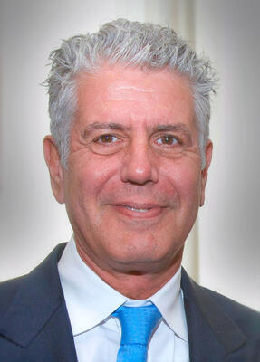
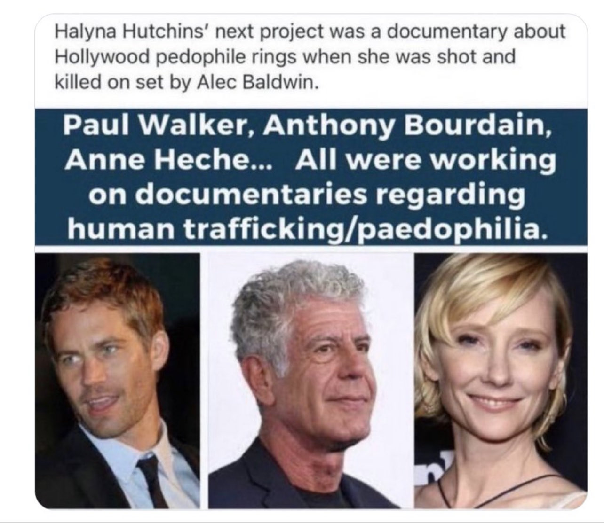

Celebrity chef and CNN host who described Bill Clinton as "rapey" and "grabby" and accused Harvey Weinstein's enablers of facilitating cover-up in his final published interview; found dead by hanging in a French hotel room three days after Kate Spade's hanging, with no suicide note, no warning to family, and his last text message reading "I'll live, and we'll survive."

| Field | Details |
|-------|---------|
| **Full Name** | Anthony Michael Bourdain |
| **Born** | June 25, 1956, New York City, New York |
| **Died** | June 8, 2018 |
| **Age at Death** | 61 |
| **Location of Death** | Le Chambard Hotel, Kaysersberg-Vignoble, Alsace, France |
| **Cause of Death** | Hanging — belt of hotel bathrobe |
| **Official Ruling** | Suicide; no signs of forced entry; toxicology negative for narcotics |
| **Category** | Celebrity / Public Figure |

## Viral Image: Trafficking Documentary Deaths

*Image circulating on social media claims: "Halyna Hutchins' next project was a documentary about Hollywood pedophile rings when she was shot and killed on set by Alec Baldwin. Paul Walker, Anthony Bourdain, Anne Heche... All were working on documentaries regarding human trafficking/paedophilia." Source: [@thematrixb0t on X](https://x.com/thematrixb0t/status/2044984371694997806), April 17, 2026.*

See also: [Paul Walker](Paul_Walker.md) | [Anne Heche](Anne_Heche.md)

## Assessment: SUSPICIOUS

Anthony Bourdain publicly called former President Bill Clinton "a piece of shit," "entitled, rapey, gropey, grabby, disgusting" in a February 2018 interview published just weeks after his June death — words that made enemies of some of the most powerful people in Democratic politics. His girlfriend Asia Argento was the most prominent early accuser of Harvey Weinstein. Three days before his death, fashion designer [Kate Spade](Kate_Spade.md) was found hanged in her New York apartment; the cluster of hanging deaths in the 2017–2018 period is statistically anomalous. Bourdain left no suicide note. His last text to his assistant — sent hours before his death — said "I'll live, and we'll survive." His mother told interviewers he had shown no suicidal ideation. French authorities found no physical evidence of anyone else in the room. The official ruling is suicide, and there is a documented personal context (relationship breakup, prolonged depression, isolation on the road). But the combination of his explosive public statements against powerful people, the death cluster, and the contradiction between his final communications and the suicide ruling warrants documentation.

## Background

### Career

Anthony Michael Bourdain was born June 25, 1956, in New York City. He graduated from the Culinary Institute of America in 1978. Working for years in professional kitchens — including as executive chef at Brasserie Les Halles in Manhattan — he wrote a 1999 exposé of the restaurant industry for *The New Yorker* titled "Don't Eat Before Reading This," which he expanded into the bestselling memoir *Kitchen Confidential: Adventures in the Culinary Underbelly* (2000). The book was raw, explicit, and made him famous.

He parlayed that success into television: *A Cook's Tour* (Travel Channel, 2002–03), *Anthony Bourdain: No Reservations* (Travel Channel, 2005–12), *The Layover* (Travel Channel, 2011–13), and *Anthony Bourdain: Parts Unknown* (CNN, 2013–2018), which won multiple Emmy Awards and Peabody Awards. *Parts Unknown* was distinguished from typical food television by its genuine engagement with geopolitics, poverty, conflict zones, and the human conditions underlying what people eat and how they live.

By 2018 he was one of the most recognized media personalities in the world, with a reported net worth of approximately $16 million and a global platform.

### Personal History

Bourdain was open about a long struggle with heroin addiction that he described as lasting through his 20s. He was sober for many years by the time of his death. He had been married twice: to Nancy Putkoski (1985–2005) and to Ottavia Busia (2007–2016), with whom he had a daughter, Ariane, born 2007. His love for his daughter was frequently cited in interviews as a primary source of meaning in his life.

In 2016, filming the Rome episode of *Parts Unknown*, he met Italian actress and director Asia Argento and the two began a romantic relationship. Argento would become one of the most prominent figures in the #MeToo movement.

### His Role in #MeToo

When Ronan Farrow's October 2017 *New Yorker* article exposed Harvey Weinstein's decades of sexual assault, Asia Argento was among the accusers. Bourdain immediately became one of the most vocal and aggressive male public figures supporting the movement. He used his platform on social media and in interviews to name abusers, shame enablers, and call out the institutional silence that protected them.

In December 2017, he tweeted: *"I ain't 'woke.' I was lucky enough to meet one, truly extraordinary woman."* His advocacy went far beyond performative allyship — he attacked powerful figures by name and encouraged others to do the same.

## What He Was Saying Before He Died

This is the most critical element of the case. In February 2018 — four months before his death — Bourdain sat for a lengthy interview with journalist Maria Bustillos for the publication *Popula*. The interview was not published until July 15, 2018, more than a month after his death. Its contents were explosive.

### On Bill Clinton

> "Bill Clinton, look, the bimbo eruptions — it was fucking monstrous. That would not have flown today. A piece of shit. Entitled, rapey, gropey, grabby, disgusting, and the way that he — and she — destroyed these women and the way that everyone went along, and, and are blind to this!"
> — **Anthony Bourdain**, *Popula* interview, February 2018 (published posthumously, July 2018)

He explicitly criticized Hillary Clinton for her role in managing accusations against her husband:

> "Hillary Clinton is very busy calling Donald Trump a rapist — which may well be true — while she is protecting a known rapist and is pals with a bunch of other rapists."

### On Harvey Weinstein

Bourdain was so disgusted with Weinstein that he spent part of the interview describing in visceral detail how he imagined Weinstein would die — alone, having a stroke in his hotel bathroom, knowing no one would help him. He said: *"As much as I'd like to see him, you know, beaten to death in his cell..."* before pivoting to his hypothetical.

His contempt for Weinstein was inseparable from his relationship with Asia Argento, who had been assaulted by Weinstein and had come forward publicly at enormous personal cost.

### Other Targets

In the same interview, Bourdain criticized media figures and New York Times opinion columnists by name. He was not hedging or softening — he was, in his final recorded public statement on these subjects, burning his bridges with some of the most powerful institutions in American media and politics.

## Circumstances of Death

### The Timeline

**June 5, 2018:** Fashion designer Kate Spade found hanged in her New York apartment, using the red scarf of her Marc Jacobs bag. Ruled suicide.

**June 6–7, 2018:** Bourdain is filming an episode of *Parts Unknown* in the Alsace region of France, accompanied by close friend and acclaimed chef Éric Ripert. Photos of Asia Argento with French reporter Hugo Clément — photographed in the lobby of Rome's Hotel de Russie, a hotel Bourdain and Argento had shared — are published by the British tabloid *Daily Mail*.

**June 7, 2018:** Bourdain sees the photos. He texts Argento, telling her "you were careless. You were reckless with my heart. My life." Argento responds: "I can't take this." She ends the relationship. In his final text to her, Bourdain writes: "Is there anything I can do?" She replies: "Stop busting my balls." He writes: "OK."

Also on June 7: Bourdain texts his assistant Laurie Woolever, asking her to schedule a lunch, a haircut, a doctor appointment, and a private jiu-jitsu training session for the week after his return to New York. When Woolever asks if he is doing OK, he responds: **"I'll live, and we'll survive."** He also tells her to ignore media inquiries about the Argento photos but to let him know when the tabloid story drops.

**Morning of June 8, 2018:** Bourdain fails to appear for breakfast. Ripert, who had expected to join him, tries to reach him by phone. A receptionist is sent to Bourdain's room and discovers him unresponsive in the bathroom, hanging from the belt of his hotel bathrobe.

### The Physical Circumstances

Bourdain was found hanging in the bathroom of his room at Le Chambard Hotel in Kaysersberg-Vignoble. The hanging was accomplished with the bathrobe belt. French prosecutor Christian de Rocquigny du Fayel issued a statement confirming:

- No signs of forced entry to the room
- No signs of a struggle
- No signs of violence on Bourdain's body
- Toxicology showed no narcotics in his system
- The death appeared to be an impulsive act

No formal suicide note was found. The farewell Facebook post left by Sabrina Bittencourt exists; no equivalent exists for Bourdain — only the final texts, none of which read as a goodbye.

## The Claimed Connection to Child Trafficking

Claims circulate widely on social media — and are reproduced in the viral image at the top of this page — that Bourdain was killed to silence a documentary about elite child sex trafficking rings, sometimes called "The Silent Children." These claims have been investigated by multiple fact-checkers (Snopes, PolitiFact, Newsweek) and the conclusion is consistent: **no credible evidence exists that Bourdain was working on any such documentary, and no such documentary has been confirmed to exist.**

What *is* documented is the following:

1. Bourdain was one of the most prominent male voices naming powerful abusers publicly.
2. His girlfriend was the leading accuser of the most powerful man in Hollywood.
3. His final recorded interview contained attacks on Bill Clinton and Hillary Clinton that were published after his death and received national coverage.
4. He died three days after [Kate Spade](Kate_Spade.md), three weeks after the one-year anniversary of [Chris Cornell](Chris_Cornell.md)'s hanging death, and approximately 13 months after [Chester Bennington](Chester_Bennington.md)'s hanging death.
5. His mother told interviewers she had no indication he was suicidal.

The documented case for his death being suspicious rests on what he actually said and who he actually named — not on unverified documentary claims.

## Why This Death Raises Questions

- **His last text said the opposite of goodbye**: "I'll live, and we'll survive" — sent to his assistant while scheduling appointments for the week after his return home — does not read as the communication of a man who has decided to die hours later.
- **No suicide note**: French authorities found no note. Bourdain was a writer — one of the most fluent communicators of his generation. The absence of any written farewell is notable.
- **His mother had no warning**: Gladys Bourdain told interviewers: "He had everything. Success beyond his wildest dreams. Money beyond his wildest dreams." She said he had shown no indication of suicidal thoughts.
- **Part of a statistically anomalous cluster**: [Chris Cornell](Chris_Cornell.md) — hanged May 18, 2017. [Chester Bennington](Chester_Bennington.md) — hanged July 20, 2017. [Avicii](Avicii_Tim_Bergling.md) — died April 20, 2018. [Kate Spade](Kate_Spade.md) — hanged June 5, 2018. Anthony Bourdain — hanged June 8, 2018. Five public figures connected to causes that threatened powerful people dying within 13 months, four by hanging.
- **Named the Clintons publicly in his final interview**: His *Popula* interview, calling Bill Clinton "rapey," "gropey," and "a piece of shit" while accusing Hillary of protecting "known rapists" — was conducted in February 2018 and published posthumously. He knew it would come out. He made enemies with this interview that would have been felt at the highest levels of Democratic Party establishment.
- **Asia Argento's centrality**: His girlfriend's role as lead Weinstein accuser made him a supporting pillar of the entire Weinstein prosecution narrative. Attacking Weinstein's protection network meant attacking the Clinton network that had financially and socially enabled Weinstein for decades.
- **Hanging method matches the cluster**: The repeated method across the 2017–2018 cluster — Cornell, Bennington, Spade, Bourdain — using ligatures, in private spaces, with no physical evidence of others present, mirrors the documented forensic signature of staged hangings.
- **Scheduling appointments for the following week**: A man who scheduled a haircut, a doctor visit, and jiu-jitsu training hours before his death is behaving in a manner inconsistent with someone who has made a final decision.

## Part of the 2017–2018 Death Cluster

| Person | Date | Method | Connection |
|--------|------|--------|------------|
| [Chris Cornell](Chris_Cornell.md) | May 18, 2017 | Hanging | Musician who allegedly investigated trafficking |
| [Chester Bennington](Chester_Bennington.md) | July 20, 2017 | Hanging | Cornell's close friend; died on Cornell's birthday |
| [Avicii (Tim Bergling)](Avicii_Tim_Bergling.md) | April 20, 2018 | Self-inflicted wounds | Electronic musician; produced anti-trafficking content |
| [Kate Spade](Kate_Spade.md) | June 5, 2018 | Hanging | Fashion designer; family disputed suicide ruling |
| Anthony Bourdain | June 8, 2018 | Hanging | Celebrity chef; named Clinton and Weinstein publicly |

## The Counterargument

The official ruling is suicide by hanging, and the evidence supporting it is substantial:

- Bourdain had a documented decades-long history with heroin addiction and described himself in his final texts as hating his celebrity, hating travel, hating fame: *"I hate my fans, too. I hate being famous. I hate my job."* and *"I am lonely and living in constant uncertainty."*
- Éric Ripert, his closest friend, told Bourdain's mother that Tony had been "in a dark mood these past couple of days" — suggesting observable emotional deterioration.
- Asia Argento ended their relationship via text on the day before his death. The biographical evidence of Bourdain's emotional fragility in the relationship is extensive.
- The breakup of a relationship has been the proximate trigger for thousands of impulsive suicides. The impulse theory is consistent with the toxicology (no narcotics — an impulsive act, not a premeditated one) and the absence of a note.
- French authorities found no physical evidence whatsoever of another person's presence.
- The "Silent Children" documentary claim — that Bourdain was killed to stop a trafficking exposé — has been thoroughly debunked by fact-checkers. No such film existed or was in development.
- His criticism of the Clintons and Weinstein, while politically explosive, was already public knowledge within media circles. His interview was conducted in February; he was not silenced before it was conducted.

The case against the suicide ruling is circumstantial. The case for it is forensic, corroborated by multiple sources, and consistent with the documented facts of his emotional state.

## Social Media Claims and X.com Conspiracy Theories

X.com (formerly Twitter) hosts a high-volume, long-running set of conspiracy narratives asserting Bourdain was murdered rather than died by suicide. These circulate heavily in MAGA, Q-adjacent, and conspiracy-focused accounts, and some posts have achieved thousands of likes and reposts. Multiple distinct narratives are in circulation, often repeating nearly identical wording across accounts, which is consistent with coordinated posting or viral copy-paste amplification. None of these narratives are supported by forensic evidence, official records, or verified documentation.

**The Standard Hotel / Adam Schiff claim (most viral narrative):** The most widely repeated specific story alleges that Bourdain was staying at The Standard Hotel in West Hollywood and witnessed U.S. Representative Adam Schiff in a compromising situation with an underage boy. Variations allege the boy was drugged, sexually abused, and died; that Bourdain was in an adjacent room and overheard or witnessed the aftermath; that he reported what he saw (in some versions to the FBI); and that he was then killed to prevent his testimony. Specific versions found on X include: *"He was murdered for accidentally witnessing Adam Schiff with an 11 year old black boy who Schiff accidentally killed while having sex with the boy outside Schiff's hotel room — Bourdain's was next to."* Another version: *"Anthony Bourdain was murdered because he was at the Standard Hotel and saw Adam Schiff and Ed Buck with a minor that ended up dead."* A third: *"Bourdain was in the next hotel room, he heard everything, went to the FBI, dead!"* **These claims are unverified. No official investigation, criminal complaint, court filing, press account, or named witness has corroborated any version of this story. Representative Schiff has not been charged with or convicted of any crime. These are unverified social media allegations.** Ed Buck — a Democratic Party donor who was convicted in 2021 of federal drug charges related to the overdose deaths of two Black men in his apartment — is included in some variants but had no documented connection to Bourdain.

**The Clinton trafficking narrative:** A separate cluster of posts claims Bourdain told friends he had obtained "child trafficking dirt" on the Clintons and was silenced before he could act on it. Example post language: *"Anthony Bourdain did not kill himself. He told friends he had child trafficking dirt on The Clintons."* No named friend, source, or document supporting this claim has been publicly identified. What is documented — and what may be feeding this narrative — is Bourdain's actual published interview in which he called Bill Clinton "rapey, gropey, grabby, disgusting" and accused Hillary Clinton of protecting "known rapists." That interview was published posthumously. Posts appear to extrapolate from his real, documented criticism of Clinton to the undocumented claim that he possessed specific trafficking evidence.

**The "Silent Children" documentary narrative:** Multiple posts claim Bourdain, along with Chester Bennington, Chris Cornell, and others, was working on or about to release a documentary called *The Silent Children* exposing widespread elite child trafficking and was murdered to prevent it. This specific claim has been investigated and debunked by Snopes, PolitiFact, and Newsweek. No production records, interviews, agents, studios, or co-producers have confirmed Bourdain's involvement in any such documentary. The project name appears to have originated in unverified online forums; no credible journalism has confirmed it existed in any form tied to Bourdain.

**The grouped celebrity deaths narrative:** Posts repeatedly place Bourdain in a cluster of "silenced celebrities" alongside Cornell, Bennington, Avicii, and sometimes Paul Walker and Anne Heche, all alleged to have been killed for exposing elite trafficking. This narrative has some factual basis in that these deaths occurred in proximity and all involved public figures connected in varying degrees to anti-trafficking advocacy or anti-Weinstein positions. The leap from proximity to murder, however, is not supported by the evidence in any individual case.

**What Bourdain actually said publicly:** Searches for direct quotes from Bourdain about child sex trafficking rings, pedophilia networks, or Epstein produce no documented results. His verified public statements on sexual misconduct focused on adult-on-adult assault: Harvey Weinstein, Bill Clinton, and broader kitchen culture misogyny. One quote circulates in some conspiracy-adjacent posts — a dark-humor reference to Dick Cheney "eating small children" — but this appears to be a joke referencing Cheney's political reputation, not a statement about trafficking. Extrapolating from Bourdain's genuine and documented anti-Weinstein/anti-Clinton positions to conclude he was about to expose child trafficking rings is interpretation, not fact.

**The counter-narrative:** Many X posts, and the weight of investigative journalism and official findings, present the suicide ruling as credible, citing his documented emotional collapse over the Asia Argento relationship breakup, his private texts showing despair and isolation, and the toxicology and scene evidence found by French authorities.

*These social media claims are documented here as evidence of active public narratives surrounding Bourdain's death. They are not independently verified. Claims about named living individuals — including claims about Adam Schiff and the Standard Hotel — are unverified and have not been established by any legal proceeding, official inquiry, or credible reporting.*

## The 2022 Biography and New Details

In 2022, journalist Charles Leerhsen published an unauthorized biography, *Down and Out in Paradise: The Life of Anthony Bourdain*, drawing on recovered text messages and interviews with people close to Bourdain. The biography revealed the specific content of his final texts in detail, including his rage, isolation, and despair over the Argento relationship. The texts do not contain anything suggesting external threat or conspiracy — they read as the communications of a man in acute emotional crisis.

The biography also prompted controversy: Bourdain's ex-wife Ottavia Busia disputed that she had been consulted or had consented to the project.

A 2021 documentary, *Roadrunner: A Film About Anthony Bourdain*, directed by Morgan Neville, generated separate controversy when Neville revealed he had used AI to generate Bourdain's voice reading lines from letters he had never spoken aloud. Ottavia Busia publicly stated: "I certainly was NOT the one who said Tony would have been cool with that."

## Key Quotes

> "Bill Clinton, look, the bimbo eruptions — it was fucking monstrous. That would not have flown today. A piece of shit. Entitled, rapey, gropey, grabby, disgusting, and the way that he — and she — destroyed these women and the way that everyone went along, and, and are blind to this!"
> — **Anthony Bourdain**, *Popula* interview with Maria Bustillos, February 2018 (published posthumously), [Global News coverage](https://globalnews.ca/news/4338118/anthony-bourdain-last-interview-clintons-harvey-weinstein/)

> "I'll live, and we'll survive."
> — **Anthony Bourdain**, final text to assistant Laurie Woolever, June 7, 2018, hours before his death, [Yahoo Entertainment](https://www.yahoo.com/entertainment/anthony-bourdain-former-assistant-shares-162611378.html)

> "He had everything. Success beyond his wildest dreams. Money beyond his wildest dreams."
> — **Gladys Bourdain**, Anthony's mother, [Yahoo: Anthony Bourdain's Shocked Mother Speaks Out](https://www.yahoo.com/entertainment/anthony-bourdain-shocked-mother-speaks-012619425.html)

> "Tony had been in a dark mood these past couple of days."
> — **Éric Ripert**, to Gladys Bourdain after finding the body, [Euronews](https://www.euronews.com/culture/2018/06/11/anthony-bourdain-s-mother-remembers-him-feisty-talented-t130641)

> "His suicide appeared to be an impulsive act. Toxicology results were negative for narcotics."
> — **French prosecutor Christian de Rocquigny du Fayel**, [Fortune](https://fortune.com/2018/06/25/anthony-bourdain-toxicology-report/)

> "Anthony was a dear friend. He was an exceptional human being, so inspiring and generous. One of the great storytellers of our time who connected with so many."
> — **Éric Ripert**, statement after finding Bourdain's body, [TIME](https://time.com/5306636/eric-ripert-statement-anthony-bourdain-death/)

## See Also

- [Kate Spade](Kate_Spade.md) — Fashion designer found hanged three days before Bourdain; family disputed suicide ruling
- [Chris Cornell](Chris_Cornell.md) — 2017–2018 death cluster; hanging death, wife disputed suicide
- [Chester Bennington](Chester_Bennington.md) — 2017–2018 death cluster; hanging death on Cornell's birthday
- [Avicii (Tim Bergling)](Avicii_Tim_Bergling.md) — 2017–2018 death cluster; died April 2018, weeks before Spade and Bourdain
- [Sabrina Bittencourt](Sabrina_Bittencourt.md) — Brazilian activist who exposed an elite child trafficking network; died February 2019
- [Jeffrey Epstein](Jeffrey_Epstein.md) — Central figure in the trafficking blackmail network; died by alleged hanging in custody
- [Jean-Luc Brunel](Jean_Luc_Brunel.md) — Epstein network figure; found hanged in French prison 2022

## Other Shocking Stories

- [Kate Spade](Kate_Spade.md): Found hanged three days before Bourdain. Her husband wore a rat mask to leave the apartment after her death.
- [Chris Cornell](Chris_Cornell.md): Rock legend found hanged. Wife immediately disputed suicide, pointed to sudden behavioral change.
- [Sabrina Bittencourt](Sabrina_Bittencourt.md): Exposed a baby trafficking operation. Her son wrote "they killed my mother." No death certificate exists.
- [Monica Petersen](Monica_Petersen.md): Trafficking researcher in Haiti. Dead at 32. Her colleagues publicly rejected the suicide ruling.

## Sources

- [Popula / Global News: Anthony Bourdain's last interview — Late chef lambastes the Clintons, Harvey Weinstein](https://globalnews.ca/news/4338118/anthony-bourdain-last-interview-clintons-harvey-weinstein/)
- [The Wrap: Anthony Bourdain Wanted to See Harvey Weinstein 'Beaten to Death' in Jail](https://www.thewrap.com/anthony-bourdain-slams-harvey-weinstein-in-just-published-interview/)
- [Vice: Anthony Bourdain Thought Bill Clinton Was a 'Gropey' 'Piece of Shit'](https://www.vice.com/en/article/anthony-bourdain-popula-interview-bill-clinton-weinstein-vgtrn/)
- [Deadline: Anthony Bourdain Imagines Harvey Weinstein Death, Slams Clintons](https://deadline.com/2018/07/anthony-bourdain-harvey-weinstein-death-popula-interview-bill-clinton-hillary-clinton-new-york-times-opinion-writers-1202427002/)
- [Yahoo Entertainment: Anthony Bourdain's former assistant shares heartbreaking final text](https://www.yahoo.com/entertainment/anthony-bourdain-former-assistant-shares-162611378.html)
- [HuffPost: Anthony Bourdain's Dark Final Texts To Asia Argento Revealed In Biography](https://www.huffpost.com/entry/anthony-bourdain-texts-asia-argento_n_63345294e4b08e0e6069154f)
- [Deadline: Anthony Bourdain's Grim Final Days Revealed Through Texts In New Book](https://deadline.com/2022/09/anthony-bourdain-asia-argento-charles-leerhsen-biography-down-and-out-in-paradise-1235127832/)
- [TIME: Eric Ripert Speaks Out After Finding Anthony Bourdain Dead](https://time.com/5306636/eric-ripert-statement-anthony-bourdain-death/)
- [Fortune: Anthony Bourdain's Toxicology Report Shows No Narcotics in His System](https://fortune.com/2018/06/25/anthony-bourdain-toxicology-report/)
- [France 24: French prosecutor reveals details of Bourdain's suicide](https://www.france24.com/en/20180609-french-prosecutor-anthony-bourdains-suicide-hanging-death)
- [NPR: AI Brought Anthony Bourdain's Voice Back to Life in 'Roadrunner' Documentary](https://www.npr.org/2021/07/16/1016838440/ai-brought-anthony-bourdains-voice-back-to-life-should-it-have)
- [All That's Interesting: The Inside Story of Anthony Bourdain's Tragic Death](https://allthatsinteresting.com/anthony-bourdain-death)
- [Snopes: Was Anthony Bourdain About to Expose an Elite Pedophile Ring?](https://www.snopes.com/fact-check/anthony-bourdain-expose-elite-ring/)
- [Hollywood Reporter: Anthony Bourdain Dead — CNN Chef Was 61](https://www.hollywoodreporter.com/tv/tv-news/anthony-bourdain-dead-cnn-chef-dies-at-61-1118371/)
- [Euronews: Anthony Bourdain's mother speaks out about his tragic death](https://www.euronews.com/culture/2018/06/11/anthony-bourdain-s-mother-remembers-him-feisty-talented-t130641)

*This information was built by Grok and Claude AI research.*
