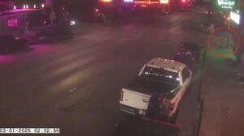

# Austin Tucker Martin
Trump supporter fixated on Epstein files, shot dead by Secret Service breaching Mar-a-Lago with a shotgun.

| Field | Details |
|-------|---------|
| **Full Name** | Austin Tucker Martin |
| **Born** | ~2004/2005 |
| **Died** | February 22, 2026 |
| **Age at Death** | 21 |
| **Location of Death** | Mar-a-Lago, Palm Beach, Florida, USA |
| **Cause of Death** | Shot by U.S. Secret Service agents and Palm Beach County Sheriff's deputy |
| **Official Ruling** | Justified use of force (armed intruder) |
| **Category** | Civilian / Epstein Files Motivated |

## Assessment: NOT SUSPICIOUS — DOCUMENTED MOTIVE

Martin's death was not suspicious in the sense of a cover-up. He was shot by Secret Service after breaching the secure perimeter of the President's residence while armed. His death is documented here because it was directly motivated by the Epstein files and represents a unique case: a person who died because of the Epstein scandal, not as a witness or participant, but as a member of the public driven to action by outrage over perceived government cover-up.

## Circumstances of Death

Austin Tucker Martin, 21, from Moore County, North Carolina, breached the secure perimeter around President Donald Trump's Mar-a-Lago property in Palm Beach, Florida at approximately 1:30 AM on February 22, 2026. He was carrying a shotgun and a gas canister. U.S. Secret Service agents and a Palm Beach County Sheriff's deputy fatally shot him.

## Background and Motive

Martin was an employee at Pine Needles Lodge & Golf Club in North Carolina. He was described as a well-meaning but increasingly frustrated young man. He was an outspoken Christian and strong Trump supporter.

Co-workers reported that Martin became fixated on the Epstein files following the DOJ's major file releases in late 2025 and early 2026. He was deeply disturbed by what he believed was a government cover-up protecting powerful people connected to Epstein.

On February 15, 2026 — one week before the incident — Martin texted a co-worker: **"I don't know if you read up on the Epstein Files, but evil is real and unmistakable."**

Co-workers said he often talked about powerful people "getting away with it" and was frustrated that the Epstein files had not led to more arrests. Outside of work, he was a sketch artist who attempted to sell drawings of local scenery and people.

## Context

Martin's death occurred three days before the February 25, 2026 news cycle about the DOJ withholding Epstein files related to accusations against President Trump. The FBI investigated whether Martin's actions were motivated specifically by the Epstein files. His case illustrates the real-world consequences of the public's frustration over the perceived lack of accountability in the Epstein case.

## Why This Death Is Documented Here

- Directly motivated by the Epstein files and perceived government cover-up
- Represents the first known death of a civilian driven to action by Epstein file disclosures
- His text messages explicitly reference the Epstein files as his motivation
- Occurred during the peak of the 2026 Epstein file release cycle

## Key Quotes from Media Coverage

> "I don't know if you read up on the Epstein Files, but evil is real and unmistakable."
> — Austin Tucker Martin, text message to a co-worker on February 15, 2026, one week before the incident, via [TMZ](https://www.tmz.com/2026/02/22/mar-a-lago-armed-man-shot-dead-texts-show-epstein-files-fixation/)

> "Austin Tucker Martin rarely, if ever, talked about politics, seemed afraid of guns, and came from a family of Trump supporters."
> — Family members describing Martin before his radicalization, via [ABC7](https://abc7chicago.com/post/was-austin-tucker-martin-north-carolina-man-shot-dead-mar-lago-never-interested-politics-guns-family-says/18649936/)

> "He was deeply disturbed by what he believed was a government cover-up and often talked about powerful people 'getting away with it.'"
> — Co-workers at Pine Needles Lodge & Golf Club, via [Newsweek](https://www.newsweek.com/mar-a-lago-suspect-austin-tucker-martin-was-angry-over-epstein-files-report-11564224)
## See Also
- [Jeffrey Epstein](Jeffrey_Epstein.md) — Martin was fixated on the Epstein files before his death
- Jeffrey Epstein Network — The network whose file releases motivated Martin's actions

## Other Shocking Stories

- [Aaron Swartz](Aaron_Swartz.md): Built the tool that protects whistleblowers. Faced 35 years for downloading research papers. MIT took Epstein's money.
- [John Connolly](John_Connolly.md): Co-authored the book that exposed Epstein to millions. Died of a brief illness at 78.
- [LeRoi Moore](LeRoi_Moore.md): Dave Matthews Band saxophonist. Died at 46 from a blood clot. Band's agency CEO later linked to Epstein.
- [Kevin Preiss](Kevin_Preiss.md): NYPD officer who allegedly saw what was on the Weiner laptop. Suicide. The pattern keeps repeating.

## Sources

- [TMZ: Armed Man Shot Dead at Mar-a-Lago Was Fixated on Epstein Files](https://www.tmz.com/2026/02/22/mar-a-lago-armed-man-shot-dead-texts-show-epstein-files-fixation/)
- [The Hill: Epstein files investigated as possible motive](https://thehill.com/homenews/administration/5751104-fbi-probe-martin-epstein/)
- [Newsweek: Mar-a-Lago Suspect Austin Tucker Martin Was Angry Over Epstein Files](https://www.newsweek.com/mar-a-lago-suspect-austin-tucker-martin-was-angry-over-epstein-files-report-11564224)
- [CNN: Armed man shot and killed after entering Mar-a-Lago perimeter](https://edition.cnn.com/2026/02/22/politics/mar-a-lago-man-shot-armed)
- [NewsNation: Law enforcement investigating whether Mar-a-Lago suspect motivated by Epstein](https://www.newsnationnow.com/crime/mar-a-lago-breach-motive-epstein/)
- [The New Republic: Mar-a-Lago Gunman Was a Trump Supporter and Angry About Epstein Files](https://newrepublic.com/post/206899/mar-a-lago-gunman-trump-supporter-epstein-files)
- [ABC7: Who was Austin Tucker Martin? North Carolina man shot dead at Mar-a-Lago](https://abc7chicago.com/post/was-austin-tucker-martin-north-carolina-man-shot-dead-mar-lago-never-interested-politics-guns-family-says/18649936/)
- [The Daily Beast: Mar-a-Lago Gunman's Real Politics Revealed as Leavitt Blames Dems](https://www.thedailybeast.com/mar-a-lago-gunmans-real-politics-revealed-as-leavitt-blames-dems/)
- [Detroit News: Armed man shot dead at Mar-a-Lago was obsessed with Epstein files](https://eu.detroitnews.com/story/news/nation/2026/02/23/armed-man-shot-dead-at-mar-a-lago-was-obsessed-with-epstein-files-reports-say/88829237007/)
- [La Voce di New York: Who Was Austin Tucker Martin, the Armed Man Shot Dead at Mar-A-Lago?](https://lavocedinewyork.com/en/news/2026/02/24/man-wielding-shotgun-and-gas-cannister-shot-dead-at-mar-a-lago/)
- [Post Millennial: 21-year-old Austin Martin who was shot, killed during 'unauthorized entry' to Mar-a-Lago was obsessed with Epstein files](https://thepostmillennial.com/breaking-man-who-tried-to-breach-mar-a-lago-identified-as-21-year-old-from-nc)
- [Spectrum News NC: N.C. man killed at Mar-a-Lago wasn't interested in politics or guns, cousin says](https://spectrumlocalnews.com/nc/charlotte/news/2026/02/23/austin-martin-shot-mar-a-lago-trump-)

*This information was built by Grok and Claude AI research.*
