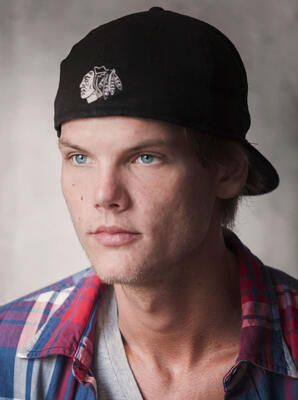

World-famous DJ who created a music video explicitly depicting a child trafficking ring being exposed and violently dismantled, died at 28 at an Omani royal estate from self-inflicted wounds; the night before, fans described him as cheerful and "full of life."

| Field | Details |
|-------|---------|
| **Full Name** | Tim Bergling (stage name: Avicii) |
| **Born** | September 8, 1989, Stockholm, Sweden |
| **Died** | April 20, 2018 |
| **Age at Death** | 28 |
| **Location of Death** | Muscat, Oman — estate owned by the Omani royal family |
| **Cause of Death** | Self-inflicted wounds from broken glass; died of blood loss |
| **Official Ruling** | Suicide |
| **Nationality** | Swedish |
| **Killed on US Soil** | No |
| **Category** | Celebrity / Public Figure |

## Assessment: SUSPICIOUS

Avicii's death presents a genuinely unresolved contradiction: the night before he was found dead, multiple independent witnesses — fans and hotel staff — described him as cheerful, engaged, and "full of life." A close colleague who had just spent weeks with him in the studio said he "didn't seem like a guy at the end of his days." His brother flew to Oman specifically to seek answers. These documented observations sit uneasily against the official suicide ruling. His 2015 music video "For a Better Day" explicitly depicted a child trafficking ring with the final frame displaying the word "pedofilia" — and Avicii publicly described his motivation as wanting to start a "louder discussion" about child exploitation. He died within the same 2017–2018 cluster as [Chris Cornell](Chris_Cornell.md), [Chester Bennington](Chester_Bennington.md), [Kate Spade](Kate_Spade.md), and [Anthony Bourdain](Anthony_Bourdain.md) — all ruled suicides, all alleged by researchers to have connections to trafficking exposure work. The Omani investigation was brief, the autopsy findings were not publicly released in full detail, and Oman does not permit independent press scrutiny of such cases.

## Circumstances of Death

On April 8, 2018, Avicii arrived in Muscat, Oman, to vacation with friends connected to the Omani royal family. He was staying at an estate owned by the Omani royal family.

In the days leading up to his death, he was photographed smiling with fans, went kite-surfing and sailing, and held a conference call with his management team to discuss which guest artists he wanted to recruit for his new album. According to Per Sundin, head of Universal Music Sweden, "All his notes were in happy mode. He loved what he had created."

On the evening of April 19 — the night before his death — Avicii was seen at the Muscat Hills Resort. Samiha Al Aboodi, 24, was among the last people to speak with him and described him as being in good spirits, polite, and standing up to greet her. Preetam Ghoshi, a food and drink vendor at the hotel, described Avicii as "cool, a gentleman and full of life," adding that he asked which was the best place to visit in Oman outside of Muscat.

On April 20, 2018, Avicii was found dead. TMZ later reported that the cause of death was self-inflicted injuries with a broken wine bottle or glass, with Bergling dying of blood loss.

Omani authorities conducted two autopsies — one on April 20 and one on April 21 — and announced there was "no criminal suspicion" in the death. The full autopsy findings were not released to the public, and Oman's investigation concluded without an inquest or independent review. No suicide note was publicly confirmed.

Within hours of his death, his older brother David Bergling flew to Oman specifically "to seek answers" about the circumstances, according to The National. David was described as looking into the small group of friends Avicii had been with in the days leading up to his death.

On April 26, the family released an open letter: *"Our beloved Tim was a seeker, a fragile artistic soul searching for answers to existential questions. An over-achieving perfectionist who travelled and worked hard at a pace that led to extreme stress. He really struggled with thoughts about Meaning, Life, Happiness. He wanted to find peace."*

## Background

Tim Bergling, known professionally as Avicii, was one of the world's most successful electronic music producers and DJs. His 2011 track "Levels" became one of the defining anthems of the EDM era; his 2013 crossover hit "Wake Me Up" reached number one in 22 countries. By 2013 he was among the highest-earning musicians in the world.

He played approximately 830 shows globally across seven years. The relentless pace — demanded by his management, according to the 2017 documentary *Avicii: True Stories* — led to severe alcohol dependency, acute pancreatitis, and multiple surgical procedures. In 2012 he was hospitalized for 11 days for acute pancreatitis. Between 2012 and 2014 he was prescribed opioids including OxyContin and Vicodin for pain management, to which he developed an addiction. In 2014, his appendix and gallbladder were both removed. He spent time in rehabilitation in 2015.

In 2016, Bergling retired from live touring entirely, citing his health. He began therapy, practiced Transcendental Meditation, and returned to creating music in the studio — an environment he genuinely loved.

In the months before his death he appeared, by multiple accounts, to be doing better. Songwriter-producer Joe Janiak spent weeks with him at his Los Angeles home studio in early 2018. Janiak stated: *"You could tell he had spent a long time figuring out the puzzle, and he was trying to take charge of his life. He seemed pumped... He didn't seem like a guy at the end of his days."*

The 2024 Netflix documentary *Avicii: I Am Tim*, directed by Henrik Burman, drew on journal entries, family testimonies, and archival footage. His final journal entry, written shortly before his death, read: *"The shedding of the soul is the last attachment, before it restarts!"*

### Manager Dispute

The 2017 documentary *Avicii: True Stories* depicted his former manager Ash Pournouri (also known as Arash Pournouri) as having pressured Bergling to continue performing despite his medical objections, portraying a pattern where management demands overrode the artist's physical and psychological collapse. Pournouri subsequently filed a defamation lawsuit against the documentary's director, calling the portrayal "fictional claims" that misrepresented him as someone who "ruthlessly pushed Tim Bergling to the limit and exploited his career for personal gain." The lawsuit was filed in Stockholm District Court.

## The Child Trafficking Music Video

In September 2015, Avicii released the official video for "For a Better Day," which he co-directed with Levan Tsikurishvili. The video is a direct, unflinching depiction of a child sex trafficking operation and its violent dismantling by the survivors.

The video's narrative shows children being packed into a vehicle and sold as part of a trafficking operation. One of the buyers is a politician. The children who escape grow up into adults who hunt down and execute their traffickers, including the political figure. The final word displayed on screen, branded onto a trafficker, is: **"PEDOFILIA."**

This was not ambiguous symbolism. Avicii publicly explained his intent: *"The promise of a better life often traps families and children into being used as tools for some of the most despicable people on Earth. It's an issue about which I hope to start a louder discussion, especially now with the huge number of families on the move from war torn countries looking for safety and shelter."*

The video drew significant attention when released. It was Avicii's directorial debut and starred Swedish actor Krister Henriksson. He was 25 years old when he made it.

The video remains available on YouTube and has been viewed by tens of millions of people. After his death it generated renewed attention as researchers noted that a mainstream pop figure had explicitly depicted child trafficking by political elites in a video that reached a global audience — three years before he died at 28.

## Why This Death Raises Questions

- **Contradictory witness accounts on the night before death:** Multiple independent witnesses at the hotel — fans and staff — described Avicii as cheerful, engaged, and "full of life" the evening before he was found dead. A close colleague who had just spent weeks with him said he "didn't seem like a guy at the end of his days." These are not secondhand reports; these are direct contemporaneous accounts from people who interacted with him.
- **Brother flew to Oman specifically for answers:** David Bergling, Avicii's older brother, traveled immediately to Oman after the death and was specifically described in multiple news reports as being there to "seek answers" and investigate the small group of friends present during the final days.
- **Omani royal estate — unusual location:** Avicii was not staying at a commercial hotel when he died. He was at an estate owned by the Omani royal family. The political dynamics of an Omani investigation into a death on royal property create obvious structural limitations on any independent inquiry.
- **Two autopsies, no public release:** Oman conducted two autopsies and concluded there was "no criminal suspicion" — but the full findings were never made public. There was no inquest, no independent forensic review, and no Swedish government inquiry into the death of a Swedish citizen.
- **No confirmed suicide note:** No suicide note was publicly confirmed, which is unusual for a death officially ruled suicide.
- **Music video was a deliberate public statement about child trafficking and pedophile politicians:** The "For a Better Day" video was not vague. It depicted the entire pipeline — children taken from families, sold to elites including a politician, survivors taking revenge — with the word "PEDOFILIA" as the closing image. Avicii publicly stated this was an intentional discussion-starter. He was 25 when he made it and 28 when he died.
- **2017–2018 celebrity death cluster:** His death occurred within the same compressed time window as [Chris Cornell](Chris_Cornell.md) (May 2017, hanging), [Chester Bennington](Chester_Bennington.md) (July 2017, hanging), [Kate Spade](Kate_Spade.md) (June 2018, hanging), and [Anthony Bourdain](Anthony_Bourdain.md) (June 2018, hanging). All ruled suicides. All alleged by researchers to have had connections to child trafficking awareness or exposure work.
- **Management exploitation documented on film:** The *Avicii: True Stories* documentary, released six months before his death, depicted a management relationship in which Bergling was repeatedly pressured to perform against his own medical objections. His former manager subsequently sued over the portrayal — but the documentary's account is consistent with Bergling's own documented statements and the multiple hospitalization events.
- **"Full of life" to dead within 24 hours:** The speed of the transition — from being described by independent witnesses as happy and socially engaged one evening, to being found dead the following day — is a documented fact that warrants examination.

## The "Silent Children" Documentary Claim — What Is Verified vs. What Is Not

A widely circulated claim holds that Avicii, Chris Cornell, Chester Bennington, and Anthony Bourdain were all working on a documentary called "The Silent Children" exposing elite child trafficking, and were killed to prevent its release.

**What is confirmed:** *The Silent Children* is a real documentary project, originally developed by Lisa Beane and LeRoi Moore of the Dave Matthews Band, focused on child sex trafficking.

**What is confirmed as false:** Producer Arthur Gorson has stated on the record that none of the four celebrities — Avicii, Cornell, Bennington, or Bourdain — were ever involved in the project in any capacity. "Completely untrue and preposterous," Gorson told Reuters. Development of the project was halted around 2015, years before the deaths. The claim originated from fringe media outlets including Neon Nettle and has been debunked by Reuters, Lead Stories, and Snopes.

**What remains documented regardless of the debunked claim:** Avicii independently created and publicly released a music video explicitly depicting child trafficking by political elites, explained his personal motivation for doing so, and died at 28 under circumstances that a member of his own family traveled across the world to investigate.

## The Counterargument

Avicii had a severe, well-documented multi-year physical and mental health crisis. His pancreatitis, surgeries, opioid dependency, alcohol dependency, and the psychological collapse triggered by years of management-driven overwork are all fully documented. His own journal entries describe hospital stays as "the most anxiety and stress-free days I can remember." His father, Klas Bergling, stated after the death: "The suicide came as a shock to all of us. And we thought that he was really on a better way before." The family accepted the suicide ruling and established the Tim Bergling Foundation for suicide prevention and mental health advocacy. His final journal entry contained language that could plausibly be interpreted as a metaphysical framing of self-chosen death: *"The shedding of the soul is the last attachment, before it restarts!"* The Omani investigation found no evidence of foul play.

## Social Media Coverage and Community Response

Since Avicii's death in April 2018, X (formerly Twitter) has maintained a large, active community arguing his death was an assassination tied to the "For a Better Day" video's explicit depiction of child trafficking. These claims have not faded — posts from 2025–2026 continue to circulate the core arguments and link them to Epstein client list discussions and current trafficking headlines.

**Core framing on X:** Conspiracy communities on X frame Avicii's death not as a suicide but as a deliberate "suiciding" — a term used in these communities to describe targeted murders staged to appear self-inflicted. The core argument is that the "For a Better Day" video crossed a line powerful interests could not tolerate, and that the roughly three years between the video's release (September 2015) and his death (April 2018) represented a period of warning, pressure, and ultimately elimination. Posts assert he was cheerful with witnesses hours before death, which they treat as incompatible with the official suicide ruling.

**The "record labels warned him" narrative:** A frequently circulated claim holds that record labels or unnamed "elites" warned Avicii that promoting the trafficking video would destroy his career. X users assert he refused to back down, and that his 2016 retirement from live touring — officially attributed to his documented health crisis — was actually a response to industry pressure following the video's release. No verified evidence supporting this specific account has surfaced publicly; it circulates as assertion within X communities.

**Celebrity cluster as coordinated eliminations:** The most prominent recurring theme is the bundling of Avicii's death with those of Chris Cornell (May 2017, hanging), Chester Bennington (July 2017, hanging), and Anthony Bourdain (June 2018, hanging) — all four ruled suicides within approximately 13 months. X accounts including @Jordan_Sather_ have posted detailed threads arguing all four deaths were coordinated hits targeting figures exposing or about to expose elite child trafficking networks. The debunked "Silent Children" documentary claim (addressed in the dedicated section above) remains the most-cited claimed motive in these threads, despite having been refuted on the record by the documentary's actual producer. X communities largely continue to treat the claim as established fact.

**Conspiracy collages:** A distinctive visual format in X trafficking discussions is grid collages — faces of celebrities alleged to have been killed for their knowledge, typically featuring Avicii, Cornell, Bennington, and Bourdain, sometimes alongside Isaac Kappy or others. These images circulate widely as visual arguments for a coordinated pattern of assassinations.

**QAnon and Epstein bundling (2025–2026):** More recent X threads tie Avicii's death to QAnon-adjacent narratives and post-Epstein-arrest discourse, framing his death as part of a broader elite trafficking protection system. These posts frequently appear in threads about Epstein's client list, making Avicii a recurring fixture in active trafficking-conspiracy communities more than seven years after his death.

**What X posts treat as the convergence proof:** Posts consistently frame the combination of (1) the explicit trafficking video, (2) Avicii's public statement about wanting to start a "louder discussion," (3) independent witness accounts describing him as cheerful and "full of life" hours before his death, and (4) the Omani royal estate setting as collectively incompatible with the official suicide ruling. Accounts share clips of the video alongside witness statements and "last interview" footage, urging viewers to "connect the dots."

These narratives originate in X communities and are not independently verified. No evidence of foul play was found by Omani authorities. No independent forensic review has been conducted.

## Key Quotes

> "The promise of a better life often traps families and children into being used as tools for some of the most despicable people on Earth. It's an issue about which I hope to start a louder discussion."
> — Avicii, on the "For a Better Day" music video, [Billboard, 2015](https://www.billboard.com/music/music-news/avicii-directs-videos-for-a-better-day-pure-grinding-6685775/)

> "Our beloved Tim was a seeker, a fragile artistic soul searching for answers to existential questions. An over-achieving perfectionist who travelled and worked hard at a pace that led to extreme stress. He really struggled with thoughts about Meaning, Life, Happiness. He could not go on any longer. He wanted to find peace."
> — Bergling family statement, April 26, 2018, [Billboard](https://www.billboard.com/music/music-news/avicii-death-family-heartfelt-second-statement-8389218/)

> "You could tell he had spent a long time figuring out the puzzle, and he was trying to take charge of his life. He seemed pumped... He didn't seem like a guy at the end of his days."
> — Joe Janiak, songwriter-producer who worked with Avicii weeks before his death, [Rolling Stone](https://www.rollingstone.com/music/music-news/inside-aviciis-final-days-630489/)

> "Cool, a gentleman and full of life."
> — Preetam Ghoshi, hotel vendor who spoke with Avicii the night before his death, [The National](https://www.thenationalnews.com/world/mena/avicii-s-final-hours-fans-recount-meeting-full-of-life-dj-in-oman-hotel-night-before-death-1.723520)

> "The shedding of the soul is the last attachment, before it restarts!"
> — Avicii's final journal entry, as published in Måns Mosesson's *The Official Biography of Avicii* (2022), [EDM.com](https://edm.com/news/aviciis-final-journal-entries-last-words/)

> "The suicide came as a shock to all of us. And we thought that he was really on a better way before."
> — Klas Bergling (Avicii's father), [CBS News](https://www.cbsnews.com/news/avicii-suicide-father-klas-bergling-on-depression-tim-bergling-foundation/)

## See Also

- [Chris Cornell](Chris_Cornell.md) — 2017 death; alleged trafficking documentary connection; hanging
- [Chester Bennington](Chester_Bennington.md) — July 2017 death, two months after Cornell; hanging
- [Anthony Bourdain](Anthony_Bourdain.md) — June 2018 death, weeks after Avicii; hanging
- [Kate Spade](Kate_Spade.md) — June 2018 death, same week as Bourdain; hanging
- [Isaac Kappy](Isaac_Kappy.md) — Openly accused Hollywood figures of child trafficking; died 2019
- [Monica Petersen](Monica_Petersen.md) — Investigating trafficking in Haiti; died 2016
- [LeRoi Moore](LeRoi_Moore.md) — Original co-developer of the *Silent Children* documentary; died 2008

## Other Shocking Stories

- [Chris Cornell](Chris_Cornell.md): Billionaire rockstar who donated millions to find missing children. Found hanged in Detroit hotel room at 52.
- [Chester Bennington](Chester_Bennington.md): Linkin Park frontman and alleged trafficking investigation participant. Died on Chris Cornell's birthday.
- [Isaac Kappy](Isaac_Kappy.md): Actor who publicly named celebrities as pedophiles. Forced off a bridge and killed at 42.
- [Monica Petersen](Monica_Petersen.md): Human trafficking researcher investigating Clinton Foundation connections in Haiti. Died alone at 30.

## Sources

- [Billboard: Avicii's Family Shares Heartfelt Second Statement Following DJ's Death](https://www.billboard.com/music/music-news/avicii-death-family-heartfelt-second-statement-8389218/)
- [Rolling Stone: Inside Avicii's Final Days](https://www.rollingstone.com/music/music-news/inside-aviciis-final-days-630489/)
- [The National: Avicii's final hours — fans recount meeting 'full of life' DJ in Oman hotel night before death](https://www.thenationalnews.com/world/mena/avicii-s-final-hours-fans-recount-meeting-full-of-life-dj-in-oman-hotel-night-before-death-1.723520)
- [The National: Avicii's brother seeks answers in Oman after death of Swedish DJ](https://www.thenationalnews.com/arts-culture/music/avicii-s-brother-seeks-answers-in-oman-after-death-of-swedish-dj-1.723805)
- [Billboard: Avicii Directs 'For a Better Day' and 'Pure Grinding'](https://www.billboard.com/music/music-news/avicii-directs-videos-for-a-better-day-pure-grinding-6685775/)
- [CNN: Avicii's life and death back in the spotlight with new documentary (2025)](https://www.cnn.com/2025/01/02/entertainment/aviciis-life-death-documentary/index.html)
- [EDM.com: Avicii's Final Journal Entries Illuminate Depths of Struggle](https://edm.com/news/aviciis-final-journal-entries-last-words/)
- [CBS News: Avicii suicide — father Klas Bergling on depression and the Tim Bergling Foundation](https://www.cbsnews.com/news/avicii-suicide-father-klas-bergling-on-depression-tim-bergling-foundation/)
- [NPR: Avicii's Family Statement Implies Suicide Was The Cause Of The Young Producer's Death](https://www.npr.org/sections/therecord/2018/04/26/606060983/aviciis-family-statement-implies-suicide-was-the-cause-of-the-young-producer-s-d)
- [For a Better Day — Wikipedia](https://en.wikipedia.org/wiki/For_a_Better_Day)
- [Lead Stories: Fact Check — Avicii, Bennington, Cornell, Bourdain Were NOT Killed For Work On Silent Children Documentary](https://leadstories.com/hoax-alert/2023/08/fact-check-dj-avicii-chester-bennington-chris-cornell-anthony-bourdain-were-not-killed-for-their-work-on-child-sex-trafficking-documentary.html)
- [Rolling Stone: Avicii's Former Manager Files Lawsuit Over Netflix Doc](https://www.rollingstone.com/music/music-news/aviciis-manager-lawsuit-netflix-doc-1235488032/)
- [Snopes: Did DJ Avicii Try to Expose a Pedophile Ring Before He Died?](https://www.snopes.com/fact-check/dj-avicii-expose-pedophile-ring/)
- [Gulf News: Avicii cause of death not suspicious — Oman police](https://gulfnews.com/entertainment/hollywood/avicii-cause-of-death-not-suspicious-oman-police-1.2209369)

*This information was built by Grok and Claude AI research.*
