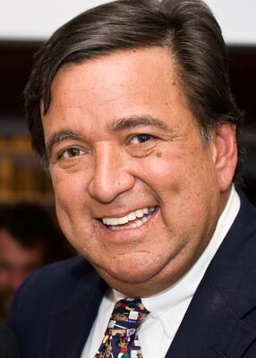

# Bill Richardson
Former NM governor who met Epstein 9+ times after conviction; name removed from children's hospital.

| Field | Details |
|-------|---------|
| **Full Name** | Bill Richardson |
| **Born** | November 15, 1947 |
| **Died** | September 1, 2023 |
| **Age at Death** | 75 |
| **Location of Death** | New Mexico, USA |
| **Cause of Death** | Died in his sleep |
| **Official Ruling** | Natural death |
| **Category** | Politician / Governor |

## Assessment: LOW SUSPICION — LIKELY OLD AGE

Richardson was 75 years old and died in his sleep. While he was named in [Epstein](Jeffrey_Epstein.md) documents and maintained an extensive relationship with Epstein well after his 2008 conviction, his age and the circumstances of death are consistent with natural causes.

## Circumstances of Death

Bill Richardson died in his sleep on September 1, 2023, at his home in New Mexico. He was 75 years old.

## Background

Richardson served as Governor of New Mexico (2003–2011) and as the U.S. Ambassador to the United Nations (1997–1998). He was named in court documents from the civil suit between [Virginia Giuffre](Virginia_Giuffre.md) and [Ghislaine Maxwell](Ghislaine_Maxwell.md), unsealed on August 9, 2019. Giuffre alleged she was sexually trafficked by Epstein and Maxwell to Richardson while she was underage in the early 2000s. Richardson denied the allegations.

## New Mexico Connection

Epstein's [Zorro Ranch](Zorro_Ranch_Unnamed_Victims.md) — the 7,560-acre property near Stanley, New Mexico — was located within the state Richardson governed. Key facts about Richardson's New Mexico ties to Epstein:

- **Campaign donations:** Epstein contributed $50,000 to Richardson's successful campaign for Governor of New Mexico in 2002 and again for his reelection in 2006.
- **Post-conviction meetings:** Records show Richardson arranged to meet with Epstein at least nine times between 2010 and 2018 — well after Epstein's 2008 Florida conviction for procuring minors for prostitution.
- **Flight logs:** Logs released by the U.S. Congress in 2025 showed that in 2011, Richardson and his chief of staff traveled with Epstein and three of his victims from the British Virgin Islands to the U.S. Virgin Islands.
- **Name removal:** In February 2026, the University of New Mexico Hospital (UNMH) quietly removed Bill Richardson's name from its children's hospital tower amid the Epstein file revelations.

## Why This Death Possibly Raises Questions

- Richardson was named in Epstein documents and maintained meetings with Epstein for years after Epstein's 2008 sex offender conviction.
- As Governor of New Mexico, he oversaw the state where Epstein's Zorro Ranch was located — the property associated with the most serious unverified allegations (buried bodies, incinerator concerns).
- Flight logs show he traveled with Epstein and three victims.
- His death came before the most significant Epstein file releases in 2025–2026 and the New Mexico truth commission investigation.
- However, he was 75 years old and died in his sleep, which is consistent with natural causes.

## Key Quotes from Media Coverage

> "Virginia Giuffre alleged that Ghislaine Maxwell directed her to have sex with Richardson by telling her to give him a 'massage,' and that Giuffre had been 'sent to' New Mexico."
>
> — [NBC News: Jeffrey Epstein ordered teen girl to have sex with powerful men, accuser says](https://www.nbcnews.com/news/us-news/jeffrey-epstein-ordered-teen-girl-have-sex-powerful-men-accuser-n1040996)

> "Former New Mexico Gov. Bill Richardson arranged to meet with [Jeffrey Epstein](Jeffrey_Epstein.md) at least nine times after the financier's Florida conviction on sex crimes, including a visit to Epstein's private island. Richardson scheduled meetings with Epstein as late as 2018."
>
> — [Santa Fe New Mexican: Records show Gov. Richardson met with Epstein for years after conviction](https://www.santafenewmexican.com/news/local_news/records-show-gov-richardson-met-with-epstein-for-years-after-conviction/article_daf34b03-39af-4f6a-b016-5db73cc7f4b5.html)

> "The University of New Mexico Hospital has quietly removed former New Mexico governor Bill Richardson's name from one of its buildings amid allegations that he and Jeffrey Epstein kept in close contact years after the financier was convicted of sex crimes."
>
> — [ABQ Journal: UNM quietly removes Bill Richardson name from children's hospital amid Jeffrey Epstein ties](https://www.abqjournal.com/news/unmh-quietly-separates-itself-from-bill-richardson-amid-alleged-connections-with-epstein/2979055)

> "In his limited interactions with Mr. Epstein, he never saw him in the presence of young or underage girls."
>
> — Bill Richardson's spokesperson, denying Virginia Giuffre's allegations ([The Daily Beast: Jeffrey Epstein Accuser Names Bill Richardson, Glenn Dubin, Prince Andrew, George Mitchell](https://www.thedailybeast.com/jeffrey-epstein-unsealed-documents-name-powerful-men-in-sex-ring/))

## See Also

- [Jeffrey Epstein](Jeffrey_Epstein.md) — Primary subject
- [Two Unnamed Foreign Women](Zorro_Ranch_Unnamed_Victims.md) — Alleged burial at Zorro Ranch
- [Brice and Karen Gordon](Brice_Karen_Gordon.md) — Zorro Ranch managers who vanished
- [Virginia Giuffre](Virginia_Giuffre.md) — Accused Richardson of abuse
- [Mary Kennedy](Mary_Kennedy.md) — RFK Jr.'s ex-wife who flew on Epstein's plane; found hanged; Epstein emailed "whoops" upon learning of her death
- [Sergei Krivov](Sergei_Krivov.md) — Russian diplomat found dead at Russian consulate in NYC on Election Day 2016; another death with suppressed investigation details

## Other Shocking Stories

- [Mark Salling](Mark_Salling.md): 50,000 child abuse images. A child abuse manual. Hanged five weeks before sentencing. Distribution network never traced.
- [Steven Hoffenberg](Steven_Hoffenberg.md): FBI cooperator who exposed Epstein's blackmail operation. Found dead in his apartment, body decomposing for a week.
- [Peter Mandelson](Peter_Mandelson.md): Senior UK politician arrested on suspicion of misconduct in public office over alleged Epstein ties. Released on bail; not charged.
- [Johnny Rios](Johnny_Rios.md): NYPD officer. Allegedly viewed the Weiner laptop. Suicide. Six officers connected to that laptop are gone.

## Sources

- [National Enquirer Investigation](https://nationalenquirer.com/more-than-two-dozen-people-linked-to-jeffrey-epstein-have-died-under-mysterious-circumstances/)
- [Wikipedia: Bill Richardson](https://en.wikipedia.org/wiki/Bill_Richardson)
- [Santa Fe New Mexican: Records show Gov. Richardson met with Epstein for years after conviction](https://www.santafenewmexican.com/news/local_news/records-show-gov-richardson-met-with-epstein-for-years-after-conviction/article_daf34b03-39af-4f6a-b016-5db73cc7f4b5.html)
- [ABQ Journal: UNM quietly removes Bill Richardson name from children's hospital amid Jeffrey Epstein ties](https://www.abqjournal.com/news/unmh-quietly-separates-itself-from-bill-richardson-amid-alleged-connections-with-epstein/2979055)
- [NBC News: Jeffrey Epstein ordered teen girl to have sex with powerful men, accuser says](https://www.nbcnews.com/news/us-news/jeffrey-epstein-ordered-teen-girl-have-sex-powerful-men-accuser-n1040996)
- [The Daily Beast: Jeffrey Epstein Accuser Names Bill Richardson, Glenn Dubin, Prince Andrew, George Mitchell in Alleged Sex Ring](https://www.thedailybeast.com/jeffrey-epstein-unsealed-documents-name-powerful-men-in-sex-ring/)
- [The Daily Beast: Former New Mexico Governor Bill Richardson Dead at 75](https://www.thedailybeast.com/former-new-mexico-governor-bill-richardson-dead-at-75/)
- [KOB.com: Former Gov. Bill Richardson's name removed from UNMH building amid Epstein file questions](https://www.kob.com/new-mexico/former-gov-bill-richardsons-name-removed-from-unmh-building-amid-epstein-file-questions/)
- [KRQE: Former Gov. Bill Richardson's name no longer on University of New Mexico Hospital Pavilion building](https://www.krqe.com/news/albuquerque-metro/former-gov-bill-richardsons-name-no-longer-on-unmh-pavilion-building/)
- [Source New Mexico: By the Numbers -- New Mexico mentions in recent Epstein email release](https://sourcenm.com/briefs/by-the-s-new-mexico-mentions-in-recent-epstein-email-release/)
- [CBS News: New Mexico reopens investigation into allegations at Epstein's former Zorro Ranch](https://www.cbsnews.com/news/new-mexico-reopens-investigation-jeffrey-epstein-zorro-ranch/)
- [Taos News: Records show Gov. Richardson met with Epstein for years after conviction](https://www.taosnews.com/public-safety/records-show-gov-richardson-met-with-epstein-for-years-after-conviction/article_42408c83-d94a-45be-bbc7-70f8bce2f512.html)

*This information was built by Grok and Claude AI research.*

**Status:** Deceased (2023)
