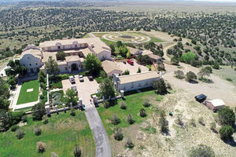

# Brice and Karen Gordon
Zorro Ranch managers for two decades who vanished after Epstein's death and Maxwell's arrest.

| Field | Details |
|-------|---------|
| **Names** | Brice Gordon, Karen Gordon |
| **Nationality** | New Zealand |
| **Status** | Missing / In Hiding since ~2020 |
| **Last Known Location** | Zorro Ranch area, Stanley, New Mexico |
| **Role** | Ranch managers for Epstein's Zorro Ranch (~2000–2019) |
| **Category** | Associates / Potential Witnesses |

## Assessment: MISSING PERSONS AT RISK

Brice and Karen Gordon, a New Zealand couple, managed [Jeffrey Epstein](Jeffrey_Epstein.mdx)'s 7,560-acre Zorro Ranch near Stanley, New Mexico for nearly two decades. After Epstein's death in August 2019 and [Ghislaine Maxwell](Ghislaine_Maxwell.mdx)'s arrest in July 2020, the Gordons disappeared from public view. They have no confirmed address in the United States and no social media presence. Their prolonged absence has been described as "alarming" by New Mexico state legislators investigating the ranch.

## Background

The Gordons were responsible for the day-to-day management of Zorro Ranch, one of Epstein's primary properties. Brice Gordon told the FBI that Epstein flew in guests and "masseuses" to the ranch and hired local massage therapists to work there, including through the Santa Fe spa Ten Thousand Waves.

The couple is listed in Epstein's black book. They would have had extensive firsthand knowledge of:
- Who visited the ranch over two decades
- The activities that took place there
- The staff and "masseuses" brought to the property
- Any construction or modifications to the property (including allegations about a barn with an incinerator)
- The identities of victims brought to the ranch

## Disappearance

After Epstein's death in August 2019 and particularly after Maxwell's arrest in July 2020, the Gordons vanished. Local sources speculate they may have returned to New Zealand. In 2022, a reporter from The Sun newspaper was told to leave a public road near the ranch by a man resembling Brice Gordon driving a red truck, suggesting one or both may still be in the area.

Ean Royal, a former employee whose father worked as Epstein's ranch hand, stated: "I can't believe Karen and Brice have hardly been spoken about. They're ghosts."

## New Mexico Truth Commission

In February 2026, New Mexico state legislators unanimously passed a measure creating a bipartisan "truth commission" to investigate allegations of criminal activity at Zorro Ranch. The commission has subpoena power and a $2 million budget. Commission chairwoman Rep. Andrea Romero told New Zealand media that the Gordons would be considered "people of interest" and could be subpoenaed to testify about their time managing the property.

## Why This Disappearance Raises Questions

- They managed the ranch for nearly two decades and would have been key witnesses to everything that occurred there.
- Multiple victims (Annie Farmer, "Jane," [Virginia Giuffre](Virginia_Giuffre.mdx), Chauntae Davis) have testified that sexual abuse occurred at the ranch.
- An anonymous former employee alleged two foreign girls were buried near the ranch — the Gordons would likely know about any such events.
- Zorro Ranch is the only Epstein property that was never raided by the FBI.
- An FBI report from July 2019 noted concerns about a barn with a chimney and "sally port" that could conceal an incinerator — potentially for destroying evidence.
- The Gordons' complete disappearance from public life after Epstein's death mirrors a pattern of witnesses going silent or dying.

## Key Quotes from Media Coverage

> "I can't believe Karen and Brice have hardly been spoken about. They're ghosts."
> — Ean Royal, former Epstein ranch employee, [Narativ](https://www.narativ.org/p/not-just-buried-bodies-the-managers)

> "New Mexicans deserve to know the truth about what went on at the Zorro Ranch and who knew about it."
> — Rep. Andrea Romero, sponsor of the Epstein Truth Commission bill, [Source New Mexico (February 2026)](https://sourcenm.com/2026/02/16/new-mexico-house-unanimously-enacts-epstein-truth-commission/)

> "He was basically doing anything he wanted in this estate without any accountability whatsoever."
> — Rep. Andrea Romero, on Epstein's operations at Zorro Ranch, [CNN (February 2026)](https://www.cnn.com/2026/02/17/politics/epstein-ranch-new-mexico-house-committee)

> "We are also partnering with our New Mexico Department of Justice to make sure that survivors can come forward, witnesses can come forward, in a way in which is taken seriously unlike years previous."
> — Rep. Anaya, on the Truth Commission's subpoena power, [Al Jazeera (February 2026)](https://www.aljazeera.com/news/2026/2/17/new-mexico-lawmakers-launch-probe-into-epsteins-zorro-ranch)

## See Also

- [Jeffrey Epstein](Jeffrey_Epstein.mdx) — Primary subject, ranch owner
- [Ghislaine Maxwell](Ghislaine_Maxwell.mdx) — Co-conspirator, referenced in burial allegations as "Madam G"
- [Bill Richardson](Bill_Richardson.mdx) — NM governor who met with Epstein at the ranch
- [Two Unnamed Foreign Women](Zorro_Ranch_Unnamed_Victims.mdx) — Alleged buried victims at Zorro Ranch
- [Nadia Marcinko](Nadia_Marcinko.mdx) — Fellow Epstein associate who also disappeared
## Other Shocking Stories

- [Stephen Hawking](Stephen_Hawking.mdx): The world's most famous physicist visited Epstein's island. Photographed there. Died of ALS at 76.
- [Nadia Marcinko](Nadia_Marcinko.mdx): Epstein's personal pilot granted immunity in 2008. Files unsealed in 2024.
- [Sabrina Bittencourt](Sabrina_Bittencourt.mdx): Exposed a baby-selling operation. Died in hiding in Barcelona.
- [Roy Black](Roy_Black.mdx): Defended Epstein in court. One of many lawyers who shielded the operation. Died at home at 80.

## Sources

- [Narativ: Not Just Buried Bodies — The Managers of Epstein's Zorro Ranch Haven't Been Seen in Years](https://www.narativ.org/p/not-just-buried-bodies-the-managers)
- [Time: New Investigation Launched into Epstein's 7,600-Acre Zorro Ranch](https://time.com/7379228/epstein-zorro-ranch-investigation/)
- [NZ Herald: Jeffrey Epstein files reveal New Zealand couple managed his infamous island](https://www.nzherald.co.nz/nz/wellington/jeffrey-epstein-files-reveal-new-zealand-couple-managed-his-infamous-island/AVOH6DTWYJDXRCZ5BG4KRM7XYQ/)
- [Al Jazeera: New Mexico reopens criminal probe related to Epstein's Zorro Ranch](https://www.aljazeera.com/news/2026/2/20/new-mexico-reopens-criminal-probe-related-to-jeffrey-epsteins-zorro-ranch)
- [CNN: New Mexico lawmakers pass measure aimed at investigating Epstein's Zorro Ranch](https://www.cnn.com/2026/02/17/politics/epstein-ranch-new-mexico-house-committee)
- [Source New Mexico: New Mexico House unanimously enacts Epstein 'truth commission'](https://sourcenm.com/2026/02/16/new-mexico-house-unanimously-enacts-epstein-truth-commission/)
- [NBC News: New Mexico approves comprehensive probe of Epstein's Zorro Ranch](https://www.nbcnews.com/politics/politics-news/new-mexico-probe-jeffrey-epstein-zorro-ranch-rcna259292)
- [NZ Herald: New Mexico lawmakers may subpoena NZ couple Brice and Karen Gordon over Epstein links](https://www.nzherald.co.nz/nz/new-mexico-lawmakers-may-subpoena-nz-couple-brice-and-karen-gordon-over-epstein-links/HSCI5OAAXFDCBFTSBHRIHGLYVU/)
- [The Sun: Epstein's Zorro Ranch manager 'vanished' after his death](https://www.the-sun.com/news/1077692/epstein-zorro-ranch-manager-vanished/)
- [CENTRIST NZ: Missing FBI interview notes put NZ Epstein property manager back in focus](https://centrist.nz/missing-fbi-interview-notes-put-nz-epstein-property-manager-back-in-focus/)
- [Santa Fe New Mexican: New Mexico attorney general reopens investigation into Epstein's Zorro Ranch](https://www.santafenewmexican.com/news/local_news/new-mexico-attorney-general-reopens-investigation-into-epsteins-zorro-ranch/article_8de923e3-77ed-4478-97e5-f19468d1f4f4.html)
- [Wikipedia: Zorro Ranch](https://en.wikipedia.org/wiki/Zorro_Ranch)

*This information was built by Grok and Claude AI research.*

**Status:** Unknown (Missing / In Hiding since ~2020)
