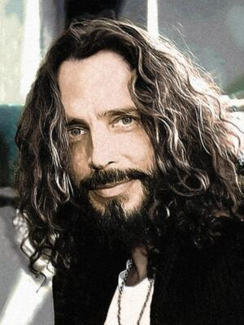

# Chris Cornell
Soundgarden vocalist linked to trafficking documentary, found hanged after concert; wife disputes suicide.

| Field | Details |
|-------|---------|
| **Full Name** | Christopher John Cornell |
| **Born** | July 20, 1964 |
| **Died** | May 18, 2017 |
| **Age at Death** | 52 |
| **Location of Death** | MGM Grand Detroit, Michigan |
| **Cause of Death** | Hanging |
| **Official Ruling** | Suicide |
| **Category** | Celebrity / Public Figure |

## Assessment: SUSPICIOUS

Cornell's death shares the same method — hanging — as at least four others in the Epstein-adjacent death cluster, including his close friend Chester Bennington, who died just two months later. His wife publicly disputes the suicide ruling, citing prescribed Ativan as a potential cause of impaired judgment, and hired a forensic expert who concluded the investigation was prematurely closed. The claimed link to an unreleased child sex trafficking documentary adds a layer of contested but widely circulated motive.

## Circumstances of Death

Cornell was found unresponsive in his room at the MGM Grand Detroit in the early morning hours of May 18, 2017, following a Soundgarden concert at the Fox Theatre. His bodyguard, who had been alerted by Vicky Cornell after Chris mentioned possibly taking extra Ativan, found him in the bathroom. He was pronounced dead at the scene. The Wayne County Medical Examiner ruled the cause of death suicide by hanging. A toxicology report confirmed the presence of Ativan (lorazepam), barbiturates, and other substances in his system at the time of death.

## Background

Chris Cornell was the lead vocalist and co-founder of Soundgarden and Audioslave, widely regarded as one of the most technically gifted rock vocalists of his generation. At the time of his death, Soundgarden had recently released their album *King Animal* (2012) and were on an active tour. Cornell had a documented history of depression and substance use, which he had spoken about publicly, and had been prescribed Ativan for anxiety.

He is alleged by some online sources to have been a key financial backer or driving force behind a project called "The Silent Children," described as an unreleased documentary on child sex trafficking. Certain Cornell lyrics — particularly phrases interpreted as allusions to trafficking rings — are cited on social media as evidence connecting him to networks linked to [Jeffrey Epstein](Jeffrey_Epstein.md) and [Ghislaine Maxwell](Ghislaine_Maxwell.md). Some posts extend this to Maxwell's alleged Venezuelan compound and international trafficking networks. The documentary claim has been disputed by fact-checkers and by the project's actual creators, who say Cornell had no involvement.

## Why This Death Possibly Raises Questions

- Cornell died by hanging, the same method as [Jeffrey Epstein](Jeffrey_Epstein.md), [Jean-Luc Brunel](Jean_Luc_Brunel.md), [Mark Middleton](Mark_Middleton.md), and [Thomas Bowers](Thomas_Bowers.md) — all figures connected to the Epstein network
- His close friend [Chester Bennington](Chester_Bennington.md) died by the same method just two months later, on what would have been Cornell's birthday (July 20, 2017)
- The alleged "Silent Children" documentary project was reportedly halted after Cornell's death
- Some observers argue there was no clear behavioral motive for suicide given his active career, recently completed Soundgarden album, and ongoing tour
- Cornell's bodyguard reportedly noticed slurred speech and unusual behavior in his final hours, attributed to Ativan; Vicky Cornell contacted security after Chris told her he may have taken extra doses
- Vicky Cornell hired a forensic expert who reviewed the investigation and concluded the suicide ruling was premature and that questions remained unanswered
- Cornell's death is part of a documented 2017–2018 cluster of celebrity hangings, several of whom were linked online to trafficking awareness:
  - Chris Cornell — May 18, 2017
  - [Chester Bennington](Chester_Bennington.md) — July 20, 2017
  - [Avicii (Tim Bergling)](Avicii_Tim_Bergling.md) — April 20, 2018
  - [Kate Spade](Kate_Spade.md) — June 5, 2018
  - [Anthony Bourdain](Anthony_Bourdain.md) — June 8, 2018

## The Counterargument

The official ruling is suicide, supported by the Wayne County Medical Examiner's findings and toxicology results showing lorazepam (Ativan), barbiturates, and other substances — all consistent with impaired judgment leading to a self-inflicted death. Cornell had a documented, long-term history of depression and substance abuse, which he had discussed publicly, and his body showed no signs of struggle or forced entry at the scene. His bodyguard discovered him after being dispatched at Vicky Cornell's own request, suggesting the circumstances were unusual to those around him but not necessarily involving outside actors.

The claim that Cornell was connected to "The Silent Children" documentary has been specifically investigated and debunked by fact-checking outlets. The documentary's actual creators have stated he had no involvement. The social media narrative tying his lyrics to trafficking networks relies on speculative lyrical interpretation rather than documented facts.

Vicky Cornell's dispute of the ruling, while genuine and publicly stated, centers on the Ativan prescription as potentially impairing his judgment — which is itself an argument that his death may have been accidental or unintentional rather than deliberately orchestrated. Her forensic expert's criticism of the investigation as premature does not, by itself, constitute evidence of third-party involvement.

## Key Quotes from Media Coverage

> "I know that he loved our children and he would not hurt them by intentionally taking his own life."
> -- Vicky Cornell, [CNN: Chris Cornell's wife disputes 'intentional' suicide finding](https://www.cnn.com/2017/05/19/celebrities/chris-cornell-wife-statement-suicide)

> "When he told me he may have taken an extra Ativan or two, I contacted security and asked that they check on him."
> -- Vicky Cornell, [NBC News: Chris Cornell's Wife Disputes Suicide Ruling, Says Medication Could Have Played Role](https://www.nbcnews.com/pop-culture/music/chris-cornell-s-wife-disputes-suicide-ruling-says-medication-could-n762046)

> "Those pieces didn't fit on May 18, 2017, and they don't fit today."
> -- Vicky Cornell's forensic expert, on the premature suicide ruling, [Detroit News: Chris Cornell widow rips probe year after Detroit death](https://eu.detroitnews.com/story/entertainment/people/2018/05/15/chris-cornell-widow-rips-probe-detroit-death/34918321/)

> "Chris Cornell, in our circle, was known as 'The Voice' because he had the best voice in rock and roll."
> -- Alice Cooper, via [Rolling Stone tribute coverage](https://www.rollingstone.com/music/music-news/chris-cornell-see-best-onstage-tributes-to-soundgarden-singer-120173/)

## See Also
- [Chester Bennington](Chester_Bennington.md) — Close friend; died by hanging two months later on Cornell's birthday
- [Anthony Bourdain](Anthony_Bourdain.md) — 2017–2018 death cluster; both allegedly tied to trafficking documentary
- [Avicii (Tim Bergling)](Avicii_Tim_Bergling.md) — 2017–2018 death cluster; same alleged documentary connection
- [Kate Spade](Kate_Spade.md) — 2017–2018 death cluster; died by hanging in June 2018
- [Jeffrey Epstein](Jeffrey_Epstein.md) — Central figure in the trafficking network Cornell allegedly exposed
- [Ghislaine Maxwell](Ghislaine_Maxwell.md) — Convicted trafficker; Cornell's lyrics allegedly referenced her network
- [Jean-Luc Brunel](Jean_Luc_Brunel.md) — Another hanging death in the Epstein network
- [Mark Middleton](Mark_Middleton.md) — Another hanging death linked to Epstein connections
- Jeffrey Epstein Network — The network the "Silent Children" documentary allegedly targeted

## Other Shocking Stories

- [Philip K. Dick](Philip_K_Dick.md): His home safe blown open with explosives. FBI and CIA confirmed surveillance.
- [Mark Middleton](Mark_Middleton.md): Hanged from a tree AND shot. Clinton aide who let Epstein into the White House.
- [Austin Tucker Martin](Austin_Tucker_Martin.md): Armed 21-year-old breached Mar-a-Lago fixated on Epstein files. Shot dead by Secret Service on the property.
- [Corey Haim](Corey_Haim.md): Allegedly raped on a film set at age 13. Spent 25 years in addiction. Dead at 38.

## Sources
- Wayne County Medical Examiner's report
- Vicky Cornell public statements and legal filings
- X/Twitter threads on "Silent Children" documentary deaths
- TMZ, BBC News, Rolling Stone coverage (May 2017)
- [CNN: Chris Cornell's wife disputes 'intentional' suicide finding](https://www.cnn.com/2017/05/19/celebrities/chris-cornell-wife-statement-suicide)
- [NBC News: Chris Cornell's Wife Disputes Suicide Ruling, Says Medication Could Have Played Role](https://www.nbcnews.com/pop-culture/music/chris-cornell-s-wife-disputes-suicide-ruling-says-medication-could-n762046)
- [Variety: Details Emerge About Chris Cornell's Suicide in Leaked Police Report](https://variety.com/2017/music/news/chris-cornell-suicide-details-leaked-police-report-1202437510/)
- [Billboard: Vicky Cornell Tells Gayle King Chris Cornell's Suicide 'Came From Nowhere'](https://www.billboard.com/music/rock/vicky-cornell-talks-chris-cornell-suicide-gayle-king-1235140241/)
- [CBS Detroit: Cornell Family Disputes Suicide Ruling; Cites Drug He Was Prescribed](https://www.cbsnews.com/detroit/news/chris-cornell-death-dispute/)
- [Detroit News: Unanswered questions in Chris Cornell's death trouble fans](https://eu.detroitnews.com/story/news/local/detroit-city/2017/07/10/chris-cornell-death-fan-questions-unanswered/103567836/)
- [Detroit News: Chris Cornell widow rips probe year after Detroit death](https://eu.detroitnews.com/story/entertainment/people/2018/05/15/chris-cornell-widow-rips-probe-detroit-death/34918321/)
- [Rolling Stone: Ativan: What You Need to Know About Chris Cornell's Anxiety Pills](https://rollingstone.com/culture/culture-news/ativan-what-you-need-to-know-about-chris-cornells-anxiety-pills-124013/)
- [HuffPost: Chris Cornell's Wife Blames Prescription Pills In Heart-Wrenching Statement](https://www.huffpost.com/entry/chris-cornell-wife_n_591f15bee4b03b485cb1236d)
- [Rolling Stone: Chris Cornell's Widow Vicky Pens Letter to Late Singer](https://www.rollingstone.com/music/music-news/chris-cornells-widow-vicky-pens-letter-to-late-singer-im-sorry-you-were-alone-on-final-night-2-193292/)
- [American Songwriter: Behind Chris Cornell's Death and Conspiracy Theories](https://americansongwriter.com/behind-chris-cornells-death-and-conspiracy-theories/)
- [Diffuser.fm: Chris Cornell's Widow Continues Death Investigation](https://diffuser.fm/chris-cornell-widow-investigation/)

*This information was built by Grok and Claude AI research.*

**Status:** Deceased (2017)
