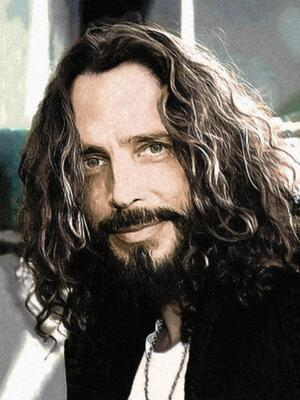

Soundgarden vocalist who ran a foundation fighting child trafficking, found hanged in his hotel room after a concert; his wife disputes the ruling citing a head injury omitted from the autopsy, the death was ruled suicide in under two hours, and his closest friend Chester Bennington was found hanged by the same method exactly two months later — on what would have been Cornell's birthday.

| Field | Details |
|-------|---------|
| **Full Name** | Christopher John Cornell |
| **Born** | July 20, 1964, Seattle, Washington |
| **Died** | May 18, 2017 |
| **Age at Death** | 52 |
| **Location of Death** | Room 1136, MGM Grand Detroit, Michigan |
| **Cause of Death** | Hanging (asphyxiation by rubber exercise band) |
| **Official Ruling** | Suicide |
| **Category** | Celebrity / Public Figure |

## Assessment: SUSPICIOUS

Cornell's wife publicly disputes the suicide ruling. A head injury referenced in two EMS reports was omitted from the final autopsy. The Wayne County Medical Examiner ruled the death a suicide in under **90 minutes** — before toxicology results were complete and before the family was contacted. Cornell's forensic expert concluded the investigation was prematurely closed. The drug levels found in Cornell's system — including Ativan, barbiturates, and other substances — were described by a toxicologist as causing "significant motor and mental impairment" and "synergistic depressant activity" that would impair judgment and cloud intention. Cornell's closest friend, [Chester Bennington](Chester_Bennington.mdx), was found hanged by the same method exactly two months later — on Cornell's birthday. Both men had active foundations working with vulnerable children and both were connected, at various degrees of proximity, to anti-trafficking work. Cornell's foundation specifically listed human trafficking victims as one of its core beneficiary populations.

## Circumstances of Death

### The Night of May 17–18, 2017

Chris Cornell performed with Soundgarden at the Fox Theatre in Detroit on the evening of May 17, 2017. By all accounts, the concert was strong. Cornell was on an active tour with the band.

After the show, Cornell returned to his suite at the MGM Grand Detroit — Room 1136. His personal bodyguard, Kirk Kirsten, accompanied him. Kirsten was in Cornell's room at approximately 11:30 p.m. to help him with his computer. During this visit, Kirsten gave Cornell two Ativan pills.

At approximately 11:35 p.m., Vicky Cornell phoned her husband. She told NBC News and other outlets that she was alarmed by what she heard — his speech was slurred and his behavior seemed unusual, consistent with Ativan impairment. She immediately called Kirsten and asked him to go check on Cornell.

At approximately **12:15 a.m.** on May 18, Kirsten returned to Cornell's suite. He found the door locked. He kicked in both hotel room doors. In the bathroom, he found Chris Cornell on the floor, unresponsive, with a red rubber exercise band around his neck. Cornell had blood in his mouth. Kirsten attempted CPR.

A medic arrived at 12:56 a.m. According to the police report, the medic "untied red exercise band from victim's neck" to begin CPR. Cornell was pronounced dead at the scene.

### The Official Ruling — Made in Under 90 Minutes

The Wayne County Medical Examiner ruled Cornell's death a **suicide by hanging in less than 90 minutes** of arriving at the scene — before the toxicology results were complete, before a full forensic examination was conducted, and before the family had been contacted.

The official cause of death was asphyxiation from the exercise band. The autopsy report stated there were "no other injuries or any diseases present that contributed to death."

### The Head Injury That Was Omitted

Emergency medical responders noted a **laceration to the back of Cornell's skull** in their reports. According to Vicky Cornell, this injury was "referenced in two EMS reports that were left out of the autopsy report." The responding ambulance company's records noted "laceration to back of skull, minor bleeding noted upon crew arrival."

Cornell's family stated the gash was visible and was confirmed by band and crew members who saw Cornell's body. Photographs and video footage allegedly showed the injury.

The final autopsy report made **no mention of this head injury whatsoever.**

Medical examiner Dr. Michael Hunter, reviewing the case for a documentary, stated that on the basis of the autopsy alone — which omitted the EMS-reported head injury — he could "discount head injury as a contributing factor to his death." But the EMS reports that documented the injury were not incorporated into the final autopsy.

### The Drug Levels

The toxicology report found Cornell had the following in his system:
- **Lorazepam (Ativan)** — anti-anxiety medication he had been prescribed for approximately one year
- **Barbiturates**
- Other substances

A toxicologist retained by the Cornell family, Dr. Robert Cote, reviewed the levels and wrote in a three-page report: "Mr. Cornell had drug levels that would cause **significant motor and mental impairment**, and that the combination of drugs found in Mr. Cornell's system have **synergistic depressant activity** which would impair judgment, cloud intention, impair motor coordination, and inhibit the ability to physically respond to danger."

The official autopsy report stated that "drugs did not contribute to death." The family's toxicologist directly disputed this, arguing that drug impairment was central to understanding what happened that night.

### Hotel Surveillance — The Alibi Evidence

Police reviewed hotel surveillance video covering the period after Kirsten left Cornell's suite at approximately 11:35 p.m. until Kirsten returned at 12:15 a.m. The footage reportedly showed nobody entering or exiting the suite during that 40-minute window. Detroit police cited this footage as their primary basis for ruling out homicide.

However, Vicky Cornell and her representatives noted that the investigation was declared closed in under 90 minutes, that critical EMS evidence was not incorporated into the autopsy, and that the drug impairment context was not fully evaluated before the suicide ruling was made definitive.

## Background

### The Voice of a Generation

Christopher John Cornell was born July 20, 1964, in Seattle, Washington. He co-founded Soundgarden in 1984 and became one of the most technically accomplished vocalists in rock history — capable of a range spanning four octaves. Soundgarden's *Superunknown* (1994) won two Grammy Awards and is widely considered among the greatest rock albums ever made. Cornell also co-founded Audioslave, recorded multiple acclaimed solo albums, and wrote and performed the James Bond theme "You Know My Name" for *Casino Royale* (2006).

At the time of his death, Cornell was on tour with a reunited Soundgarden. He had recently stated in interviews that he was in a positive place, working on new material, and looking forward to continued work. His wife Vicky has repeatedly emphasized that she saw no signs that he was planning suicide.

### A History of Addiction and Recovery

Cornell was publicly candid about his history of addiction and depression. He had struggled with substance abuse from his teenage years, gone through recovery, and been sober for an extended period. In the final year of his life, he had been prescribed Ativan (lorazepam) for anxiety. Vicky Cornell's theory is that an unintentional overdose of this medication — combined with other substances — caused severe impairment that led to behavior he would not otherwise have engaged in.

This is not a conspiracy theory. It is Vicky Cornell's genuine, stated belief, supported by a toxicologist's report, that the official ruling of deliberate suicide does not accurately capture what happened.

### The Lawsuit

In 2018, the Cornell family filed a lawsuit in Los Angeles Superior Court against Cornell's physician, Dr. Robert Koblin, alleging that Koblin's prescribing practices for lorazepam — and his failure to adequately monitor Cornell's use — led to the impairment that resulted in his death. The suit alleged negligence in the management of a drug with known risks including impaired judgment and paradoxical aggression. The lawsuit was settled, with terms undisclosed.

## The Chris and Vicky Cornell Foundation — Anti-Trafficking Work

This is a documented, concrete fact — not a conspiracy theory. Chris and Vicky Cornell established **The Chris and Vicky Cornell Foundation** in late 2012 with the explicit mission of protecting vulnerable children.

The foundation's stated mission includes:
- Providing support for **homeless, abused, and at-risk youth**
- Supporting children in **refugee camps**
- Supporting **victims of human trafficking**

From the foundation's website: *"Chris and Vicky formed the foundation based on their personal experiences working in the child protection space."*

Chris Cornell himself stated: *"Children should always feel like the adults are living in this world to nurture them, to take care of them, to protect them from any bad thing that might come."*

After Cornell's death, Vicky Cornell was appointed to the New York Society for the Prevention of Cruelty to Children. The foundation funded music therapy programs for abused children in Seattle. Cornell's legacy is extensively documented in the child protection space.

This means: in the final years of his life, Chris Cornell was actively working in environments with professionals who combat human trafficking, with survivors of trafficking, and with organizations that document and expose trafficking networks.

Social media posts have claimed the foundation's international work — particularly efforts connected to Haiti in the years after the 2010 earthquake — led Cornell to discover evidence of elite trafficking networks, with some posts specifically alleging a Clinton Foundation connection and claims that orphans were being sold into trafficking pipelines. These claims are unverified and have no named source or primary documentation. What is verified is that the foundation's work genuinely intersected with anti-trafficking professionals and survivors. The gap between that documented reality and the more specific unverified allegations is addressed in the Social Media Narrative section above.

## The "Silent Children" Documentary — What Is Actually Known

A documentary project called *The Silent Children* was announced around 2009, described as a proposed feature documentary aiming to "expose the truths of child sexploitation and human trafficking." The project was to be directed by Dean Karr and produced by Lisa Beane and Arthur Gorson. A teaser trailer was released.

Social media posts widely claimed that Cornell was the main financial backer of this film and that his death (and those of Chester Bennington, Avicii, and Anthony Bourdain) was connected to the documentary. These claims went viral.

**What fact-checkers found:** A spokesperson for the project stated that Cornell, Bennington, Avicii, and Bourdain "played no part in the production of 'Silent Children'" and were "not related to the film project in any manner." The production company, JellyBeane Productions LLC, was dissolved on January 9, 2017 — before Cornell's death. Reuters, PolitiFact, and other outlets published fact-checks concluding the celebrity connection claim was false.

**What Vicky Cornell herself said:** On August 25, 2020, Vicky Cornell posted on X/Twitter linking to a Reuters fact-check of the claim, writing: "FROM THE WORLDS MOST TRUSTED NEWS SOURCE Fact check: Avicii, Bennington, Cornell and Bourdain were not working on a child sex trafficking documentary and did not take their own lives." Vicky Cornell, who disputes the suicide ruling in every other respect, specifically denied the Silent Children connection.

**What remains true:** Cornell's foundation did active anti-trafficking work. He did care deeply about child protection. He was working in those spaces. The specific documentary claim is disputed and denied by the people most closely involved.

## Social Media Narrative — X.com and Viral Claims

Since Cornell's death, a robust social media narrative has developed around it — particularly on X.com (Twitter) and in QAnon-adjacent, Pizzagate-style, and anti-elite accounts. High-engagement posts regularly receive tens of thousands of likes and reposts. Understanding this narrative matters for anyone researching Cornell's death: it mixes verified facts with unverified claims, and the combination makes the narrative difficult to assess without separating each element.

No verified direct public quotes from Cornell explicitly naming pedophilia rings, elite trafficking networks, or specific individuals appear in these threads. The claims rest on his philanthropy work, interpreted lyrics, forensic disputes, and timing.

### Core Claims Circulating on X

**Haiti and Clinton Foundation connections**: Posts claim Cornell's foundation partnered with Haiti-based organizations following the 2010 earthquake and that through this work Cornell allegedly discovered a "black book" of elite names involved in child sex trafficking — and was preparing to go public. Some posts connect this to Clinton Foundation-linked Haiti efforts, alleging he learned orphans were being sold into trafficking networks. *What is verified*: The Chris and Vicky Cornell Foundation did support children's programs internationally. The specific claim that Cornell discovered a trafficking "black book" or was preparing to disclose names is unverified and has no named source or primary documentation.

**The "farming babies" lyric interpretation**: Posts frequently screenshot a lyric — often attributed to Temple of the Dog's "Hunger Strike" (1991) or other Cornell tracks — and present it as evidence that Cornell knew about elite child trafficking rings as far back as the early 1990s, treating 1991 songwriting as coded insider knowledge about what he would later "discover" through his foundation work. *What is verified*: The lyric was written in 1991. No contemporaneous interview or documentation links it to trafficking knowledge.

**The "9 cracked ribs" claim**: Some posts claim Cornell had 9 cracked ribs consistent with violent assault prior to death, arguing this is incompatible with self-hanging and evidence of staging. *What is noted in documented sources*: The Cornell family's forensic experts publicly cited the head laceration documented in EMS reports and omitted from the autopsy. The "9 cracked ribs" claim circulates widely on social media but does not appear in major news outlet reporting on the autopsy or in the family's published forensic expert statements. CPR performed by Kirsten and medical responders can cause rib fractures, which the official record may reflect.

**The height/ligature argument**: Posts note that Cornell was 6'2" and argue that with a rubber exercise band used as a ligature, his feet could have touched or nearly touched the floor — raising questions about whether self-hanging was physically feasible in the manner described. This detail has been raised in online forensic discussions. No independent forensic expert has published a definitive analysis of this specific claim.

**Dr. Werner Spitz "questioned the ruling"**: Some posts cite the renowned forensic pathologist Dr. Werner Spitz — who worked on the JFK and MLK assassination investigations — as having questioned Cornell's suicide ruling. *What is confirmed*: Dr. Michael Hunter reviewed the case for a documentary and commented on the head injury omission. Dr. Spitz's involvement or public statements regarding the Cornell case specifically are not confirmed in major reporting, and his citation in social media posts has not been traced to a primary source.

**The broader "silenced celebrities" network**: Cornell is consistently grouped with [Chester Bennington](Chester_Bennington.mdx), [Avicii](Avicii_Tim_Bergling.mdx), and [Anthony Bourdain](Anthony_Bourdain.mdx) as a coordinated pattern of silencing celebrity whistleblowers on Hollywood/music-industry pedophilia rings. Some posts connect the cluster to Podesta emails, Epstein, or "Pizzagate." The deaths are real and documented. Whether they represent a coordinated operation or a cluster of deaths with separate causes is not established by any independent investigation.

### Verified vs. Unverified — Summary

| Claim | Status |
|-------|--------|
| Foundation supported anti-trafficking programs | **VERIFIED** — documented on foundation website |
| Foundation worked internationally with children's programs | **VERIFIED** — foundation's stated mission |
| Haiti/Clinton Foundation connection; Cornell discovered trafficking "black book" | **UNVERIFIED** — no primary source or named witness |
| Cornell planned to go public about trafficking elites | **UNVERIFIED** — no named source or contemporaneous evidence |
| *Silent Children* documentary connection | **DENIED** — by documentary creators and by Vicky Cornell herself |
| Head injury omitted from autopsy | **VERIFIED** — documented in EMS reports; confirmed publicly by Vicky Cornell |
| Drug impairment at time of death | **VERIFIED** — toxicologist retained by family documented it |
| 9 cracked ribs from assault | **UNVERIFIED in major sources** — does not appear in family forensic expert statements or major reporting |
| Exercise band as unusual ligature | **DOCUMENTED** — confirmed in police reports; forensic significance disputed |
| Height/floor-contact argument (6'2", feet may have touched floor) | **CIRCULATING CLAIM** — raised in online forensic discussions; no published independent forensic analysis |
| Dr. Werner Spitz questioned the ruling | **UNVERIFIED** — cited in social media posts; not confirmed in major reporting |
| Bennington died on Cornell's birthday by same method | **VERIFIED** — July 20, 2017; both by hanging |

## The Chester Bennington Parallel

[Chester Bennington](Chester_Bennington.mdx), vocalist of Linkin Park and Cornell's close friend, was found dead on **July 20, 2017** — Cornell's birthday. He had died by hanging. He was 41.

The similarities:
- **Same method**: Both hanged
- **Same period**: Two months apart
- **Close friends**: Bennington sang Temple of the Dog's "Hunger Strike" with Cornell regularly and had led crowds in "Happy Birthday" for Cornell at shows
- **Both had documented personal struggles**: Depression, addiction histories
- **Same time of day**: Both found in the morning hours
- **Bennington's death date**: Fell exactly on what would have been Cornell's 53rd birthday

Bennington's widow, Talinda Bennington, stated that Chester's suicide was "a complete surprise." Like Vicky Cornell, Talinda Bennington emphasized the absence of warning signs.

The probability that a close friend would die by the exact same method on your birthday, two months after your own death, is extremely low by chance. No investigation has established a connection beyond coincidence. But the coincidence is extraordinary.

## The 2017–2018 Celebrity Death Cluster

Cornell's death is one of at least five celebrity hangings in a 13-month period, several of whom were connected to child protection or anti-trafficking work:

| Date | Person | Method | Trafficking/Child Connection |
|------|--------|--------|------------------------------|
| May 18, 2017 | Chris Cornell | Hanging | Foundation supported trafficking victims |
| July 20, 2017 | [Chester Bennington](Chester_Bennington.mdx) | Hanging | Close friend of Cornell; online claims of documentary connection |
| April 20, 2018 | [Avicii (Tim Bergling)](Avicii_Tim_Bergling.mdx) | Found dead | Created "For a Better Day" music video depicting child trafficking rescue |
| June 5, 2018 | [Kate Spade](Kate_Spade.mdx) | Hanging | No documented trafficking connection |
| June 8, 2018 | [Anthony Bourdain](Anthony_Bourdain.mdx) | Hanging | Had spoken out about Harvey Weinstein and predatory behavior; used platform on abuse issues |

Whether this cluster represents coincidence, a shared cultural moment of depression and substance vulnerability, or something more sinister is genuinely unknown. The cluster is real. The anti-trafficking connections range from documented (Cornell's foundation, Avicii's music video) to alleged (others). Each death has its own context and official explanation.

## Why This Death Raises Questions

- **Suicide ruled in under 90 minutes**: The Wayne County Medical Examiner declared Cornell's death a suicide less than an hour and a half after arriving — before toxicology was complete, before the family was consulted, and while the scene was still fresh. Vicky Cornell has called this a "botched investigation" and noted that any competent examiner would have taken longer given the complexity of the situation.

- **Head injury omitted from autopsy**: Emergency responders documented a laceration to the back of Cornell's skull. Two separate EMS reports reference this injury. The final autopsy report contains no mention of it. Vicky Cornell has stated publicly that this injury was visible in photographs, was confirmed by witnesses, and that its omission from the autopsy is one of her central objections to the ruling.

- **Drug impairment context not evaluated**: A toxicologist retained by the family concluded the combination of drug levels in Cornell's system would have caused "significant motor and mental impairment" and impaired judgment. The official autopsy stated drugs did not contribute. The family's expert directly contradicts this.

- **Cornell's bodyguard gave him Ativan at 11:30 p.m.**: Kirsten confirmed he gave Cornell two Ativan tablets that evening. Vicky Cornell specifically cited this — and told Kirsten to check on Cornell — because she noticed impairment in his phone call at 11:35 p.m. The drugs in Cornell's system were not mysterious contaminants. They were administered that night by his own bodyguard.

- **Chester Bennington died on Cornell's birthday by the same method**: The coincidence is mathematical. Two close friends. Same cause of death. July 20 would have been Cornell's 53rd birthday. Bennington left no note either.

- **Cornell's foundation was doing active anti-trafficking work**: This is not speculation. The Chris and Vicky Cornell Foundation's stated mission included supporting human trafficking victims. Cornell was working closely with organizations in that space.

- **The "botched investigation" characterization from the family**: Vicky Cornell's forensic expert stated explicitly that the investigation was premature and that questions remained unanswered. Vicky Cornell stated she was "still looking for answers" one year after his death. This is not a family accepting the official story — it is a family that has publicly and repeatedly said the investigation failed.

- **The exercise band and the height question**: Cornell's use of a red rubber exercise band — not a traditional ligature — is an unusual choice for a deliberate hanging. Exercise bands are not generally what suicidal individuals reach for. Cornell was 6'2". Online forensic discussions have raised the question of whether a rubber exercise band, anchored at door height, would provide sufficient drop for a 6'2" man, or whether his feet could have contacted or nearly contacted the floor — which would complicate the mechanics of death by asphyxiation in the manner described. No published independent forensic expert has definitively resolved this specific claim, but it has become one of the more persistent technical questions raised about the official account.

- **Pattern of hanging deaths in the Epstein-adjacent death cluster**: Cornell died by hanging. [Jeffrey Epstein](Jeffrey_Epstein.mdx) died by hanging. [Jean-Luc Brunel](Jean_Luc_Brunel.mdx) died by hanging. [Mark Middleton](Mark_Middleton.mdx) was found hanged from a tree and shot. Hanging is a method that can be staged. Multiple Epstein-network deaths share this method.

## The Counterargument

The official ruling is suicide, supported by the Wayne County Medical Examiner's findings and toxicology results showing lorazepam, barbiturates, and other substances. Cornell had a documented, long-term history of depression and substance use which he had discussed publicly. His body showed no signs of struggle. Hotel surveillance footage showed nobody entering or exiting the suite during the relevant period.

Vicky Cornell's own public theory is not that someone murdered her husband — it is that prescription drug impairment caused him to act in a way he otherwise would not have. This is a dispute about the *nature* of the death (accidental drug-induced impairment vs. deliberate suicide) rather than an allegation of homicide. Her forensic expert's criticism of the investigation as premature does not, by itself, constitute evidence of third-party involvement.

The "Silent Children" documentary connection is specifically denied by the documentary's creators and by Vicky Cornell herself.

Chester Bennington's death, while hauntingly timed, has its own forensic explanation — he had struggled with depression and addiction and was, by all accounts, devastated by Cornell's death.

Cornell's foundation's anti-trafficking work, while real and documented, does not in itself create a motive for murder. Thousands of people work in anti-trafficking spaces.

## Key Quotes

> "I know that he loved our children and he would not hurt them by intentionally taking his own life."
>
> — Vicky Cornell, [CNN: Chris Cornell's wife disputes 'intentional' suicide finding](https://www.cnn.com/2017/05/19/celebrities/chris-cornell-wife-statement-suicide)

> "When he told me he may have taken an extra Ativan or two, I contacted security and asked that they check on him."
>
> — Vicky Cornell, [NBC News: Chris Cornell's Wife Disputes Suicide Ruling](https://www.nbcnews.com/pop-culture/music/chris-cornell-s-wife-disputes-suicide-ruling-says-medication-could-n762046)

> "Mr. Cornell had drug levels that would cause significant motor and mental impairment, and that the combination of drugs found in Mr. Cornell's system have synergistic depressant activity which would impair judgment, cloud intention, impair motor coordination, and inhibit the ability to physically respond to danger."
>
> — Toxicologist Dr. Robert Cote, retained by the Cornell family, [Rolling Stone / Loudwire coverage](https://loudwire.com/vicky-cornell-still-looking-answers-chris-cornell-death-botched-investigation/)

> "Those pieces didn't fit on May 18, 2017, and they don't fit today."
>
> — Vicky Cornell's forensic expert, on the premature suicide ruling, [Detroit News](https://eu.detroitnews.com/story/entertainment/people/2018/05/15/chris-cornell-widow-rips-probe-detroit-death/34918321/)

> "Children should always feel like the adults are living in this world to nurture them, to take care of them, to protect them from any bad thing that might come."
>
> — Chris Cornell, quoted on the [Chris and Vicky Cornell Foundation website](https://chrisandvickycornellfoundation.org/)

> "FROM THE WORLDS MOST TRUSTED NEWS SOURCE Fact check: Avicii, Bennington, Cornell and Bourdain were not working on a child sex trafficking documentary."
>
> — Vicky Cornell, [X/Twitter, August 25, 2020](https://x.com/vickycornell/status/1298685490359496704)

## See Also

- [Chester Bennington](Chester_Bennington.mdx) — Close friend; died by hanging exactly two months later on Cornell's birthday
- [Anthony Bourdain](Anthony_Bourdain.mdx) — 2017–2018 death cluster; died by hanging June 2018
- [Avicii (Tim Bergling)](Avicii_Tim_Bergling.mdx) — 2017–2018 death cluster; created trafficking-awareness music video
- [Kate Spade](Kate_Spade.mdx) — 2017–2018 death cluster; died by hanging June 2018
- [Jeffrey Epstein](Jeffrey_Epstein.mdx) — Central figure in the trafficking network; died by hanging before trial
- [Jean-Luc Brunel](Jean_Luc_Brunel.mdx) — Modeling agent found hanged in Paris prison awaiting trafficking trial
- [Mark Middleton](Mark_Middleton.mdx) — Clinton aide who let Epstein into the White House; found hanged from a tree and shot

## Other Shocking Stories

- [Chester Bennington](Chester_Bennington.mdx): Cornell's closest friend. Found hanged. Died on Cornell's birthday. Two months apart. Same method.
- [Mark Middleton](Mark_Middleton.mdx): Clinton aide who signed Epstein into the White House. Found hanged from a tree AND shot in the chest.
- [Jeffrey Epstein](Jeffrey_Epstein.mdx): 30-year trafficking and blackmail operation targeting world leaders. Hanged in federal custody the night before key witnesses testified.
- [Isaac Kappy](Isaac_Kappy.mdx): Actor who publicly named Hollywood figures as pedophiles on social media. Pushed from a bridge in Arizona at 42.

## Sources

- [CNN: Chris Cornell's wife disputes 'intentional' suicide finding](https://www.cnn.com/2017/05/19/celebrities/chris-cornell-wife-statement-suicide)
- [NBC News: Chris Cornell's Wife Disputes Suicide Ruling, Says Medication Could Have Played Role](https://www.nbcnews.com/pop-culture/music/chris-cornell-s-wife-disputes-suicide-ruling-says-medication-could-n762046)
- [Detroit News: Reports add details about Cornell's death](https://eu.detroitnews.com/story/news/local/detroit-city/2017/07/11/cornell-death-details/103609948/)
- [Detroit News: Unanswered questions in Chris Cornell's death trouble fans](https://www.detroitnews.com/story/news/local/detroit-city/2017/07/10/chris-cornell-death-fan-questions-unanswered/103567836/)
- [Detroit News: Chris Cornell widow rips probe year after Detroit death](https://eu.detroitnews.com/story/entertainment/people/2018/05/15/chris-cornell-widow-rips-probe-detroit-death/34918321/)
- [Loudwire: Vicky Cornell: 'Me and My Family Are Still Looking for Answers'](https://loudwire.com/vicky-cornell-still-looking-answers-chris-cornell-death-botched-investigation/)
- [Blabbermouth: Chris Cornell's Widow Slams 'Botched Investigation'](https://blabbermouth.net/news/chris-cornells-widow-slams-botched-investigation-into-soundgarden-frontmans-death)
- [Billboard: Chris Cornell 'Autopsy' Episode Probes Head Trauma Theory](https://www.billboard.com/music/rock/chris-cornell-autopsy-episode-head-trauma-theory-8469056/)
- [Alternative Nation: Chris Cornell Laceration Injury Detailed By Family: 'You Can See A Gash'](https://www.alternativenation.net/chris-cornell-laceration-injury-detailed-family-see-a-gash/)
- [Rolling Stone: Chris Cornell Autopsy Report: 'Drugs Did Not Contribute' to Death](https://www.rollingstone.com/music/music-news/chris-cornell-autopsy-report-drugs-did-not-contribute-to-death-116538/)
- [CBS News: Soundgarden frontman Chris Cornell's family and doctor agree to settle lawsuit over singer's death](https://www.cbsnews.com/news/chris-cornell-death-wife-vicky-cornell-kids-settle-lawsuit/)
- [Variety: Details Emerge About Chris Cornell's Suicide in Leaked Police Report](https://variety.com/2017/music/news/chris-cornell-suicide-details-leaked-police-report-1202437510/)
- [Washington Post: Chester Bennington died on Chris Cornell's birthday — and their friendship goes back years](https://www.washingtonpost.com/news/arts-and-entertainment/wp/2017/07/20/chester-bennington-died-on-chris-cornells-birthday-and-their-friendship-goes-back-years/)
- [Chris and Vicky Cornell Foundation: History](https://chrisandvickycornellfoundation.org/about-us/history/)
- [PolitiFact: No, Anthony Bourdain and other celebrities weren't killed while working on a film about pedophilia](https://www.politifact.com/factchecks/2022/jul/11/viral-image/no-anthony-bourdain-and-other-celebrities-werent-k/)
- [Vicky Cornell on X: Fact-check denial of Silent Children documentary connection](https://x.com/vickycornell/status/1298685490359496704)
- [American Songwriter: Behind Chris Cornell's Death and Conspiracy Theories](https://americansongwriter.com/behind-chris-cornells-death-and-conspiracy-theories/)
- [KOMO News: Chris Cornell's legacy lives on through music therapy for abused kids](https://komonews.com/news/local/chris-cornells-legacy-lives-on-through-seattles-music-therapy-program-for-abused-kids)

*This information was built by Grok and Claude AI research.*
