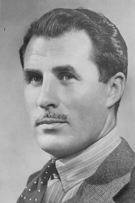

# Christine Van Hees

Belgian teenager who was raped, tortured, and murdered in the basement of an abandoned mushroom farm in Auderghem, Brussels, on February 13, 1984; witness X1 (Regina Louf) later identified Marc Dutroux and Michel Nihoul as participants in her killing, but the case remains unsolved after the investigating judge — who had personal ties to Nihoul — discarded the testimony.

| Field | Details |
|-------|---------|
| **Full Name** | Christine Van Hees |
| **Born** | April 6, 1967 (Brussels, Belgium) |
| **Died** | February 13, 1984 |
| **Age at Death** | 16 |
| **Location of Death** | Basement of abandoned mushroom farm (champignonnière), Auderghem, Brussels, Belgium |
| **Cause of Death** | Torture and murder (body set on fire) |
| **Official Ruling** | Murder (unsolved; case prescribed in 2014) |
| **Category** | Victim |

## Assessment: CONFIRMED MURDER — UNSOLVED

Christine Van Hees was subjected to horrific torture and killed at age 16. Her burned body was discovered by firefighters in the basement of a disused mushroom farm near the Vrije Universiteit Brussel (VUB). Neighbors reported hearing a girl screaming "Mom!" but no one contacted authorities. Over a decade later, a key witness — designated X1 by investigators and later identified as Regina Louf — provided detailed testimony placing Marc Dutroux, Michel Nihoul, and others at the scene of the murder. The investigating judge assigned to evaluate this testimony, Jean-Claude Van Espen, dismissed it and closed the line of inquiry. It was subsequently revealed that Van Espen had represented Nihoul's wife as a lawyer and that his sister was the godmother of Nihoul's child.

## Circumstances of Death

On the evening of February 13, 1984, firefighters responded to reports of smoke rising from a disused building adjacent to an abandoned mushroom farm (champignonnière) in Auderghem, a municipality in the Brussels-Capital Region. In the basement, they discovered the partially burned remains of a young woman.

The victim was identified as Christine Van Hees, a 16-year-old whose parents, Antoinette and Pierre Van Hees, operated a newspaper shop in Brussels. An autopsy revealed that Christine had been subjected to extreme and prolonged torture before her death. The precise cause of death could not be determined due to the severity of injuries inflicted through multiple methods of torture. After she was killed, her body was bound with electrical cord, doused with an accelerant, and set on fire.

Neighbors in the area reported having heard a girl screaming for help — calling out "Mom!" — but none contacted law enforcement at the time.

## Background

Christine Van Hees was born on April 6, 1967, in Brussels. She was the daughter of Antoinette and Pierre Van Hees, who ran a neighborhood newspaper shop. At the time of her death, she was 16 years old and lived near the site where her body was discovered.

The murder went unsolved for years, generating periodic media attention but no arrests.

### Witness X1 — Regina Louf

In 1996, following the arrest of Marc Dutroux, a woman contacted Belgian authorities and provided testimony about organized child sexual abuse networks in Belgium. She was designated "Witness X1" in official documents and was later identified as Regina Louf.

Louf testified that she had been a victim of an organized pedophile network from childhood and had been present at the murder of Christine Van Hees. According to her account:

- The murder took place during a multi-day gathering at the mushroom farm
- Those present included Michel Nihoul, Marc Dutroux, Dutroux's wife Michelle Martin, and Annie Bouty (Nihoul's partner)
- Van Hees was tortured over an extended period before being killed
- Louf stated she was forced to participate in the killing under duress

Louf's testimony contained specific details about the crime scene and the victim that investigators confirmed matched the physical evidence — details that had not been made public.

### The Judicial Sabotage

Examining judge Jean-Claude Van Espen was assigned to evaluate X1's testimony regarding the Van Hees murder. Van Espen discarded the testimony and halted the investigation into any connection between the Van Hees murder and the Dutroux network.

It was later revealed that Van Espen had significant personal connections to the accused:

- He had served as the personal lawyer for Michel Nihoul's wife
- His sister was the godmother of Michel Nihoul's child

These conflicts of interest were not disclosed at the time Van Espen made his decision to dismiss the testimony. The revelation of these connections became one of the most cited examples of judicial compromise in the Dutroux affair.

Regina Louf was never called to testify in any trial. She was publicly discredited in the Belgian media, and the investigation into the Van Hees murder was effectively closed. The statute of limitations on the case expired in 2014.

## Why This Death Possibly Raises Questions

- Witness X1 provided detailed testimony about the murder that matched non-public crime scene evidence
- The judge who dismissed this testimony had undisclosed personal ties to one of the accused perpetrators
- The murder predates Dutroux's 1996 arrest by over a decade, suggesting the network may have been operating far longer than officially acknowledged
- Michel Nihoul — named by X1 as present at the murder — was a convicted criminal with documented connections to organized crime, nightclub owners, police officers, and political figures
- The Belgian parliamentary inquiry into the Dutroux affair found systemic obstruction of justice at multiple levels
- The case was allowed to reach its statute of limitations without resolution despite the existence of witness testimony

## The Counterargument

Belgian judicial authorities who reviewed X1's testimony concluded that her statements were unreliable and could not be corroborated to the standard required for prosecution. Critics of X1's credibility have pointed to inconsistencies in her broader accounts and have argued that her testimony about the Van Hees murder may have been constructed from publicly available information or coached by investigators. The dismissal of the testimony by Judge Van Espen, while subsequently tainted by the revelation of his personal connections to Nihoul, was presented at the time as a legitimate judicial finding. No physical evidence directly linking Dutroux or Nihoul to the crime scene has been publicly confirmed.

## Key Quotes from Media Coverage

> "Neighbors heard a girl scream 'Mom!' with heartbreaking cries for help, but no one called law enforcement." — Archyde, reporting on the Van Hees case

> "Examining judge Van Espen had represented Nihoul's wife as a lawyer, and his sister was the godmother of Nihoul's child." — Multiple Belgian press sources

> "Dutroux and Nihoul suspected of the murder of Christine Van Hees in 1984." — Radical Party archive headline

## See Also

- [Bruno Tagliaferro](Bruno_Tagliaferro.md) — Belgian businessman poisoned in 1995 who had knowledge of the vehicle used in Dutroux kidnappings
- [Hubert Massa](Hubert_Massa.md) — Lead prosecutor in the Dutroux case who died of a gunshot wound ruled suicide
- [Jill Dando](Jill_Dando.md) — BBC journalist murdered in 1999 who had compiled evidence of a pedophile ring

## Sources

- [Christine Van Hees Murder Case — Conspiracy Dossiers](https://conspiracydossiers.com/2020/04/02/christine-van-hees-murder-case-marc-dutroux-involved-in-a-child-murder-network-with-michel-nihoul/)
- [Unsolved: The Mystery of Christine Van Hees and the Mushroom Farm Murder — Archyde](https://www.archyde.com/unsolved-the-mystery-of-christine-van-hees-and-the-mushroom-farm-murder/)
- [Regina Louf — Wikipedia](https://en.wikipedia.org/wiki/Regina_Louf)
- [Dutroux and Nihoul Suspected of the Murder of Christine Van Hees in 1984 — Radical Party Archive](http://old.radicalparty.org/belgium/x1_eng2.htm)
- [The Mushroom Farm Murder — RTBF Creative](https://rtbfcreative.be/programme/-1693595580)
- [Marc Dutroux — Wikipedia](https://en.wikipedia.org/wiki/Marc_Dutroux)

*This information was built by Grok and Claude AI research.*

**Status:** Deceased (1984)
