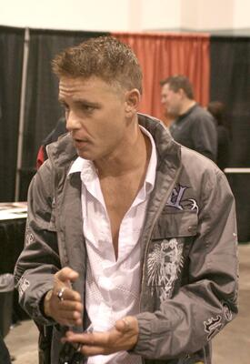

# Corey Haim
1980s teen idol who was allegedly sexually abused as a child actor in Hollywood; died at 38 of pneumonia complicated by heart disease after decades of substance abuse widely attributed to childhood trauma.

| Field | Details |
|-------|---------|
| **Full Name** | Corey Ian Haim |
| **Born** | December 23, 1971, Toronto, Ontario, Canada |
| **Died** | March 10, 2010 |
| **Age at Death** | 38 |
| **Location of Death** | Burbank, California (Providence Saint Joseph Medical Center) |
| **Cause of Death** | Diffuse alveolar damage / community-acquired pneumonia, with contributing hypertrophic cardiomyopathy and coronary arteriosclerosis |
| **Official Ruling** | Natural causes |
| **Category** | Victim |

## Assessment: MODERATE SUSPICION

Haim's death was officially ruled natural — pneumonia and heart disease — not a drug overdose, despite initial assumptions. While there is no direct evidence of foul play in his death, the broader pattern is troubling: a child who was allegedly raped by powerful Hollywood figures at age 13, who then spiraled into decades of addiction and self-destruction, and who died at 38 before the #MeToo era could have given him a platform to name his abusers publicly. His death effectively silenced a key witness to systemic child sexual abuse in the entertainment industry. The connection to the Epstein network specifically is indirect — Haim's abuse allegedly occurred within Hollywood's own pedophile networks, which share structural similarities with Epstein's operation (powerful men exploiting minors with institutional protection) but involved different perpetrators.

## Circumstances of Death

On March 10, 2010, Corey Haim collapsed at the apartment he shared with his mother, Judy Haim, in the San Fernando Valley area of Los Angeles. He had been experiencing flu-like symptoms for approximately two days prior. His mother called 911, and paramedics transported him to Providence Saint Joseph Medical Center in Burbank, where he was pronounced dead at 2:15 a.m.

The initial investigation treated his death as a "suspected prescription medication overdose." However, the Los Angeles County Coroner's autopsy, released on May 4, 2010, determined that Haim died of natural causes. The report found "an extremely large amount" of swelling in his lungs, consistent with pneumonia. He also had an enlarged heart and narrowed blood vessels.

Toxicology tests revealed low levels of several medications in his system — including a cough suppressant, antihistamine, ibuprofen, Prozac, Olanzapine, Valium, Carisoprodol, meprobamate, and THC — but the coroner determined these were "present in low levels" and were "non-contributory to death."

Despite the natural causes ruling, the California Attorney General's office noted that in the 32 days before his death (February 2 to March 5, 2010), Haim had obtained more than 553 doses of potentially dangerous prescription drugs — including 195 tablets of Valium, 194 tablets of Soma, 149 tablets of Vicodin, and 15 tablets of Xanax — from multiple doctors, none of whom knew about the others.

## Background

### Early Career

Corey Haim was born in Toronto, Ontario, to Judy Haim, an Israeli-born data processor, and Bernie Haim, who worked in sales. A shy child, he was encouraged to take acting classes to develop his confidence. He began appearing in commercials by age 10 and landed his first major role on the Canadian series *The Edison Twins* (1982–1986).

Haim rose to fame as a teen heartthrob through a string of 1980s films: *Silver Bullet* (1985), *Murphy's Romance* (1985), *Lucas* (1986), *The Lost Boys* (1987), *License to Drive* (1988), and *Dream a Little Dream* (1989). His partnership with Corey Feldman in several of these films made them one of the most recognizable teen duos in Hollywood, known collectively as "The Two Coreys."

### Alleged Sexual Abuse

According to Corey Feldman's 2020 documentary *My Truth: The Rape of 2 Coreys*, Haim confided to Feldman that he was raped on the set of the 1986 film *Lucas* by actor Charlie Sheen, who was 19 at the time while Haim was 13. This allegation is supported in the documentary by Feldman's ex-wife Susie Sprague and actor Jamison Newlander, who both stated that Haim had told them about the alleged assault. Sheen has categorically denied the allegations, calling them "sick, twisted and outlandish" through his publicist. Sheen filed a lawsuit against the National Enquirer over the claims, which was settled in 2018.

Haim's mother, Judy Haim, has publicly disputed the allegation against Sheen. In a 2017 appearance on *The Dr. Oz Show*, Judy Haim instead identified actor Dominick Brascia as the man who sexually abused her son. She described an incident where her teenage son called her from Brascia's apartment, screaming "Mom, come and get me! He's not getting off me!" She arrived to find Brascia pinning her son to the floor and reportedly threatened him with a pool cue. Brascia denied the allegations before his death in 2018.

On the A&E reality series *The Two Coreys* (2007–2008), Haim told Feldman on camera that he had been sexually abused starting at age 14 by a man who was 42 at the time, and that the abuse continued for two years. He expressed frustration that Feldman had known about it.

Feldman has also named his own alleged abusers: actor Jon Grissom, talent manager Marty Weiss, and Hollywood underage club owner Alphy Hoffman. All denied the claims. Weiss pleaded no contest to two counts of child molestation in 2012 in a separate case involving a different minor client.

### Addiction and Decline

Haim later stated that he began drinking beer on the set of *Lucas* — the same film where the alleged sexual assault occurred. By the time he was filming *The Lost Boys*, he had tried marijuana. His substance abuse escalated to cocaine, crack, and eventually severe prescription drug addiction. He entered rehab for the first time in 1989 at age 18 and sought rehabilitation at least 15 times by 2001.

His former fiancee, actress Tiffany Shepis, stated that during their yearlong relationship, Haim was "ingesting 40 some-odd pills a day." By 1997, he had filed for Chapter 11 bankruptcy. His career effectively ended by the early 2000s, a period he later described as an "eight-year hiatus" during which he "had an addiction to pretty much everything."

The California Attorney General called Haim the "poster child" for prescription drug addiction after his death.

### The Broader Hollywood Child Abuse Pattern

Haim's case exists within a well-documented pattern of child sexual abuse in the entertainment industry. The 2014 documentary *An Open Secret*, directed by Amy J. Berg, systematically exposed child sexual abuse in Hollywood, including the Digital Entertainment Network (DEN) scandal — in which DEN founders allegedly sexually assaulted teenage boys at parties attended by industry figures including, reportedly, director Bryan Singer and producer Gary Goddard. Singer has denied allegations of sexual misconduct.

Corey Feldman has stated that he and Haim were "passed around to pedophiles" at Hollywood parties where children ages 10–16 were groomed, and that these adults also attended film awards ceremonies and children's charity functions. In 2013 and again in 2017, Feldman was widely criticized for making these claims on television, including on *The View* and *The Today Show*. After the Harvey Weinstein scandal broke in 2017 and the #MeToo movement began, Feldman's earlier warnings were re-examined more sympathetically.

## Why This Death Possibly Raises Questions

- **Silenced witness:** Haim died before the #MeToo era (2017) and before widespread public reckoning with Hollywood child abuse, meaning he never had the opportunity to name his abusers in a cultural environment that might have believed him
- **Death at 38 from conditions associated with chronic stress and substance abuse:** While ruled natural, dying of pneumonia and heart disease at 38 is highly unusual for a person without underlying conditions — his enlarged heart and damaged lungs were consistent with years of drug abuse, which multiple sources attribute to childhood sexual trauma
- **Massive prescription drug consumption in final month:** The 553 pills obtained from multiple doctors in 32 days suggests a person in extreme distress, raising questions about whether he was self-medicating against trauma-related psychological pain
- **Pattern of Hollywood child victims dying young:** Haim joins a list of child actors whose lives were destroyed by alleged industry abuse — his case is not isolated but part of a systemic pattern
- **Disputed identity of his abuser:** The disagreement between Feldman (who named Sheen) and Judy Haim (who named Brascia) means the full truth of who abused Haim may never be established — both alleged perpetrators have denied the claims
- **Institutional protection of abusers:** The documentary *An Open Secret* was effectively suppressed by the entertainment industry — director Amy Berg could not find a distributor, suggesting institutional resistance to exposing Hollywood pedophilia
- **No direct Epstein connection but structural parallel:** Like Epstein's operation, Hollywood's child abuse networks allegedly involved powerful men exploiting minors with institutional cover, where victims who spoke up were discredited and abusers were protected

## Key Quotes from Media Coverage

> "You're talking about a person that, at the time when I knew him, you know, was ingesting 40 some-odd pills a day."
> — Tiffany Shepis, Haim's former fiancee, via [ABC News](https://abcnews.go.com/GMA/corey-haim-death-prescription-drugs/story?id=10099842)

> "In a period of 32 days, Corey Haim obtained at least 553 doses of potentially dangerous prescription drugs."
> — California Attorney General Jerry Brown, via [California DOJ press release](https://oag.ca.gov/news/press-releases/brown-details-corey-haims-doctor-shopping-dangerous-pills-and-efforts-crack-down)

> "I would love to name names. I would love to be the first to do it. Unfortunately, California statute of limitations laws protect these people."
> — Corey Feldman, speaking about Hollywood pedophilia, via [The Hollywood Reporter](https://www.hollywoodreporter.com/news/general-news/corey-feldman-elijah-wood-hollywood-897403/)

> "Mom, come and get me! He's not getting off me!"
> — Corey Haim (as a teenager), to his mother Judy, as recounted by Judy Haim on *The Dr. Oz Show* (2017)

> "He was afraid for himself, for what people in the industry are going to say about it."
> — Judy Haim, explaining why her son didn't want to report his abuse, via [Global News](https://globalnews.ca/news/939748/corey-haims-mother-wanted-her-sons-molester-brought-to-justice/)

> "These sick, twisted and outlandish allegations never occurred. Period."
> — Charlie Sheen's publicist, denying allegations in Feldman's documentary, via [Fox News](https://www.foxnews.com/entertainment/charlie-sheen-denies-corey-feldman-rape-claim-corey-haim-documentary)

## See Also

- [Isaac Kappy](Isaac_Kappy.md) — Actor who publicly named Hollywood pedophiles; fell from bridge in 2019
- [Jeffrey Epstein](Jeffrey_Epstein.md) — Ran parallel elite sexual abuse/blackmail network
- [Jean-Luc Brunel](Jean_Luc_Brunel.md) — Modeling industry figure who trafficked minors to Epstein; found hanged in prison
- [Karen Mulder](Karen_Mulder.md) — Model who named abusers on French TV; hospitalized, footage destroyed
- [Gabriela Rico Jimenez](Gabriela_Rico_Jimenez.md) — Accused elites of abuse on camera; disappeared
## Other Shocking Stories

- [Robert Maxwell](Robert_Maxwell.md): Ghislaine's father. Alleged Mossad super-spy. Fell from his yacht. Six intelligence services attended the funeral.
- [Peaches Geldof](Peaches_Geldof.md): Tweeted the names of mothers who enabled a pedophile. Five months later, dead on 61% pure heroin.
- [Karen Mulder](Karen_Mulder.md): Named those she accused of trafficking her on French national television. The footage was destroyed.
- [Kevin Preiss](Kevin_Preiss.md): NYPD officer who allegedly saw what was on the Weiner laptop. Suicide. The pattern keeps repeating.

## Sources

- [Corey Haim — Wikipedia](https://en.wikipedia.org/wiki/Corey_Haim)
- [Coroner: Corey Haim died of natural causes — CNN](https://www.cnn.com/2010/SHOWBIZ/Movies/05/04/corey.haim.autopsy/index.html)
- [Corey Haim's Reported Cause of Death: Pulmonary Congestion — ABC News](https://abcnews.go.com/Entertainment/corey-haims-reported-death-pulmonary-congestion/story?id=10077383)
- [Attorney General on Haim's "Doctor Shopping" — California DOJ](https://oag.ca.gov/news/press-releases/brown-details-corey-haims-doctor-shopping-dangerous-pills-and-efforts-crack-down)
- [Corey Haim: Where Did His Prescriptions Come From? — ABC News](https://abcnews.go.com/GMA/corey-haim-death-prescription-drugs/story?id=10099842)
- [Corey Feldman Names Alleged Abusers in Documentary — Rolling Stone](https://www.rollingstone.com/culture/culture-news/corey-feldman-documentary-names-revelations-964789/)
- [My Truth: The Rape of 2 Coreys — Wikipedia](https://en.wikipedia.org/wiki/My_Truth:_The_Rape_of_2_Coreys)
- [Corey Feldman on Hollywood Pedophilia — The Hollywood Reporter](https://www.hollywoodreporter.com/news/general-news/corey-feldman-elijah-wood-hollywood-897403/)
- [Corey Haim's Mother Wanted Molester Brought to Justice — Global News](https://globalnews.ca/news/939748/corey-haims-mother-wanted-her-sons-molester-brought-to-justice/)
- [Corey Haim's Mom Calls Feldman's Claims Bogus — The Hollywood Reporter](https://www.hollywoodreporter.com/news/general-news/corey-haim-s-mom-calls-corey-feldman-s-pedophile-claims-bogus-he-s-a-scam-artist-1052712/)
- [An Open Secret (2014) — Wikipedia](https://en.wikipedia.org/wiki/An_Open_Secret)
- [Corey Haim — Biography.com](https://www.biography.com/actors/corey-haim)
- [Charlie Sheen Denies Allegations — Fox News](https://www.foxnews.com/entertainment/charlie-sheen-denies-corey-feldman-rape-claim-corey-haim-documentary)
- [The Tragic Story of Corey Haim — All That's Interesting](https://allthatsinteresting.com/corey-haim-death)

*This information was built by Grok and Claude AI research.*

**Status:** Deceased (2010)
