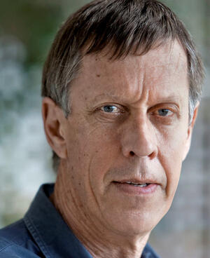

# Craig J. Spence
DC lobbyist and former journalist who ran a blackmail operation using male prostitutes, bugged his home to record powerful guests, arranged unauthorized midnight White House tours — then was found dead in a Boston hotel room five months after the scandal broke.

| Field | Details |
|-------|---------|
| **Full Name** | Craig J. Spence |
| **Born** | October 25, 1940 |
| **Died** | November 10, 1989 |
| **Age at Death** | 49 |
| **Location of Death** | Room 429, Ritz-Carlton Hotel, Boston, Massachusetts |
| **Cause of Death** | Overdose (Xanax found in room) |
| **Official Ruling** | Suicide |
| **Category** | Intelligence / Blackmail Operation |

## Assessment: HIGHLY SUSPICIOUS

Craig Spence operated a sexual blackmail ring targeting DC power brokers — bugging his home, recording compromising situations, and arranging unauthorized White House tours with male escorts and at least one 15-year-old boy. He claimed CIA connections and told associates he would be killed. He was found dead in a barricaded Ritz-Carlton room, dressed in a tuxedo, with a newspaper clipping about CIA Director William Webster protecting agents from testimony. The death was ruled suicide with minimal investigation. His case is a direct precursor to the Epstein pattern.

## Circumstances of Death

On November 10, 1989, Craig Spence was found dead in Room 429 of Boston's Ritz-Carlton Hotel. According to the *Washington Post*, he had:

- Moved the bed to barricade the door
- Dressed in a black tuxedo with white bow tie and white suspenders
- Set out a copy of his will and birth certificate
- Written on the bathroom mirror in black felt-tip marker: "Chief, consider this my resignation, effective immediately. As you always said, you can't ask others to make a sacrifice if you're not willing to make one yourself... Ask not what your country can do for you, but what you can do for your country."
- Had the hotel phone cradled to his ear and a Walkman playing Mozart
- Had $3 in his pocket
- Left a newspaper clipping about then-CIA Director William Webster's efforts to protect CIA agents from being compelled to testify before government bodies

Seven small packets of Xanax were found hidden in a false ceiling in the bathroom, with one pill removed. Boston police reportedly stonewalled details about the death.

He had been subpoenaed by a grand jury investigating Henry Vinson's escort service. In interviews before his death, Spence told the *Washington Times* he had discovered he had AIDS and alluded frequently to an impending suicide.

In the weeks before his death, according to the *Washington Post*, Spence told friends he was being watched, that his phone was tapped, and that he feared he would be killed. He also taped farewell messages to friends on audio cassettes.

## Background

Spence graduated from Boston University in 1963 with a degree in communications after transferring from Syracuse University. He began his career as a journalist at WCBS in New York and became a correspondent for ABC News. He covered the Vietnam War in Southeast Asia until 1969, when the government reportedly banned him from reporting in Vietnam, and ABC relocated him to Tokyo.

During approximately a decade in Tokyo, Spence built connections with Japanese business and government figures during Japan's period of rapid economic growth. He began public relations consulting for the Japan External Trade Organization (JETRO) and Japanese corporations.

By the 1980s, he had established himself in Washington DC as president of Craig Spence Associates, registering with the U.S. State Department in 1985 as a foreign agent for Japan. He was known for hosting lavish parties at his Kalorama mansion attended by government officials, military officers, congressional aides, journalists, and Reagan/Bush administration figures.

According to *The Washington Times*, Spence operated a two-tier party system: "squares" who left early, and an inner circle who stayed for drugs and prostitutes — creating compromising situations that were secretly recorded.

## The Blackmail Operation

According to *The Washington Times* and Henry Vinson's account in *Confessions of a D.C. Madam* (2015):

- Spence was a top client of Vinson's escort service, spending up to **$20,000 per month** on male prostitutes
- His Kalorama mansion was wired with extensive audio and visual surveillance equipment — reportedly installed by individuals Spence identified as "CIA operatives"
- He bugged gatherings to record compromising material on powerful guests, including government officials, military officers, congressional aides, and journalists
- He arranged at least **four unauthorized midnight tours of the White House**, including one on June 29, 1988, during which he brought a **15-year-old boy** whom he falsely identified as his son
- White House guard Reginald deGueldre facilitated the tours; the Secret Service furloughed three guards in connection with the unauthorized access
- According to the *Washington Times*, Spence hinted the tours were arranged by "top level" persons, including **Donald Gregg**, then-national security adviser to Vice President George H.W. Bush
- Spence maintained connections to CIA and intelligence officials, according to multiple sources cited by *The Washington Times*
- He provided cocaine at gatherings

## Why This Death Possibly Raises Questions

- **Operated a blackmail ring targeting the highest levels of government** — his recordings allegedly captured government officials, military officers, and Reagan/Bush administration figures in compromising situations
- **Claimed CIA connections** — told associates his surveillance equipment was installed by CIA operatives; claimed "top level" persons arranged his White House access
- **Told friends he would be killed** — in the weeks before his death, told associates he was being watched and feared being killed
- **CIA Director clipping** — left a newspaper article about CIA Director William Webster protecting agents from testifying, suggesting he saw himself as an intelligence asset being abandoned
- **Died before grand jury testimony** — had been subpoenaed by the grand jury investigating Vinson's escort service
- **Barricaded room** — moved the bed to block the door, consistent with someone afraid of being killed
- **Minimal investigation** — Boston police reportedly stonewalled details; the case received limited follow-up
- **Pattern match** — his death mirrors the later deaths of [Deborah Jeane Palfrey](Deborah_Jeane_Palfrey.mdx) (the DC Madam, hanged 2008) and [Jeffrey Epstein](Jeffrey_Epstein.mdx) (hanged 2019) — all three ran operations that compromised powerful people, and all three died before full exposure
- **Franklin connection** — *Washington Times* reporter Paul Rodriguez confirmed: "I had been told by several prostitutes along with law enforcement that there were connections between Craig Spence and Larry King" of the Franklin scandal

## The Counterargument

- Spence reportedly had AIDS and told the *Washington Times* he anticipated his own death
- He had alluded to suicide in interviews
- He left farewell tapes and what appeared to be a suicide note
- The elaborate staging — tuxedo, Mozart, will, birth certificate — could be interpreted as a planned exit by a theatrical personality
- Seven packets of Xanax found in the room support an overdose ruling

However, critics note that the barricaded door, the CIA clipping, his warnings about being killed, and the timing relative to the grand jury subpoena suggest an alternative interpretation. The elaborate staging could also be read as someone who knew they were about to be killed and wanted to leave a message.

## Key Quotes from Media Coverage

> "Homosexual Prostitution Inquiry Ensnares VIPs With Reagan, Bush: 'Call Boys' Took Tour of the White House" — *The Washington Times*, June 29, 1989 front-page headline

> "Chief, consider this my resignation, effective immediately." — Note written on bathroom mirror, Ritz-Carlton, November 10, 1989

> "I had been told by several prostitutes along with law enforcement that there were connections between Craig Spence and Larry King." — Paul Rodriguez, *Washington Times* reporter, on the Franklin scandal link

## See Also

- Craig Spence Operation — group file on the full blackmail operation
- Henry Vinson Escort Service — the DC escort service that supplied Spence
- Franklin Scandal — connected 1980s Nebraska trafficking ring with overlapping DC network
- DC Madam Operation — later DC-area operation with same pattern: operator died before full exposure
- [Deborah Jeane Palfrey](Deborah_Jeane_Palfrey.mdx) — DC Madam who said she'd never kill herself; found hanged
- [Jeffrey Epstein](Jeffrey_Epstein.mdx) — ran the same type of intelligence-linked sexual blackmail operation decades later
- [Ted Gunderson](Ted_Gunderson.mdx) — former FBI SAC who described "brownstone operations" matching Spence's methods

## Other Shocking Stories

- [Virginia Giuffre](Virginia_Giuffre.mdx) — Top Epstein accuser found dead by gunshot in Australia after posting "not suicidal"
- [Gary Caradori](Gary_Caradori.mdx) — Franklin scandal investigator whose plane disintegrated mid-air; briefcase vanished
- [Danny Casolaro](Danny_Casolaro.mdx) — Journalist investigating PROMIS intel op found with slashed wrists in hotel
- [Nancy Schaefer](Nancy_Schaefer.mdx) — State senator exposing CPS trafficking shot in the back with untraceable gun

## Sources

- [Washington Post: Craig Spence Found Dead in Boston Hotel (November 12, 1989)](https://www.washingtonpost.com/archive/politics/1989/11/12/craig-spence-figure-in-dc-sex-case-found-dead-in-boston/c8993a55-6895-488f-8adf-19cb45c0fb6b/)
- [Washington Post: Sex Scandal Figure Taped Farewell to Friends (November 13, 1989)](https://www.washingtonpost.com/archive/local/1989/11/13/dc-sex-scandal-figure-taped-farewell-to-friends/1c2fcd73-876f-4394-84c1-50948d41589d/)
- [Washington Post: The Shadow World of Craig Spence (July 18, 1989)](https://www.washingtonpost.com/archive/lifestyle/1989/07/18/the-shadow-world-of-craig-spence/2837e91e-49ce-4121-9416-8e0c7a2debf6/)
- [Washington Times: Homosexual Prostitution Inquiry Ensnares VIPs (June 29, 1989)](https://archive.org/details/HomosexualProstitutionInquiryEnsnaredVIPsWithReaganBush)
- [UPI: Craig Spence Found Dead (November 12, 1989)](https://www.upi.com/Archives/1989/11/12/Craig-Spence-Capitol-Hill-scandal-figure-found-dead/5676626850000/)
- [Wikipedia: Craig J. Spence](https://en.wikipedia.org/wiki/Craig_J._Spence)
- [Deseret News: Figure in D.C. Sex Scandal Found Dead (November 12, 1989)](https://www.deseret.com/1989/11/12/18832018/figure-in-d-c-sex-scandal-found-dead-in-boston-hotel/)
- Henry W. Vinson with Nick Bryant, *Confessions of a D.C. Madam* (TrineDay, 2015)
- John DeCamp, *The Franklin Cover-Up* (AWT, 1992)
- Whitney Webb, *One Nation Under Blackmail* (TrineDay, 2022)

*This information was built by Grok and Claude AI research.*

**Status:** Deceased (1989)
