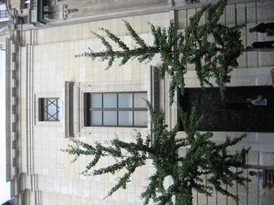

# Edmond Safra

Lebanese-Brazilian billionaire banker who died in an arson fire at his Monaco penthouse while cooperating with the FBI on Russian money laundering investigations through his Republic National Bank.

| Field | Details |
|-------|---------|
| **Full Name** | Edmond Jacob Safra |
| **Born** | August 6, 1932, Beirut, Lebanon |
| **Died** | December 3, 1999 |
| **Age at Death** | 67 |
| **Location of Death** | Monte Carlo, Monaco |
| **Cause of Death** | Smoke inhalation from arson fire |
| **Official Ruling** | Arson / homicide (nurse Ted Maher convicted) |
| **Category** | Banking / Finance |

## Assessment: SUSPICIOUS

Edmond Safra died on December 3, 1999, from smoke inhalation after a fire was deliberately set in his Monaco penthouse. His nurse Ted Maher was convicted of arson causing death, having confessed to starting the fire allegedly to stage a rescue and gain his employer's favor. While Maher's conviction provides an official resolution, the case raises questions in the context of Safra's cooperation with the FBI on Russian money laundering investigations. Safra's Republic National Bank had alerted federal authorities to suspicious transactions involving billions of dollars linked to Russian officials, and he was known to maintain extensive security measures out of fear for his life. Whether Maher acted alone or was manipulated by outside interests remains a matter of debate.

## Circumstances of Death

In the early morning hours of December 3, 1999, nurse Ted Maher -- one of several nurses providing round-the-clock care for the Parkinson's-afflicted Safra -- claimed that two hooded intruders had broken into the penthouse and stabbed him. He instructed Safra and fellow nurse Vivian Torrente to barricade themselves in a reinforced bathroom that functioned as a panic room.

A fire was burning in the penthouse. By the time firefighters and police reached Safra and Torrente, both had died of smoke inhalation. Safra had reportedly been alive when emergency services first arrived at the building but could not be reached in time.

Maher's intruder story quickly collapsed. He subsequently confessed that he had fabricated the attack and started a small fire in a wastebasket, claiming he intended to "rescue" Safra and thereby earn his trust and favor. Maher stated: "I couldn't believe that such a terrible tragedy came from such a small fire."

In December 2002, a Monaco court convicted Maher of arson causing death and sentenced him to ten years in prison. He escaped briefly from a Monaco prison in January 2003 but was recaptured within hours. He was released in 2007. As of 2025, Maher -- now using the name Jon Green -- faced additional criminal charges in the United States, including solicitation for murder-for-hire, and was imprisoned in New Mexico.

## Background

Edmond Jacob Safra was born in 1932 in Beirut, Lebanon, into a Syrian Jewish banking family with roots in the Ottoman Empire. The Safra family had been bankers in Aleppo for generations. Edmond built a global banking empire that included:

- **Republic National Bank of New York** -- Founded in 1966, it grew to operate 80 branches in the New York area, making it the third-largest branch network in the city behind Citigroup and Chase Manhattan
- **Trade Development Bank** -- Founded in Geneva, later sold to American Express in a deal that turned acrimonious
- **Safra National Bank of New York** and **Safra Republic Holdings** -- Additional institutions in his banking portfolio

In 1999, Safra sold his Republic New York Corporation and Safra Republic Holdings to HSBC for $10.3 billion in cash -- one of the largest banking acquisitions of the era. The sale was completed shortly before his death.

Safra suffered from Parkinson's disease and required round-the-clock nursing care in his final years. He was married to Lily Watkins Safra, who survived him and went on to manage the Edmond J. Safra Philanthropic Foundation.

## The FBI Cooperation

The detail that elevates Safra's death above a straightforward arson case is his cooperation with American law enforcement. In 1998, Safra's Republic National Bank alerted the FBI and Swiss authorities to a suspected money laundering scheme of extraordinary scale. The bank had identified suspicious transactions involving:

- Funds linked to the International Monetary Fund (IMF)
- The Republic National Bank of New York and its Swiss subsidiary
- Russian officials from both the Ministry of Finance and the Russian Central Bank
- Estimated sums in the billions of dollars -- Italian newspaper *La Repubblica* placed the figure at $21.4 billion

According to multiple reports, these transactions were connected to the diversion of IMF stabilization funds intended for the Russian economy, and may have contributed to the 1998 Russian financial crisis.

Safra was not merely a passive reporter of suspicious activity. According to accounts cited in the Netflix documentary *Murder in Monaco* (2025) and contemporaneous reporting, he actively worked with the FBI to expose the laundering scheme. This cooperation made him a direct threat to powerful financial and political interests connected to Russian organized crime.

Whitney Webb's *One Nation Under Blackmail* places Republic National Bank within a broader network of intelligence-linked financial institutions. Webb documents connections between these banking networks and the financial infrastructure adjacent to Jeffrey Epstein's operations, arguing that the intelligence community's relationship with international banking created an environment where figures like Safra -- who attempted to expose wrongdoing from within -- faced extraordinary risk.

## Why This Death Possibly Raises Questions

- Safra was actively cooperating with the FBI on a multi-billion-dollar Russian money laundering investigation at the time of his death
- He maintained extensive security measures across all his properties, reportedly out of sustained fear for his safety
- The "hero rescue" motive attributed to Maher -- setting a fire to save his employer and gain favor -- strains credulity given that Maher had only been employed by Safra for a short period
- The Russian Mafia theory was widely discussed but never formally investigated to public conclusion
- Maher's subsequent criminal history, including solicitation for murder-for-hire charges in 2025, raises questions about his character and the completeness of the original investigation
- Safra's death came just months after he completed the $10.3 billion sale of his banking empire to HSBC
- The fire killed both Safra and the only other witness in the panic room, nurse Vivian Torrente
- Republic National Bank had connections to financial networks that Whitney Webb documents as adjacent to intelligence-linked operations

## The Counterargument

- Ted Maher confessed to starting the fire, was convicted in a court of law, and served his sentence -- the case has an identified and convicted perpetrator
- Maher's motive, while unusual, is consistent with documented cases of individuals committing destructive acts to position themselves as heroes (a pattern seen in arson cases committed by firefighters, for instance)
- No evidence presented at trial linked Maher to Russian organized crime or any external conspiracy
- Monaco police conducted an extensive investigation, and the prosecution's case was sufficient to secure a conviction
- Safra's Parkinson's disease made him physically vulnerable to smoke inhalation in a way that a healthy person might not have been -- the fire did not need to be large to be lethal
- The Safra family accepted the verdict and did not publicly pursue alternative theories

## Key Quotes from Media Coverage

> "I couldn't believe that such a terrible tragedy came from such a small fire."
>
> -- **Ted Maher**, Safra's nurse, after confessing to starting the fire ([Biography.com](https://www.biography.com/crime/a69676214/murder-in-monaco-netflix-true-story-edmond-safra))

> "Not long before his death, Safra worked with the FBI to expose Russian money laundering at his bank. For years, he had concerns about his safety."
>
> -- Netflix, *Murder in Monaco* documentary synopsis ([Monaco Tribune](https://www.monaco-tribune.com/en/2025/11/netflix-releases-documentary-on-mysterious-death-of-banker-edmond-safra-in-monaco/))

## See Also

- [Robert Maxwell](Robert_Maxwell.mdx) -- Another figure at the intersection of banking, intelligence, and unexplained death. Maxwell's financial empire had intelligence connections that parallel the networks Whitney Webb documents around Republic National Bank.
- [Jeffrey Epstein](Jeffrey_Epstein.mdx) -- Whitney Webb documents the financial infrastructure adjacent to both Safra's banking network and Epstein's operations as part of interconnected intelligence-linked systems.
- [Danny Casolaro](Danny_Casolaro.mdx) -- Investigator of PROMIS software and intelligence-linked financial networks who was found dead in 1991. Both cases involve individuals who threatened to expose the intersection of intelligence services and international banking.

## Related Groups

- Republic National Bank of New York -- Safra's bank that reported Russian money laundering to the FBI
- Russian Organized Crime -- The most widely discussed alternative theory for Safra's death
- HSBC -- Acquired Safra's banking empire for $10.3 billion shortly before his death

## Related Locations

- Monte Carlo, Monaco -- Where Safra died in the penthouse fire
- New York, USA -- Headquarters of Republic National Bank

## Sources

- [Wikipedia: Edmond Safra](https://en.wikipedia.org/wiki/Edmond_Safra)
- [Wikipedia: Ted Maher](https://en.wikipedia.org/wiki/Ted_Maher)
- [Biography.com: Murder in Monaco -- The True Story of Edmond Safra's Death](https://www.biography.com/crime/a69676214/murder-in-monaco-netflix-true-story-edmond-safra)
- [Monaco Tribune: Netflix Releases Documentary on Mysterious Death of Banker Edmond Safra](https://www.monaco-tribune.com/en/2025/11/netflix-releases-documentary-on-mysterious-death-of-banker-edmond-safra-in-monaco/)
- [Primetimer: How Did Edmond Safra Die?](https://www.primetimer.com/features/how-did-edmond-safra-die-details-analyzed-from-netflix-s-murder-in-monaco)
- [Kveller: Who Was Edmond Safra?](https://www.kveller.com/edmond-safra-jewish-murder-in-monaco-netflix/)
- Whitney Webb, *One Nation Under Blackmail* (2022)

*This information was built by Grok and Claude AI research.*

**Status:** Deceased (1999)
