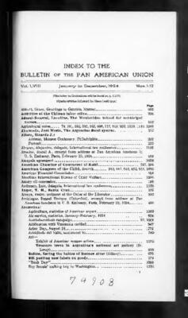

# Gabriela Rico Jimenez
Mexican woman who publicly accused elites of cannibalism and murder outside a Monterrey hotel in 2009; detained by police, sent to psychiatric facility, and never seen again.

| Field | Details |
|-------|---------|
| **Full Name** | Gabriela Rico Jiménez |
| **Born** | ~1988 (exact date undocumented) |
| **Age at Incident** | 21 |
| **Date of Incident** | August 3, 2009 |
| **Location** | Fiesta Inn hotel (also referred to as Hotel Quinta Real or Fiesta Americana), Ocampo Street, Monterrey, Nuevo León, Mexico |
| **Status** | Unknown — not seen publicly since 2009. If alive, approximately 38 years old. |
| **Category** | Silenced Witness / Disappeared |

## Video Footage

The original incident was filmed by local Mexican television news crews and is available online:

- [YouTube: Gabriela Rico Jimenez video (1)](https://www.youtube.com/watch?v=VxDWXkX1R_U)
- [YouTube: Gabriela Rico Jimenez video (2)](https://www.youtube.com/watch?v=ykGwCAtqE5g)

The footage shows Jiménez in a visibly distressed state outside the hotel, shouting accusations in Spanish while police approach and eventually detain her. The clips range from 20–50 seconds in commonly shared versions, with extended versions running 1–2 minutes. Multiple copies exist online — some have been removed over the years and re-uploaded.

## Assessment: SUSPICIOUS DISAPPEARANCE

Gabriela Rico Jiménez was filmed by local Mexican television cameras in a visibly distressed state outside the Fiesta Inn hotel in Monterrey, Mexico on August 3, 2009. She accused specific, named powerful individuals of cannibalism and murder. She specifically accused the family of then-richest man in the world Carlos Slim of involvement. She named a recently deceased Mexican government official and accused elites of assassinating him. She claimed she had been held captive since 2001. Police detained her and she was transferred to a psychiatric facility. She has not been seen or heard from publicly since. Her online presence appears to have been scrubbed from the internet. No verifiable public records, hospital records, or court filings about her have surfaced since approximately 2013. No official records, obituaries, or death reports have ever been found.

## The Incident — August 3, 2009

On August 3, 2009, Gabriela Rico Jiménez emerged from the Fiesta Inn hotel on Ocampo Street in Monterrey, Nuevo León, Mexico, barefoot, in torn clothing — notably wearing a shirt with the words "Yum Yum" on it — looking disheveled and visibly distressed. She interrupted an event at or near the hotel while screaming for help. Local television news crews and passersby captured the incident on camera.

Reports indicate she had attended a private "elite" event or party at the hotel involving businessmen, politicians, and other high-profile attendees. Witnesses described her as escaping the event in a state of panic.

### What She Said (Translated from Spanish)

- **"They ate humans, how disgusting, they ate humans! I didn't know anything, but yes about the murders."**
- She referenced "eating children" and "eating human flesh"
- She claimed she had been **held captive since 2001** — referencing approximately eight years of captivity, with events beginning in mid-2001 in Mexico City
- "I wanted my freedom. Monterrey freed me but it cost me a lot of work."
- "I want freedom!"
- She pointed at police officers and said one of them "was there"
- She shouted **"You killed Mouriño!"** — a direct accusation that elites had assassinated a sitting Mexican government official
- She pleaded with bystanders and police during the extended footage

### Who She Named

- **Carlos Slim Domit** — Son of Carlos Slim Helú, who at the time was the richest man in the world. She accused the Slim family of involvement in murder and cannibalism.
- **Juan Camilo Mouriño Terrazo** — Mexico's Secretary of the Interior (Secretario de Gobernación), who served under President Felipe Calderón. Mouriño had died nine months earlier in a government Learjet crash that killed 16 people (see below). She accused elites of assassinating him.
- **Queen Elizabeth II** — She referenced the "Queen of England" in her accusations.
- **Disney** — She made accusations connecting Disney executives to the network she described.

## The Mouriño Plane Crash — A Verified Suspicious Death

The most specific and verifiable element of Jiménez's accusations was her claim that Juan Camilo Mouriño was murdered.

**Mouriño died on November 4, 2008** — nine months before Jiménez's public outburst — when his government Learjet 45 crashed into rush-hour traffic in Mexico City, killing all 9 people on board and 7 people on the ground. At the time, Mouriño was Mexico's Secretary of the Interior — the second most powerful position in the Mexican government — and was leading the country's war against drug cartels.

The crash circumstances were considered suspicious by many in Mexico:
- He was 37 years old and considered a potential future presidential candidate
- He was the highest-ranking Mexican official to die since 1994
- The plane went down in a densely populated area of Mexico City (the Lomas de Chapultepec neighborhood)
- Mexican authorities attributed the crash to wake turbulence from a larger aircraft, but independent analyses questioned this conclusion
- His death effectively removed the government's point man on cartel enforcement

Jiménez's specific naming of Mouriño — a real government official who had died under disputed circumstances — nine months after his death suggests she had some level of knowledge about or exposure to powerful circles in Mexico.

## What Happened After the Incident

### Detention and Hospitalization

- Police arrived at the scene during the broadcast and arrested her on camera for disturbing the peace
- She was handcuffed and taken into custody
- She was transferred to a psychiatric facility in the Buenos Aires neighborhood of Monterrey for evaluation
- Authorities characterized her behavior as a psychotic episode and dismissed her accusations as "crazy talk" or delusions
- She was reportedly to remain at the facility "indefinitely" due to her "distressed" state
- **No formal investigation into her allegations appears to have occurred**

### The Anonymous Law Graduate Account

An unverified account circulated online from someone claiming to be a law graduate completing his mandatory legal practice (servicio social) in Monterrey. He described encountering Jiménez after her arrest:

- He said she had "a face full of despair, fear, anguish"
- She told him "we were all dead"
- After approximately 20 minutes, "some tall, well-dressed people arrived, they practically pulled me out of there"
- When this witness later attempted to locate her through authorities, he was allegedly told: **"If she does not exist, she never existed, and you do not work here"**
- He reportedly left Monterrey after this encounter

**This account has not been independently verified.**

### The 2015 Psychiatric Facility Report

A separate unverified account from approximately 2015 claims an individual encountered Jiménez at the psychiatric facility, where she reportedly reiterated claims about "underground child exploitation." When authorities were questioned about her presence, they denied she was there.

**This account has not been independently verified.**

### Family Response

Her family reportedly withdrew a missing-person complaint at some point, stating she had received treatment and wished to remain out of the public eye. No public statements from family members have been documented.

### Current Status

- No verifiable public information about Gabriela Rico Jiménez has surfaced since approximately 2013
- No hospital records, court filings, government records, obituaries, or death certificates have been made public
- Her pre-2009 online presence — including any photographs — appears to have been largely scrubbed from the internet
- She has never been seen publicly again
- Her current status — alive, dead, or institutionalized — is **unknown**
- No official records confirm her death; no official records confirm she is alive

## Background

### The "Supermodel" Claim — Unverified

Claims circulated online that Jiménez was a Mexican supermodel who had appeared on the cover of Cosmopolitan Mexico and walked runways in Paris and New York. **No evidence of any professional modeling career, portfolio, magazine appearances, or runway work has been independently verified.** Internet searches reveal no modeling photographs or agency representation records. The "supermodel" label appears to stem from viral exaggeration.

Reports more consistently describe her as an aspiring model who attended a private elite party at the luxury hotel before the outburst. Her actual background, how she came to be at the Fiesta Inn that night, and what events preceded her public outburst remain unclear.

### The Captivity Claim

In her outburst, Jiménez claimed she had been held captive since 2001 — approximately eight years. She referenced spending time in Mexico City during this period. If true, this would mean she was approximately 13 years old when the captivity began. This claim has not been verified, but it is consistent with the patterns of trafficking operations documented elsewhere in this research, which target minors.

## Connection to Broader Patterns

### The Pattern of Silenced Whistleblowers

Jiménez fits a documented pattern of individuals who publicly accused powerful people or networks of crimes and were subsequently silenced or disappeared:

- **[Karen Mulder](Karen_Mulder.mdx)** — Named [Jean-Luc Brunel](Jean_Luc_Brunel.mdx) and men she accused of abuse in the modeling industry on French TV in 2001. Footage destroyed. Hospitalized for five months. Career ended. (Brunel wasn't arrested for 19 more years.)
- **[Isaac Kappy](Isaac_Kappy.mdx)** — Named Hollywood pedophiles publicly. Said "if I die, it wasn't suicide." Fell from bridge (2019).
- **[Nikolai Mushegian](Nikolai_Mushegian.mdx)** — Tweeted about CIA/Mossad sex trafficking ring in Puerto Rico. Drowned four hours later (2022).
- **[Tracy Twyman](Tracy_Twyman.mdx)** — Researcher who warned about elite trafficking. Left dead man's switch. Found hanged (2019).
- **[Max Spiers](Max_Spiers.mdx)** — Told mother "if anything happens to me, investigate." Found dead in Poland (2016).

The silencing mechanism used on Jiménez — psychiatric institutionalization followed by complete disappearance — mirrors what happened to [Karen Mulder](Karen_Mulder.mdx), who was hospitalized for five months after naming her abusers on French television. In Mulder's case, the hospitalization was paid for by one of the men she accused.

### The Mexican Context

Mexico's environment of cartel violence, corruption, and impunity creates conditions where people who speak out against powerful individuals can disappear without accountability. The specific naming of Carlos Slim's son — a member of the most powerful family in Mexico — and accusations against figures connected to cartel enforcement (Mouriño) placed Jiménez at the intersection of extreme wealth and extreme violence.

### 2026 Epstein File Resurgence

Jiménez's 2009 video went massively viral in January–February 2026 when the U.S. Department of Justice released over 3 million pages of Epstein-related documents. Some of those documents contained unverified allegations from sources about ritualistic abuse at private gatherings, which social media users found resonant with her 2009 claims. One email in the files reportedly stated "I loved the torture video," fueling further speculation. However, **no direct connection between Gabriela Rico Jiménez and [Jeffrey Epstein](Jeffrey_Epstein.mdx) exists in any released documents**. Fact-checkers from CBS News, Factually.co, and other outlets confirmed that no evidence links her case to the Epstein files.

Her case resurfaced in public attention not because of a documented Epstein connection, but because of the broader pattern: a young woman who accused powerful elites of horrific crimes, was immediately silenced, and was never seen again. On X (formerly Twitter), her story trended with hashtags like "Justice for Gabriela," with users reposting the video and noting the parallels to other silenced witnesses documented in this research.

## What Is Verified

- The video is real, filmed August 3, 2009 in Monterrey by local TV news crews
- She was a real person who was detained by police on camera
- She made the accusations described above, naming specific individuals
- She claimed she had been held captive since 2001
- Juan Camilo Mouriño did die in a disputed plane crash on November 4, 2008
- Carlos Slim Helú was the richest man in the world at the time she named his son
- She was arrested and transferred to a psychiatric facility
- No formal investigation into her allegations was conducted
- She has not been seen publicly since 2009
- Her digital footprint has been largely erased
- No death records exist; no proof of life exists

## What Is Not Verified

- Her professional modeling career (no evidence found; likely viral exaggeration)
- Her claim of eight years of captivity since 2001
- The substance of her accusations about cannibalism and murder
- The anonymous law graduate's account
- The 2015 psychiatric facility encounter
- The alleged quote from authorities denying her existence
- Any direct connection to Jeffrey Epstein or his network
- Her current status — whether she is alive, dead, or institutionalized

## See Also

- [Karen Mulder](Karen_Mulder.mdx) — Silenced after naming abusers on French TV; hospitalized, career destroyed
- [Isaac Kappy](Isaac_Kappy.mdx) — Named powerful pedophiles publicly; predicted his own death
- [Nikolai Mushegian](Nikolai_Mushegian.mdx) — Tweeted about elite trafficking ring; drowned hours later
- [Tracy Twyman](Tracy_Twyman.mdx) — Researcher who warned about elite trafficking; found hanged
- [Ruslana Korshunova](Ruslana_Korshunova.mdx) — Model connected to Epstein who fell from building
- [Nadia Marcinko](Nadia_Marcinko.mdx) — Epstein associate, missing since January 2024
## Other Shocking Stories

- [Isaac Kappy](Isaac_Kappy.mdx): Said on camera: 'If I die, it wasn't suicide.' Two months later, fell from a bridge in Arizona.
- [Joe Recarey](Joe_Recarey.mdx): Lead detective on the original Epstein case. Died unexpectedly at 50 of a brief unspecified illness.
- [Nancy Schaefer](Nancy_Schaefer.mdx): State senator exposing child trafficking through CPS. Shot in the back with an untraceable gun no family recognized.
- [Corey Haim](Corey_Haim.mdx): Allegedly raped on a film set at age 13. Spent 25 years in addiction. Dead at 38.

## Sources

- [YouTube: Gabriela Rico Jimenez video (1)](https://www.youtube.com/watch?v=VxDWXkX1R_U)
- [YouTube: Gabriela Rico Jimenez video (2)](https://www.youtube.com/watch?v=ykGwCAtqE5g)
- [Mexico Unexplained: The Mysterious Disappearance of Mexican Supermodel Gabriela Rico Jimenez](https://mexicounexplained.com/the-mysterious-disappearance-of-mexican-supermodel-gabriela-rico-jimenez/)
- [The Mirror US: Mystery Disappearance of Model Gabriela Rico Jimenez](https://www.themirror.com/news/world-news/inside-disappearance-gabriela-rico-jimenez-516785)
- [IBTimes UK: Cannibal Claims Resurface Around Epstein After Chilling 2009 Video](https://www.ibtimes.co.uk/cannibal-claims-resurface-around-epstein-after-chilling-2009-video-model-gabriela-rico-jimenez-1776842)
- [NewsBytes: Who's Gabriela Rico Jimenez](https://www.newsbytesapp.com/news/entertainment/who-is-gabriela-rico-jimenez/story)
- [Unilad: Chilling Footage Shows Last Sighting of Woman Who Accused Elites](https://www.unilad.com/news/world-news/mexico-video-missing-woman-cannibalism-566988-20240602)
- [Irish Star: Mexican Model's Disappearance Linked to Cannibalism Accusations](https://www.irishstar.com/news/us-news/mexican-model-disappearance-queen-elizabeth-32942400)
- [Infobae Mexico: Quién es Gabriela Rico](https://www.infobae.com/mexico/2026/02/09/quien-es-gabriela-rico-y-por-que-el-nombre-de-la-modelo-se-volvio-tendencia/)
- [Factually.co: Fact Check on Epstein Connection](https://factually.co/fact-checks/justice/gabriela-rico-jimenez-2009-disappearance-epstein-connection-evidence-972633)
- [CBS News: Epstein Conspiracy Theories Debunked](https://www.cbsnews.com/news/jeffrey-epstein-conspiracy-theories/)
- [Distractify: What Happened to Gabriela Rico Jimenez](https://www.distractify.com/p/what-happened-to-gabriela-rico-jimenez)
- [Latestly: Why 2009 Video Is Going Viral After Epstein Files](https://www.latestly.com/world/gabriela-rico-jimenez-know-why-the-2009-they-ate-humans-video-of-mexican-model-is-going-viral-after-new-epstein-files-release-7298754.html)
- [TheInfoHatch: Gabriela Rico Jimenez and Epstein Files 2026](https://theinfohatch.com/gabriela-rico-jimenez-and-jeffrey-epstein-files/)

*This information was built by Claude AI research.*

**Status:** Unknown (Disappeared 2009)
