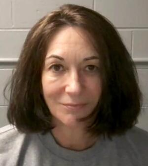

# Ghislaine Maxwell (Living — At Risk)
Only convicted Epstein co-conspirator still alive, serving 20 years with multiple documented threats.

| Field | Details |
|-------|---------|
| **Full Name** | Ghislaine Noelle Marion Maxwell |
| **Born** | December 25, 1961 |
| **Status** | ALIVE — Serving 20-year sentence |
| **Current Location** | Federal Prison Camp Bryan (FPC Bryan), Bryan, Texas |
| **Conviction** | Sex trafficking of a minor, transporting a minor with intent to engage in criminal sexual activity, three counts of conspiracy |
| **Category** | Co-conspirator / Convicted Sex Trafficker |

## Assessment: AT RISK — MULTIPLE DOCUMENTED THREATS

Maxwell is the only convicted Epstein co-conspirator still alive and in custody. Her brother, the Deputy Attorney General, and prison officials have all acknowledged threats against her life. She is the single most valuable living witness to the full scope of the Epstein operation.

## Current Situation (As of February 2026)

Maxwell was previously held at FCI Tallahassee, a low-security co-ed federal prison in Florida described as "notoriously violent." On approximately August 1, 2025, she was transferred to Federal Prison Camp Bryan (FPC Bryan) in Bryan, Texas — a minimum-security all-women's facility with dormitory-style housing.

The transfer came approximately one week after Deputy Attorney General Todd Blanche met with Maxwell for nine hours over two days at the federal courthouse in Tallahassee in late July 2025. Maxwell received a limited form of immunity during those meetings (void if she lied).

BOP policy states Maxwell should be ineligible for minimum-security housing because she is a convicted sex offender, normally requiring at least a low-security facility. After her arrival, FPC Bryan added patrol cars and surveillance cameras along the perimeter.

AG Pam Bondi testified to Congress on February 11, 2026, that she did not know Maxwell was being transferred, and claimed it was the "same level" — a claim disputed by the BOP's own security level designations.

## Safety Concerns

- Her brother Ian Maxwell stated there were "numerous and numerous threats against her life" at FCI Tallahassee, which Deputy AG Blanche cited as justification for the transfer.
- The National Enquirer quoted an insider warning: *"She's got a bull's-eye on her back!"*
- Ian Maxwell has publicly stated: *"She's not suicidal."*
- Congressional Democrats cited over a dozen whistleblowers describing preferential treatment, retaliation against inmates, and endemic sexual assault at FPC Bryan.

## Cooperation with Authorities

- In late July 2025, Maxwell initiated contact with the DOJ and met with Deputy AG Blanche for nine hours under limited immunity.
- She provided no incriminating information about high-profile individuals, per ABC News reporting on the transcripts.
- She stated she does not believe a formal "client list" exists and that Epstein did not maintain blackmail material.
- The Trump administration released the interview transcripts in August 2025.
- On February 9, 2026, Maxwell appeared before the House Committee on Oversight and Government Reform in a virtual closed-door session. She invoked her Fifth Amendment right and declined to answer questions.

## Appeals Status

- September 2024: U.S. Court of Appeals for the Second Circuit upheld all five convictions and her sentence.
- October 2025: U.S. Supreme Court declined to hear her appeal.
- Maxwell filed a pro se habeas corpus petition making nine grounds for relief, including juror misconduct.
- In her petition, she named four unindicted co-conspirators and alleged the DOJ reached "secret settlements" with 25 men who had not been prosecuted.
- Maxwell's lawyers are actively fighting release of documents from her civil defamation case (approximately 90,000 pages), calling the Epstein Files Transparency Act unconstitutional.

## Why Maxwell Matters to This List

Ghislaine Maxwell is the only convicted Epstein co-conspirator still alive. Given the pattern of deaths documented in this database — particularly the deaths of [Jeffrey Epstein](Jeffrey_Epstein.md) and [Jean-Luc Brunel](Jean_Luc_Brunel.md), both found hanged in their prison cells while awaiting proceedings — her continued safety is a matter of significant public concern. She potentially possesses more knowledge about the Epstein network than any other living person.

## Key Quotes from Media Coverage

> "Maxwell is prepared to speak fully and honestly if granted clemency by President Trump."
> — David Oscar Markus, Maxwell's attorney, during House Oversight Committee deposition, [NBC News (February 2026)](https://www.nbcnews.com/politics/justice-department/ghislaine-maxwell-pleads-fifth-says-speak-fully-honestly-trump-grants-rcna258227)

> "Since Epstein's death, her life has been threatened and death threats continue while she is incarcerated."
> — Maxwell's legal team, as reported by [CNN (June 2022)](https://www.cnn.com/2022/06/25/us/ghislaine-maxwell-on-suicide-watch)

> "It's very clear she's campaigning for clemency."
> — Rep. Melanie Stansbury (D-NM), after Maxwell invoked the Fifth Amendment more than a dozen times during her House deposition, [NPR (February 2026)](https://www.npr.org/2026/02/10/g-s1-109413/maxwell-appeals-for-clemency)

> "She's not suicidal."
> — Ian Maxwell, Ghislaine's brother, publicly warning against an Epstein-like outcome, [ABC News (2025)](https://abcnews.com/US/ghislaine-maxwells-brother-talks-prince-andrew-petition-freedom/story?id=130228703)

## Related Groups

- Jeffrey Epstein Network — The core operation she co-ran with Epstein
- Mossad — Intelligence service her father allegedly served; researchers allege she continued his intelligence role
- Elite Model Management — Introduced Brunel to Epstein; Brunel's agency was a trafficking pipeline

## See Also

- [Jeffrey Epstein](Jeffrey_Epstein.md) — Found hanged in prison
- [Jean-Luc Brunel](Jean_Luc_Brunel.md) — Found hanged in prison, same pattern
- [Virginia Giuffre](Virginia_Giuffre.md) — Most prominent accuser, died 2025
- [Carolyn Andriano](Carolyn_Andriano.md) — Testified against Maxwell at trial
- [Steven Hoffenberg](Steven_Hoffenberg.md) — Confessed about Epstein-Maxwell blackmail operation
- [Ruslana Korshunova](Ruslana_Korshunova.md) — Model documented on Epstein's jet
- [Andrew Stewart](Andrew_Stewart.md) — Epstein's personal chef on Little St. James island

## Other Shocking Stories

- [Corey Haim](Corey_Haim.md): Allegedly raped on a film set at age 13. Spent 25 years in addiction. Dead at 38.
- [Nikolai Mushegian](Nikolai_Mushegian.md): Tweeted that CIA and Mossad ran a sex trafficking ring in Puerto Rico. Drowned four hours later.
- [Vitaly Churkin](Vitaly_Churkin.md): Russian UN Ambassador. Sudden cardiac event. Cause of death withheld by State Department. Autopsy results sealed.

## Sources

- [NBC News: Ghislaine Maxwell moved to federal prison in Texas](https://www.nbcnews.com/politics/justice-department/ghislaine-maxwell-moved-federal-prison-texas-rcna222497)
- [NBC News: Maxwell's transfer a "travesty of justice"](https://www.nbcnews.com/news/us-news/ghislaine-maxwells-transfer-cushy-prison-camp-travesty-justice-ex-bop-rcna223045)
- [ABC News: Ian Maxwell interview](https://abcnews.com/US/ghislaine-maxwells-brother-talks-prince-andrew-petition-freedom/story?id=130228703)
- [Axios: Maxwell transcript — DOJ interview](https://www.axios.com/2025/08/22/ghislaine-maxwell-transcript-interview-doj-epstein-trump)
- [National Enquirer Investigation](https://nationalenquirer.com/more-than-two-dozen-people-linked-to-jeffrey-epstein-have-died-under-mysterious-circumstances/)
- [NPR: Ghislaine Maxwell appeals for clemency from Trump as she declines to answer questions](https://www.npr.org/2026/02/10/g-s1-109413/maxwell-appeals-for-clemency)
- [NBC News: Maxwell pleads the Fifth but says she'd 'speak fully and honestly' if Trump grants her clemency](https://www.nbcnews.com/politics/justice-department/ghislaine-maxwell-pleads-fifth-says-speak-fully-honestly-trump-grants-rcna258227)
- [CNBC: Ghislaine Maxwell interview released by DOJ; Epstein procurer questioned about Trump](https://www.cnbc.com/2025/08/22/ghislaine-maxwell-transcripts-trump-epstein-doj.html)
- [Fortune: White House releases Ghislaine Maxwell interview full of quotes denying Trump and Epstein links](https://fortune.com/2025/08/23/white-house-ghislaine-maxwell-interview-transcript-trump-epstein/)
- [Washington Post: Ghislaine Maxwell invokes Fifth Amendment in House's Epstein hearing](https://www.washingtonpost.com/national-security/2026/02/09/ghislaine-maxwell-epstein-testimony/)
- [CBS News: Ghislaine Maxwell pleads the Fifth, with lawyer saying she'll testify in Epstein probe if Trump grants her clemency](https://www.cbsnews.com/news/ghislaine-maxwell-house-oversight-committee-deposition-fifth-amendment/)
- [Al Jazeera: Ghislaine Maxwell refuses US Congress testimony on Epstein, seeks clemency](https://www.aljazeera.com/news/2026/2/9/us-congress-seeks-answers-maxwell-invokes-fifth-amid-epstein-case-tensions)
- [Snopes: Was Ghislaine Maxwell replaced with a body double in prison?](https://www.snopes.com/news/2026/02/25/ghislaine-maxwell-body-double/)
- [DOJ: Maxwell Interview Transcript — July 24, 2025](https://www.justice.gov/storage/audio-files/Interview%20Transcript/Interview%20Transcript%20-%20Maxwell%202025.07.24%20(Redacted).pdf)

*This information was built by Grok and Claude AI research.*
