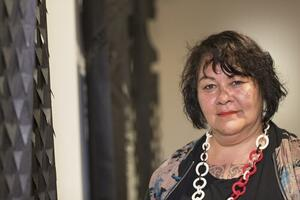

# Gina Hutchinson

Early Keith Raniere victim found dead of a shotgun wound at a Buddhist monastery; one of the first people Raniere sexually abused as a teenager, and her death was ruled suicide without a thorough investigation.

| Field | Details |
|-------|---------|
| **Full Name** | Gina Hutchinson |
| **Born** | c. 1969 |
| **Died** | October 11, 2002 |
| **Age at Death** | 33 |
| **Location of Death** | Karma Triyana Dharmachakra Buddhist Monastery, Woodstock, New York |
| **Cause of Death** | Gunshot wound to the head (20-gauge shotgun) |
| **Official Ruling** | Suicide |
| **Category** | Victim |

## Assessment: HIGHLY SUSPICIOUS

Gina Hutchinson was one of Keith Raniere's earliest known sexual abuse victims, first targeted when she was approximately 14 or 15 years old. She was found dead at age 33 on the grounds of a Buddhist monastery in Woodstock, New York, with a 20-gauge pump shotgun. Police and the coroner conducted an investigation oriented exclusively toward confirming suicide, according to journalist Frank Parlato's analysis. Her hands were not properly tested for gunpowder residue, not all shotgun pellets were accounted for, and the question of how she obtained the weapon was not resolved. Just four months later, another woman connected to Raniere -- [Kristin Snyder](Kristin_Snyder.md) -- disappeared and was never found.

## Circumstances of Death

On October 11, 2002, at approximately 11:00 PM, Gina Hutchinson's body was found on the grounds of the Karma Triyana Dharmachakra Buddhist monastery in rural Woodstock, New York. She had died from a gunshot wound to the head. A 20-gauge pump shotgun was found in her jacket with the muzzle positioned at the side of her head.

The death was ruled a suicide. However, according to investigative reporting by Frank Parlato of the Frank Report, the investigation was cursory at best. Parlato reported that police and the coroner were "looking for -- and only for -- evidence of suicide." Key forensic steps were reportedly not taken:

- Hutchinson's hands were not properly tested for gunpowder residue, which would have helped establish whether she fired the weapon herself
- The autopsy report noted that "numerous" pellets were found in her brain, but police did not search for all 18 pellets in the area surrounding her body
- The origin of the shotgun was not conclusively established; Hutchinson was not known to own firearms
- Parlato noted that it is statistically rare for women to commit suicide by shotgun, particularly women who do not own guns

According to reporting by Hutchinson's sister Heidi, Raniere had told Gina that she "must ascend to the level of the goddess by leaving her body" -- language that, if accurately reported, could be interpreted as encouraging suicide.

## Background

Gina Hutchinson grew up in the Clifton Park, New York area. She was in eighth grade, approximately 14 years old, when she first encountered Keith Raniere around 1983, while he was still working for Amway. According to her sister Heidi Hutchinson, who has spoken extensively about the case, Raniere began a sexual relationship with Gina when she was approximately 15. Raniere was 23 at the time.

According to Heidi's accounts, Raniere had sex with Gina, became her mentor, convinced her to quit school to be tutored by him, and told her she was born to be his "consort" and could achieve enlightenment as a Buddhist goddess through him. The relationship was one of profound psychological manipulation of a minor by an adult.

At the time of her death, Gina was 33 years old and living at 261 Lapp Road in Clifton Park with her aunt, Mary Ketz. She had maintained an interest in Buddhism, which may explain why she was found at the monastery.

Raniere went on to found NXIVM, which was later prosecuted as a criminal organization. In 2019, he was convicted on federal charges including racketeering, sex trafficking, and forced labor conspiracy. He was sentenced to 120 years in prison.

## Why This Death Possibly Raises Questions

- Hutchinson was one of Raniere's earliest known sexual abuse victims, abused from approximately age 15
- Raniere reportedly told her she needed to "leave her body" to achieve spiritual transcendence, language that could constitute encouraging suicide
- Police conducted an investigation that, according to Frank Parlato, was oriented solely toward confirming suicide rather than investigating all possibilities
- Her hands were not properly tested for gunpowder residue
- She was not known to own firearms, yet died from a shotgun wound
- It is statistically uncommon for women to commit suicide by shotgun
- Not all shotgun pellets were accounted for at the scene
- Just four months later, [Kristin Snyder](Kristin_Snyder.md), another woman connected to Raniere, disappeared under suspicious circumstances and was never found
- Frank Parlato has identified discrepancies in the police report on Hutchinson's death
- Keith Raniere was later convicted of running a criminal enterprise involving sex trafficking and the psychological manipulation of women
- Gina's sister Heidi Hutchinson became a prominent NXIVM critic and has publicly questioned the suicide ruling for years

## The Counterargument

Hutchinson had reportedly struggled with depression and the psychological aftermath of her long-term manipulation by Raniere. She was found at a location with spiritual significance to her, which could suggest a deliberate choice of setting for a planned suicide. The presence of the shotgun and the nature of the wound are consistent with self-infliction. No physical evidence directly implicating another person in her death has been publicly identified. The coroner ruled suicide based on the available evidence.

## Key Quotes from Media Coverage

> "Police and the coroner were looking for -- and only for -- evidence of suicide."
> -- Frank Parlato, Frank Report, September 2019

> "It's very rare for women to commit suicide by gun, especially women who don't own guns, like Hutchinson."
> -- Frank Parlato, Frank Report

> "She must ascend to the level of the goddess by leaving her body."
> -- Keith Raniere to Gina Hutchinson, as reported by Heidi Hutchinson

## See Also

- [Kristin Snyder](Kristin_Snyder.md) -- NXIVM member who disappeared four months after Hutchinson's death, also connected to Keith Raniere

## Sources

- [Police and Coroner Were Looking for Evidence of Suicide - Frank Report](https://frankreport.com/2019/09/15/police-and-coroner-were-looking-for-and-only-for-evidence-of-suicide-in-the-case-of-gina-hutchinson/)
- [Gina Hutchinson's Death Still Remains a Mystery - Frank Report](https://frankreport.com/2021/12/07/gina-hutchinsons-death-still-remains-a-mystery-did-raniere-play-any-role-in-it/)
- [Discrepancy in Police Report on Hutchinson Suicide - Frank Report](https://frankreport.com/2017/08/13/discrepancy-in-police-report-on-hutchinson-suicide/)
- [What Happened to Gina Hutchinson - Distractify](https://www.distractify.com/p/gina-hutchinson-nxivm)
- [The Dead Women of NXIVM - True Crime Edition](https://www.truecrimeedition.com/post/nxivm)
- [Heidi Hutchinson on the Death of Her Sister Gina - Frank Report](https://frankreport.com/2019/12/08/heidi-hutchinson-on-the-death-of-her-sister-gina-raniere-thought-himself-satan/)

*This information was built by Grok and Claude AI research.*

**Status:** Deceased (2002)
