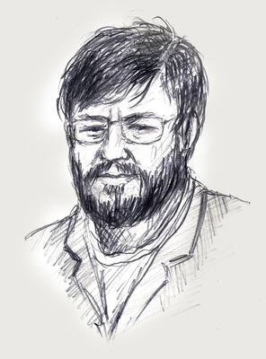

# Hubert Massa

Belgian Advocate General and chief prosecutor overseeing both the Marc Dutroux pedophile case and the André Cools assassination investigation, found dead of a gunshot wound ruled suicide on July 13, 1999, after returning from a meeting with the Belgian Justice Minister.

| Field | Details |
|-------|---------|
| **Full Name** | Hubert Massa |
| **Born** | December 27, 1945 (Belgium) |
| **Died** | July 13, 1999 |
| **Age at Death** | 53 |
| **Location of Death** | Verviers, Belgium |
| **Cause of Death** | Gunshot wound (shot himself in the mouth) |
| **Official Ruling** | Suicide |
| **Category** | Law Enforcement |

## Assessment: HIGHLY SUSPICIOUS

Hubert Massa was the most senior prosecutor in Belgium overseeing the country's most politically sensitive criminal investigation — the Dutroux pedophile kidnapping case — as well as the unsolved assassination of Socialist politician André Cools. He died of a gunshot wound to the mouth on the same day he returned from a meeting with the Justice Minister. His death removed the lead prosecutorial authority from cases that had already been plagued by allegations of institutional obstruction, evidence destruction, and high-level protection of suspects. The Dutroux case is notable for the suspicious deaths of approximately 20 connected witnesses.

## Circumstances of Death

On July 13, 1999, Hubert Massa traveled to meet with Justice Minister Marc Verwilghen. The precise content of their discussion has not been made fully public, though it reportedly concerned the handling of the Dutroux case. Massa returned to his home in Verviers, went into his office, and shot himself in the mouth.

The death was ruled a suicide. No suicide note has been publicly reported. The timing — amid a period of intense political pressure surrounding the Dutroux investigation — immediately raised questions in the Belgian press and among families of Dutroux's victims.

## Background

Hubert Massa was born on December 27, 1945. He rose through the Belgian judicial system to become Advocate General (chief prosecuting attorney) at the Liège public prosecutor's office. In this role, he held responsibility for two of the most consequential criminal cases in modern Belgian history.

### The Dutroux Case

Marc Dutroux was arrested in August 1996 after kidnapping, imprisoning, and sexually abusing multiple young girls in a concealed basement dungeon in Marcinelle, near Charleroi. Two of his victims — Julie Lejeune and Melissa Russo, both eight years old — starved to death while Dutroux was briefly imprisoned on an unrelated charge. Two other victims, An Marchal and Eefje Lambrecks, were murdered. The case exposed catastrophic failures within Belgian law enforcement and the justice system, prompting a Belgian parliamentary inquiry that found evidence of incompetence, negligence, and possible complicity at multiple levels of the police and judiciary.

As Advocate General in Liège, Massa was the senior prosecutorial authority overseeing the Dutroux files. This placed him at the center of a case that had triggered the largest public demonstrations in Belgian history — the 1996 White March, in which 300,000 Belgians took to the streets of Brussels to protest the handling of the investigation.

### The André Cools Case

Massa was simultaneously responsible for the investigation into the 1991 assassination of André Cools, a prominent Belgian Socialist politician who was shot dead outside his girlfriend's apartment in Liège. The Cools murder was connected to corruption scandals involving Belgian arms deals and political kickbacks. The case took years to resolve and implicated senior Belgian political figures.

## Why This Death Possibly Raises Questions

- Massa was the highest-ranking prosecutor overseeing Belgium's most politically explosive pedophile investigation at the time of his death
- He died on the same day he returned from a meeting with the Justice Minister — the content of which has never been fully disclosed
- His death by gunshot to the mouth is a method sometimes associated with staged suicides, though it also occurs in genuine suicides
- The Dutroux case had already been marked by extraordinary institutional failures: police who searched Dutroux's house heard the trapped children screaming but failed to find them; a key investigating judge was removed from the case; evidence went missing
- Massa's death fits a broader pattern of approximately 20 witnesses and officials connected to the Dutroux case who died in suspicious circumstances
- He was simultaneously overseeing the André Cools assassination case, which implicated powerful political figures in corruption
- No suicide note has been publicly reported

## The Counterargument

Belgian authorities ruled Massa's death a suicide, and there is no public forensic evidence contradicting this finding. Prosecutors and senior legal officials face extraordinary psychological pressure, and the Dutroux case in particular was an emotionally devastating investigation involving the torture and murder of children. The meeting with the Justice Minister may have compounded existing stress rather than constituting a trigger for foul play. It is possible that the cumulative burden of overseeing two of Belgium's most traumatic criminal cases contributed to a genuine mental health crisis.

## Key Quotes from Media Coverage

> "Belgian Child Sex Prosecutor Commits Suicide." — Tehran Times headline, July 1999

> "Hubert Massa, the chief prosecutor in charge of both the Dutroux and André Cools briefs, shot himself after returning from a meeting with the justice minister." — The Irish Times

> "The number of deaths exposed in this unfolding case defied belief." — Consortium News, reporting on the broader pattern of Dutroux-connected deaths

## See Also

- [Bruno Tagliaferro](Bruno_Tagliaferro.md) — Belgian businessman poisoned in 1995 who had knowledge of the vehicle used in Dutroux kidnappings
- [Christine Van Hees](Christine_Van_Hees.md) — Brussels teenager murdered in 1984 whose case was later linked to Dutroux and Nihoul
- [Jill Dando](Jill_Dando.md) — BBC journalist murdered in 1999 who had compiled evidence of a pedophile ring

## Sources

- [Belgian Child Sex Prosecutor Commits Suicide — Tehran Times](https://www.tehrantimes.com/news/40971/Belgian-Child-Sex-Prosecutor-Commits-Suicide)
- [Marc Dutroux — Wikipedia](https://en.wikipedia.org/wiki/Marc_Dutroux)
- [Hubert Massa biography — Astro-Databank](https://www.astro.com/astro-databank/Massa,_Hubert)
- [Dutroux Affair / Premature Death — Wikispooks](https://wikispooks.com/wiki/Dutroux_Affair/Premature_death)
- [Dutroux Trial to Revive Belgium's Trauma — The Irish Times](https://www.irishtimes.com/news/dutroux-trial-to-revive-belgium-s-trauma-1.1133525)
- [The Revelations of WikiLeaks: No. 4 — Consortium News](https://consortiumnews.com/2019/07/11/the-revelations-of-wikileaks-no-4-the-haunting-case-of-a-belgian-child-killer-and-how-wikileaks-helped-crack-it/)

*This information was built by Grok and Claude AI research.*
