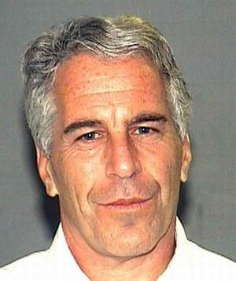

# Jeffrey Epstein
Convicted sex trafficker found hanged in federal jail awaiting trial under deeply suspicious circumstances.

| Field | Details |
|-------|---------|
| **Full Name** | Jeffrey Edward Epstein |
| **Born** | January 20, 1953 |
| **Died** | August 10, 2019 |
| **Age at Death** | 66 |
| **Location of Death** | Metropolitan Correctional Center, New York City, New York, USA |
| **Cause of Death** | Hanging in jail cell |
| **Official Ruling** | Suicide |
| **Category** | Primary Subject / Convicted Sex Offender |

## Assessment: HIGHLY SUSPICIOUS

This is arguably the most suspicious death on the entire list. Epstein was the central figure in a sex trafficking network involving the world's most powerful people. He died in a federal facility while awaiting trial, after being removed from suicide watch, with guards asleep and falsifying records, cameras malfunctioning, and a broken hyoid bone that is more commonly associated with homicide by strangulation than suicide by hanging. His brother publicly calls it murder. He had every motive to be silenced and every powerful person in his network had motive to silence him.

### New Evidence (2026)

Surveillance video observation logs released by the DOJ in January 2026 show an orange-colored figure moving up a staircase toward Epstein's locked housing tier at approximately 10:39 PM on August 9, 2019 — hours before he was found dead. The FBI log describes the fuzzy image as "possibly an inmate." The inspector general logged it as an officer carrying orange "linen or bedding." Independent video analysts say the movement is more consistent with someone wearing an orange prison uniform than a corrections officer. Official reviews of Epstein's death, and then-AG Barr's statements, made no mention of this figure.

## Circumstances of Death

Jeffrey Epstein was found unresponsive in his cell at 6:30 AM at the Metropolitan Correctional Center in Manhattan on August 10, 2019. He was pronounced dead at a nearby hospital. He had previously been placed on suicide watch but had been removed from it prior to his death. Guards on duty that night falsified records showing they had checked on him when they had not.

## Autopsy Findings

Chief Medical Examiner Barbara Sampson ruled the death as suicide by hanging. The autopsy revealed a broken hyoid bone, which medical experts note can occur in both suicide by hanging and homicide by strangulation.

## Why This Death Possibly Raises Questions

- Epstein's brother, Mark Epstein, publicly stated he believes it was murder, not suicide.
- Epstein was awaiting trial on federal sex trafficking charges involving dozens of underage girls from 2002-2005.
- The phrase "Epstein didn't kill himself" became a widespread cultural meme reflecting public skepticism.
- Security cameras malfunctioned or provided unusable footage on the night of his death.
- Guards were asleep and falsified check-in logs.
- Epstein had been removed from suicide watch despite a previous apparent suicide attempt weeks earlier.
- He possessed potentially damaging information about numerous powerful individuals worldwide.

## The Counterargument

- Metropolitan Correctional Center was severely understaffed, with approximately 15 inmates per guard; correctional officers were routinely working mandatory overtime shifts of 16 or more hours, increasing the likelihood of errors and falsified logs as a systemic condition rather than a cover-up.
- Suicide attempts and deaths at MCC were not unprecedented; multiple inmates had attempted or completed suicide in the years prior to Epstein's death, suggesting the facility's failures reflected institutional dysfunction rather than a targeted operation.
- Epstein had a documented prior suicide attempt on July 23, 2019 — less than three weeks before his death — and was placed on suicide watch as a result; his removal from watch status followed standard protocol and was approved by the relevant medical staff.
- The broken hyoid bone, cited by family-hired pathologist Dr. Baden as a homicide indicator, is not diagnostic. Peer-reviewed studies document hyoid fractures in approximately 25% of hanging deaths in individuals over age 50; it is a contested finding, not dispositive evidence.
- No surveillance footage showed an intruder entering Epstein's cell; what available footage existed showed movement consistent with staff or inmates in ways the inspector general determined were not sinister.
- Chief Medical Examiner Barbara Sampson, an experienced and credentialed forensic pathologist, reviewed all available evidence and stood by her ruling of suicide by hanging, distinguishing her conclusion from Baden's as a professional difference of opinion on an ambiguous case.
- Epstein had strong personal motives to take his own life: he faced the prospect of spending the rest of his life in federal prison with no realistic path to acquittal, his fortune was under legal attack, and his social world had collapsed entirely.

## Background

Epstein had a previous conviction in 2008 under a controversial Florida plea deal for soliciting prostitution from a minor, for which he served only 13 months. His death ended the pending federal criminal case but sparked numerous subsequent investigations into his associates and enablers.

## Key Quotes from Media Coverage

> "I have never seen three fractures like this in a suicidal hanging. Going over a thousand jail hangings, suicides in the New York City state prisons over the past 40-50 years, no one had three fractures."
> — Dr. Michael Baden, forensic pathologist hired by Epstein's family, on [CBS 60 Minutes](https://www.cbsnews.com/news/jeffrey-epstein-autopsy-a-closer-look-60-minutes-2020-01-05/)

> "I could see if he got a life sentence, I could then see him taking himself out, but he had a bail hearing coming up."
> — Mark Epstein, Jeffrey Epstein's brother, rejecting suicide as the cause of death, via [Newsweek](https://www.newsweek.com/jeffrey-epstein-murdered-conspiracy-theory-piers-morgan-brother-interview-1859542)

> "Numerous and serious failures by MCC New York staff constituting misconduct and dereliction of their duties.. resulted in Epstein being unmonitored and alone in his cell with an excessive amount of bed linens."
> — DOJ Office of the Inspector General, [official report](https://oig.justice.gov/reports/investigation-and-review-federal-bureau-prisons-custody-care-and-supervision-jeffrey)

> "The movement is more consistent with an inmate — or someone wearing an orange prison uniform — than a corrections officer."
> — Independent video analysts reviewing newly released surveillance logs, via [CBS News](https://www.cbsnews.com/news/epstein-files-jail-cell-death-video-logs/)

## Related Groups

- Jeffrey Epstein Network — The core trafficking and blackmail operation
- Mossad — Israeli intelligence allegedly behind the operation via the Maxwell family
- CIA — Acosta allegedly said Epstein "belonged to intelligence"
- Deutsche Bank — Moved Epstein's money; $150M fine
- JPMorgan Chase — Maintained accounts for 15+ years; $365M in settlements
- Wexner / L Brands — Source of Epstein's wealth and NYC townhouse
- Elite Model Management — Modeling agency used as trafficking pipeline
- MC2 Model Management — Agency Epstein funded for Brunel
- USVI Government — Territorial government that protected Epstein

## See Also

- [Ghislaine Maxwell](Ghislaine_Maxwell.md) — Only convicted co-conspirator, serving 20 years
- [Jean-Luc Brunel](Jean_Luc_Brunel.md) — Found hanged in Paris prison, same method
- [Thomas Bowers](Thomas_Bowers.md) — Deutsche Bank wealth chief, found hanged 3 months later
- [Mark Middleton](Mark_Middleton.md) — Clinton aide who admitted Epstein to White House
- [Steven Hoffenberg](Steven_Hoffenberg.md) — Business partner who confessed about blackmail operation
- [Virginia Giuffre](Virginia_Giuffre.md) — Most prominent accuser
- [Alfredo Rodriguez](Alfredo_Rodriguez.md) — House manager who stole the "black book"
- [Efrain "Stone" Reyes](Efrain_Stone_Reyes.md) — Last cellmate, transferred out one day before death
- [Arthur Shapiro](Arthur_Shapiro.md) — Predecessor whose murder created Epstein's opening
- [Joe Recarey](Joe_Recarey.md) — Lead detective on the original investigation
- Weiner Laptop Officers — NYPD officers who allegedly died after viewing related evidence
- [Andrew Stewart](Andrew_Stewart.md) — Epstein's personal chef on Little St. James island

## Related Locations

- New York City Metro — Died at Metropolitan Correctional Center in Manhattan; primary base of operations
- South Florida — Palm Beach mansion where trafficking was first investigated; 2008 plea deal in Florida
- Caribbean — Owned Little St. James island in the U.S. Virgin Islands, center of trafficking operation
- New Mexico — Owned Zorro Ranch near Stanley, New Mexico; another documented abuse location
## Other Shocking Stories

- [Val Broeksmit](Val_Broeksmit.md): His father hanged. He became an FBI informant on Deutsche Bank.
- [Terje Rød-Larsen](Terje_Rod_Larsen.md): Norwegian diplomat. Epstein paid him $250K and willed $10 million to his children. Under criminal investigation.
- [Johnny Rios](Johnny_Rios.md): NYPD officer. Allegedly viewed the Weiner laptop. Suicide. Six officers connected to that laptop are gone.
- [Marc Angelucci](Marc_Angelucci.md): Shot at his front door by the same gunman who attacked Judge Salas's family eight days later.

## Sources

- [National Enquirer Investigation](https://nationalenquirer.com/more-than-two-dozen-people-linked-to-jeffrey-epstein-have-died-under-mysterious-circumstances/)
- [Times Now Investigation](https://www.timesnownews.com/world/us/us-news/mysterious-deaths-linked-to-jeffrey-epstein-over-the-years-a-timeline-of-tragedy-and-suspicion-article-153071534)
- [Wikipedia: Death of Jeffrey Epstein](https://en.wikipedia.org/wiki/Death_of_Jeffrey_Epstein)
- [CBS News: Who entered Epstein's jail tier the night of his death? Newly released video logs appear to contradict official accounts](https://www.cbsnews.com/news/epstein-files-jail-cell-death-video-logs/)
- [CBS 60 Minutes: Jeffrey Epstein's autopsy — a closer look](https://www.cbsnews.com/news/jeffrey-epstein-autopsy-a-closer-look-60-minutes-2020-01-05/)
- [NPR: Pathologist Hired By Jeffrey Epstein's Brother Says Signs Point To Homicide](https://www.npr.org/2019/10/30/774838950/jeffrey-epstein-case-expert-hired-by-his-family-suggests-doubt-on-suicide-findin)
- [PBS News: Misconduct by federal jail guards led to Jeffrey Epstein's suicide, DOJ watchdog says](https://www.pbs.org/newshour/nation/misconduct-by-federal-jail-guards-led-to-jeffrey-epsteins-suicide-doj-watchdog-says)
- [DOJ OIG: Investigation and Review of the Federal Bureau of Prisons' Custody, Care, and Supervision of Jeffrey Epstein](https://oig.justice.gov/reports/investigation-and-review-federal-bureau-prisons-custody-care-and-supervision-jeffrey)
- [CBS News: Massive trove of Epstein files released by DOJ, including 3 million documents and photos](https://www.cbsnews.com/live-updates/epstein-files-released-doj-2026/)
- [NBC News: Jeffrey Epstein's autopsy found broken neck bone](https://www.nbcnews.com/news/us-news/jeffrey-epstein-s-autopsy-found-broken-neck-bone-source-says-n1042741)
- [Newsweek: Jeffrey Epstein's Brother Renews Conspiracy Theories About Death](https://www.newsweek.com/jeffrey-epstein-murdered-conspiracy-theory-piers-morgan-brother-interview-1859542)
- [NPR: Jeffrey Epstein Found Dead Early Saturday Morning](https://www.npr.org/2019/08/10/750113214/jeffrey-epstein-found-dead-early-saturday-morning)
- [ABC News: Jeffrey Epstein's suicide — New details revealed](https://abcnews.com/US/jeffrey-epsteins-suicide-new-details-revealed/story?id=100405667)
- [DOJ: Epstein Files Transparency Act Disclosures](https://www.justice.gov/epstein/doj-disclosures)

*This information was built by Grok and Claude AI research.*
