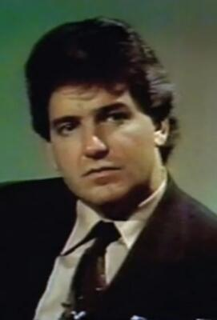

# John Connolly
Journalist who co-authored Filthy Rich exposing Epstein, died at 78 of natural illness.

| Field | Details |
|-------|---------|
| **Full Name** | John Connolly |
| **Born** | ~1944 |
| **Died** | January 17, 2022 |
| **Age at Death** | 78 |
| **Location of Death** | Unknown |
| **Cause of Death** | Brief illness |
| **Official Ruling** | Natural death |
| **Category** | Journalist / Investigative Journalist |

## Assessment: LOW SUSPICION — LIKELY OLD AGE

Connolly was 78 years old and died after a brief illness. While he possessed extensive knowledge about the [Epstein](Jeffrey_Epstein.md) case from his investigative work and co-authored one of the key books, his age and the confirmed natural illness make this most likely a death from old age.

## Circumstances of Death

John Connolly died on January 17, 2022, after a brief illness. His longtime partner confirmed his death.

## Background

Connolly was a former NYPD detective who became an investigative journalist. He was known as a hard-hitting reporter with an "unending Rolodex" and the ability to move among Hollywood, Wall Street, politicians, and police.

He co-authored *Filthy Rich: A Powerful Billionaire, the Sex Scandal that Undid Him, and All the Justice that Money Can Buy* with James Patterson. The book was one of the first major exposés of [Jeffrey Epstein](Jeffrey_Epstein.md)'s crimes, published before Epstein's 2019 arrest. Connolly also appeared in the documentary *Who Killed Jeffrey Epstein?*

## Why This Death Possibly Raises Questions

- Connolly was one of the leading journalistic investigators into the Epstein case.
- He co-authored one of the most significant books exposing Epstein's crimes.
- His death in January 2022 came during a period of renewed investigation into the Epstein network.
- He had decades of accumulated knowledge about the case through his investigative work and law enforcement background.
- However, he was 78 years old and his death was confirmed as natural after a brief illness.

## Key Quotes from Media Coverage

> "The cop-turned-scribe was known among media insiders for his unending Rolodex, and a unique ability to mix among Hollywood execs and stars, Wall Street rainmakers, pols, police and wiseguys."
> — [Showbiz411: RIP John Connolly, 78, Investigative Journalist, A Real Life Damon Runyon Character](https://www.showbiz411.com/2022/01/17/rip-john-connolly-78-investigative-journalist-former-nypd-detective-a-real-life-damon-runyon-character)

> "John Connolly was like a character out of a movie — a street-smart NYPD detective who reinvented himself as a fearless investigative journalist."
> — [Jamie Malanowski obituary](http://jamiemalanowski.com/john-connolly-1943-2022/)

> "He co-authored one of the first major exposes of Jeffrey Epstein's crimes, years before the rest of the world caught up."
> — [The Sun: Famed journalist who investigated Jeffrey Epstein dies](https://www.the-sun.com/news/4479840/john-connolly-famed-journalist-investigated-jeffrey-epstein-dead/)

## See Also

- [Jeffrey Epstein](Jeffrey_Epstein.md)
## Other Shocking Stories

- [Marvin Minsky](Marvin_Minsky.md): AI pioneer named in Epstein court filings. Visited the island. Died at 88 of cerebral hemorrhage.
- [Alfredo Rodriguez](Alfredo_Rodriguez.md): Had Epstein's black book listing every victim and client. Tried to sell it. Died of cancer in custody.
- [Marjorie Dyer](Marjorie_Dyer.md): Co-signed Yassenoff's will with the man suspected of killing him. Died in a car accident.
- [Joseph Calabrese](Joseph_Calabrese.md): NYPD detective. Allegedly saw the Weiner laptop. Dead by suicide one day after his colleague Silks.

## Sources

- [NY Post: John Connolly, journalist who investigated Epstein, dead at 78](https://nypost.com/2022/01/17/john-connolly-journalist-who-investigated-epstein-dead-at-78/)
- [National Enquirer Investigation](https://nationalenquirer.com/more-than-two-dozen-people-linked-to-jeffrey-epstein-have-died-under-mysterious-circumstances/)
- [Showbiz411: RIP John Connolly, 78, Investigative Journalist, Former NYPD Detective, A Real Life Damon Runyon Character](https://www.showbiz411.com/2022/01/17/rip-john-connolly-78-investigative-journalist-former-nypd-detective-a-real-life-damon-runyon-character)
- [Jamie Malanowski: John Connolly (1943-2022)](http://jamiemalanowski.com/john-connolly-1943-2022/)
- [The Sun: Famed journalist who investigated Jeffrey Epstein dies](https://www.the-sun.com/news/4479840/john-connolly-famed-journalist-investigated-jeffrey-epstein-dead/)
- [The Sun: Who was John Connolly and what was his cause of death?](https://www.the-sun.com/news/4481476/who-john-connolly-cause-of-death/)
- [Epoch Times: John Connolly, Investigative Journalist Who Co-Wrote Jeffrey Epstein Book, Dies at 78](https://www.theepochtimes.com/us/john-connolly-investigative-journalist-who-co-wrote-jeffrey-epstein-book-dies-at-78-4219254)
- [Tony Ortega: Journalist John Connolly dies at 78](https://tonyortega.org/2022/01/19/journalist-john-connolly-dies-at-78-was-outed-in-2011-as-scientology-spy-by-mike-rinder/)

*This information was built by Grok and Claude AI research.*

**Status:** Deceased (2022)
