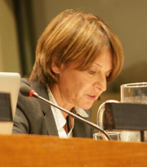

# Mona Juul
Norwegian ambassador who resigned after Epstein willed $5M per child; under criminal corruption investigation.

| Field | Details |
|-------|---------|
| **Full Name** | Mona Juul |
| **Born** | 1959 (approximate) |
| **Age** | ~67 |
| **Status** | Resigned; under criminal investigation (as of February 2026) |
| **Location** | Norway |
| **Category** | European Diplomat / Epstein Associate |

## Assessment: LIVING PERSON AT RISK

Juul is under criminal investigation alongside her husband [Terje Rød-Larsen](Terje_Rod_Larsen.md). Their family received extraordinary financial benefits from Epstein — $10M willed to their children — suggesting a deep relationship that investigators are probing.

## Background

Mona Juul is a Norwegian diplomat and former Labour Party politician. She served as Norwegian ambassador to Iraq and Jordan and held various diplomatic positions. She is married to [Terje Rød-Larsen](Terje_Rod_Larsen.md), the diplomat described as Epstein's "top diplomatic fixer."

## Epstein Connection

- Epstein listed each of Juul and Rød-Larsen's children in his will to receive $5 million each (approximately $10M total)
- The family had close personal contact with Epstein over many years
- Her name appears extensively in the DOJ-released Epstein files alongside her husband's
- The relationship continued after Epstein's 2008 conviction

## Resignation

In February 2026, following the DOJ file releases, Juul resigned from her post as ambassador to Iraq and Jordan. The resignation came amid intense scrutiny of her contacts with Epstein and the financial benefits her family received.

## Investigation

Norway's economic crime authority, Økokrim:

- Launched a corruption probe into both Juul and her husband
- Searched their Oslo residence
- The investigation focuses on whether the family's financial relationship with Epstein constituted corruption given their public positions
- Reports indicate Juul could potentially face charges of aggravated corruption

## Norway's Epstein Reckoning

Juul's case is part of a broader crisis in Norway:
- Her husband [Terje Rød-Larsen](Terje_Rod_Larsen.md) is under investigation
- Former PM [Thorbjorn Jagland](Thorbjorn_Jagland.md) has been charged with corruption and hospitalized
- Crown Princess Mette-Marit was named ~1,000 times in the files and publicly apologized
- Norway's self-image as an ethical, transparent society has been shaken

## Key Quotes from Media Coverage

> "Juul's contact with convicted sex offender [Jeffrey Epstein](Jeffrey_Epstein.md) revealed a serious lapse in judgment, and the situation makes it difficult to restore the trust that the role requires."
> — Norwegian Foreign Minister Espen Barth Eide, [PBS (February 2026)](https://www.pbs.org/newshour/world/norwegian-ambassador-resigns-amid-scrutiny-over-her-contacts-with-epstein)

> "Palestinian leaders are now questioning whether Oslo's foundational agreements of the two-state solution were brokered by a mediator vulnerable to elite blackmail and foreign intelligence pressure."
> — [Al Jazeera (February 2026)](https://www.aljazeera.com/features/2026/2/12/compromised-peace-oslo-accords-figure-deeply-linked-to-epstein-network)

> "Norway's self-image as an ethical, transparent society has been shaken by the revelations linking some of its most prominent diplomats to Epstein."
> — [Courthouse News Service (February 2026)](https://www.courthousenews.com/norways-self-image-cracking-amid-political-elite-expose-in-epstein-files/)

## See Also

- [Terje Rød-Larsen](Terje_Rod_Larsen.md) — Husband, also under investigation
- [Thorbjorn Jagland](Thorbjorn_Jagland.md) — Norwegian PM, charged over Epstein ties
- [Jeffrey Epstein](Jeffrey_Epstein.md) — Primary subject
- [Ghislaine Maxwell](Ghislaine_Maxwell.md) — Convicted co-conspirator
## Other Shocking Stories

- [Thomas Bowers](Thomas_Bowers.md): Deutsche Bank exec who personally handled Epstein's money. Found hanged at home. Bank paid $150M in fines.
- [Efrain "Stone" Reyes](Efrain_Stone_Reyes.md): Epstein's cellmate who knew what happened that night. Talked to investigators. Dead within months.
- [Arthur Shapiro](Arthur_Shapiro.md): Gunned down weeks before IRS questioning. His killer's partner had FBI links to Epstein's network.
- [Natacha Jaitt](Natacha_Jaitt.md): Accused elites of pedophilia on national TV.

## Sources

- [PBS: Norwegian ambassador resigns amid scrutiny over her contacts with Epstein](https://www.pbs.org/newshour/world/norwegian-ambassador-resigns-amid-scrutiny-over-her-contacts-with-epstein) (February 2026)
- [Courthouse News: Norway's self-image cracking amid political elite exposé in Epstein Files](https://www.courthousenews.com/norways-self-image-cracking-amid-political-elite-expose-in-epstein-files/) (February 2026)
- [South China Morning Post: Norwegian ambassador resigns over Epstein links](https://www.scmp.com/news/world/europe/article/3342855/senior-diplomat-resigns-norway-investigates-epstein-links) (February 2026)
- [Al Jazeera: Epstein files fallout](https://www.aljazeera.com/news/2026/2/24/epstein-files-fallout-muted-us-response-vs-political-reckoning-in-europe) (February 2026)
- [Regjeringen.no: Mona Juul Steps Down as Ambassador](https://www.regjeringen.no/en/whats-new/mona-juul-steps-down-as-ambassador/id3148469/) (February 2026)
- [Washington Times: Norwegian ambassador resigns as she faces scrutiny over contacts with Jeffrey Epstein](https://www.washingtontimes.com/news/2026/feb/9/norwegian-ambassador-resigns-faces-scrutiny-contacts-jeffrey-epstein/) (February 2026)
- [Arab News: Norway's ambassador to Jordan and Iraq resigns over Epstein links](https://www.arabnews.com/node/2632256/middle-east) (February 2026)
- [The New Arab: Norwegian ambassador resigns over contacts with Epstein](https://www.newarab.com/news/norwegian-ambassador-resigns-over-contacts-epstein) (February 2026)
- [Anadolu Agency: Norway's envoy to Jordan steps down over contact with Epstein](https://www.aa.com.tr/en/europe/-norway-s-envoy-to-jordan-steps-down-over-contact-with-epstein-foreign-minister-says/3824171) (February 2026)
- [NBC News: Epstein files fallout — Tracking the resignations, firings and investigations](https://www.nbcnews.com/politics/justice-department/epstein-files-fallout-resignations-firings-investigations-rcna259702) (February 2026)
- [Al Jazeera: Compromised peace? Oslo Accords figure deeply linked to Epstein network](https://www.aljazeera.com/features/2026/2/12/compromised-peace-oslo-accords-figure-deeply-linked-to-epstein-network) (February 2026)
- [Wikipedia: Mona Juul](https://en.wikipedia.org/wiki/Mona_Juul)

*This information was built by Grok and Claude AI research.*

**Status:** Alive
