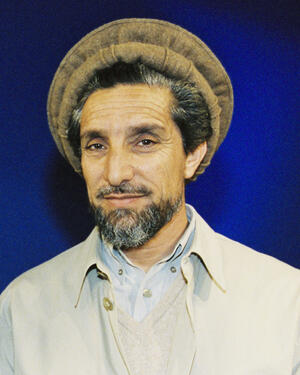

# Ahmad Shah Massoud

Afghan military commander known as the "Lion of Panjshir," assassinated by al-Qaeda suicide bombers posing as journalists exactly two days before the September 11 attacks -- a killing reportedly coordinated with the Taliban and allegedly facilitated by Pakistani intelligence (ISI).

| Field | Details |
|-------|---------|
| **Full Name** | Ahmad Shah Massoud |
| **Born** | c. September 2, 1953, Jangalak, Bazarak, Panjshir Valley, Afghanistan |
| **Died** | September 9, 2001 |
| **Age at Death** | 48 |
| **Location of Death** | Khwaja Bahauddin, Takhar Province, Afghanistan (died en route to hospital in Tajikistan) |
| **Cause of Death** | Suicide bomb hidden inside a camera, detonated during fake interview |
| **Official Ruling** | Assassination by al-Qaeda operatives |
| **Alleged Intelligence Connection** | al-Qaeda (confirmed), ISI / Pakistani intelligence (alleged), Taliban (facilitated) |
| **Victim Was Intel Employee** | No |
| **Category** | Military / Political Leader |

## Assessment: CONFIRMED (al-Qaeda); HIGHLY SUSPICIOUS (ISI)

Al-Qaeda's role in assassinating Massoud is confirmed -- the organization sent two operatives posing as journalists who detonated a bomb hidden in a stolen television camera. The assassination was timed precisely two days before the September 11, 2001 attacks on the United States, strongly suggesting it was a coordinated prelude designed to eliminate the Taliban's most effective military opponent before the anticipated American retaliation. According to senior Afghan intelligence officials, former Northern Alliance leaders, and multiple investigators, Pakistan's Inter-Services Intelligence (ISI) allegedly had knowledge of or involvement in the plot, given ISI's comprehensive support for the Taliban and its documented history of facilitating jihadist operations. Pakistan has denied involvement.

## Circumstances of Death

On September 9, 2001, Ahmad Shah Massoud agreed to an interview at his headquarters in Khwaja Bahauddin, Takhar Province, in northeastern Afghanistan. Two men identifying themselves as journalists -- Tunisian nationals Dahmane Abd al-Sattar and Bouraoui al-Ouaer -- had been waiting for weeks to secure the interview, having arrived with stolen Belgian passports and a letter of introduction purportedly from an Islamic media center in London.

The two men had stolen a television camera from a French journalist. Inside the camera and a battery belt, they had concealed explosives. When the interview began, reportedly right after asking Massoud the question, "Commander, what are you going to do with Osama bin Laden when you have conquered Afghanistan?" -- the bomb was detonated.

The explosion killed al-Sattar immediately. Al-Ouaer attempted to flee but was shot by Massoud's guards while trying to escape and later died of his wounds. Massoud was critically wounded by the blast. He was rushed toward a helicopter for evacuation to a hospital in Tajikistan but died during the transport. His death was not publicly confirmed by the Northern Alliance until September 15, 2001 -- four days after the 9/11 attacks -- to prevent the Taliban from exploiting the news militarily.

The FBI later matched the destroyed camera's serial number to a theft case involving a French cameraman, confirming the origin of the murder weapon.

## Background

### The Lion of Panjshir

Ahmad Shah Massoud was born around September 2, 1953, in the village of Jangalak in the Panjshir Valley, to an ethnic Tajik family. His father, Dost Mohammad Khan, was a colonel in the Royal Afghan Army. Massoud studied at the French-language Lycee Istiqlal in Kabul and briefly attended Kabul University's engineering faculty before the political upheaval of the 1970s drew him into resistance politics.

### Resistance Against the Soviets

When the Soviet Union invaded Afghanistan in December 1979, Massoud emerged as the most formidable commander of the Afghan mujahideen. Operating from the Panjshir Valley, he developed sophisticated guerrilla warfare tactics that repeatedly defeated Soviet offensives. The Soviets launched at least nine major operations into the Panjshir between 1980 and 1985, deploying up to 15,000 troops with heavy armor and air support, but never succeeded in holding the valley.

Massoud created the Shura-e Nazar (Supervisory Council), which united 130 commanders from 12 Afghan provinces in coordinated resistance against the Soviet occupation. His military genius earned him the title "Lion of Panjshir" and international recognition as one of the most effective guerrilla commanders of the 20th century.

### Post-Soviet Afghanistan and the Rise of the Taliban

After the Soviet withdrawal in 1989 and the fall of the communist government in 1992, Massoud became Defense Minister in the mujahideen government. When the Taliban, backed by Pakistan's ISI, swept across Afghanistan beginning in 1994, Massoud led the Northern Alliance (United Islamic Front for the Salvation of Afghanistan) as the primary military opposition.

By 2001, the Northern Alliance controlled only about 10% of Afghan territory, concentrated in the northeast, but Massoud's forces remained undefeated. He was the Taliban's and al-Qaeda's most significant military obstacle.

### Warnings to the West

In the months before his death, Massoud repeatedly tried to warn Western governments about the growing threat posed by al-Qaeda and the Taliban. In April 2001, he addressed the European Parliament in Strasbourg and Brussels, warning that his intelligence had gathered information about a large-scale attack being planned against the United States. According to reports, he asked for humanitarian aid for the Afghan people and warned that what was happening in Afghanistan threatened the entire world.

## Intelligence Connections

### Al-Qaeda: Confirmed

* The two assassins, Dahmane Abd al-Sattar and Bouraoui al-Ouaer, were Tunisian nationals operating as al-Qaeda agents
* The stolen Belgian passports used by the assassins were traced back to a Belgian consulate theft linked to al-Qaeda networks in Europe
* The timing -- exactly two days before 9/11 -- indicates the assassination was part of al-Qaeda's broader operational plan, designed to eliminate the Taliban's most dangerous opponent before the anticipated American military response
* Osama bin Laden reportedly promised Taliban leader Mullah Omar that Massoud would be eliminated as part of the 9/11 operational plan

### ISI / Pakistani Intelligence: Alleged

According to senior Afghan officials and multiple investigators:

* According to former Afghan intelligence chief Amrullah Saleh, "Without the ISI, it couldn't have happened." Saleh, who served as Massoud's intelligence liaison, has consistently alleged ISI complicity
* According to Ahmad Wali Massoud (brother of Ahmad Shah and then-Afghan ambassador to London), ISI was involved in the assassination plot
* According to investigators, Pakistan allegedly requested that a British (Scotland Yard) investigation into the assassination be shut down in its early stages
* ISI maintained comprehensive support for the Taliban from 1994 onward, providing training, funding, and military advisors
* ISI had a documented history of facilitating jihadist groups operating in Afghanistan, including providing sanctuary to al-Qaeda leadership
* Pakistan has not publicly responded to these specific allegations regarding the Massoud assassination

### The Two-Day Gap

The assassination of Massoud on September 9, followed by the 9/11 attacks on September 11, represents one of the most significant tactical sequences in modern terrorism. By eliminating Massoud first, al-Qaeda removed the one Afghan leader who could have immediately organized effective military resistance and cooperated with an American-led intervention. The Northern Alliance's initial concealment of Massoud's death underscores how strategically devastating the loss was.

## Why This Death Raises Questions

- The assassination was precisely timed two days before 9/11, indicating coordination as part of a larger operational plan
- The assassins waited weeks for access to Massoud, suggesting patient, well-resourced planning by a sophisticated intelligence network
- According to multiple Afghan officials, Pakistan's ISI allegedly had knowledge of the plot, given its comprehensive support for both the Taliban and jihadist networks
- According to investigators, Pakistan allegedly pressured Britain to shut down Scotland Yard's investigation into the assassination
- Massoud had been trying to warn Western intelligence agencies about an imminent al-Qaeda attack in the months before his death -- his warnings went largely unheeded
- The stolen Belgian passports used by the assassins were traced to al-Qaeda networks in Europe, indicating a transnational operation
- The letter of introduction carried by the assassins was reportedly traced to an Islamic center in London with known extremist connections
- Massoud's elimination removed the only Afghan military leader capable of immediately cooperating with a Western military response to 9/11

## Key Quotes

> According to Massoud's April 2001 address to the European Parliament, as reported by multiple news outlets, he warned that his intelligence had gathered information about a large-scale attack being planned on U.S. soil, and he asked for humanitarian aid for the Afghan people.

> According to former Afghan intelligence chief Amrullah Saleh, as reported by multiple sources: "I am 100 percent sure. Without the ISI, it couldn't have happened. And this is my question: if they weren't involved, why did they stop Scotland Yard's investigation?"

> According to CBS News, the assassins reportedly asked Massoud: "Commander, what are you going to do with Osama bin Laden when you have conquered Afghanistan?" -- moments before detonating the bomb.

> According to NPR, Massoud is remembered in Afghanistan as "a national hero who fought off first the Soviets and then the Taliban."

## Counterarguments / Alternative Explanations

Regarding ISI involvement, it should be noted that:

- No direct, publicly available evidence conclusively proves ISI participation in the specific assassination plot
- Al-Qaeda had its own extensive operational capability and did not necessarily need ISI assistance to carry out the attack
- The assassins operated through European al-Qaeda networks, which were outside ISI's typical operational sphere
- Pakistan's support for the Taliban does not automatically mean ISI was involved in every al-Qaeda operation conducted from Afghan territory
- ISI has denied involvement in the assassination
- The allegations come primarily from Massoud's allies and Afghan intelligence officials who were adversaries of Pakistan, raising questions about potential bias

The al-Qaeda role, however, is not disputed by any party.

## See Also

- [Benazir Bhutto](Benazir_Bhutto.md) -- Pakistani prime minister assassinated in 2007, with alleged ISI connections to the attack
- [Zia ul-Haq](Zia_ul_Haq.md) -- Pakistani president killed in suspicious 1988 plane crash
- [Qasem Soleimani](Qasem_Soleimani.md) -- Iranian general killed by U.S. drone strike in 2020
- [Daniel Pearl](Daniel_Pearl.md) -- journalist kidnapped and murdered in Pakistan with alleged ISI-linked connections

## Other Shocking Stories

- [Dag Hammarskjold](Dag_Hammarskjold.md): UN Secretary-General's plane crashed in Africa in 1961 -- evidence points to a shoot-down by mercenaries.
- [Anna Politkovskaya](Anna_Politkovskaya.md): Russian journalist investigating Chechen war crimes shot dead in her apartment elevator on Putin's birthday.
- [Patrice Lumumba](Patrice_Lumumba.md): Congo's first elected leader overthrown by CIA, executed, then dissolved in acid to destroy all evidence.
- [Karen Silkwood](Karen_Silkwood.md): Nuclear whistleblower died in suspicious car crash the night she was bringing proof of safety violations to a reporter.

## Sources

- [Assassination of Ahmad Shah Massoud - Wikipedia](https://en.wikipedia.org/wiki/Assassination_of_Ahmad_Shah_Massoud)
- [Ahmad Shah Massoud - Wikipedia](https://en.wikipedia.org/wiki/Ahmad_Shah_Massoud)
- [He tried to warn the world about al-Qaeda. Then he was assassinated 2 days before 9/11 - CBC Radio](https://www.cbc.ca/radio/asithappens/as-it-happens-friday-edition-1.6171560/he-tried-to-warn-the-world-about-al-qaeda-then-he-was-assassinated-2-days-before-9-11-1.6171563)
- [A Decade Ago, Massoud's Killing Preceded Sept. 11 - NPR](https://www.npr.org/2011/09/09/140328019/a-decade-ago-massouds-assassination-preceded-sept-11)
- [In Afghanistan, A Rebel Leader's Legacy - NPR](https://www.npr.org/2011/09/09/140333732/in-afghanistan-assessing-a-rebel-leaders-legacy)
- [Ahmad Shah Masoud - Britannica](https://www.britannica.com/biography/Ahmad-Shah-Masoud)
- [Inter-Services Intelligence activities in Afghanistan - Wikipedia](https://en.wikipedia.org/wiki/Inter-Services_Intelligence_activities_in_Afghanistan)
- [The Complex Legacy of Ahmad Shah Massoud - The Diplomat](https://thediplomat.com/2024/09/the-complex-legacy-of-ahmad-shah-massoud/)

*This information was built by Grok and Claude AI research.*

**Status:** Deceased (2001)
