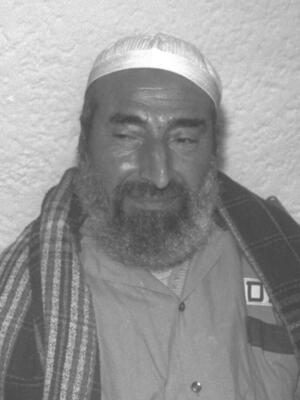

# Ahmed Yassin
Founder and spiritual leader of Hamas, assassinated by an Israeli helicopter strike in Gaza City in 2004 as he was wheeled out of a mosque after predawn prayers. The strike also killed his two bodyguards and nine bystanders.

| Field | Details |
|-------|---------|
| **Full Name** | Sheikh Ahmed Ismail Hassan Yassin |
| **Born** | 1 January 1936 |
| **Died** | 22 March 2004 |
| **Age at Death** | 67 |
| **Location of Death** | Gaza City, Gaza Strip |
| **Cause of Death** | Israeli helicopter-fired Hellfire missiles |
| **Official Ruling** | Targeted killing by Israeli military |
| **Alleged Intelligence Connection** | Shin Bet / IDF Military Intelligence / Israeli Air Force |
| **Category** | Political Figure |

## Assessment: CONFIRMED

The assassination of Ahmed Yassin was an overt Israeli military operation, publicly ordered by Prime Minister Ariel Sharon and carried out by Israeli Air Force AH-64 Apache helicopters firing Hellfire missiles. Israel made no attempt to deny responsibility, framing the killing as a legitimate military operation against the leader of a terrorist organization.

## Circumstances of Death

In the early morning hours of 22 March 2004, Yassin attended the Fajr (predawn) prayer at a mosque near his home in the Sabra neighborhood of Gaza City. As the wheelchair-bound cleric was being wheeled out of the mosque by his companions, an Israeli AH-64 Apache helicopter gunship fired at least three Hellfire missiles at his group.

Yassin, both of his bodyguards, and nine bystanders were killed instantly. Another twelve people were wounded, including two of Yassin's sons. The attack occurred at approximately 5:00 AM. The Israeli government confirmed the strike within hours, with Prime Minister Ariel Sharon describing it as a defensive measure.

## Background

Ahmed Yassin co-founded Hamas (the Islamic Resistance Movement) in 1987 during the First Intifada. He had been paralyzed from the neck down since his adolescence — reportedly due to a sporting accident — and used a wheelchair for most of his life. Despite his physical limitations, he became the most prominent figure in Palestinian Islamist politics.

Yassin was imprisoned by Israel from 1989 to 1997, when he was released in a deal after a botched Mossad assassination attempt on Hamas official Khaled Meshaal in Jordan. After his release, he continued to serve as Hamas's spiritual leader, issuing public statements endorsing suicide bombings against Israeli targets during the Second Intifada.

Israel had attempted to kill Yassin before: in September 2003, an Israeli airstrike targeted a building where he was meeting with other Hamas leaders. He survived that attack with minor injuries.

## Intelligence Connections

* The assassination was planned and executed by Israeli military intelligence and the Israeli Air Force
* Shin Bet (Israel's internal security service) reportedly tracked Yassin's movements and confirmed his location for the strike
* The operation was authorized directly by Prime Minister Ariel Sharon and the Israeli security cabinet
* It was part of Israel's broader policy of "targeted killings" of Palestinian militant leaders during the Second Intifada
* The assassination triggered an international diplomatic crisis, with the UN Security Council debating a resolution condemning the killing (vetoed by the United States)

## Why This Death Raises Questions

- Yassin was a wheelchair-bound 67-year-old quadriplegic — his killing outside a mosque after morning prayers struck many as disproportionate
- Nine bystanders were killed in the strike, including civilians who had been praying alongside him
- The assassination violated international norms against extrajudicial killing and was condemned by the UN, the EU, and most nations
- Far from weakening Hamas, the killing galvanized Palestinian support for the organization and led to retaliatory attacks
- Yassin's successor, Abdel Aziz al-Rantisi, was killed by Israel just 26 days later in a near-identical helicopter strike
- The rapid sequential killing of Hamas leaders was characterized by critics as a pattern of state assassination rather than military necessity

## Key Quotes

> "This is a crazy and very dangerous act. It opens the door wide to chaos." — Palestinian Authority President Yasser Arafat, March 2004

> "Israel carried out the attack as part of its right of self-defense against the head of a terrorist organization." — Israeli government statement, March 2004

> "Sheikh Yassin was known as the spiritual leader of a terrorist organization, but he was in his wheelchair, leaving a mosque. What kind of threat was he?" — International criticism of the strike

## See Also

- [Abdel Aziz al-Rantisi](Abdel_Aziz_al_Rantisi.mdx) — Yassin's successor, assassinated by Israel 26 days later
- [Mahmoud Al-Mabhouh](Mahmoud_Al_Mabhouh.mdx) — Hamas commander killed by Mossad in Dubai, 2010
- [Imad Mughniyeh](Imad_Mughniyeh.mdx) — Hezbollah commander killed by CIA-Mossad, 2008

- Mossad (Group Profile) — intelligence service connected to this case

## Other Shocking Stories

- [Barry Seal](Barry_Seal.mdx): CIA drug pilot turned informant. A judge forced him into an unprotected halfway house. The cartel found him.
- [Darioush Rezaeinejad](Darioush_Rezaeinejad.mdx): Iranian engineer shot five times in front of his wife and child. Part of a systematic assassination campaign.
- [Mary Pinchot Meyer](Mary_Pinchot_Meyer.mdx): JFK's mistress shot execution-style on a Georgetown towpath. CIA counterintelligence chief seized and burned her diary.
- [Rafael Trujillo](Rafael_Trujillo.mdx): CIA supplied the weapons. Dominican dictator ambushed and shot in his car. Church Committee confirmed it.

## Sources

- [Killing of Ahmed Yassin — Wikipedia](https://en.wikipedia.org/wiki/Killing_of_Ahmed_Yassin)
- [Ahmed Yassin — Wikipedia](https://en.wikipedia.org/wiki/Ahmed_Yassin)
- [Hamas Leader Killed in Israeli Air Strike — PBS NewsHour](https://www.pbs.org/newshour/politics/middle_east-jan-june04-mideast_03-22)
- [Hamas founder killed in Israeli airstrike — CNN, March 2004](https://www.cnn.com/2004/WORLD/meast/03/21/yassin/)
- [Israel Assassinates Hamas Founder Sheikh Ahmed Yassin — VOA](https://www.voanews.com/a/a-13-a-2004-03-22-2-israel-66878867/261044.html)

*This information was built by Grok and Claude AI research.*

**Status:** Deceased (2004)
