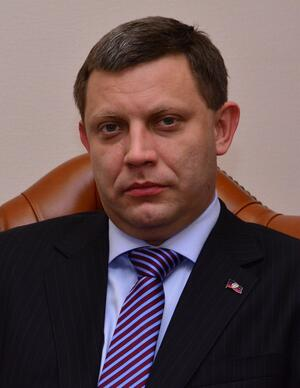

# Alexander Zakharchenko
Pro-Russian separatist leader of the self-proclaimed Donetsk People's Republic, killed by a bomb planted in a cafe he frequented in Donetsk in 2018. Both Ukrainian intelligence and Russian FSB have been accused, with competing theories pointing to state assassination or internal separatist power struggles over control of the Donbas region's economic assets.

| Field | Details |
|-------|---------|
| **Full Name** | Alexander Vladimirovich Zakharchenko |
| **Born** | 26 June 1976 |
| **Died** | 31 August 2018 |
| **Age at Death** | 42 |
| **Location of Death** | Donetsk, Ukraine (DPR-controlled) |
| **Cause of Death** | Bomb explosion in cafe |
| **Official Ruling** | Assassination (homicide) |
| **Alleged Intelligence Connection** | Ukrainian SBU, Russian FSB (competing theories) |
| **Category** | Political Figure |

## Assessment: SUSPICIOUS

Zakharchenko's assassination remains one of the most contested killings of the Donbas conflict, with multiple parties accused and no definitive attribution. Russia blamed Ukrainian intelligence; Ukraine blamed internal separatist power struggles or a Russian FSB purge of an increasingly unreliable proxy leader. The sophistication of the bomb placement in a cafe he regularly visited — reportedly concealed in a lighting fixture above his usual seat — required detailed knowledge of his habits and access to the venue, pointing to insiders within his own security apparatus. The rapid installation of his successor Denis Pushilin within days suggests at least one party was prepared for his removal.

## Circumstances of Death

On the evening of August 31, 2018, Zakharchenko entered the cafe "Separ" on Pushkin Boulevard in central Donetsk, a restaurant he was known to frequent as a regular gathering spot for DPR officials. A bomb detonated inside the establishment as Zakharchenko entered, killing him and wounding several others, including DPR finance minister Alexander Timofeyev. Reports indicated the bomb had been concealed in the lighting fixture above the area where Zakharchenko typically sat, requiring advance placement and detailed knowledge of his seating habits.

A second person, Zakharchenko's bodyguard, also died from injuries sustained in the blast. The cafe's name — "Separ" — was slang for "separatist," reflecting the establishment's function as an informal headquarters for DPR leadership. The predictability of Zakharchenko's visits made it both a surveillance opportunity and an operational vulnerability.

According to the analysis by the Centre for Eastern Studies (OSW) in Warsaw, the circumstances indicated that "the attack must have involved people associated with local security bodies, who knew Zakharchenko's schedule, the places he lived, and how his bodyguards behaved. These people also had free access to the building of the café where the explosive charge was planted."

## Background

Alexander Zakharchenko was born in Donetsk in 1976 and worked as a mine electrician before entering separatist politics. In December 2013, amid the Euromaidan revolution in Kyiv, he became head of the Donetsk branch of OPLOT, a pro-Russian militant organization. Following the revolution, he participated in the April 2014 seizure of Donetsk City Council offices — one of the key acts in the Russian-backed separatist uprising in eastern Ukraine.

He succeeded the Russian citizen Alexander Borodai as DPR prime minister on August 7, 2014. Borodai later admitted that Zakharchenko was installed as part of a Russian government effort to make the uprising appear to be a local, grassroots phenomenon rather than a Moscow-directed operation. In the November 2014 DPR elections — which were not recognized by Ukraine, the EU, or the United States — Zakharchenko reportedly won with 78.93% of the vote.

During his four years as DPR leader, Zakharchenko oversaw the region during the heaviest fighting of the Donbas war, including the battles for Donetsk airport and Debaltseve. He became the public face of the separatist movement, appearing at press conferences and signing the Minsk agreements on behalf of the DPR.

However, his relationship with Moscow reportedly deteriorated as he became increasingly independent, resisting directives from Russian handlers and asserting personal control over the DPR's economic resources — including coal exports, metals, and other industries in the territory. He was sanctioned by the EU, US, Canada, and other nations for his role in the separatist movement.

He had reportedly survived at least two previous assassination attempts before the final, successful bombing.

By 2018, he was increasingly isolated — caught between Ukrainian forces on one side, Moscow's demands for compliance on another, and rival separatist factions vying for control of Donbas resources and revenue streams.

## Intelligence Connections

* Ukraine's SBU (Security Service) presented two theories: the attack was organized by Russia's FSB as part of an ongoing purge of separatist leadership, or it was the result of personal score-settling among separatist factions over financial and criminal matters
* Russia accused Ukrainian intelligence of carrying out the assassination, calling it a "dastardly" crime aimed at destabilizing the Minsk peace process
* The OSW analysis concluded that the attack required insiders with access to local security bodies, Zakharchenko's schedule, and the cafe building — ruling out a purely external operation
* Multiple separatist leaders had been killed in similar targeted attacks in both the DPR and LPR, suggesting a systematic pattern of eliminations
* Zakharchenko's security detail was reportedly penetrated or compromised, as the attackers had access to the cafe's interior for bomb placement
* The attack occurred during a period of increased tensions between Zakharchenko and Moscow-backed figures over control of DPR economic resources and political direction
* OSW assessed that "Zakharchenko's elimination could have been the result of an internal, criminal conflict within the DRL, mainly involving the fight for control over economic assets, but it could just as well have been a decision taken in Moscow, in order to get rid of the separatists' discredited leader"

## Why This Death Raises Questions

- The bomb was pre-planted in a cafe he frequented, concealed in a lighting fixture above his usual seat — requiring detailed knowledge of his habits and physical access to the venue
- Both Ukrainian and Russian intelligence services had potential motives: Ukraine to eliminate a separatist leader, Russia to replace an increasingly independent and unreliable proxy
- DPR finance minister Timofeyev, wounded in the same blast, had reportedly been in a power struggle with Zakharchenko over control of DPR economic assets
- The attack followed a clear pattern of separatist leader assassinations in Donbas: Arsen "Motorola" Pavlov was killed by a bomb in his apartment building elevator in October 2016; LPR leader Igor Plotnitsky was forcibly removed in a coup in November 2017; and other field commanders were eliminated in suspicious circumstances
- No group credibly claimed responsibility for the killing
- His successor, Denis Pushilin, was installed within days of the assassination, suggesting preparations had been made in advance by at least one faction
- The Donbas region remained a black hole for independent investigation, with no credible judicial process, no free media, and no international monitoring of the crime scene
- The killing came at a moment when Moscow was reportedly consolidating direct control over the separatist territories, removing leaders who had built independent power bases
- RFE/RL reported that a second person died from blast injuries, and several others were wounded, indicating a powerful device designed to ensure the target's death regardless of exact positioning

## The Counterargument

The question of who killed Zakharchenko may never be definitively answered. Russia's claim that Ukraine was responsible cannot be independently verified, and Ukraine's counterclaim that it was either a Russian FSB operation or internal separatist infighting is equally unproven. It is possible that the killing resulted from a purely criminal dispute over economic assets in the DPR rather than a state-directed assassination. The chaotic, lawless environment of the Donbas conflict zone — where warlords, intelligence operatives, and criminal networks overlapped — makes any single attribution inherently uncertain.

## Key Quotes

> "This is not the first attempt on the life of the head of the Donetsk People's Republic. This despicable murder once again confirms that the people in Kiev are not looking for peace." — Russian Foreign Ministry statement, reported by Al Jazeera

> "We have nothing to do with this. This is an internal matter of the terrorists." — Ukraine's response, according to the Washington Post

> "The attack must have involved people associated with local security bodies, who knew Zakharchenko's schedule, the places he lived, and how his bodyguards behaved." — Centre for Eastern Studies (OSW) analysis

## See Also

- [Yevgeny Prigozhin](Yevgeny_Prigozhin.mdx) — Russian paramilitary leader killed in suspicious plane crash after challenging Moscow
- [Boris Nemtsov](Boris_Nemtsov.mdx) — Russian opposition politician assassinated near the Kremlin
- [Alexei Navalny](Alexei_Navalny.mdx) — Russian opposition leader who died in custody

## Other Shocking Stories

- [Serena Shim](Serena_Shim.mdx): Reported ISIS using UN food trucks. Turkish intelligence accused her of espionage.
- [Marine Vlahovic](Marine_Vlahovic.mdx): French journalist found dead on a Marseille rooftop while filming a documentary on Israel's war in Gaza.
- [Humberto Delgado](Humberto_Delgado.mdx): Portuguese opposition leader lured to the Spanish border by secret police and murdered. Body hidden for two years.
- [Georgi Markov](Georgi_Markov.mdx): Bulgarian dissident stabbed with a ricin-tipped umbrella on Waterloo Bridge. Dead in three days.

## Sources

- [Al Jazeera: Alexander Zakharchenko killed in Donetsk cafe explosion](https://www.aljazeera.com/news/2018/8/31/alexander-zakharchenko-killed-in-donetsk-cafe-explosion)
- [CNN: Pro-Russian rebel leader killed in cafe explosion](https://edition.cnn.com/2018/08/31/europe/alexander-zakharchenko-donetsk-rebel-leader-killed/index.html)
- [Washington Post: Donetsk separatist leader killed in eastern Ukraine cafe explosion](https://www.washingtonpost.com/world/europe/pro-russian-rebel-leader-killed-in-eastern-ukraine-blast/2018/08/31/12a18336-ad37-11e8-b1da-ff7faa680710_story.html)
- [OSW Centre for Eastern Studies: The leader of the Donetsk separatists is assassinated](https://www.osw.waw.pl/en/publikacje/analyses/2018-09-03/leader-donetsk-separatists-assassinated)
- [RFE/RL: Second Person Dies In Donetsk Cafe Blast That Killed Separatist Leader](https://www.rferl.org/a/ukrainian-separatist-leader-zakharchenko-reported-killed-in-donetsk-cafe-blast/29464119.html)
- [Meduza: Cafe bombing kills separatist leader in eastern Ukraine](https://meduza.io/en/news/2018/08/31/cafe-bombing-kills-separatist-leader-in-eastern-ukraine)
- [Wikipedia: Alexander Zakharchenko](https://en.wikipedia.org/wiki/Alexander_Zakharchenko)

*This information was built by Grok and Claude AI research.*

**Status:** Deceased (2018)
