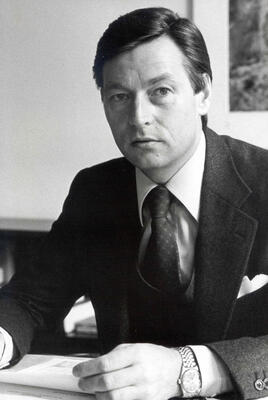

# Alfred Herrhausen

Chairman of Deutsche Bank killed by a sophisticated remote-controlled roadside bomb in Bad Homburg, Germany, just 21 days after the fall of the Berlin Wall. The Red Army Faction claimed responsibility, but the bomb's military-grade sophistication far exceeded known RAF capabilities, fueling theories of Stasi or KGB involvement. The case remains officially unsolved.

| Field | Details |
|-------|---------|
| **Full Name** | Alfred Herrhausen |
| **Born** | January 30, 1930, Essen, Germany |
| **Died** | November 30, 1989 |
| **Age at Death** | 59 |
| **Location of Death** | Bad Homburg, Hesse, West Germany |
| **Cause of Death** | Killed by remote-controlled roadside bomb (explosively formed penetrator) |
| **Official Ruling** | Homicide (claimed by Red Army Faction; no one charged) |
| **Alleged Intelligence Connection** | Stasi (East German intelligence), KGB, possibly RAF acting as proxy |
| **Victim Was Intel Employee** | No |
| **Category** | Banker / Financier |

## Assessment: SUSPICIOUS

Alfred Herrhausen was killed by one of the most technically sophisticated assassination devices ever used in postwar Europe -- a Misnay-Schardin effect explosively formed penetrator, hidden in a child's knapsack on a parked bicycle, detonated by a photoelectric beam triggered by the passage of his armored car. While the Red Army Faction claimed responsibility, federal prosecutors dropped charges against the RAF in 2004 due to lack of evidence. The bomb's design required expertise in military-grade shaped charges, precision electronics, and intelligence-level surveillance of Herrhausen's movements -- capabilities that investigators and analysts have questioned whether the RAF possessed. The timing -- 21 days after the Berlin Wall fell -- and Herrhausen's role in negotiating German reunification and Third World debt relief have fueled enduring theories that intelligence services were involved.

## Circumstances of Death

On the morning of November 30, 1989, Alfred Herrhausen left his villa in Bad Homburg vor der Hohe for his daily commute to Deutsche Bank headquarters in Frankfurt. His armored Mercedes-Benz S-Class was part of a three-car convoy with police escort.

A bicycle had been parked along Herrhausen's regular route for an extended period before the assassination -- long enough that his security detail had grown accustomed to its presence and stopped treating it as a threat. Concealed in a child's knapsack attached to the bicycle was approximately 7 kilograms of plastic explosive fitted with a copper plate -- an explosively formed penetrator based on the Misnay-Schardin principle.

When Herrhausen's car passed the bicycle, it broke an infrared photoelectric beam strung across the road at low height. The beam triggered the detonation. The copper plate was deformed by the explosive force into a superplastic slug traveling at nearly two kilometers per second -- fast enough to punch through the armored Mercedes. The projectile struck the car from the side, killing Herrhausen instantly.

The precision of the device was extraordinary. The photoelectric trigger required exact calibration to distinguish between the lead car and Herrhausen's vehicle. The shaped charge had to be aimed at the precise height and angle to defeat armored plating. The entire system -- explosive, trigger, and aiming mechanism -- demonstrated a level of engineering sophistication that stunned investigators and military ordnance experts.

## Background

### Chairman of Deutsche Bank

Alfred Herrhausen rose through Deutsche Bank during West Germany's postwar economic miracle to become Chairman of the Board of Managing Directors in May 1988. He was widely regarded as one of the most powerful bankers in Europe and a close confidant of Chancellor Helmut Kohl.

### Third World Debt Relief

Herrhausen became internationally prominent -- and controversial within banking circles -- for his advocacy of substantial debt relief for developing nations. In a speech at the World Bank-IMF annual meeting in September 1989, he proposed what became known as the "Herrhausen Plan": general debt write-offs of up to 70%, interest rate cuts of up to 50% for five years, a five-year grace period for all debtors, and an extension of loan maturities to 25-30 years. This proposal placed him in direct opposition to powerful financial interests in New York, London, and Washington who stood to lose billions.

### German Reunification

Following the fall of the Berlin Wall on November 9, 1989, Herrhausen played a pivotal role in the financial architecture of German reunification. According to multiple reports, at the time of his death he had helped negotiate a secret agreement with Chancellor Kohl and Soviet leader Mikhail Gorbachev to loan the Soviet Union 8 billion Deutschmarks to stabilize the Soviet economy, in exchange for Moscow's consent to German reunification. He was scheduled to present a detailed plan for the economic integration of East Germany the day after he was killed.

### A Man with Many Powerful Enemies

Herrhausen's combination of positions -- advocating debt relief that threatened Western banking profits, facilitating German reunification that threatened Cold War power structures, and negotiating directly with the Soviets -- meant he had accumulated enemies across multiple power centers: Western financial institutions that would lose from debt forgiveness, Cold War hardliners who opposed rapprochement with Moscow, and intelligence services on both sides whose relevance depended on continued East-West division.

## Intelligence Connections

* **Stasi connection:** Certain German and American media connected the assassination to the Staatssicherheitsdienst (Stasi) of East Germany. With the Berlin Wall having fallen just three weeks earlier, the Stasi was in the process of destroying records and covering its tracks. Some analysts have suggested the assassination could have been a Stasi operation to destabilize reunification or a settling of accounts
* **KGB allegations:** Some reports in the 2000s claimed that Vladimir Putin, then a KGB officer stationed in Dresden, East Germany, was the handler of RAF members involved in the assassination. However, a 2023 investigation by Der Spiegel reported that the anonymous source behind these claims had never been an RAF member and was "considered a notorious fabulist" with "several previous convictions, including for making false statements"
* **RAF as proxy:** Western intelligence analysts have long debated whether the RAF operated independently or served as a proxy for Eastern Bloc intelligence services. The RAF's historical connections to training camps in East Germany, Yemen, and Lebanon -- facilitated by Stasi and Palestinian organizations -- are well documented
* **Bomb sophistication:** Military ordnance experts noted that the Misnay-Schardin shaped charge used in the attack was a military weapon system, not a typical terrorist improvised device. The photoelectric trigger, the precise calibration, and the explosive forming technique all suggested access to military engineering expertise beyond what the RAF was known to possess

## Why This Death Raises Questions

- The bomb used military-grade technology -- an explosively formed penetrator with photoelectric trigger -- that far exceeded the demonstrated technical capabilities of the Red Army Faction
- Federal prosecutors dropped all charges against the RAF in 2004 due to insufficient evidence, and no one has ever been charged with the murder
- Herrhausen was killed exactly 21 days after the fall of the Berlin Wall, at the precise moment when his work on reunification and Soviet financial stabilization was reaching its most sensitive phase
- He was scheduled to present his plan for East German economic integration the day after he was killed
- The bicycle used to conceal the bomb had been placed along his route well in advance, requiring long-term surveillance of his movements -- a hallmark of intelligence operations, not ad hoc terrorism
- His advocacy for Third World debt relief directly threatened billions in Western banking profits, creating powerful financial enemies
- His secret negotiations with Gorbachev on an 8 billion Deutschmark Soviet loan threatened Cold War power structures on both sides
- The Stasi was actively destroying records and conducting operations in the chaotic weeks after the Wall fell, creating a window of maximum deniability
- Despite decades of investigation, the case remains completely unsolved -- no arrests, no trial, no accountability

## Key Quotes

> "I know that there is a group of people who have an interest in my death." -- Alfred Herrhausen, according to multiple biographical accounts, speaking in the weeks before his assassination

> "The assassination was mourned by both Chancellor Helmut Kohl and opposition leader Willy Brandt. Kohl called it a 'cowardly murder.'" -- As reported by Deseret News, November 30, 1989

> "If you want to do something really meaningful, you have to be prepared to break the rules." -- Alfred Herrhausen, widely attributed, regarding his debt relief advocacy

## Counterarguments / Alternative Explanations

- **RAF acted alone:** Supporters of the RAF theory note that the group had carried out sophisticated attacks before, including the 1977 kidnapping and murder of Hanns Martin Schleyer. Former RAF member Eva Haule has been linked to discussions about the Herrhausen attack, though not definitively
- **No definitive intelligence link:** Despite decades of speculation, no declassified document or defector testimony has definitively proven Stasi or KGB involvement
- **Putin connection debunked:** The most dramatic intelligence theory -- that Vladimir Putin personally directed the operation -- was undermined by Der Spiegel's 2023 investigation showing the key source was unreliable
- **Domestic terrorism explanation:** West Germany in the late 1980s experienced genuine left-wing terrorism, and the RAF had the motivation (opposing capitalism) and some technical capability, even if this particular attack exceeded their known sophistication
- **Multiple theories, no proof:** The unsolved status of the case means all theories -- RAF, Stasi, KGB, Western intelligence, financial interests -- remain speculative

## See Also

- [Roberto Calvi](Roberto_Calvi.md) -- Italian banker found dead under Blackfriars Bridge, linked to Vatican Bank, P2, and intelligence services
- [Detlev Rohwedder](Detlev_Rohwedder.md) -- Head of Treuhandanstalt, shot by sniper in 1991 in another unsolved German assassination attributed to RAF
- [Gerald Bull](Gerald_Bull.md) -- Arms designer assassinated with suspected intelligence involvement
- [Olof Palme](Olof_Palme.md) -- Swedish Prime Minister assassinated in 1986 in another long-unsolved European political killing

## Other Shocking Stories

- [Jamal Khashoggi](Jamal_Khashoggi.md): Walked into a Saudi consulate for a marriage document. Walked out in pieces, in suitcases.
- [Georgi Markov](Georgi_Markov.md): Stabbed with a poisoned umbrella tip on a London bridge. Dead in three days from ricin.
- [Karen Silkwood](Karen_Silkwood.md): Nuclear whistleblower run off the road the night she was delivering proof of contamination cover-ups.
- [Patrice Lumumba](Patrice_Lumumba.md): Congo's first elected leader dissolved in acid by Belgian agents after a CIA-backed coup.

## Sources

- [Alfred Herrhausen - Wikipedia](https://en.wikipedia.org/wiki/Alfred_Herrhausen)
- [Alfred Herrhausen - Britannica Money](https://www.britannica.com/money/Alfred-Herrhausen)
- [Bicycle bomb kills leading German banker - UPI Archives](https://www.upi.com/Archives/1989/11/30/Bicycle-bomb-kills-leading-German-banker/4379628405200/)
- [Tearful Kohl assails 'cowardly murder' of West German banker - Deseret News](https://www.deseret.com/1989/11/30/18834643/tearful-kohl-assails-cowardly-murder-of-west-german-banker/)
- [The Herrhausen Method - Schiller Institute](https://archive.schillerinstitute.com/news_briefs/2016/08/herrhausen_method.html)
- ['Dark' Star Oliver Masucci on 'Herrhausen - The Banker and The Bomb' - Hollywood Reporter](https://www.hollywoodreporter.com/tv/tv-news/dark-star-oliver-masucci-on-blowing-up-german-cold-war-history-with-herrhausen-the-banker-and-the-bomb-1235525142/)
- [Alfred Herrhausen - Grokipedia](https://grokipedia.com/page/Alfred_Herrhausen)

*This information was built by Grok and Claude AI research.*
