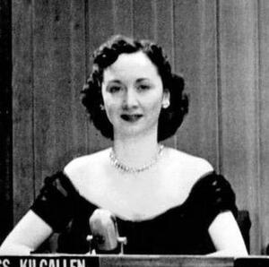

America's most famous female journalist and beloved television panelist on *What's My Line?*, found dead of a barbiturate-alcohol overdose in 1965 after privately interviewing Jack Ruby and aggressively investigating the JFK assassination. Her investigation files vanished and have never been recovered.

| Field | Details |
|-------|---------|
| **Full Name** | Dorothy Mae Kilgallen |
| **Born** | July 3, 1913, Chicago, Illinois |
| **Died** | November 8, 1965 |
| **Age at Death** | 52 |
| **Location of Death** | 45 East 68th Street, Manhattan, New York, USA |
| **Cause of Death** | Combined overdose of alcohol and barbiturates (secobarbital, pentobarbital, and tuinal) |
| **Official Ruling** | Undetermined (medical examiner stated it "could well have been accidental") |
| **Alleged Intelligence Connection** | CIA, FBI |
| **Category** | Journalist / Investigator |

## Assessment: HIGHLY SUSPICIOUS

Dorothy Kilgallen was the most prominent journalist in America actively investigating the JFK assassination when she died. She was the only journalist in the world who secured a private interview with Jack Ruby -- an extraordinary journalistic achievement -- and had obtained and published classified Warren Commission testimony before it was officially released. She told multiple people she was about to "break the case wide open." Her complete JFK investigation file, including her notes from the Ruby interview, vanished from her home after her death and has never been recovered. Her friend Florence Pritchett Smith, with whom Kilgallen had shared her notes, died two days later.

## Background

### Career and Rise to Fame

Dorothy Kilgallen was born into journalism. Her father, James Lawrence Kilgallen, was a veteran reporter for the International News Service, part of the Hearst media empire. Dorothy followed him into the newspaper business, joining the New York Evening Journal after completing two semesters at the College of New Rochelle.

She made national headlines in 1936 at age 23 when she competed in a race around the world against two male reporters -- Herbert Ekins of the New York World-Telegram and Leo Kieran of The New York Times -- using only transportation available to ordinary people. She was the only woman in the contest. Though she finished second (completing the journey in 24 days to Ekins' 21), the feat made her famous and led to her book *Girl Around the World* and inspired the 1937 film *Fly-Away Baby*.

In 1938, Kilgallen began writing her daily column, "The Voice of Broadway," for the Hearst-owned New York Journal-American. The column started as show-business gossip but expanded into politics, organized crime, and major news. It was eventually syndicated through King Features to over 200 newspapers nationwide, reaching an estimated 20 million readers daily. She had a star on the Hollywood Walk of Fame.

### Pioneer Crime Reporter

Before the JFK assassination defined her legacy, Kilgallen was already one of America's most respected trial reporters. She covered the 1935 Lindbergh baby kidnapping trial (Bruno Richard Hauptmann), the Anna Antonio case (1934), and the Eva Coo murder trial (1935). In the 1950s, her coverage of the Sam Sheppard murder trial was credited with helping to generate public pressure that eventually contributed to Sheppard's retrial and acquittal.

### Television Stardom

Kilgallen became a household name through *What's My Line?*, the CBS television game show on which she appeared as a panelist from its very first broadcast on February 2, 1950, until her death fifteen years later. She appeared alongside host John Charles Daly and fellow regular panelists Arlene Francis and Bennett Cerf almost every Sunday evening. The show made her one of the most recognized women in America -- a journalist who was simultaneously a television celebrity, giving her an enormous platform that few reporters of any era have matched.

## The JFK Assassination Investigation

### Initial Skepticism

From the moment President Kennedy was assassinated on November 22, 1963, Kilgallen was skeptical of the official story. Within one week of the assassination, she published a column asking pointed questions about how Jack Ruby could have walked into Dallas police headquarters to shoot Lee Harvey Oswald:

> "I'd like to know how, in a big, smart town like Dallas, a man like Jack Ruby -- who wanted his face and his name in every paper, on every TV channel -- can stroll in and out of police headquarters as if it was a health club at a time when a small army of law enforcers is keeping a 'tight security guard' on Oswald."

She also wrote a column titled "Oswald File Must Not Close," which caught the attention of FBI Director J. Edgar Hoover. According to declassified FBI documents, Hoover scribbled "Wrong" next to a copy of the column.

### The Private Interview with Jack Ruby

In March 1964, Kilgallen traveled to Dallas to cover Jack Ruby's murder trial. During the proceedings, she achieved what no other journalist in the world managed: a private interview with Ruby in Judge Joe B. Brown's chambers. Ruby's own bodyguards were kept outside the room. According to various accounts, there were actually two such meetings, each lasting approximately ten minutes.

In her exclusive column for the Journal-American, Kilgallen described Ruby as having a trembling handshake, "like the heartbeat of a bird." She quoted Ruby as saying, "I feel I'm on the verge of something I don't understand -- the breaking point maybe."

But a great deal of what Kilgallen learned from Ruby reportedly never made it into her published column. She kept the most significant revelations for a book she was writing about the assassination -- a book that, because of her death, would never be completed. Kilgallen left the Ruby trial more convinced than ever that a conspiracy had killed Kennedy.

### Publishing Classified Testimony

In August 1964, in an astonishing journalistic coup, Kilgallen published in her column the then-classified transcript of testimony Jack Ruby had given at a secret session of the Warren Commission on June 7, 1964. This was before the Warren Commission had officially released it. The scoop infuriated the government. Two FBI agents visited Kilgallen at her home to find out how she had obtained the classified material. According to accounts of the visit, she made the agents tea but told them she could never reveal her source.

### Challenging the Warren Commission

When the Warren Report was released in September 1964, Kilgallen publicly called its conclusions "laughable." She continued investigating, writing columns that questioned the lone-gunman theory and pursuing leads connecting Ruby to organized crime and, according to author Mark Shaw, to intelligence operations.

According to Shaw's research in *The Reporter Who Knew Too Much*, Kilgallen's investigation was tracking connections between Ruby, the CIA, the Mafia, and the events in Dallas. She reportedly had developed sources within law enforcement and the intelligence community who were feeding her information.

### "Break the Case Wide Open"

In the months before her death, Kilgallen told multiple people -- including her lawyer, her agent, and fellow journalists -- that she was close to breaking the JFK assassination case. According to Mark Shaw, she stated:

> "I'm going to break the real story and have the biggest scoop of the century."

She also declared:

> "That story isn't going to die as long as there's a real reporter alive, and there are a lot of them alive."

Her hairdresser, Marc Sinclaire, reported seeing Kilgallen carrying a thick file of JFK assassination papers in the days before her death -- papers she described as pertaining to the assassination.

## Circumstances of Death

On the morning of November 8, 1965, Dorothy Kilgallen was found dead in her Manhattan townhouse at 45 East 68th Street. She had appeared on *What's My Line?* the previous evening -- her final broadcast -- and had afterward gone out to a bar called P.J. Clarke's, where she was seen with an unidentified companion.

The death scene contained multiple anomalies that author Mark Shaw and other investigators have highlighted:

**Wrong room.** Kilgallen's body was found in the master bedroom on the third floor of her five-story townhouse. But she never slept in that room -- she used it only as a dressing room. She normally slept on the fifth floor. Her husband, Richard Kollmar, slept on the fourth floor.

**Wrong clothes.** She was wearing a matching blue robe and nightgown that friends said she did not normally wear to bed, as well as full makeup, false eyelashes, and a hairpiece -- items she would not have worn to sleep.

**Wrong book.** The novel *The Honey Badger* by Robert Ruark was found open and face-down beside her, but Kilgallen had told people she had already finished reading it. Her reading glasses were not in the room.

**The drugs.** The medical examiner, Dr. James Luke, found a combination of alcohol and three barbiturates in her system -- secobarbital, pentobarbital, and tuinal. The combination of three barbiturates was unusual and not consistent with her known prescriptions.

The death scene was not treated as a crime scene. No thorough forensic investigation was conducted. No suicide note was found. Dr. Luke ruled the cause of death "undetermined," stating the overdose "could well have been accidental."

## The Disappearing Files

The most alarming fact surrounding Kilgallen's death is the complete disappearance of her JFK assassination investigation file. This file reportedly contained her notes from the private Ruby interview, classified documents she had obtained, source names, and the draft of the book she was writing. Despite searches by her family and researchers over the decades, the file has never been recovered.

Her friend and fellow columnist Ron Pataky was reportedly the last person to see her alive. According to Mark Shaw's investigation, Pataky has refused to cooperate with investigators looking into Kilgallen's death.

## The Death of Florence Pritchett Smith

In what many researchers consider the most chilling footnote to this case, Kilgallen had shared a copy of her JFK investigation notes with her close friend Florence Pritchett Smith -- the wife of Earl E. T. Smith, who had served as U.S. Ambassador to Cuba from 1957 to 1959.

Florence Pritchett Smith was found dead just two days after Kilgallen, reportedly of a cerebral hemorrhage. The copy of Kilgallen's notes that had been given to Smith was never found.

Two women, one of whom had the original JFK file and one who had a copy, dead within 48 hours. Neither set of documents was ever recovered.

## Intelligence Connections

* Kilgallen published classified Warren Commission testimony before its official release, proving she had a source inside the investigation or the government
* According to declassified documents, FBI Director J. Edgar Hoover had Kilgallen under surveillance due to her aggressive JFK reporting and personally annotated her columns
* Two FBI agents were dispatched to Kilgallen's home to interrogate her about how she obtained classified Ruby testimony
* According to Mark Shaw, the CIA had 53 field offices around the world monitoring Kilgallen during her foreign travels
* The FBI reportedly tapped her home phone line
* According to Shaw (*The Reporter Who Knew Too Much*), Kilgallen's investigation was tracking connections between Ruby, the CIA, and organized crime -- the very nexus that intelligence agencies would have had the strongest motive to conceal
* Jack Ruby himself reportedly told Kilgallen things he told no other journalist -- and then both Ruby and Kilgallen were dead within 14 months of each other

## Why This Death Raises Questions

- Her complete JFK investigation file -- reportedly containing notes from the Ruby interview, classified documents, and the draft of her book -- vanished from her home after her death and has never been recovered
- She was found in a room she did not normally sleep in, wearing clothes she did not normally wear to bed, with full makeup on, next to a book she had already finished reading, without her reading glasses
- The combination of three barbiturates was unusual and inconsistent with her known prescriptions
- She had told multiple friends, colleagues, her lawyer, and her agent that she was about to "break the case wide open"
- No crime scene investigation was conducted
- Her friend Florence Pritchett Smith, who had a copy of Kilgallen's notes, died two days later; the notes were never found
- Jack Ruby died of cancer on January 3, 1967, just over a year after Kilgallen -- eliminating the two key non-governmental sources of information about the assassination
- Her companion Ron Pataky, reportedly the last person to see her alive, has refused to cooperate with investigators
- The FBI and CIA both had her under active surveillance at the time of her death
- Manhattan DA declined to reopen the investigation despite petitions from Mark Shaw and others
- She was arguably the single most dangerous journalist to anyone trying to keep the JFK assassination conspiracy hidden -- she had the platform (20 million readers, national television), the sources (Ruby himself, Warren Commission insiders), and the determination to publish

## The Counterargument

The official position is that Kilgallen's death was an accidental overdose. She was known to use barbiturates and to drink, and the combination could have been unintentional. Her marriage to Richard Kollmar was reportedly troubled, and she had personal stresses. Some skeptics note that Kilgallen's JFK investigation, while aggressive, may not have actually uncovered anything that would have warranted assassination. The unusual death scene details (wrong room, wrong clothes, wrong book) could have alternative explanations -- she may have been intoxicated and disoriented. Kollmar himself died of a drug overdose in 1971, suggesting the family may have had broader substance abuse issues.

## Key Quotes

> "I'd like to know how, in a big, smart town like Dallas, a man like Jack Ruby -- who wanted his face and his name in every paper, on every TV channel -- can stroll in and out of police headquarters as if it was a health club at a time when a small army of law enforcers is keeping a 'tight security guard' on Oswald." — Dorothy Kilgallen, November 1963

> "I'm going to break the real story and have the biggest scoop of the century." — Dorothy Kilgallen, reportedly to friends shortly before her death, as cited by Mark Shaw

> "That story isn't going to die as long as there's a real reporter alive, and there are a lot of them alive." — Dorothy Kilgallen on the JFK assassination, 1964

> "I feel I'm on the verge of something I don't understand -- the breaking point maybe." — Jack Ruby to Kilgallen during their private interview, as reported in her column

> "The overdose could well have been accidental." — Dr. James Luke, NYC Chief Medical Examiner

## See Also

- [Danny Casolaro](Danny_Casolaro.mdx) — investigative journalist whose files also vanished after his suspicious death; investigated PROMIS and intelligence connections
- [Gary Webb](Gary_Webb.mdx) — journalist who died of two gunshot wounds to the head, ruled suicide, while investigating CIA drug trafficking
- [Karen Silkwood](Karen_Silkwood.mdx) — whistleblower killed in suspicious car crash while transporting documents to a journalist; documents disappeared
- [Michael Hastings](Michael_Hastings.mdx) — journalist who died in a suspicious single-car explosion after telling friends he was being investigated by the FBI
- [Frank Olson](Frank_Olson.mdx) — CIA scientist whose 1953 death was reopened decades later; pattern of intelligence agencies staging deaths
- [Mary Pinchot Meyer](Mary_Pinchot_Meyer.mdx) — CIA-connected socialite investigating JFK assassination, shot dead in 1964; diary seized by James Angleton
- CIA (Group Profile) — intelligence service connected to this case
- **Epstein investigation profile:** [Dorothy Kilgallen](https://intelligencemurders.com/intelligence-service-murders/Details/Dorothy_Kilgallen/) — documents her investigation's connection to sexual blackmail networks linked to Roy Cohn and J. Edgar Hoover

## Other Shocking Stories

- [Alexander Litvinenko](Alexander_Litvinenko.mdx): Former FSB officer poisoned with radioactive polonium-210 in his tea at a London hotel. Took three weeks to die.
- [Karen Silkwood](Karen_Silkwood.mdx): Drove to meet a journalist with documents proving plutonium plant dangers. Car forced off road. Documents gone.
- [Danny_Casolaro](Danny_Casolaro.mdx): Found in a hotel bathtub with wrists slashed twelve times. His briefcase full of investigation files had vanished.
- [David Kelly](David_Kelly.mdx): British weapons inspector who challenged Iraq WMD claims. Found dead in woods. Key evidence sealed for 70 years.

## Sources

- [Dorothy Kilgallen — Wikipedia](https://en.wikipedia.org/wiki/Dorothy_Kilgallen)
- [Dorothy Kilgallen — Britannica](https://www.britannica.com/biography/Dorothy-Kilgallen)
- [All That's Interesting — The Journalist Who Died Probing the JFK Assassination](https://allthatsinteresting.com/dorothy-kilgallen)
- [HowStuffWorks — Did Kilgallen's Probe of JFK's Assassination Lead to Her Death?](https://history.howstuffworks.com/historical-figures/dorothy-kilgallen.htm)
- [Spartacus Educational — Dorothy Kilgallen](https://spartacus-educational.com/JFKkilgallen.htm)
- [Donald E. Wilkes Jr., "Dorothy Kilgallen and JFK's Murder" — University of Georgia Law](https://digitalcommons.law.uga.edu/cgi/viewcontent.cgi?article=1283&context=fac_pm)
- [Palo Alto Daily Post — Local Author Says Columnist Cracked the JFK Case](https://padailypost.com/2018/12/03/local-author-says-columnist-cracked-the-jfk-case-in-1965-just-before-she-was-murdered/)
- Mark Shaw, *The Reporter Who Knew Too Much* (2016)
- Mark Shaw, *Denial of Justice* (2020)

*This information was built by Grok and Claude AI research.*

**Status:** Deceased (1965)

---

## Additional context from the Epstein Murders investigation

Pioneering journalist and television star who was investigating the JFK assassination, secured a private interview with Jack Ruby, told friends she was about to "break the case wide open," and was found dead of a barbiturate overdose with her investigation notes missing.

| Field | Details |
|-------|---------|
| **Full Name** | Dorothy Mae Kilgallen |
| **Born** | July 3, 1913, Chicago, Illinois |
| **Died** | November 8, 1965 |
| **Age at Death** | 52 |
| **Location of Death** | Her townhouse at 45 East 68th Street, Manhattan, New York |
| **Cause of Death** | Acute ethanol and barbiturate intoxication (combination of alcohol and secobarbital) |
| **Official Ruling** | Circumstances undetermined (initially); later classified as accidental |
| **Category** | Journalist / Investigator |

## Assessment: HIGHLY SUSPICIOUS

Dorothy Kilgallen was one of the most powerful journalists in America — a syndicated columnist read by millions, a panelist on the hit CBS show *What's My Line?*, and a Pulitzer Prize-nominated investigative reporter. She spent the last 18 months of her life investigating the assassination of President John F. Kennedy, secured the only private interview with Jack Ruby, obtained a leaked copy of Ruby's secret Warren Commission testimony, and told multiple friends she was about to "break the case wide open." She was found dead in her Manhattan townhouse on November 8, 1965. The file of notes and documents she had been carrying — what associates described as a thick folder pertaining to the assassination — vanished after her death and has never been recovered. No serious investigation into her death was ever conducted. The sexual blackmail networks she was positioned to expose — involving figures like Roy Cohn and J. Edgar Hoover — have been documented by researcher Whitney Webb as direct precursors to Jeffrey Epstein's operation.

## Circumstances of Death

On the morning of November 8, 1965, Dorothy Kilgallen was found dead in a third-floor bedroom of her Manhattan townhouse. She was sitting upright in bed, fully dressed and made up, with an open book on her lap. According to those who knew her habits, the room where she was found was not her usual bedroom, and she would never have gone to bed wearing her makeup and hairpiece.

The New York City chief medical examiner, Dr. James Luke, determined the cause of death to be a combination of alcohol and barbiturates (secobarbital). The manner of death was listed as "circumstances undetermined" — not accident, not suicide, not homicide. This ambiguous classification reflected the fact that no proper investigation was conducted. The death scene was not treated as a crime scene. No toxicology analysis was performed to determine whether the drug levels were consistent with voluntary ingestion.

Her hairdresser, Marc Sinclaire, who arrived at the townhouse that morning, later recalled that Kilgallen had been carrying around "a big packet of papers with her that she said pertained to the assassination." That file was gone. It has never been found.

## Background

Dorothy Kilgallen was born July 3, 1913, in Chicago, the daughter of journalist James Kilgallen. She began working as a reporter at age 18 for the New York Evening Journal and quickly became one of the most prominent journalists in New York. Her column, "The Voice of Broadway," was syndicated to over 200 newspapers nationwide with a readership estimated at 20 million.

In 1950, she became a panelist on the CBS television show *What's My Line?*, making her one of the most recognized media figures in the country. She appeared on the show for 15 years, from its premiere until her death.

Kilgallen covered numerous high-profile trials throughout her career, including the Sam Sheppard murder case (the inspiration for *The Fugitive*) and the trial of Dr. John Bodkin Adams in England. She was known for her tenacity, her extensive network of sources, and her willingness to pursue stories that others would not touch.

## The JFK Investigation

After the assassination of President Kennedy on November 22, 1963, Kilgallen became consumed by the case. She found the idea that Lee Harvey Oswald had acted alone "laughable" and committed herself to an independent investigation.

Her most significant achievement was securing a private interview with Jack Ruby during his murder trial in Dallas in March 1964. She was the only journalist to accomplish this. The contents of their conversation have never been fully disclosed, but Kilgallen subsequently obtained from a source a copy of Ruby's secret testimony before the Warren Commission. She published portions of this testimony in her column in August 1964 — an exclusive that enraged the Warren Commission.

In the months before her death, Kilgallen told multiple friends and associates that she had uncovered information that would "break the case wide open." According to author Mark Shaw, who spent years investigating her death, Kilgallen had come to believe that the JFK assassination was connected to organized crime — specifically to New Orleans Mafia boss Carlos Marcello — and that Ruby's role was that of a mob operative, not a lone patriotic avenger.

## Connection to Epstein Network Through Sexual Blackmail Infrastructure

Dorothy Kilgallen's investigation positioned her at the intersection of sexual blackmail networks that researcher Whitney Webb has documented as direct precursors to the Epstein operation:

- **Roy Cohn**: The powerful attorney and political fixer was a contemporary of Kilgallen's in New York social and political circles. Whitney Webb's research in *One Nation Under Blackmail* documents Cohn as a key figure in sexual blackmail operations targeting politicians and officials — operations that Webb traces forward through subsequent decades to Epstein's network. Cohn was an associate of both J. Edgar Hoover and organized crime figures.
- **J. Edgar Hoover**: The FBI Director maintained a system of collecting compromising information on public figures — a practice documented by multiple historians. Hoover had a documented interest in Kilgallen's JFK investigation. The FBI's use of sexual compromise as a tool of control is documented as part of the broader intelligence community practice that Epstein's operation later exemplified.
- **The Organized Crime-Intelligence Nexus**: Kilgallen's investigation into the JFK assassination led her into the overlap between organized crime, intelligence services, and political power — the same nexus that Whitney Webb and others have documented as the foundation of Epstein's protection and operation.

## Why This Death Possibly Raises Questions

- She told multiple friends she was about to "break the case wide open" on the JFK assassination
- She secured the only private interview with Jack Ruby — the man who killed the man accused of killing the President
- She published leaked Warren Commission testimony that the commission wanted kept secret
- Her investigation file — described by witnesses as a thick folder of documents — disappeared after her death and has never been recovered
- She was found in a room that was not her usual bedroom, fully dressed and made up, in a position inconsistent with her known habits
- No proper death investigation was conducted; the scene was not treated as a potential crime scene
- The manner of death was officially listed as "circumstances undetermined" — not definitively accidental
- No toxicology analysis determined whether the drug and alcohol levels were consistent with voluntary ingestion
- Author Mark Shaw, a former legal analyst for ABC and CNN, spent years investigating and concluded her death was a homicide, publishing his findings in *The Reporter Who Knew Too Much* (2016) and *Denial of Justice* (2018)
- She was one of the most powerful journalists in America — her death effectively silenced the most prominent media voice questioning the Warren Commission's conclusions

## The Counterargument

- Kilgallen had a documented history of mixing barbiturates and alcohol; friends and associates were aware of her use of sleeping pills and drinking.
- The New York City medical examiner determined the drug and alcohol combination was the cause of death; no physical evidence of assault or forced administration was found.
- Her husband, Richard Kollmar, did not publicly dispute the findings or allege foul play at the time.
- Kilgallen's investigation, while persistent, had not produced a publishable story at the time of her death; the "break the case wide open" claim comes from secondhand accounts of private conversations.
- The missing file, while striking, could have been taken by family members, associates, or household staff seeking to protect her reputation or privacy, rather than by conspirators.
- Kilgallen was 52 and had been under significant personal stress, including a difficult marriage.

## Key Quotes from Media Coverage

> "Dorothy Kilgallen found the idea that Oswald had killed Kennedy alone 'laughable' and spent 18 months speaking to sources and digging into the assassination."
> — **Britannica** ([Britannica](https://www.britannica.com/biography/Dorothy-Kilgallen))

> "That story isn't going to die as long as there's a real reporter alive, and I'm a real reporter."
> — **Dorothy Kilgallen**, on the JFK assassination, quoted in *The Reporter Who Knew Too Much* by Mark Shaw

> "She told me she was going to break the Kennedy assassination wide open."
> — **Florence Pritchett Smith**, Kilgallen's close friend and former U.S. Ambassador's wife, as quoted in Mark Shaw's investigation

> "The case was closed not because all questions had been answered, but because the chief investigator was dead."
> — **Mark Shaw**, *Denial of Justice* ([Amazon](https://www.amazon.com/Denial-Justice-Compelling-Assassination-Investigation/dp/164293058X))

## See Also

- [Danny Casolaro](Danny_Casolaro.mdx) — Journalist investigating the PROMIS/Octopus intelligence scandal, found dead in 1991
- [Gary Webb](Gary_Webb_Journalist.mdx) — Journalist who exposed CIA drug trafficking, found dead with two gunshot wounds in 2004
- [Jenny Moore](Jenny_Moore.mdx) — Citizen journalist investigating child trafficking, found dead in 2018
- [Jeffrey Epstein](Jeffrey_Epstein.mdx) — Intelligence-connected sex trafficker whose sexual blackmail operation has been traced to earlier networks involving Roy Cohn
- [Ted Gunderson](Ted_Gunderson.mdx) — Former FBI Special Agent who investigated elite pedophile rings and described intelligence "brownstone operations"
- [Nancy Schaefer](Nancy_Schaefer.mdx) — Georgia state senator investigating child trafficking who was found shot dead alongside her husband
- **Intelligence investigation profile:** [Dorothy Kilgallen](/intelligence-service-murders/Details/Dorothy_Kilgallen) — documents her JFK assassination investigation and CIA/FBI surveillance in detail

## Sources

- [Wikipedia: Dorothy Kilgallen](https://en.wikipedia.org/wiki/Dorothy_Kilgallen)
- [Britannica: Dorothy Kilgallen](https://www.britannica.com/biography/Dorothy-Kilgallen)
- [All That's Interesting: Dorothy Kilgallen, The Journalist Who Died Probing The JFK Assassination](https://allthatsinteresting.com/dorothy-kilgallen)
- [HowStuffWorks: Did Journalist Dorothy Kilgallen's Probe of JFK's Assassination Lead to Her Death?](https://history.howstuffworks.com/historical-figures/dorothy-kilgallen.htm)
- [Spartacus Educational: Dorothy Kilgallen](https://spartacus-educational.com/JFKkilgallen.htm)
- [Mark Shaw: The Dorothy Kilgallen Story](https://www.thedorothykilgallenstory.org/home.html)
- [MintPress News: Hidden in Plain Sight — The Shocking Origins of the Jeffrey Epstein Case (Roy Cohn connection)](https://www.mintpressnews.com/shocking-origins-jeffrey-epstein-blackmail-roy-cohn/260621/)
- [Palo Alto Daily Post: Local author says columnist cracked the JFK case in 1965](https://padailypost.com/2018/12/03/local-author-says-columnist-cracked-the-jfk-case-in-1965-just-before-she-was-murdered/)

---

*This information was built by Grok and Claude AI research.*

**Status:** Deceased (1965)

---

**Investigations:** Intelligence Service Murders, Epstein Murders
