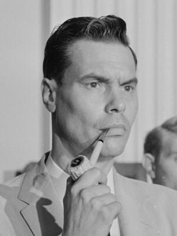

# George Lincoln Rockwell
Founder of the American Nazi Party and former U.S. presidential candidate, shot from a rooftop in Arlington, Virginia, while the FBI's COINTELPRO program was actively infiltrating and disrupting his organization.

| Field | Details |
|-------|---------|
| **Full Name** | George Lincoln Rockwell |
| **Born** | March 9, 1918 |
| **Died** | August 25, 1967 |
| **Age at Death** | 49 |
| **Location of Death** | Dominion Hills Shopping Center, Arlington, Virginia |
| **Cause of Death** | Gunshot wounds (shot from rooftop as he entered his car) |
| **Official Ruling** | Homicide — John Patler convicted on circumstantial evidence |
| **Alleged Intelligence Connection** | FBI (COINTELPRO-WHITE HATE program actively targeting ANP); U.S. Army 116th Intelligence Corps Group (counterintelligence agent was eyewitness) |
| **Category** | Political Figure / Activist |

## Assessment: SUSPICIOUS

George Lincoln Rockwell was assassinated at a moment when the FBI's COINTELPRO-WHITE HATE program was actively infiltrating, disrupting, and fomenting internal conflict within his American Nazi Party. The conviction of John Patler rested entirely on circumstantial evidence. Patler never admitted guilt. The FBI had documented informants inside the ANP, and according to contemporary reporters, many of the party's "stormtroopers" were assumed to be FBI infiltrators. COINTELPRO's documented methods included forging letters to create internal divisions and encouraging splintering within targeted groups — precisely the kind of internal conflict that preceded Rockwell's killing. A U.S. Army counterintelligence agent was an eyewitness to the assassination. While Patler had personal motives, the broader intelligence context raises questions about whether an intelligence service manipulated or facilitated the killing.

## Circumstances of Death

Just before noon on Friday, August 25, 1967, George Lincoln Rockwell left his headquarters to do laundry at the Econ-o-Wash laundromat in the Dominion Hills Shopping Center on Wilson Boulevard in Arlington, Virginia. As he slid into the seat of his fading blue-and-white 1958 Chevrolet, gunshots rang out from the roof of the shopping center.

One shot missed. The second struck Rockwell in the chest. He was killed at age 49.

John Patler — born John Christ Patsalos — a former ANP member whom Rockwell had expelled five months earlier, was arrested and charged. At trial, Patler was convicted of first-degree murder and sentenced to 20 years in prison, of which he served eight. The evidence against him was entirely circumstantial. Patler has never admitted guilt, and he pursued several unsuccessful appeals.

According to the Association of Counterintelligence Special Agents of America (ACISAA), SGT Hugh Grey Willard, a Counterintelligence Special Agent assigned to the U.S. Army's 116th Intelligence Corps Group, was an eyewitness to the assassination. The 116th INTC Group sent an "IMMEDIATE" message reporting Rockwell's murder.

## Background

Rockwell was born in Bloomington, Illinois, the eldest of three children born to vaudeville performers. He briefly studied philosophy at Brown University before dropping out to join the U.S. Navy, where he trained as a pilot. He served in both World War II (European and Pacific theaters) and the Korean War, reaching the rank of Commander.

In October 1959, Rockwell founded the American Nazi Party (ANP) with headquarters in Arlington, Virginia. He became the self-styled "Commander" of the party.

Rockwell ran for public office twice. In 1964, he ran as a write-in candidate in the U.S. presidential election, receiving 212 votes. In 1965, he ran for Governor of Virginia as an independent, finishing fourth with 5,730 votes (1.02%).

In April 1966, Alex Haley (who later wrote *Roots*) published a lengthy interview with Rockwell in *Playboy* magazine. According to multiple sources, this was Rockwell's greatest success in broadcasting his views to the public, dramatically increasing interest and income for his movement. By 1967, Rockwell had become one of the most popular speakers on the American college lecture circuit, earning as much as $2,000 per week.

In early 1967, Rockwell renamed the ANP the National Socialist White People's Party (NSWPP) as part of an effort to broaden the party's base. He was assassinated seven months later.

## Intelligence Connections

### FBI COINTELPRO-WHITE HATE

The FBI's COINTELPRO (Counter Intelligence Program) ran a dedicated operation called "COINTELPRO-WHITE HATE" from 1964 to 1971 that specifically targeted the American Nazi Party alongside the Ku Klux Klan and other white supremacist groups. Documented operations included:

* **Infiltration and informants:** According to contemporary reporters, many of the Nazi "stormtroopers" were assumed to be FBI infiltrators. Internal FBI memos credited Rockwell with being "very cooperative with Agents," suggesting regular FBI contact with the organization.
* **Fomenting internal divisions:** COINTELPRO's documented methods included forging letters to create internal conflict, encouraging group splintering, and sending fraudulent correspondence designed to sabotage organizations from within. The FBI sent fake letters to both Rockwell and his enemies.
* **Chicago disruption plot:** In 1965, the FBI's COINTELPRO targeted the ANP's Chicago unit with a two-part plot to disrupt leadership and destroy the chapter financially. The FBI recruited a member of the Anti-Defamation League and sent fake letters to local Jewish organizations to provoke action against the party.
* **Financial destruction:** FBI operations aimed to destroy the ANP financially and isolate it from potential supporters.

### U.S. Army Intelligence Presence

According to the ACISAA, a counterintelligence agent from the U.S. Army's 116th Intelligence Corps Group was physically present as an eyewitness at the time of the assassination. The 116th INTC Group immediately sent an "IMMEDIATE" priority message reporting Rockwell's death — a level of urgency that suggests active intelligence interest in Rockwell, not merely coincidental presence.

### Rockwell's Understanding of FBI Surveillance

According to researchers, Rockwell "believed — rightly or not — that the agency's director, J. Edgar Hoover, secretly sympathized with most of his aims." This belief, whether accurate or not, may have made Rockwell less guarded about FBI infiltration of his organization.

## Why This Death Raises Questions

- **COINTELPRO was actively targeting the ANP** at the time of the assassination, using methods that included fomenting internal conflict and encouraging organizational splintering — precisely the kind of dynamics that preceded the killing
- **The evidence against Patler was entirely circumstantial** and he never confessed
- **Patler's expulsion fits the COINTELPRO playbook:** COINTELPRO documented methods included creating internal disputes to fracture organizations. Patler was expelled in March 1967 for "causing dissension" — whether this dissension was organic or amplified by FBI provocateurs remains unknown
- **The FBI had informants inside the ANP.** According to multiple sources, reporters assumed many party members were FBI infiltrators. According to one theory described by the ACISAA, "the FBI had an informant inside the 'barracks' who was nudged by his Case Officer to point Patler towards the target"
- **A U.S. Army counterintelligence agent was an eyewitness** to the assassination, and Army intelligence sent an immediate-priority message reporting the killing
- **Rockwell was becoming more politically effective.** By 1967, his Playboy interview had made him a popular college speaker earning $2,000/week. He had renamed the party to broaden its appeal. A growing, more mainstream-facing political figure was a different kind of threat than a marginal extremist
- **COINTELPRO facilitated other assassinations.** The same FBI program coordinated the 1969 assassination of Black Panther leader Fred Hampton — providing floor plans via an informant and drugging Hampton before the raid. The program's willingness to facilitate killings is documented fact
- **The "patsy" pattern:** Patler — a volatile, expelled, disgruntled former member with ethnic grievances against party leadership — was an ideal candidate to be manipulated into action or used as a convenient scapegoat. His father had killed his mother when Patler was five; he had a history of mental instability and juvenile criminal convictions
- **Timing:** Rockwell was killed at a moment when COINTELPRO was at the peak of its operational intensity against both black and white political organizations

## The Counterargument

The simplest explanation is that Patler acted alone out of personal revenge. He had been expelled from the party five months earlier, reportedly for instability and causing internal division. Other party members, particularly Matt Koehl and William Luther Pierce, had mocked his Greek heritage and non-Nordic appearance. Rockwell had defended Patler but ultimately expelled him. A personal grudge and a rooftop position overlooking a laundromat is not, on its face, evidence of an intelligence operation.

Patler was convicted by a jury and his appeals were unsuccessful. No court or investigation has established FBI involvement in the killing.

It should also be noted that Rockwell was a deeply polarizing figure with many enemies — from civil rights organizations to rival extremist groups. Personal or ideological motives for his murder were abundant.

Karl Allen organized a "John Patler Defense Fund" and promoted the theory that either the killing or the blame placed on Patler was the result of a conspiracy by the Anti-Defamation League, but according to researchers, there is no evidence supporting this claim.

## Key Quotes

> "Many of the Nazi 'stormtroopers' were assumed to be FBI infiltrators." — Contemporary press observations about FBI penetration of the ANP

> "[Rockwell was] very cooperative with Agents." — Internal FBI memo, as cited by researchers

> "If you are unsure of the identity of a member of the ANP, it's probably best to assume he works for the FBI." — Common sentiment among journalists covering the ANP in the 1960s, as described by researchers

> "The COINTELPRO operators targeted multiple groups at once and encouraged splintering of these groups from within." — Description of FBI COINTELPRO methods

## See Also

- [Fred Hampton](Fred_Hampton.md) — Black Panther leader whose assassination was directly coordinated by the same COINTELPRO program that was targeting Rockwell's organization
- [Mark Clark](Mark_Clark.md) — Killed alongside Hampton in the FBI-coordinated raid
- [John Lennon](John_Lennon.md) — Another political figure under FBI COINTELPRO surveillance who was assassinated
- [Mary Pinchot Meyer](Mary_Pinchot_Meyer.md) — Execution-style killing with intelligence connections; case never solved

## Other Shocking Stories

- [Fred Hampton](Fred_Hampton.md): FBI drugged him, gave police his floor plan, and 99 bullets later called it a "gunfight."
- [Frank Olson](Frank_Olson.md): CIA dosed their own scientist with LSD, then threw him out a hotel window to keep MKUltra secret.
- [Dorothy Kilgallen](Dorothy_Kilgallen.md): Journalist died after privately interviewing JFK assassin Jack Ruby. Her notes vanished completely.
- [Karen Silkwood](Karen_Silkwood.md): Nuclear whistleblower forced off the road while driving to meet a New York Times reporter with documents.

## Sources

- [Wikipedia: Assassination of George Lincoln Rockwell](https://en.wikipedia.org/wiki/Assassination_of_George_Lincoln_Rockwell)
- [Wikipedia: George Lincoln Rockwell](https://en.wikipedia.org/wiki/George_Lincoln_Rockwell)
- [Wikipedia: John Patler](https://en.wikipedia.org/wiki/John_Patler)
- [Wikipedia: COINTELPRO](https://en.wikipedia.org/wiki/COINTELPRO)
- [ACISAA: Assassination — George Lincoln Rockwell and the 116th INTC Group](https://www.acisaa.org/post/assassination-george-lincoln-rockwell)
- [Arlington Historical: The Assassination of an Arlington Nazi](https://arlingtonhistorical.com/items/show/45)
- [UPI Archives: Rockwell, U.S. Nazi party leader, slain](https://www.upi.com/Archives/1967/08/25/Rockwell-US-Nazi-party-leader-slain/4291535164782/)
- [The FBI, COINTELPRO-WHITE HATE, and the Nazification of the Ku Klux Klan in the 1970s (academic paper)](https://journals.ku.edu/amsj/article/download/3133/3913/5914)
- [MuckRock: George Lincoln Rockwell FBI FOIA Files](https://www.muckrock.com/foi/united-states-of-america-10/george-lincoln-rockwell-fbi-20674/)
- [FBI Vault: American Nazi Party Files](https://vault.fbi.gov/American%20Nazi%20Party%20/American%20Nazi%20Party%20Part%2002%20(Final)/view)
- [Alex Haley Interviews George Lincoln Rockwell (Playboy, 1966)](https://alexhaley.com/2019/09/10/alex-haley-interviews-george-lincoln-rockwell/)

*This information was built by Grok and Claude AI research.*
