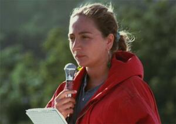

# Ilaria Alpi

Italian RAI television journalist ambushed and shot dead in Mogadishu alongside cameraman Miran Hrovatin while investigating illegal arms trafficking and toxic waste dumping involving Italian intelligence (SISMI). The only person convicted was later acquitted and awarded over three million euros for wrongful imprisonment. The case remains unsolved.

| Field | Details |
|-------|---------|
| **Full Name** | Ilaria Alpi |
| **Born** | May 24, 1961, Rome, Italy |
| **Died** | March 20, 1994 |
| **Age at Death** | 32 |
| **Location of Death** | Mogadishu, Somalia |
| **Cause of Death** | Gunshot — ambushed by a seven-man commando unit |
| **Official Ruling** | Homicide (unsolved — only conviction was overturned) |
| **Alleged Intelligence Connection** | Italian military intelligence (SISMI), Italian armed forces, 'Ndrangheta (Calabrian Mafia) |
| **Victim Was Intel Employee** | No |
| **Category** | Journalist / Investigator |

## Assessment: HIGHLY SUSPICIOUS

Ilaria Alpi was executed in a professionally organized ambush in Mogadishu immediately after returning from Bosaso, where she had been gathering evidence about illegal arms trafficking and toxic waste dumping that allegedly involved Italian intelligence (SISMI) and the Italian military. The only person convicted — a Somali man named Hashi Omar Hassan — was later acquitted after nearly 17 years in prison and awarded over three million euros for wrongful imprisonment, strongly suggesting the conviction was a deliberate misdirection. An Italian parliamentary commission investigated the case but produced contested findings. Three decades later, the killers and those who ordered the assassination remain unidentified.

## Circumstances of Death

On March 20, 1994, Ilaria Alpi and her cameraman Miran Hrovatin were traveling in a jeep through Mogadishu, having just returned from the port city of Bosaso in northeastern Somalia. They were ambushed near the Hotel Sahafi — the international media base in the Somali capital — by a seven-man commando unit that opened fire on their vehicle.

Hrovatin was killed first. According to witness accounts, Alpi was then shot with a single bullet to the temple at close range — an execution-style killing that suggests the attackers specifically targeted her rather than carrying out a random robbery or militia attack.

The ambush was precisely organized: the attackers knew the route the journalists would take and were waiting for them. This level of planning indicates advance intelligence about Alpi's movements.

## Background

Ilaria Alpi was born in Rome on May 24, 1961. After attending the Gymnasium "Titus Lucrezio Caro" in Rome, she graduated in literature from the Sapienza University of Rome, where she completed courses in languages and Islamic culture at the Department of Oriental Studies. She spoke fluent Arabic, French, and English.

Her language skills enabled her to win her first journalism position as a correspondent writing from Cairo for the Italian newspapers *Paese Sera* and *L'Unita*. She later won a scholarship to join RAI, Italy's national public broadcasting company.

Alpi first arrived in Somalia in December 1992 to cover **Operation Restore Hope**, the UN-coordinated peacekeeping mission launched after the civil war that followed the fall of dictator Siad Barre in 1991. She reported for **TG3** (RAI's third-channel news program) and quickly became one of the most knowledgeable Italian journalists covering the Somali conflict.

During her time in Somalia, Alpi began uncovering what she believed was a vast criminal network involving illegal arms shipments to Somalia and the dumping of toxic and radioactive waste along the Somali coast — activities she believed involved the Italian military, Italian intelligence (SISMI), and criminal organizations.

## Intelligence Connections

* **SISMI (Italian Military Intelligence)**: According to the 1999 book *The Execution* by Alpi's parents, Luciana and Giorgio Alpi, their daughter had uncovered evidence that SISMI was involved in an international arms and toxic waste trafficking ring operating between Italy and Somalia. The book accuses SISMI of playing "a major part" in this network.
* **Italian Military**: Alpi reportedly told journalist Rita Del Prete that in Somalia "roads were being built from nowhere to nowhere, made for digging and dumping toxic debris" — suggesting Italian-funded infrastructure projects were being used as cover for burying toxic waste.
* **'Ndrangheta (Calabrian Mafia)**: In 2009, former 'Ndrangheta member Francesco Fonti claimed that Alpi and Hrovatin were murdered because they had witnessed toxic waste shipped by the 'Ndrangheta arriving in Bosaso, Somalia. Fonti alleged the Calabrian Mafia was being paid to dispose of European toxic and radioactive waste by dumping it in Somalia.
* **Italian Cooperation in Somalia**: The parliamentary commission examined whether Italian foreign aid and cooperation programs in Somalia served as cover for arms and waste trafficking, with intelligence service involvement in facilitating or concealing these operations.

## The Wrongful Conviction

The judicial handling of the Alpi-Hrovatin case raises serious questions about possible institutional cover-up:

- **2000**: Somali citizen Hashi Omar Hassan was convicted of the double murder and sentenced to 26 years in prison
- **2016**: A court in Perugia reversed the conviction. Prosecutor Dario Razzi told the court that Hassan "did not commit" the crime
- **2018**: Hassan was awarded **3.181 million euros** by the Perugia appeals court for wrongful imprisonment after spending nearly 17 years in Italian prison
- **2022**: Hassan was killed by a car bomb in Mogadishu — raising further questions about whether he was silenced to prevent him from revealing who orchestrated his wrongful conviction

The wrongful conviction of Hassan effectively closed the case for over 16 years, preventing any real investigation into who ordered the killings.

## Parliamentary Commission

The Italian Parliament established a **Commission of Inquiry into the deaths of Ilaria Alpi and Miran Hrovatin** in July 2003. The commission was constituted in January 2004 under the presidency of Carlo Taormina and tasked with investigating:

- The events leading to the murders
- Illegal trafficking of arms and waste involving Somalia
- Italian cooperation with Somalia
- Any responsibility of Italian national authorities

The commission's final report, approved in February 2006, analyzed various possible motives for the murders but produced contested conclusions. Critics argued the commission failed to adequately pursue the intelligence connections that Alpi had been investigating.

## Why This Death Raises Questions

- Alpi was killed immediately after returning from Bosaso, where she had been gathering evidence about arms and toxic waste trafficking — suggesting someone knew what she had found and acted to silence her
- The ambush was carried out by a seven-man commando — a professional operation, not a random militia attack
- Alpi was shot execution-style with a single bullet to the temple, indicating she was specifically targeted
- The only person convicted (Hashi Omar Hassan) was later proved innocent and awarded millions in compensation — raising the question of whether his prosecution was a deliberate cover-up
- Hassan himself was killed by a car bomb in Mogadishu in 2022
- Alpi's investigation pointed to Italian intelligence (SISMI) involvement in arms and waste trafficking — powerful institutional interests that had both motive and capability to order her elimination
- The Italian parliamentary commission produced contested results that critics said failed to follow the intelligence trail
- An 'Ndrangheta informant claimed the Calabrian Mafia killed Alpi because she witnessed their toxic waste shipments arriving in Bosaso
- Alpi's cameraman Hrovatin was also killed, and his final footage has never been recovered — suggesting the attackers wanted to destroy the visual evidence

## Key Quotes

> According to journalist Rita Del Prete, Ilaria Alpi told her that in Somalia "roads were being built from nowhere to nowhere, made for digging and dumping toxic debris."

> According to Alpi's parents in their 1999 book *The Execution*, Alpi and Hrovatin "were killed to stop them revealing what they knew about an international arms and toxic waste traffic ring implicating high-level political, military and economic spheres in both countries."

> Prosecutor Dario Razzi told the Perugia court during the reversal of Hassan's conviction that Hassan "did not commit" the crime he served more than 16 years in jail for.

## Counterarguments / Alternative Explanations

- Some investigators suggested the killings were the result of random militia violence in war-torn Mogadishu, where journalists and foreigners were frequent targets
- The parliamentary commission considered Islamic fundamentalism and local criminality as possible motives
- The chaos of the Somali civil war made targeted killings extremely difficult to investigate, and evidence preservation was virtually impossible
- Without Hrovatin's final footage, it is difficult to confirm exactly what Alpi had documented in Bosaso
- The 'Ndrangheta connection relies on the testimony of a single informant (Francesco Fonti), whose claims have not been independently verified

## Family Response

Ilaria Alpi's parents, Luciana and Giorgio Alpi, spent decades fighting for justice. They published *The Execution* in 1999, laying out their case that SISMI and powerful Italian interests were behind their daughter's murder. They campaigned relentlessly for the parliamentary commission and criticized its findings as inadequate. Their advocacy kept the case in public attention for three decades.

## See Also

- [Mino Pecorelli](Mino_Pecorelli.md) — Italian journalist murdered for his intelligence connections and revelations about the Aldo Moro affair
- [Daphne Caruana Galizia](Daphne_Caruana_Galizia.md) — Maltese journalist killed by car bomb investigating corruption
- [Roberto Calvi](Roberto_Calvi.md) — Italian banker murdered in connection with P2, Vatican Bank, and Italian intelligence
- [Serena Shim](Serena_Shim.md) — American journalist killed investigating intelligence operations in Turkey

## Other Shocking Stories

- [Jamal Khashoggi](Jamal_Khashoggi.md): Saudi journalist lured into consulate, dismembered alive by 15-member hit squad with a bone saw.
- [Alexander Litvinenko](Alexander_Litvinenko.md): Ex-FSB officer poisoned with radioactive polonium-210 in London. Took three weeks to die.
- [Daniel Pearl](Daniel_Pearl.md): Wall Street Journal reporter beheaded in Karachi investigating ISI-Al Qaeda links. Execution filmed.
- [Benazir Bhutto](Benazir_Bhutto.md): Pakistan's first female PM killed by gun and bomb at rally. UN found ISI "failed profoundly" to protect her.

## Sources

- [Ilaria Alpi - Wikipedia](https://en.wikipedia.org/wiki/Ilaria_Alpi)
- [Ilaria Alpi murder investigation and toxic waste trafficking in Somalia - Large Movements](https://migrazioniontheroad.largemovements.it/ilaria-alpi-murder-investigation-toxic-waste-trafficking-somalia/)
- [Ilaria Alpi - investigative journalist - Italy On This Day](https://www.italyonthisday.com/2023/05/ilaria-alpi-investigative-journalist.html)
- [Ilaria Alpi - Committee to Protect Journalists](https://cpj.org/data/people/ilaria-alpi/)
- [Somali wrongly convicted in Alpi case gets 3 mn euros - ANSA](https://www.ansa.it/english/news/2018/03/30/somali-wrongly-convicted-in-alpi-case-gets-3-mn-euros-3_6437892f-21fc-4529-9edc-bc92b269fc63.html)
- [Somali man acquitted after 17 years and awarded 3.1m, killed in car bomb - Goobjoog](https://en.goobjoog.com/somali-man-acquitted-by-italian-court-after-17-years-and-awarded-e3-1m-killed-in-car-bomb-in-mogadishu/)
- [Ilaria Alpi - Cercavano la verita](https://www.giornalistiuccisi.it/en/storie/ilaria-alpi-en/)

*This information was built by Grok and Claude AI research.*

**Status:** Deceased (1994)
