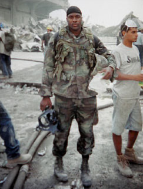

[< Back to Main List](../)

# Jason R. Thomas
Cancer researcher with active Department of Defense contracts through Novartis, disappeared December 2025 and found dead in frozen Lake Quannapowitt three months later.

| Field | Details |
|-------|---------|
| **Full Name** | Jason R. Thomas |
| **Born** | c. 1980 |
| **Died** | Found March 17, 2026 (missing since December 12, 2025) |
| **Age at Death** | 45 |
| **Location of Death** | Lake Quannapowitt, Wakefield, Massachusetts |
| **Cause of Death** | Pending — body recovered from lake after ice thawed |
| **Official Ruling** | Under investigation; police stated no foul play suspected |
| **Alleged Intelligence Connection** | Active Department of Defense contracts through Novartis; part of broader cluster of scientist deaths in 2025-2026 |
| **Category** | Scientist |

## Assessment: MODERATE SUSPICION

Thomas was a highly credentialed pharmaceutical scientist with DOD contracts who vanished under unusual circumstances and was found dead three months later in a frozen lake. While police have stated no foul play is suspected and Thomas was reportedly grieving the sudden loss of both parents, the official cause and manner of death have not been publicly released as of March 2026. His death falls within a broader cluster of scientist deaths and disappearances in 2025-2026 that has drawn congressional attention.

## Circumstances of Death

On the evening of December 12, 2025, Jason Thomas and his wife Kristen Bartoli went out socializing — one of the first times they had done so since the deaths of Thomas's parents in fall 2025. After returning home, according to Kristen, she made eye contact with him briefly before he turned and walked down the street. She assumed he was going for a late-night walk.

Thomas left behind his wallet, his phone (found on the bathroom counter), and his Apple Watch (found in the mailbox). He was last captured on security camera footage shortly before midnight near train tracks at North Avenue and Chestnut Street in Wakefield.

When he had not returned by morning, Kristen filed a missing person report with Wakefield Police on December 13, 2025. Police deployed K-9 teams and drones within hours. Live tracking dogs caught his scent approximately one mile up local train tracks the morning after he disappeared — that was the only trace.

On March 17, 2026, a Wakefield police detective searching the area of Lake Quannapowitt spotted a body in the water. The lake had been frozen during the winter months and had recently thawed. Preliminary identification was based on the victim's clothing matching what Thomas was believed to have been wearing. The body was referred to the Office of the Chief Medical Examiner for official identification, cause, and manner of death determination.

As of late March 2026, the official autopsy results — including cause and manner of death — have not been publicly released.

## Background

Jason R. Thomas was the Assistant Director of Chemical Biology at the Novartis Institutes for BioMedical Research (NIBR) in Cambridge, Massachusetts. He was a prolific researcher with 48 published scientific articles and over 4,500 citations on Google Scholar.

His research focused on chemical biology, chemoproteomics, phenotypic screening, target identification, and targeted protein degradation — a cutting-edge approach to cancer treatment using PROTACs and molecular glues. He co-authored work on "Reinstating targeted protein degradation with DCAF1 PROTACs in CRBN PROTAC resistant settings," which addressed overcoming resistance to protein degradation cancer therapies.

According to news reports, Thomas had active contracts with the Department of Defense through Novartis. Novartis NIBR in Cambridge held a DARPA contract (maximum value $13,165,658) for the ADEPT-PROTECT program involving mRNA-based therapeutics, though the specific contract details linking Thomas personally have not been publicly detailed beyond news attribution.

Thomas was an only child. In fall 2025, both of his parents died within approximately one hour of each other — his mother passed while he was at her side in hospice care, and his father collapsed of a heart attack immediately afterward while they were discussing funeral arrangements. According to friends and family, Thomas was struggling to cope with this double loss.

He lived on Murray Street in Wakefield, Massachusetts, with his wife Kristen Bartoli, whom he had been married to for 10 years.

## Intelligence Connections

Thomas's connection to intelligence or defense agencies is indirect but documented:

- He held active Department of Defense contracts through his employer Novartis, according to news reporting
- Novartis NIBR held a DARPA contract worth up to $13.1 million for the ADEPT-PROTECT program involving mRNA-based therapeutics
- His research in targeted protein degradation represents cutting-edge cancer treatment technology with potential dual-use applications
- No direct evidence has emerged linking his death to any intelligence service

## Why This Death Raises Questions

- **DOD contracts:** Thomas was working on research funded by the Department of Defense through Novartis, giving his work a national security dimension
- **Cluster of scientist deaths:** Thomas's death falls within a notable cluster of scientist deaths and disappearances in 2025-2026, including MIT fusion physicist Nuno Loureiro (shot at home, December 2025), Caltech astrophysicist Carl Grillmair (fatally shot, late 2025), materials scientist Monica Reza (vanished June 2025), and retired Air Force Major General William Neil McCasland (reported missing February 2026)
- **Congressional attention:** Rep. Tim Burchett (R-TN) publicly stated he believes there may be a pattern, telling the Daily Mail that "the numbers seem very high in these certain areas of research"
- **Unreleased autopsy:** As of late March 2026, the official cause and manner of death have not been publicly released
- **Three months in frozen lake:** The body was submerged in a frozen lake for approximately three months, which severely limits the forensic evidence that can be recovered
- **Abandoned personal effects:** Thomas left his wallet, phone, and Apple Watch behind — his watch was found in the mailbox, an unusual location
- **Rapid disappearance:** Dogs tracked his scent one mile up train tracks and then lost it entirely — he seemingly vanished

## The Counterargument

There are significant reasons to consider Thomas's death a tragic personal crisis rather than foul play:

- Thomas was an only child who lost both parents within an hour of each other in fall 2025 and was reportedly struggling severely with grief
- Leaving behind wallet, phone, and watch is consistent with someone in acute psychological crisis who does not intend to return
- He walked away from home late at night on foot, consistent with crisis behavior
- The lake is near the train tracks where his scent was last detected
- Police explicitly stated no foul play is suspected based on preliminary information
- Thomas's published research was in pharmaceutical chemistry, not in aerospace, UAP, or other fields that have drawn the most suspicion in the scientist death cluster
- No threats, warnings, or statements predicting harm have been reported

## Key Quotes

> "He literally vanished."
> — Kristen Bartoli, Thomas's wife, to Boston 25 News

> "This isn't like him."
> — Kristen Bartoli, to Boston 25 News

> "The numbers seem very high in these certain areas of research."
> — Rep. Tim Burchett (R-TN), regarding the broader cluster of scientist deaths, to the Daily Mail

## See Also

- [Frank Olson](Frank_Olson.md) — CIA scientist who died under suspicious circumstances; biological weapons research with intelligence dimensions
- [David Kelly](David_Kelly.md) — UK weapons scientist found dead before testimony; official ruling disputed by experts

## Other Shocking Stories

- [Karen Silkwood](Karen_Silkwood.md): Plutonium plant whistleblower died in car crash en route to hand evidence to the New York Times.
- [Alexander Litvinenko](Alexander_Litvinenko.md): Former FSB officer poisoned with polonium-210 in London; named Putin as his killer from his deathbed.
- [Mohsen Fakhrizadeh](Mohsen_Fakhrizadeh.md): Iran's top nuclear scientist assassinated by AI-controlled remote gun mounted in a parked Nissan pickup truck.
- [Danny Casolaro](Danny_Casolaro.md): Journalist investigating "The Octopus" found dead in hotel bathtub the night before a key meeting.

## Sources

- [Body pulled from Wakefield lake believed to be that of missing man — Boston.com](https://www.boston.com/news/local-news/2026/03/17/body-pulled-from-wakefield-lake-believed-to-be-that-of-missing-man/)
- [Body recovered from lake in Wakefield — NBC Boston](https://www.nbcboston.com/news/local/wakefield-body-lake/3917208/)
- [Missing husband Jason Thomas — NBC Dateline "Missing in America"](https://www.nbcnews.com/dateline/missing-in-america/jason-thomas-missing-wakefield-massachusetts-rcna263785)
- [Body of Wakefield Man Found in Lake — Daily Voice](https://dailyvoice.com/ma/wakefield/body-of-jason-thomas-found-in-wakefield-lake-3-months-later/)
- [Body recovered from Lake Quannapowitt — Middlesex County DA](https://www.middlesexda.com/press-releases/news/body-recovered-lake%C2%A0quannapowitt-wakefield)
- [Body of missing Wakefield man found — Boston 25 News](https://www.boston25news.com/news/local/body-found-north-shore-lake-believed-be-man-who-vanished-months-ago-da-says/GE72QWYDCVE3TO75AG2TW4W44A/)
- ['He Literally Vanished': Scientist Still Missing — CrimeOnline](https://www.crimeonline.com/2026/01/05/he-literally-vanished-scientist-still-missing-weeks-after-hes-seen-walking-near-train-tracks/)
- [High-Profile Scientists Dead or Missing — Daily Caller](https://dailycaller.com/2026/03/23/high-profile-scientists-dead-missing-gop-rep-suggestsconspiracy-play/)

*This information was built by Grok and Claude AI research.*
