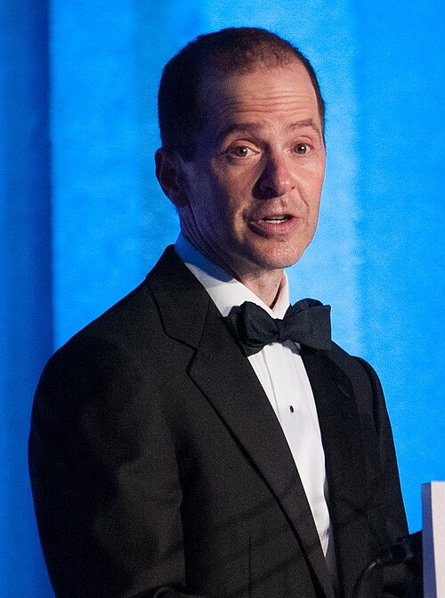

# Max Spiers
British conspiracy researcher and lecturer who died in Warsaw, Poland, after vomiting two litres of black fluid — days after texting his mother: "Your boy's in trouble. If anything happens to me, investigate."

| Field | Details |
|-------|---------|
| **Full Name** | Maxwell Lindsay Herbert Bates-Spiers |
| **Born** | December 22, 1976 |
| **Died** | July 16, 2016 |
| **Age at Death** | 39 |
| **Location of Death** | Warsaw, Poland |
| **Cause of Death** | Pneumonia and drug intoxication (aspiration of gastric contents) |
| **Official Ruling** | Natural causes / drug intoxication |
| **Alleged Intelligence Connection** | Topics included MKUltra, government pedophile rings, "super soldier" programs — alleged military/intelligence targeting |
| **Category** | Journalist / Investigator |

## Assessment: SUSPICIOUS

Max Spiers was a well-known conspiracy researcher who lectured on MKUltra, elite pedophile networks, and alleged government super soldier programs. He died in a Warsaw apartment two days after texting his mother a warning that he was in trouble. The Polish police investigation was so poor that a British coroner called it "wholly incompetent" — the body was left overnight in the apartment with no examination, no crime scene control, and no investigation launched. The 2019 inquest attributed death to pneumonia combined with oxycodone and a benzodiazepine, but the botched initial investigation means key forensic questions can never be answered.

## Circumstances of Death

Spiers traveled to Warsaw in April 2016 to speak at a paranormal conference. He stayed at the apartment of a friend, Monika Duval. On July 16, 2016, Spiers vomited approximately two litres of black fluid and was pronounced dead in the apartment.

Two days before his death, Spiers had texted his mother, Vanessa Bates, saying: "Your boy's in trouble. If anything happens to me, investigate."

When Polish paramedics arrived, they pronounced him dead but did not call police or order a post-mortem. His body was left in Duval's apartment overnight with no examination and no forensic investigation. The scene was not secured or treated as a potential crime scene.

Polish authorities initially concluded natural causes. On August 30, 2016, a Polish investigation was launched into possible involuntary manslaughter, but produced no charges.

A post-mortem examination carried out by a pathologist in Kent found lethal levels of oxycodone in his system, along with a Turkish over-the-counter benzodiazepine (an equivalent of Xanax) at twice the therapeutic dose. The cause of death was recorded as pneumonia and drug intoxication leading to aspiration of gastric contents — the black liquid was attributed to aspirated stomach contents.

## Background

Max Spiers was born in Canterbury, Kent, and attended St Edmund's School (he was classmates with actor Orlando Bloom). He became a prominent figure in the conspiracy research and UFO investigation community, building a following through conference appearances and online videos.

His research topics included:
- **MKUltra and mind control programs** — he claimed to have been subjected to military programming as a child, describing himself as a "super soldier"
- **Government pedophile rings** — he investigated and lectured on elite pedophile networks and alleged cover-ups
- **Occult practices among elites** — he alleged satanic ritual abuse and black magic rites involving world leaders, politicians, and entertainment figures
- **UFOs and extraterrestrial cover-ups** — he investigated alleged government concealment of contact with non-human intelligence

At the time of his death, he was reportedly working on an expose of prominent figures in politics, business, and entertainment. He had been invited to speak at a conference in Warsaw about "who really controls the world."

## Why This Death Raises Questions

- **The warning text:** Two days before dying, Spiers texted his mother: "Your boy's in trouble. If anything happens to me, investigate." This fits the pattern of researchers who predict their own deaths.
- **"Wholly incompetent" investigation:** British Coroner Christopher Sutton-Mattocks fiercely criticized the Polish police, calling their investigation "wholly incompetent." The body was left overnight in the apartment with no examination, no crime scene security, and no forensic analysis of the scene.
- **The black liquid:** Spiers vomited two litres of black fluid before dying. While the inquest attributed this to aspirated gastric contents, the volume and appearance remain disturbing and unusual.
- **No autopsy in Poland:** Polish authorities did not perform a post-mortem examination before releasing the body. The only post-mortem was conducted weeks later in Kent, after the body had been transported.
- **His research targets:** Spiers was actively investigating elite pedophile networks and powerful figures in politics and entertainment — topics that have provoked retaliation against other researchers.
- **Conference timing:** He died just before he was due to speak at a conference about global power structures and elite control.
- **Drug source unclear:** The inquest found lethal oxycodone levels and a Turkish benzodiazepine in his system, but the source of these drugs was never established by investigators.

## The Counterargument

- The 2019 inquest established a medical cause of death: pneumonia combined with drug intoxication. This is a known and documented cause of death.
- Spiers reportedly had a history of substance use. Opioid overdoses combined with pneumonia are not uncommon.
- The black liquid was medically explained as aspirated gastric contents — dark-colored vomit is consistent with certain drug interactions and gastric bleeding.
- No physical evidence of foul play was found (though the botched investigation means limited evidence was collected at all).
- His mother acknowledged he had been unwell in the period before his death.
- The coroner's criticism was directed at the incompetence of the Polish investigation, not at evidence of murder.

## Key Quotes from Media Coverage

> "Your boy's in trouble. If anything happens to me, investigate."
> — **Max Spiers**, text to his mother Vanessa Bates, two days before his death

> "I think Max had been digging in some dark places and I fear that somebody wanted him dead."
> — **Vanessa Bates**, Spiers's mother, reported by Kent Online

> "Max was a conspiracy theorist and a well-known one at that. If there was anything bound to excite the interest of other conspiracy theorists it was the wholly incompetent initial investigation into his death."
> — **Coroner Christopher Sutton-Mattocks**, 2019 inquest

## See Also

- [Danny Casolaro](Danny_Casolaro.md) — Journalist who also texted warnings before his death while investigating intelligence-connected conspiracies
- [Bill Cooper](Bill_Cooper.md) — Author and broadcaster killed after exposing government conspiracies
- [Jenny Moore](Jenny_Moore.md) — Citizen journalist investigating trafficking, found dead in DC hotel
- [Philip Marshall](Philip_Marshall.md) — Author exposing CIA connections, found dead
- [Paul Vigay](Paul_Vigay.md) — British IT consultant and conspiracy researcher found dead in the sea under suspicious circumstances
- **Epstein investigation profile:** [Max Spiers](/epstein/Details/Max_Spiers) — documents his research into elite pedophilia networks connected to the Epstein case

## Other Shocking Stories

- [Jan Kuciak](Jan_Kuciak.md): Shot dead at home with his fiancee for exposing mafia-government ties. Slovakia's prime minister resigned.
- [Daniel Pearl](Daniel_Pearl.md): Wall Street Journal reporter beheaded in Pakistan while investigating ISI links to Al-Qaeda.
- [Anastasia Baburova](Anastasia_Baburova.md): A 25-year-old journalism student shot dead on a Moscow sidewalk trying to save a human rights lawyer.
- [Maxim Kuzminov](Maxim_Kuzminov.md): Russian pilot defected to Ukraine. Found shot dead in Spain with Russian ammunition. SVR called him 'traitor.'

## Sources

- [Death of Max Spiers — Wikipedia](https://en.wikipedia.org/wiki/Death_of_Max_Spiers)
- [What happened to conspiracy theorist Max Spiers? — The Week](https://theweek.com/77649/what-happened-to-conspiracy-theorist-max-spiers)
- [Canterbury mother fears conspiracy theorist son Max Spiers was murdered in Poland — Kent Online](https://www.kentonline.co.uk/canterbury/news/mother-fears-conspiracy-theorist-son-104085/)
- [Max Spiers inquest: Why the conspiracy community will never accept his death — HuffPost UK](https://www.huffingtonpost.co.uk/entry/max-spiers-death-of-british-ufo-hunter-will-simply-not-be-accepted-by-the-conspiracy-theory-community_uk_5c3740dfe4b05cb31c3fdc1e)
- [Max Spiers inquest examining how UFO hunter who predicted his own death died — HuffPost UK](https://www.huffingtonpost.co.uk/entry/max-spiers-inquest_uk_5c3334bae4b0bcb4c25dce79)
- [Maxwell Lindsay Herbert Bates "Max" Spiers — Find a Grave](https://www.findagrave.com/memorial/181091344/maxwell-lindsay_herbert_bates-spiers)
- [Adam Taylor represents the family in Maxwell Bates-Spiers inquest — Crown Office Chambers](https://www.crownofficechambers.com/2019/01/09/adam-taylor-represents-the-family-in-maxwell-bates-spiers-inquest/)

*This information was built by Grok and Claude AI research.*