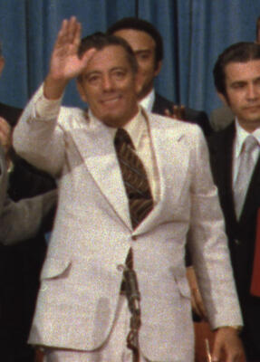

# Omar Torrijos
Panamanian military leader and de facto head of state, killed in a plane crash on July 31, 1981 — just two months after Ecuadorian President Jaime Roldos died in a nearly identical plane crash. Both leaders had challenged U.S. economic and strategic interests. Former CIA operatives and whistleblowers, most notably John Perkins in *Confessions of an Economic Hit Man*, have alleged CIA sabotage.

| Field | Details |
|-------|---------|
| **Full Name** | Omar Efrain Torrijos Herrera |
| **Born** | February 13, 1929, Santiago, Veraguas, Panama |
| **Died** | July 31, 1981 |
| **Age at Death** | 52 |
| **Location of Death** | Cerro Marta, Coclesito, Panama |
| **Cause of Death** | Plane crash (de Havilland Canada DHC-6 Twin Otter) |
| **Official Ruling** | Pilot error / Accident |
| **Alleged Intelligence Connection** | CIA |
| **Category** | Foreign Leader |

## Assessment: HIGHLY SUSPICIOUS

Torrijos died in a plane crash just two years after signing the Panama Canal Treaties that transferred control of the canal from the United States to Panama. His death came exactly two months after Ecuadorian President Jaime Roldos died in a strikingly similar plane crash on May 24, 1981 — both leaders had defied U.S. economic interests. Multiple former intelligence operatives and insiders, most notably John Perkins in *Confessions of an Economic Hit Man*, have alleged CIA involvement. The official investigation was inconclusive, key documents reportedly went missing during the 1989 U.S. invasion of Panama, and Torrijos's death cleared the path for CIA asset Manuel Noriega to seize power.

## Circumstances of Death

On July 31, 1981, Torrijos boarded a Panamanian Air Force Twin Otter (FAP-205) for a routine flight to Coclesito, a small community in the mountains of Cocle province where he maintained a retreat. The aircraft crashed into Cerro Marta hill in bad weather. All seven people on board were killed, including Torrijos, the pilot, co-pilot, and four others.

A 1983 official investigation by Panamanian authorities, assisted by the FBI, attributed the crash to pilot error, citing spatial disorientation, failure to maintain altitude relative to terrain, and low visibility caused by poor weather. The investigation reportedly found no evidence of mechanical failure, explosives, or sabotage. However, the crash site was in remote, dense jungle terrain that made thorough forensic recovery extremely difficult. The case was ultimately declared unsolved due to insufficient evidence. Some witnesses in the area reportedly described hearing an explosion before the crash, though these accounts were never officially corroborated.

## Background

Omar Torrijos was the sixth of twelve children born to Jose Maria Torrijos and Dona Eda de Torrijos, both schoolteachers in the rural province of Veraguas. He joined the Panamanian National Guard in 1952, received military training at the School of the Americas in the United States, and rose through the ranks to become a lieutenant colonel. On October 11, 1968, Torrijos and fellow officers overthrew the elected government of President Arnulfo Arias Madrid in a military coup.

Although Torrijos never held the formal title of president, he ruled Panama as its "Maximum Leader of the Panamanian Revolution" from 1968 until his death. Unlike many Latin American military rulers of the era, Torrijos pursued a progressive, populist agenda focused on Panama's poor majority. His government enacted sweeping reforms:

- **Agrarian reform**: Redistributed over 500,000 hectares of uncultivated land to more than 18,000 peasant families by 1978, breaking the oligarchy's monopoly on agricultural land
- **Labor Code of 1972**: Established a minimum wage, compulsory arbitration, and the principle of state economic control, strengthening workers' and peasants' unions
- **Education and health**: Built hundreds of new schools and rural health clinics, extending basic medical services to underserved communities and reducing infant mortality rates
- **Saemaul-style rural development**: Brought roads, electricity, and clean water to rural communities for the first time

Torrijos was regarded by supporters as the first Panamanian leader to genuinely represent the country's poor, Spanish-speaking, mixed-heritage majority. He was also active in the Non-Aligned Movement, maintaining relationships with both Cuba's Fidel Castro and Washington while charting an independent course.

His crowning achievement was the negotiation of the 1977 Torrijos-Carter Treaties with U.S. President Jimmy Carter, which guaranteed that Panama would gain full sovereignty over the Panama Canal and the Canal Zone by December 31, 1999. The treaties were deeply controversial in the United States, where conservative politicians accused Carter of "giving away" the canal. At the time of his death, Torrijos was reportedly in negotiations with Japanese businessmen led by Shigeo Nagano over plans for a new, larger sea-level canal — a project that would have further diminished U.S. strategic control over hemispheric shipping.

## Intelligence Connections

* John Perkins alleged in *Confessions of an Economic Hit Man* (2004) that he was sent to Panama as an "economic hit man" to convince Torrijos to accept deals favorable to U.S. corporate interests. According to Perkins, when Torrijos refused to be corrupted, the CIA escalated to assassination
* Perkins claimed the CIA organized operatives who planted a bomb aboard Torrijos's aircraft, motivated by his negotiations with Japanese businessmen over a competing canal project that threatened U.S. strategic interests
* According to Perkins and other accounts, a plan allegedly codenamed "Falcon in Flight" targeted both Torrijos and Ecuadorian President Jaime Roldos, who died in a strikingly similar plane crash just two months earlier on May 24, 1981. Roldos had been challenging U.S. oil companies operating in Ecuador
* Former Panamanian military officials, including Colonel Roberto Diaz Herrera, have publicly stated the U.S. was responsible for Torrijos's death
* Key investigative documents reportedly went missing during the December 1989 U.S. invasion of Panama (Operation Just Cause), when U.S. forces destroyed the headquarters of the Panamanian Defense Forces
* Torrijos's death cleared the way for Manuel Noriega, who had been a paid CIA asset since the 1960s, to consolidate power. Noriega eventually became dictator — until the U.S. invaded to remove him in 1989

## Why This Death Raises Questions

- Ecuadorian President Jaime Roldos died in a nearly identical plane crash just two months earlier on May 24, 1981; both leaders had challenged U.S. economic and strategic interests in Latin America
- Torrijos had reportedly told friends and associates he expected the CIA to try to kill him, saying "If I die, it will be by the hand of my enemies"
- The Panama Canal negotiations had placed him in direct opposition to powerful U.S. business, military, and political interests
- His negotiations with Japanese businessmen for a competing sea-level canal threatened to further erode U.S. strategic leverage
- The official investigation was inconclusive, and the case was declared unsolved
- Documents relevant to the investigation reportedly disappeared during the 1989 U.S. invasion
- Torrijos's death cleared the way for Manuel Noriega, a longtime CIA asset, to seize power
- The remote jungle crash site made thorough forensic examination nearly impossible
- Torrijos's son Martin later became President of Panama (2004-2009) and continued to raise questions about his father's death
- The pattern of Latin American leaders dying in plane crashes during this period — Roldos and Torrijos within 68 days of each other — remains one of the most striking coincidences in Cold War history

## Key Quotes

> "Torrijos was assassinated because he would not renegotiate the Canal Treaty." — John Perkins, *Confessions of an Economic Hit Man*

> "If I die, it will be by the hand of my enemies, and they are very powerful." — Omar Torrijos, reportedly to associates before his death

> "The jackals got him." — John Perkins, referring to the CIA operatives he alleged were sent when economic pressure failed

## See Also

- [Jaime Roldos](Jaime_Roldos.md) — Ecuadorian president who died the same way two months earlier
- [Patrice Lumumba](Patrice_Lumumba.md) — Another foreign leader allegedly killed with CIA involvement
- [Salvador Allende](Salvador_Allende.md) — Chilean president overthrown with CIA support
- [Dag Hammarskjold](Dag_Hammarskjold.md) — UN Secretary-General killed in a suspicious plane crash
- CIA (Group Profile) — intelligence service connected to this case

## Other Shocking Stories

- [Ali Hassan Salameh](Ali_Hassan_Salameh.md): He was simultaneously a CIA asset and a Mossad target. Mossad killed him anyway with a car bomb.
- [Rafik Hariri](Rafik_Hariri.md): Lebanon's prime minister killed by a massive car bomb. UN tribunal convicted a Hezbollah operative.
- [David Webster](David_Webster.md): South African academic shot dead outside his home by military intelligence for documenting apartheid-era death squads.
- [Imad Mughniyeh](Imad_Mughniyeh.md): The world's most wanted terrorist. CIA and Mossad finally killed him with a car bomb in Damascus.

## Sources

- [Wikipedia — Omar Torrijos](https://en.wikipedia.org/wiki/Omar_Torrijos)
- [Wikipedia — 1981 Panamanian Air Force Twin Otter Crash](https://en.wikipedia.org/wiki/1981_Panamanian_Air_Force_Twin_Otter_crash)
- [Newsroom Panama — US Responsible for Death of Omar Torrijos, Former Military](https://www.newsroompanama.com/news/us-responsible-for-death-of-omar-torrijos-former-militar)
- [Washington Post — Torrijos, Who Won Canal Zone for Panama, Dies in Air Crash](https://www.washingtonpost.com/archive/politics/1981/08/02/torrijos-who-won-canal-zone-for-panama-dies-in-air-crash/66aa7ebd-8472-4dcf-bbf5-6338cd7d5322/)
- [Britannica — Omar Torrijos](https://www.britannica.com/biography/Omar-Torrijos)
- [EBSCO Research Starters — Omar Torrijos](https://www.ebsco.com/research-starters/history/omar-torrijos)
- [Encyclopedia.com — Torrijos Herrera, Omar](https://www.encyclopedia.com/humanities/encyclopedias-almanacs-transcripts-and-maps/torrijos-herrera-omar-1929-1981)
- [ReVista Harvard — The Weak and the Powerful: Omar Torrijos, Panama, and the Non-Aligned World](https://revista.drclas.harvard.edu/a-review-of-the-weak-and-the-powerful-omar-torrijos-panama-and-the-non-aligned-world/)

*This information was built by Grok and Claude AI research.*
