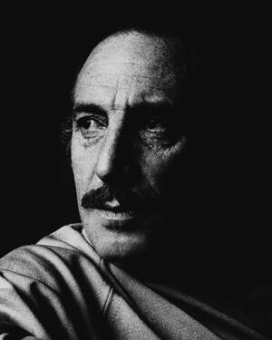

# Orlando Letelier
Chilean diplomat, former ambassador to the United States, and leading international critic of the Pinochet dictatorship, assassinated by a car bomb on Embassy Row in Washington, DC, by agents of Chile's DINA secret police. His American colleague Ronni Moffitt was killed alongside him.

| Field | Details |
|-------|---------|
| **Full Name** | Orlando Letelier del Solar |
| **Born** | April 13, 1932, Temuco, Chile |
| **Died** | September 21, 1976 |
| **Age at Death** | 44 |
| **Location of Death** | Sheridan Circle, Embassy Row, Washington, DC |
| **Cause of Death** | Car bomb (remote-detonated C-4 explosive) |
| **Official Ruling** | Homicide (assassination) |
| **Alleged Intelligence Connection** | DINA (Chilean secret police), CIA (foreknowledge via Operation Condor intelligence) |
| **Category** | Diplomat / Political Figure |

## Assessment: CONFIRMED

This is one of the most clearly documented cases of a state-sponsored assassination on American soil. Chilean secret police (DINA) agents planted a remote-controlled bomb under Letelier's car, killing him and his 25-year-old American colleague [Ronni Moffitt](Ronni_Moffitt.md). The DINA operative who built and planted the bomb -- American-born agent Michael Townley -- confessed and was convicted. DINA chief Manuel Contreras and his deputy Pedro Espinoza were convicted in Chile. Declassified CIA documents, released by the National Security Archive, state that "Pinochet personally ordered" the assassination. Secretary of State Henry Kissinger blocked a State Department warning to Operation Condor nations that could have prevented the killing. The assassination was carried out less than two kilometers from the White House.

## Background

Orlando Letelier was born in Temuco, Chile, and graduated from the Universidad de Chile with degrees in law and economics. He entered Chile's diplomatic service and worked at the Inter-American Development Bank in Washington during the 1960s, where he developed extensive contacts in American political circles.

Under President [Salvador Allende](Salvador_Allende.md), Letelier served as Chile's ambassador to the United States from 1971 to 1973. He was later recalled to Santiago to serve as foreign minister, then briefly as minister of the interior, and finally as defense minister -- a post he held at the time of the September 11, 1973 military coup.

### Imprisonment and Torture

Letelier was the first high-ranking member of the Allende administration to be arrested after the coup. He was held for twelve months across multiple detention sites: first at the Tacna Regiment, then at the Military Academy in Santiago. He was subsequently transferred to Dawson Island, a political prison in the remote Strait of Magellan, where he spent eight months. From Dawson Island he was moved to the basement of the Air Force War Academy, and finally to Ritoque, a concentration camp north of Valparaiso. According to declassified State Department reports, Letelier and his fellow prisoners were subjected to severe physical and psychological torture. The United Nations Human Rights Commission described the treatment of Dawson Island prisoners as "barbaric sadism."

### Release and Exile

International diplomatic pressure secured Letelier's release in September 1974. Venezuelan Governor Diego Arria flew to Santiago and personally negotiated with Pinochet, reportedly leveraging a discounted oil deal: "This depends upon your freeing Orlando Letelier." Letelier was released on the condition that he immediately leave Chile. He and his family first went to Caracas, Venezuela, then moved to Washington, DC, on the recommendation of American writer and filmmaker Saul Landau.

### Advocacy in Washington

In Washington, Letelier became a senior fellow at the Institute for Policy Studies (IPS), a progressive policy think tank. In October 1975, he also became Director of Planning and Development for the Transnational Institute, the IPS's international affiliate based in the Netherlands. He threw himself into writing, speaking, and lobbying the US Congress and European governments against the Pinochet regime. Colleagues described him as "the most respected and effective spokesman in the international campaign to condemn and isolate" Pinochet's government.

His advocacy produced concrete results. He convinced the Dutch government to cancel a $63 million investment in Chile's mining industry. He cultivated alliances with Democratic Party senators and helped secure the cutoff of US military aid to Chile. He helped initiate a Dutch embargo of Chilean products. He organized and spoke at a large rally at Madison Square Garden denouncing Pinochet's human rights atrocities. This effectiveness made him the Pinochet regime's most dangerous exile opponent -- and a prime target.

On September 10, 1976, eleven days before his assassination, Pinochet signed a decree stripping Letelier of his Chilean citizenship, citing his interference with "normal financial support to Chile" and his efforts to "hinder or prevent the investment of Dutch capital in Chile."

## Circumstances of Death

On the morning of September 21, 1976, Orlando Letelier left his home in Bethesda, Maryland, with two colleagues from the Institute for Policy Studies: [Ronni Moffitt](Ronni_Moffitt.md), his 25-year-old American research assistant, and her husband Michael Moffitt. Ronni sat in the front passenger seat; Michael sat in the back.

As Letelier drove his blue 1975 Chevrolet Chevelle along Massachusetts Avenue -- Embassy Row -- approaching Sheridan Circle at approximately 9:35 AM, a bomb attached to the underside of the car detonated. The device was a remote-controlled bomb containing approximately 1.5 pounds of C-4 plastic explosive, wired to a paging-device receiver and attached to the car's chassis directly beneath the driver's seat with magnets. It was triggered by a radio signal from an operative watching the car.

The explosion ripped upward through the floorboard, severing both of Letelier's legs and propelling the car into a parked Volkswagen. Letelier died at the scene. Ronni Moffitt suffered a severed carotid artery from shrapnel that pierced her throat; she drowned in her own blood before paramedics could reach her. Michael Moffitt, shielded in the back seat, survived with injuries and was able to crawl from the wreckage. The blast was heard blocks away, and debris scattered across the tree-lined diplomatic neighborhood.

The assassination took place less than two kilometers from the White House, in the heart of Washington's diplomatic quarter, surrounded by the embassies of Romania, Ireland, Turkey, and other nations.

## Intelligence Connections

* **DINA ordered the assassination.** The operation was authorized by DINA (Direccion de Inteligencia Nacional) chief General Manuel Contreras, who reported directly to Pinochet. According to declassified CIA documents released by the National Security Archive, "Pinochet personally ordered" the killing.
* **Michael Townley built and planted the bomb.** Townley, an American-born DINA agent, entered the United States on a forged Paraguayan passport obtained through Operation Condor's intelligence-sharing network. He built the remote-controlled device and attached it to Letelier's car.
* **Cuban exile militants provided support.** Townley recruited members of the Coordination of United Revolutionary Organizations (CORU), a Cuban exile anti-Castro umbrella group, to conduct surveillance and assist with logistics. The operatives included Virgilio Paz Romero, Jose Dionisio Suarez Esquivel, Alvin Ross Diaz, and brothers Guillermo and Ignacio Novo Sampol.
* **Operation Condor provided the framework.** The assassination was carried out under [Operation Condor](https://en.wikipedia.org/wiki/Operation_Condor), the coordinated campaign of political repression and cross-border assassination by South American military dictatorships. Condor nations -- Chile, Argentina, Brazil, Paraguay, Uruguay, and Bolivia -- shared intelligence, logistics, and false documents. The Letelier assassination was Condor's most brazen operation, extending its reach into the capital of the United States.
* **CIA had foreknowledge of Condor assassination plans.** By summer 1976, CIA Director George H.W. Bush's agency was receiving intelligence from South American sources reporting that Condor member states were preparing "to engage in 'executive action' outside the territory of member countries" -- a euphemism for assassination. The CIA knew about Condor's assassination capabilities at least two months before Letelier was killed but did not act on the intelligence.
* **Kissinger blocked the warning.** On August 23, 1976, instructions were sent under Kissinger's name to US ambassadors in Chile, Argentina, and Uruguay to deliver a formal demarche expressing "deep concern" about reports of planned assassinations of political opponents abroad. Assistant Secretary of State Harry Shlaudeman described what they were trying to prevent as "a series of international murders." On September 16, 1976 -- five days before Letelier's murder -- a cable from Kissinger's office stated that he "has instructed that no further action be taken on this matter." The warning was never delivered.
* **CIA misdirected the investigation after the killing.** Two days after the assassination, CIA Director Bush received a memo reporting accurate speculation that the Chilean government may have "hired Cuban thugs to do it." Despite Bush's public promise of the CIA's full cooperation in tracking down the killers, according to journalist John Dinges and declassified documents, the CIA planted false information suggesting the Chilean government was not involved and withheld evidence that would have implicated the junta.
* **Part of a pattern of DINA extraterritorial assassinations.** The Letelier killing followed DINA's assassination of General [Carlos Prats](Carlos_Prats.md) and his wife by car bomb in Buenos Aires in September 1974, and the shooting of [Bernardo Leighton](Bernardo_Leighton.md) and his wife in Rome in October 1975 -- also carried out by Townley on DINA's orders.

## Legal Proceedings

### United States

The FBI investigation, codenamed CHILBOM, eventually traced the assassination to DINA through Townley. In 1978, Michael Townley was extradited from Chile and pleaded guilty to conspiracy to murder a foreign official. Under a controversial plea bargain, he received only 62 months in federal prison and was placed in the US Witness Protection Program with a new identity upon release.

On January 9, 1979, the trial of Guillermo Novo Sampol, Ignacio Novo Sampol, and Alvin Ross Diaz began in Washington, DC. All three were found guilty of murder; Guillermo Novo and Diaz were sentenced to life imprisonment, Ignacio Novo to eight years. However, the convictions were overturned on appeal, and all three were acquitted at a retrial. Virgilio Paz Romero and Jose Dionisio Suarez Esquivel, who had been fugitives, were eventually captured; they received plea bargains from the US Justice Department and were paroled after only six and seven years respectively.

In a 1980 civil case (*Letelier v. Republic of Chile*), a US federal court found Chile liable for the assassination and awarded $5 million in damages to the Letelier and Moffitt families. Chile eventually paid $2.6 million in an *ex gratia* settlement in 1992.

### Chile

In Chile, DINA chief General Manuel Contreras was convicted in November 1993 and sentenced to seven years in prison. His deputy, Brigadier Pedro Espinoza, received six years. Contreras initially resisted imprisonment and was protected by the Chilean army before finally being jailed in 1995.

General Augusto Pinochet was never tried for the Letelier-Moffitt murders, despite declassified intelligence establishing that he personally ordered the assassination. When Pinochet was detained in London in 1998 pending extradition to Spain on charges of murdering Spanish citizens, former President George H.W. Bush protested his arrest, calling it "a travesty of justice," and joined Kissinger in a successful effort to secure Pinochet's release. Pinochet died in 2006 without ever facing trial.

## Why This Death Raises Questions

- This was a brazen state-sponsored assassination carried out on US soil, in the heart of Washington, DC, less than two kilometers from the White House
- Secretary of State Kissinger personally rescinded a warning to Condor nations five days before the assassination -- a warning that, according to the National Security Archive, "conceivably could have deterred an act of terrorism in Washington, D.C."
- The CIA had intelligence about Condor assassination plans at least two months before the killing but failed to act
- After the assassination, the CIA allegedly planted false exonerations of Chile and withheld evidence from the FBI investigation
- An American citizen ([Ronni Moffitt](Ronni_Moffitt.md)) was killed alongside Letelier
- Michael Townley, the American-born assassin who built and planted the bomb, served only 62 months in prison and received a new identity through witness protection
- The Cuban exile operatives who assisted received minimal sentences or were acquitted on retrial
- Pinochet, who declassified documents show personally ordered the killing, was never prosecuted
- The assassination was part of a documented pattern: [Carlos Prats](Carlos_Prats.md) (car bomb, Buenos Aires, 1974), [Bernardo Leighton](Bernardo_Leighton.md) (shot, Rome, 1975), and [Juan Jose Torres](Juan_Jose_Torres.md) (shot, Buenos Aires, 1976) were all targeted by the same network
- Letelier's Chilean citizenship was stripped just 11 days before his murder -- suggesting the regime was preparing to disown him before killing him

## Key Quotes

> "I was born a Chilean, I am a Chilean and I will die a Chilean. They, the Fascists, were born traitors, live as traitors, and will be remembered forever as Fascist traitors." -- Orlando Letelier, speech at Madison Square Garden's Felt Forum, September 10, 1976, eleven days before his assassination, responding to Pinochet's decree stripping his citizenship

> "This was not an accident. This was a bomb." -- Witness at the scene, September 21, 1976, as reported by the Washington Post

> "The Chilean government is responsible for the assassination of Orlando Letelier." -- US Department of Justice finding

> "Pinochet personally ordered his intelligence chief to carry out the murder." -- CIA intelligence assessment, declassified 2016, as reported by the National Security Archive

> "A series of international murders that could do serious damage to the international status and reputation of the countries involved." -- Assistant Secretary of State Harry Shlaudeman, describing what the cancelled warning to Condor nations was meant to prevent

> "He has instructed that no further action be taken on this matter." -- Cable from Secretary Kissinger's office, September 16, 1976, rescinding the Condor assassination warning five days before the bombing

## The Counterargument

The Chilean military government initially denied any involvement in the Letelier assassination, claiming it was carried out by leftist elements seeking to create a martyr. Some supporters of the Pinochet regime suggested Letelier was killed by internal disputes within the Chilean exile community. The CIA initially promoted the theory that the Chilean government was not responsible.

These alternative explanations collapsed entirely when Michael Townley confessed and detailed the DINA chain of command. The convictions of Contreras and Espinoza in Chile, combined with declassified US intelligence documents establishing Pinochet's personal authorization, make this one of the most thoroughly documented state-sponsored assassinations in history. There is no credible alternative explanation.

## See Also

- [Salvador Allende](Salvador_Allende.md) -- Chilean president overthrown in CIA-backed coup, September 11, 1973; Letelier served as his ambassador, foreign minister, and defense minister
- [Ronni Moffitt](Ronni_Moffitt.md) -- American citizen and Letelier's colleague at the Institute for Policy Studies, killed alongside him by the car bomb
- [Carlos Prats](Carlos_Prats.md) -- Chilean general assassinated by DINA car bomb in Buenos Aires, September 1974; same assassin (Townley), same method, same intelligence service
- [Bernardo Leighton](Bernardo_Leighton.md) -- Chilean Christian Democrat leader shot by DINA-directed operatives in Rome, October 1975; Townley arranged the attack
- [Rene Schneider](Rene_Schneider.md) -- Chilean Army commander-in-chief assassinated by CIA-backed plotters in 1970 to prevent Allende from taking office
- [Juan Jose Torres](Juan_Jose_Torres.md) -- Former president of Bolivia assassinated in Buenos Aires, June 1976, as part of Operation Condor
- [Hector Gutierrez Ruiz](Hector_Gutierrez_Ruiz.md) -- Uruguayan legislator murdered in Buenos Aires, 1976, under Operation Condor
- CIA (Group Profile) -- Intelligence service with foreknowledge of Condor assassination plans

## Other Shocking Stories

- [Carlos Prats](Carlos_Prats.md): Same assassin, same method -- DINA car-bombed Chile's top general and his wife in Buenos Aires two years earlier.
- [Georgi Markov](Georgi_Markov.md): Bulgarian secret police jabbed him with a ricin-tipped umbrella on a London bridge. Dead in three days.
- [Fred Hampton](Fred_Hampton.md): FBI drugged his drink, then Chicago police shot the sleeping 21-year-old Black Panther leader in his bed.
- [Jamal Khashoggi](Jamal_Khashoggi.md): Saudi hit squad dismembered a Washington Post columnist inside a consulate. His body was never found.

## Sources

- [Wikipedia: Assassination of Orlando Letelier](https://en.wikipedia.org/wiki/Assassination_of_Orlando_Letelier)
- [Wikipedia: Orlando Letelier](https://en.wikipedia.org/wiki/Orlando_Letelier)
- [National Security Archive: CIA -- "Pinochet personally ordered" Letelier bombing](https://nsarchive.gwu.edu/briefing-book/chile/2016-09-23/cia-pinochet-personally-ordered-letelier-bombing)
- [National Security Archive: Letelier-Moffitt Assassination](https://nsarchive.gwu.edu/briefing-book/chile/2019-09-20/letelier-moffitt-assassination-state-department-officials-pushed-pinochets-ouster)
- [National Security Archive: Kissinger Blocked Demarche on International Assassinations to Condor States](https://nsarchive2.gwu.edu/NSAEBB/NSAEBB312/index.htm)
- [Washington Post: 'This was not an accident. This was a bomb.'](https://www.washingtonpost.com/sf/national/2016/09/20/this-was-not-an-accident-this-was-a-bomb/)
- [Jacobin: The Murder of Orlando Letelier](https://jacobin.com/2016/09/orlando-letelier-pinochet-nixon-kissinger)
- [Jacobin: 44 Years Ago Today, Chilean Socialist Orlando Letelier Was Assassinated on US Soil](https://jacobin.com/2020/09/orlando-letelier-murder-chile-allende-pinochet-washington-dc)
- [Transnational Institute: Transcript of Orlando Letelier's Speech at the Felt Forum](https://www.tni.org/en/article/transcript-of-orlando-leteliers-speech-at-the-felt-forum)
- [Democracy Now: Assassination on U.S. Soil -- Orlando Letelier's Son Seeks Justice](https://www.democracynow.org/2023/9/26/chile_coup_anniversary_assassination_letelier)
- [HISTORY: How a Dictator Got Away With a Brazen Murder in D.C. in 1976](https://www.history.com/articles/pinochet-terror-attack-dc)
- [Axios: United States-born Pinochet hitman's "confessions" declassified](https://www.axios.com/2023/12/07/united-states-declassified-chile-pinochet-hitman)
- [Americas Quarterly: Attack on America -- How Justice Finally Came in Chile](https://www.americasquarterly.org/fulltextarticle/attack-on-america-how-justice-finally-came-in-chile/)

*This information was built by Grok and Claude AI research.*

**Status:** Deceased (1976)
