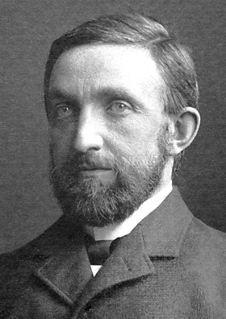

[< Back to Main List](../)

# Philip Leonard
Los Alamos National Laboratory high-explosives synthesis chemist killed in a head-on collision on the road to LANL in February 2024, when another driver crossed the center line into oncoming traffic.

| Field | Details |
|-------|---------|
| **Full Name** | Dr. Philip William Leonard |
| **Born** | March 19, 1979 |
| **Died** | February 27, 2024 |
| **Age at Death** | 44 |
| **Location of Death** | NM 501 (Truck Route), approximately one mile east of LANSCE facility, Los Alamos, New Mexico |
| **Cause of Death** | Injuries sustained in head-on vehicle collision |
| **Official Ruling** | Traffic accident |
| **Alleged Intelligence Connection** | Los Alamos National Laboratory — nuclear weapons research, high-explosives synthesis |
| **Victim Was Intel Employee** | No — weapons laboratory scientist, not an intelligence officer |
| **Category** | Scientist / Weapons Expert |

## Assessment: SUSPICIOUS (cluster timing)

Philip Leonard was a high-explosives synthesis chemist at Los Alamos National Laboratory — the birthplace of nuclear weapons — killed in a head-on collision when another driver crossed the double yellow line into his lane on the road leading to the lab. While officially ruled a traffic accident and with no direct evidence of foul play, Leonard's death occurred in February 2024, placing it at the start of what would become a notable cluster of defense scientist deaths and disappearances in the New Mexico defense corridor throughout 2024–2025. The timing, location, and institutional affiliation have led some researchers to include Leonard's death alongside those of Christopher Fallen (AFRL, February 2024), Charles McMillan (former LANL director, September 2024), and the subsequent 2025 wave documented by The Sentinel Network.

## Circumstances of Death

On the morning of February 27, 2024, at approximately 7:30 a.m., Philip Leonard was driving westbound on NM 501 — known locally as the Truck Route — in a 2024 Toyota Camry, heading toward Los Alamos National Laboratory.

According to the Los Alamos Police Department:

- **Ayla Gustafson, 21, of White Rock**, was driving eastbound in a 2017 Toyota RAV4 when she crossed the double yellow line into oncoming traffic approximately one mile east of the LANSCE (Los Alamos Neutron Science Center) facility
- Gustafson's vehicle struck Leonard's Camry **head-on**
- A third vehicle, a 2013 Buick Enclave driven by **James Benge**, collided with Leonard's vehicle after the initial impact
- All three drivers were trapped in their vehicles and had to be extricated by the Los Alamos Fire Department
- Leonard died from his injuries. Gustafson and Benge were hospitalized with serious injuries

As of the initial reporting, police were still investigating the crash and awaiting crash-team analysis and medical records from those involved. No information about impairment, distraction, or mechanical failure in the Gustafson vehicle has been publicly released.

## Background

Dr. Philip William Leonard was a scientist at Los Alamos National Laboratory who had worked at the lab since 2009 — a 15-year career in one of the most sensitive weapons research facilities in the world.

- **Specialty:** High-explosives synthesis chemistry — the design and creation of explosive compounds used in nuclear weapons, conventional munitions, and advanced defense applications
- **Publications:** Author of 48 scientific papers documented on ResearchGate and Google Scholar
- **LinkedIn:** Described himself as a "high explosions synthesis chemist" at LANL
- **Residence:** Owned property near Eldorado, outside Santa Fe, and commuted to Los Alamos

Leonard's work in high-explosives synthesis placed him at the core of LANL's weapons mission — the design, testing, and certification of nuclear warheads for the U.S. stockpile.

## Intelligence Connections

- LANL is the primary U.S. nuclear weapons design laboratory, operating under the Department of Energy's National Nuclear Security Administration (NNSA)
- High-explosives research at LANL is central to nuclear weapons design — the conventional explosive "lens" that compresses the plutonium pit is one of the most sensitive aspects of weapon physics
- LANL scientists routinely hold Q clearances (DOE equivalent of Top Secret) and work on classified programs
- No direct evidence has emerged linking Leonard's death to any intelligence service or targeted operation
- The crash was caused by another driver crossing the center line, and no evidence of vehicle tampering has been reported

## Why This Death Raises Questions

- **NM defense corridor:** Leonard died on the road leading to LANL, in the same geographic corridor where multiple other defense scientists would die or disappear over the following 12 months
- **Cluster timing:** February 2024 saw both Leonard's death (LANL) and Christopher Fallen's murder (AFRL, Albuquerque) — two defense scientists in the same New Mexico corridor within weeks of each other
- **Institutional sensitivity:** High-explosives synthesis chemistry is among the most classified and sensitive research areas at LANL, directly related to nuclear weapons design
- **Pattern of car crashes:** Head-on collisions caused by another driver crossing the center line are a documented method in intelligence operations, though they are also common traffic accidents
- **No public explanation for the crossing:** Why Gustafson's vehicle crossed the double yellow line has not been publicly detailed

## Counterarguments

- Head-on collisions from lane departures are unfortunately common on New Mexico highways, particularly on two-lane mountain roads
- NM 501 is a known dangerous road with a history of serious crashes — local reporting documented multiple fatalities on this route
- The other driver, Gustafson, was 21 years old — young drivers have higher rates of distracted driving and lane departure
- No evidence of vehicle tampering or deliberate action has been reported
- A third vehicle was also involved, consistent with a chaotic traffic accident rather than a targeted operation
- Leonard's name has not appeared in any congressional inquiry or official investigation into scientist deaths

## Key Quotes

> "Philip Leonard, 44, a Santa Fe man, died in a three-vehicle crash on the Truck Route." — Santa Fe New Mexican

## See Also

- [Christopher Fallen](Christopher_Fallen.md) — AFRL/HAARP physicist murdered in Albuquerque, February 2024
- [Charles McMillan](Charles_McMillan.md) — Former LANL director killed in car crash in Los Alamos, September 2024
- [Jason Thomas](Jason_Thomas.md) — Novartis cancer researcher with DOD contracts, found dead 2026
- [Karen Silkwood](Karen_Silkwood.md) — Nuclear whistleblower killed in car crash en route to deliver documents, 1974

## Other Shocking Stories

- [Frank Olson](Frank_Olson.md): CIA scientist dosed with LSD, then fell from a hotel window. Exhumation revealed he was struck unconscious first.
- [Michael Hastings](Michael_Hastings.md): Investigating CIA Director Brennan. His car exploded at 4 a.m. in LA. Richard Clarke said it was "consistent with a car cyber attack."
- [Sergei Magnitsky](Sergei_Magnitsky.md): Russian tax advisor exposed $230M government fraud. Beaten to death in prison. Led to global sanctions.
- [Barry Seal](Barry_Seal.md): CIA drug pilot turned informant. A judge forced him into an unprotected halfway house. The cartel found him.

## Sources

- [Santa Fe New Mexican: Police: Chemist from Santa Fe died in Los Alamos crash](https://www.santafenewmexican.com/news/local_news/police-chemist-from-santa-fe-died-in-los-alamos-crash/article_3ab644f8-d7eb-11ee-9e48-337c7c9033a1.html)
- [Los Alamos Reporter: Three-Car Crash on Truck Route Results in Death](https://losalamosreporter.com/2024/02/27/lapd-early-morning-three-car-crash-on-truck-route-results-in-death-of-santa-fe-man/)
- [Los Alamos Reporter: Obituary — Dr. Philip William Leonard](https://losalamosreporter.com/2024/04/03/obituary-d-r-philip-william-leonard-march-19-1979-february-27-2074/)
- [Boomtown Los Alamos: Road to Zero](https://www.boomtownlosalamos.org/p/road-to-zero)

*This information was built by Grok and Claude AI research.*
