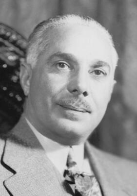

# Rafael Trujillo
Dominican Republic dictator assassinated in 1961 by conspirators using CIA-supplied weapons, ambushed in his car on the highway to San Cristobal after 31 years of brutal rule.

| Field | Details |
|-------|---------|
| **Full Name** | Rafael Leonidas Trujillo Molina |
| **Born** | October 24, 1891, San Cristobal, Dominican Republic |
| **Died** | May 30, 1961 |
| **Age at Death** | 69 |
| **Location of Death** | Highway between Santo Domingo and San Cristobal, Dominican Republic |
| **Cause of Death** | Machine gun and pistol fire in vehicular ambush |
| **Official Ruling** | Assassination |
| **Alleged Intelligence Connection** | CIA (United States) |
| **Category** | Foreign Leader |

## Assessment: CONFIRMED

The Church Committee confirmed that the CIA supplied weapons to the conspirators who assassinated Trujillo, including three .30-caliber M1 carbines delivered on March 31, 1961. A 1973 CIA Inspector General investigation disclosed "quite extensive Agency involvement with the plotters," despite the CIA publicly claiming only a "faint connection." The Church Committee found that while the United States did not initiate the plot, U.S. officials responded to requests for aid from local dissidents whose aim was clearly to assassinate Trujillo. The Kennedy administration provided arms — including machine guns sent via diplomatic pouch in violation of CIA regulations and international law — as part of a broader Caribbean strategy.

## Circumstances of Death

On the night of May 30, 1961, Trujillo was being driven in his blue 1957 Chevrolet Bel Air along the highway from Santo Domingo toward his estate in San Cristobal. He traveled without his usual military escort — a fateful decision. Seven assassins in two cars intercepted the vehicle. The conspirators — led by Brigadier General Juan Tomas Diaz and including General Antonio Imbert Barrera, Antonio de la Maza, Pedro Livio Cedeno, and Amado Garcia Guerrero — opened fire with machine guns, pistols, and carbines. Trujillo, who reportedly attempted to return fire with a pistol, was struck multiple times and killed on the roadside. His chauffeur was wounded but survived.

The event is referred to in the Dominican Republic as the "ajusticimiento" — an execution that brings justice. Trujillo's body was taken to his son Ramfis, who had been in Paris at the time. The dictator who had ruled with absolute power for three decades was dead.

## Background

### The 31-Year Dictatorship

Trujillo seized power in 1930 and ruled the Dominican Republic until his death, establishing one of the most repressive dictatorships in Latin American history. Known as "El Jefe" (The Boss), he controlled every aspect of Dominican life — renaming the capital city "Ciudad Trujillo," requiring his portrait in every home, and accumulating personal wealth estimated at $800 million (roughly two-thirds of the nation's productive economic activity). He maintained power through a vast network of secret police, informants, torture, and political murder.

### The Parsley Massacre (1937)

Trujillo's regime was responsible for the parsley Massacre of October 1937, in which Dominican soldiers, prisoners, and forced civilian participants rounded up and murdered Haitian men, women, and children living near the border — primarily using machetes and knives. Soldiers identified Haitians by asking them to say "perejil" (Spanish for "parsley"); those who could not properly trill the "r" were killed. Estimates of the dead range from 9,000 to 30,000. In a speech on October 2, 1937, Trujillo declared: "Three hundred Haitians are now dead in Banica. This remedy will continue." Newspapers were prohibited from reporting on the events.

### The Mirabal Sisters (1960)

On November 25, 1960, Trujillo's agents murdered the three Mirabal sisters — Patria, Minerva, and Maria Teresa — Dominican political dissidents known as "Las Mariposas" (The Butterflies). The sisters had helped form the 14th of June Movement against Trujillo after dissidents were tortured and killed in 1959. Minerva Mirabal, the first woman to graduate from law school in the Dominican Republic, had personally rejected Trujillo's sexual advances at a party, after which she was repeatedly harassed and stripped of her law license. The regime's agents strangled and beat the sisters to death with clubs, then placed their bodies back in their car and pushed it off a cliff to simulate an accident. According to historian Bernard Diederich, the Mirabal sisters' assassination "had greater effect on Dominicans than most of Trujillo's other crimes" and "did something to their machismo." In 1999, the United Nations General Assembly designated November 25 as the International Day for the Elimination of Violence against Women in their honor. The murders galvanized opposition and paved the way for Trujillo's own assassination six months later.

### Why the U.S. Turned Against Trujillo

Although the United States initially supported Trujillo as an anti-communist ally during the Cold War, the Eisenhower and Kennedy administrations turned against him for several reasons. In June 1960, Trujillo orchestrated an assassination attempt against Venezuelan president Romulo Betancourt, personally overseeing the testing of radio-controlled car bombs on his estate before a third bomb was sent to Venezuela and detonated along Betancourt's motorcade route. Betancourt survived but was injured. The Organization of American States voted unanimously to sever diplomatic relations with the Dominican Republic and impose economic sanctions. Combined with the murders of the Mirabal sisters, the kidnapping and presumed murder of Columbia University lecturer Jesus de Galindez, and Trujillo's escalating brutality, U.S. policymakers concluded that Trujillo had become an embarrassment and a liability — a dictator whose continued rule risked pushing the Dominican Republic toward a Cuba-style communist revolution.

## Intelligence Connections

* The CIA supplied three .30-caliber M1 carbines to the conspirators on March 31, 1961, weapons that had been left in the U.S. embassy before the United States broke diplomatic relations
* On April 10, 1961, four M3 machine guns and 240 rounds of ammunition were sent via diplomatic pouch to the Dominican Republic, received on April 19
* The use of a diplomatic pouch to send weapons violated both CIA Clandestine Services regulations and international law; the Deputy Director of Plans approved a waiver of internal regulations
* The Kennedy administration covertly sent machine guns, pistols, and carbines to Dominican dissidents before the Bay of Pigs invasion
* A 1973 CIA Inspector General investigation disclosed "quite extensive Agency involvement with the plotters"
* The CIA publicly claimed only a "faint connection" to the assassination, contradicting its own internal findings
* The Church Committee investigated the Trujillo assassination as one of five cases of CIA assassination plots against foreign leaders, alongside [Patrice Lumumba](Patrice_Lumumba.md), [Ngo Dinh Diem](Ngo_Dinh_Diem.md), [Rene Schneider](Rene_Schneider.md), and Fidel Castro
* On May 28, 1961 — two days before the assassination — Kennedy sent a cable to Consul General Henry Dearborn stating that the United States could not condone political assassination and must not be associated with the attempt on Trujillo's life, yet the weapons had already been delivered
* Several conspirators had direct CIA contacts and received operational encouragement

## The Aftermath

### Ramfis Trujillo's Revenge

Following the assassination, Trujillo's son Ramfis — a brigadier general who had been in Paris — flew back and seized control of the military. He directed the capture, torture, and execution of most of the assassins while pledging nominal support for democratic reforms under puppet president Joaquin Balaguer. Ramfis emerged as the dominant figure over the Trujillo family's economic interests, which encompassed approximately two-thirds of the nation's productive economic activity.

### The End of the Trujillo Dynasty

The U.S. deployed naval forces offshore to prevent the Trujillo family from retaining permanent power. By November 1961, a military uprising by six members of the Dominican Military Aviation put a definitive end to 31 years of Trujillo rule, forcing the family into exile. Balaguer introduced reforms to open the regime.

### Political Instability

The assassination ushered in years of political turmoil. Juan Bosch was elected president in 1962 as the country's first democratically chosen leader in decades, but was overthrown in a military coup in September 1963 after just seven months in office. The resulting instability led to the Dominican Civil War of 1965, prompting a U.S.-OAS military intervention. The country did not achieve stable multi-party governance until 1966 under Joaquin Balaguer — the same man who had served as Trujillo's puppet president.

## Why This Death Raises Questions

- The CIA supplied the weapons used in the assassination while publicly maintaining minimal involvement
- Internal CIA documents contradict the agency's public claims of limited connection to the plotters
- The assassination was part of a broader U.S. strategy to reshape Caribbean politics during the Bay of Pigs era
- Kennedy's cable disclaiming involvement arrived just two days before the killing — after weapons had already been delivered — suggesting the administration wanted deniability rather than prevention
- The use of diplomatic pouches to smuggle weapons violated both CIA regulations and international law
- After Trujillo's death, the U.S. deployed naval forces offshore to influence the political transition
- The gap between CIA's public testimony and its internal records suggests deliberate deception of Congress
- The Church Committee found this was one of five confirmed CIA assassination plots against foreign leaders, revealing a systematic pattern rather than an isolated case

## Key Quotes

> "Quite extensive Agency involvement with the plotters." — **CIA Inspector General internal memorandum**, 1973

> The CIA described itself as having "no active part" in the assassination and only a "faint connection" with the groups that planned the killing. — **CIA report to Deputy Attorney General**, 1975

> "In the Trujillo case, although the United States Government certainly opposed his regime, it did not initiate the plot. Rather, United States officials responded to requests for aid from local dissidents whose aim clearly was to assassinate Trujillo." — **Church Committee interim report**, *Alleged Assassination Plots Involving Foreign Leaders*, 1975

> "Three hundred Haitians are now dead in Banica. This remedy will continue." — **Rafael Trujillo**, speech on October 2, 1937, during the Parsley Massacre

> The Mirabal sisters' assassination "had greater effect on Dominicans than most of Trujillo's other crimes. It did something to their machismo." — **Bernard Diederich**, historian

> On May 28, 1961 — two days before the assassination — Kennedy sent a cable to Consul General Dearborn stating that "the United States as a government cannot condone assassination" and must not be associated with the attempt. — As reported by **Warfare History Network**

## See Also

- [Patrice Lumumba](Patrice_Lumumba.md) — Congolese leader assassinated with CIA involvement (1961), investigated alongside Trujillo by the Church Committee
- [Ngo Dinh Diem](Ngo_Dinh_Diem.md) — South Vietnamese president killed in CIA-backed coup (1963), another of the five Church Committee assassination cases
- [Rene Schneider](Rene_Schneider.md) — Chilean general killed in CIA-backed operation (1970), the fifth Church Committee assassination case alongside Castro
- [Salvador Allende](Salvador_Allende.md) — Chilean president overthrown in CIA-backed coup (1973)

- CIA (Group Profile) — intelligence service connected to this case

## Other Shocking Stories

- [Victor Jara](Victor_Jara.md): Chilean folk singer's hands were broken. Then soldiers machine-gunned him with 44 rounds in a stadium.
- [Barry Seal](Barry_Seal.md): CIA drug pilot turned informant. A judge forced him into an unprotected halfway house. The cartel found him.
- [Fred Hampton](Fred_Hampton.md): FBI gave police his floor plan. They drugged him, then shot him in bed while he slept.
- [Frank Olson](Frank_Olson.md): CIA scientist dosed with LSD, then fell from a hotel window. Exhumation revealed he was struck unconscious first.

## Sources

- [Rafael Trujillo — Wikipedia](https://en.wikipedia.org/wiki/Rafael_Trujillo)
- [The CIA Assassination of Rafael Trujillo — Warfare History Network](https://warfarehistorynetwork.com/article/the-cia-assassination-of-rafael-trujillo/)
- [CIA Assassination Plots: Church Committee Report 50 Years Later — National Security Archive](https://nsarchive.gwu.edu/briefing-book/intelligence/2025-11-20/cia-assassination-plots-church-committee-report-50-years)
- [CIA Inspector General's Report, "Trujillo Report" — National Security Archive](https://nsarchive.gwu.edu/document/32915-6-cia-inspector-generals-report-trujillo-report-report-assassination-dominican)
- [Rafael Trujillo — HISTORY](https://www.history.com/topics/1960s/rafael-trujillo)
- [Dominican Dictator Rafael Trujillo Is Assassinated — EBSCO Research](https://www.ebsco.com/research-starters/history/dominican-dictator-rafael-trujillo-assassinated)
- [How the Mirabal Sisters Helped Topple a Dictator — HISTORY](https://www.history.com/articles/mirabal-sisters-trujillo-dictator)
- [Mirabal Sisters — Wikipedia](https://en.wikipedia.org/wiki/Mirabal_sisters)
- [Parsley Massacre — Wikipedia](https://en.wikipedia.org/wiki/Parsley_massacre)
- [Trujillo's Murder Plot — TIME](https://time.com/archive/6807214/venezuela-trujillos-murder-plot/)
- [Attempted Assassination of Romulo Betancourt — Wikipedia](https://en.wikipedia.org/wiki/Attempted_assassination_of_R%C3%B3mulo_Betancourt)
- [Sic Semper Tyrannis: The Assassination of El Jefe — Association for Diplomatic Studies & Training](https://adst.org/2013/05/sic-semper-tyrannis-the-assassination-of-el-jefe-may-30-1961/)

*This information was built by Grok and Claude AI research.*

**Status:** Deceased (1961)
