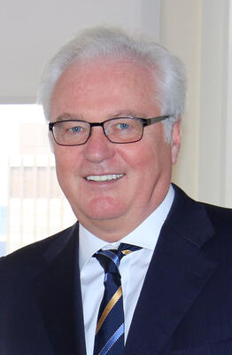

Russia's Permanent Representative to the United Nations who died suddenly in New York City in 2017, one day before his 65th birthday. The NYC Medical Examiner initially could not determine cause of death, and the autopsy results were subsequently suppressed under diplomatic immunity at the request of the U.S. State Department.

| Field | Details |
|-------|---------|
| **Full Name** | Vitaly Ivanovich Churkin |
| **Born** | 21 February 1952 |
| **Died** | 20 February 2017 |
| **Age at Death** | 64 |
| **Location of Death** | New York City, USA |
| **Cause of Death** | Officially suppressed; initially attributed to cardiac arrest |
| **Official Ruling** | Cause of death classified under diplomatic immunity |
| **Alleged Intelligence Connection** | Unknown; death occurred during period of multiple suspicious Russian diplomat deaths |
| **Category** | Diplomat |

## Assessment: SUSPICIOUS

Vitaly Churkin's sudden death came during a period in 2016-2017 when at least six Russian diplomats died under unusual circumstances worldwide. While one senior NYC official stated he died of a heart attack with no foul play, the Medical Examiner's office initially said the cause needed "further study" — often indicating toxicology tests — and the autopsy results were then suppressed at the request of the U.S. State Department, citing posthumous diplomatic immunity. The secrecy surrounding his death has fueled speculation.

## Circumstances of Death

On the morning of 20 February 2017, one day before his 65th birthday, Churkin collapsed while at work at the Russian Mission to the United Nations on East 67th Street in Manhattan. He was rushed to New York-Presbyterian Hospital, where he was pronounced dead.

Initial reports attributed his death to cardiac arrest. However, on 21 February, the NYC Medical Examiner's Office stated that the autopsy results were inconclusive and the cause of death required "further study" — language that typically indicates the need for additional toxicology testing. The results were never publicly released.

On 24 February, the U.S. State Department formally requested in writing that the NYC Medical Examiner's Office not release the autopsy results, citing Churkin's diplomatic immunity, which was ruled to extend beyond death. Russia also maintained that the information was private and should not be disclosed, reportedly stating that the results "could hurt his reputation."

## Background

Churkin was one of Russia's most prominent and skilled diplomats. He served as Russia's Permanent Representative to the United Nations from 2006 until his death. His career spanned decades of Soviet and Russian diplomacy, including roles as Deputy Foreign Minister and Special Representative to the Yugoslavia negotiations (1992-1994), Ambassador to Belgium and NATO liaison (1994-1998), and Ambassador to Canada (1998-2003). He was known for his sharp debating skills and frequently clashed with Western representatives at the UN Security Council over Syria, Ukraine, and other issues.

## Intelligence Connections

* Churkin's death occurred during a period of multiple Russian diplomat and intelligence-connected deaths between November 2016 and February 2017
* Russian Ambassador to Turkey Andrei Karlov was assassinated in December 2016
* Russian diplomat Petr Polshikov was found shot dead in his Moscow apartment in December 2016
* Russian ex-KGB chief Oleg Erovinkin was found dead in his car in Moscow in January 2017
* The cluster of deaths was widely noted by media at the time, though no connection between them has been established
* The suppression of Churkin's autopsy results prevented any public determination of whether his death was natural

## Why This Death Raises Questions

- The NYC Medical Examiner initially could not determine cause of death and required further study — this is unusual for a straightforward heart attack
- The U.S. State Department actively suppressed the autopsy results, an extraordinary step
- Russia also opposed disclosure, stating the results could "hurt his reputation" — a cryptic comment that fueled speculation
- His death came during a cluster of at least six Russian diplomat deaths in a four-month period
- The combination of inconclusive autopsy, active suppression by two governments, and the cluster timing make this case inherently suspicious
- No independent review of the medical evidence has ever been conducted

## Key Quotes

> "The cause and manner of death of Ambassador Churkin requires further study." — NYC Medical Examiner's Office, February 21, 2017

> "We have asked the city medical examiner to not release the cause of death, because he had diplomatic immunity." — U.S. State Department, reported by CBS News

> "Disclosing details of the autopsy results could hurt his reputation." — Russian government statement

## See Also

- [Alexander Litvinenko](Alexander_Litvinenko.md) — Russian intelligence defector poisoned in London
- [Boris Nemtsov](Boris_Nemtsov.md) — Russian opposition leader killed in Moscow
- [Nikolai Glushkov](Nikolai_Glushkov.md) — Russian exile found dead in London
- [Vitaly Churkin (Epstein Kill List)](https://intelligencemurders.com/intelligence-service-murders/Details/Vitaly_Churkin/) — Epstein Kill List cross-reference
## Other Shocking Stories

- [Carlos Prats](Carlos_Prats.md): Chilean general killed by a DINA car bomb in Buenos Aires. Operation Condor hunted dissidents across continents.
- [Pierre Gemayel](Pierre_Gemayel.md): Lebanese anti-Syrian politician shot dead in his car. Part of a wave of assassinations targeting one alliance.
- [Barry Seal](Barry_Seal.md): CIA drug pilot turned informant. A judge forced him into an unprotected halfway house. The cartel found him.
- [Dulcie September](Dulcie_September.md): ANC representative shot dead in Paris while investigating South African arms deals. Case still unsolved after 38 years.

## Sources

- [Vitaly Churkin — Wikipedia](https://en.wikipedia.org/wiki/Vitaly_Churkin)
- [Russia Ambassador Vitaly Churkin's cause of death won't be released — CBS News](https://www.cbsnews.com/news/russia-ambassador-cause-of-death-wont-be-released/)
- [No Clear Cause for Russian UN Ambassador's Sudden Death — VOA News](https://www.voanews.com/a/no-clear-cause-russian-un-ambassador-vitaly-churkin-sudden-death/3734682.html)
- [Official: No foul play in death of Russian ambassador to UN — CNN](https://www.cnn.com/2017/03/10/world/russian-ambassador-heart-attack)
- [Vitaly Churkin, 64, Russia's Longtime Ambassador to the UN, Dies Suddenly — PassBlue](https://passblue.com/2017/02/20/vitaly-churkin-64-russias-longtime-ambassador-to-the-un-dies-suddenly/)
- [Vitaly I. Churkin, Russian ambassador to the U.N., dies at 64 — Washington Post](https://www.washingtonpost.com/world/vitaly-i-churkin-russian-ambassador-to-the-un-dies-at-64/2017/02/20/6c817be4-f79a-11e6-be05-1a3817ac21a5_story.html)

*This information was built by Grok and Claude AI research.*

**Status:** Deceased (2017)

---

## Additional context from the Epstein Murders investigation

Russian UN Ambassador who died suddenly; medical examiner withheld cause at State Dept request.

| Field | Details |
|-------|---------|
| **Full Name** | Vitaly Ivanovich Churkin |
| **Born** | February 21, 1952 |
| **Died** | February 20, 2017 |
| **Age at Death** | 64 |
| **Location of Death** | Russian Mission to the United Nations, Manhattan, New York |
| **Cause of Death** | Sudden cardiac event (heart failure) |
| **Official Ruling** | Natural causes |
| **Category** | Political Figure / Intelligence |

## Assessment: UNCERTAIN
Churkin's death is notable primarily because the New York City medical examiner initially withheld his cause of death at the explicit request of the U.S. State Department, citing diplomatic protocol — an unusual and documented step that fueled speculation. The cause was eventually reported as cardiac-related. No verified evidence connects him to the Epstein network; the association appears to originate from timing and broader theories about Epstein's alleged international intelligence connections.

## Connection to Epstein Network
A less common but recurring mention in Epstein threads on X, some posts call Churkin's death suspicious, labeling him a possible "[Epstein](/epstein-murders/Details/Jeffrey_Epstein) GRU case officer" or intelligence link/accomplice in the network. The claim ties into broader theories about Epstein's alleged intelligence connections (Mossad, CIA, and Russian intelligence have all been named in various theories).

## Circumstances of Death
Churkin collapsed at the Russian Mission to the United Nations in Manhattan on the morning of February 20, 2017 — one day before his 65th birthday. Emergency services were called and he was transported to NewYork-Presbyterian Hospital/Weill Cornell Medical Center, where he was pronounced dead. Russian Foreign Ministry spokeswoman Maria Zakharova initially confirmed his death without disclosing a cause. The New York City medical examiner's office was directed not to publicly disclose the cause or manner of death, at the written request of the U.S. State Department, citing diplomatic immunity and international protocol. The cause was eventually reported as cardiac-related, with CNN citing an official confirming no foul play.

## Background
Vitaly Churkin served as Russia's Permanent Representative to the United Nations from 2006 until his death — an 11-year tenure that made him one of Russia's most recognized international voices. He was known for sharp, often combative rhetoric at the UN Security Council during debates over Syria, Ukraine, the 2008 Georgia war, and other crises. Before his UN appointment, he served in multiple diplomatic roles including as Russia's ambassador to Belgium and Canada. He was widely regarded as a skilled and experienced diplomat even by Western counterparts who opposed his positions.

No verified evidence connects Churkin to [Jeffrey Epstein](/epstein-murders/Details/Jeffrey_Epstein), the Epstein trafficking network, or any intelligence operation related to Epstein. The claims appear to originate from the timing of his death, the initial secrecy around his cause of death, and broader theories about Epstein's intelligence connections involving multiple nations.

## Why This Death Possibly Raises Questions
- The NYC medical examiner withheld the cause of death at the documented written request of the U.S. State Department — an unusual, confirmed step that went beyond standard diplomatic protocol
- Died one day before his 65th birthday, suddenly, with no widely reported prior illness
- Died in the same year as [Chris Cornell](/epstein-murders/Details/Chris_Cornell) and [Chester Bennington](/epstein-murders/Details/Chester_Bennington), cited in "Silent Children" documentary theories
- Fits a pattern noted online of intelligence-connected figures dying before full Epstein exposure became public
- His role placed him at the intersection of international diplomacy and intelligence operations — the arena Epstein's alleged blackmail network reportedly operated in

## The Counterargument
CNN reported an official confirmation of no foul play. Cardiac events are the leading cause of death for men in their mid-60s. The State Department's request to withhold the autopsy was explicitly tied to standard diplomatic immunity protocols applied reciprocally to U.S. diplomats abroad. The cause was eventually disclosed as cardiac-related. No colleague, family member, or government has alleged foul play.

## Key Quotes from Media Coverage

> "In order to comply with international law and protocol, the New York City Law Department has instructed the Office of Chief Medical Examiner to not publicly disclose the cause and manner of death of Ambassador Vitaly Churkin."
>
> — Julie Bolcer, spokeswoman for the NYC Chief Medical Examiner's Office ([NBC News: State Department bars release of Russian U.N. ambassador's autopsy](https://www.nbcnews.com/news/us-news/state-department-bars-release-russian-u-n-ambassador-s-autopsy-n731996))

> "The United States insists on the dignified handling of the remains of our diplomatic personnel who pass away abroad (including in Russia) and works to prevent unnecessary disclosures regarding the circumstances of their deaths."
>
> — James Donovan, U.S. Mission to the UN, in a letter requesting suppression of the autopsy report ([PassBlue: US Mission to the UN -- Do Not Release Vitaly Churkin's Autopsy Report](https://passblue.com/2017/03/12/us-mission-to-the-un-do-not-release-vitaly-churkins-autopsy-report/))

> "Ambassador Churkin's diplomatic immunity survives his death."
>
> — NYC Chief Medical Examiner's Office spokeswoman, explaining why cause of death would not be released ([CBS News: Russia Ambassador Vitaly Churkin's cause of death won't be released](https://www.cbsnews.com/news/russia-ambassador-cause-of-death-wont-be-released/))

## See Also

- [Jeffrey Epstein](/epstein-murders/Details/Jeffrey_Epstein)
- [Chris Cornell](/epstein-murders/Details/Chris_Cornell)
- [Chester Bennington](/epstein-murders/Details/Chester_Bennington)
- [Bill Richardson](/epstein-murders/Details/Bill_Richardson) — New Mexico governor linked to Epstein who died shortly after being named in Giuffre's deposition
- [John Ashe](/epstein-murders/Details/John_Ashe) — UN official who died before his corruption trial
- **Intelligence investigation profile:** [Vitaly Churkin](/intelligence-service-murders/Details/Vitaly_Churkin) — documents his death from the intelligence operations perspective
- [Sergei Krivov](/intelligence-service-murders/Details/Sergei_Krivov) — Russian diplomat found dead at Russian consulate in New York in 2016, months before Churkin

## Other Shocking Stories

- [Steven Silks](/epstein-murders/Details/Steven_Silks): NYPD deputy chief who allegedly viewed the Weiner laptop evidence. First of four officer suicides in 22 days.
- [Val Broeksmit](/epstein-murders/Details/Val_Broeksmit): His father hanged. He became an FBI informant on Deutsche Bank.
- [Diana Spencer (Princess of Wales)](Diana_Spencer.md): Wrote 'my husband is planning an accident in my car.' Died in a Paris tunnel crash.
- [Priscilla Presley](/epstein-murders/Details/Priscilla_Presley): Groomed by Elvis Presley at age 14. The entertainment industry's oldest documented pattern of powerful men targeting girls.

## Sources

- [NBC News: State Department bars release of Russian U.N. ambassador's autopsy (March 10, 2017)](https://www.nbcnews.com/news/us-news/state-department-bars-release-russian-u-n-ambassador-s-autopsy-n731996)
- [PassBlue: US Mission to the UN -- Do Not Release Vitaly Churkin's Autopsy Report (March 12, 2017)](https://passblue.com/2017/03/12/us-mission-to-the-un-do-not-release-vitaly-churkins-autopsy-report/)
- [PassBlue: Vitaly Churkin, 64, Russia's Longtime Ambassador to the UN, Dies Suddenly (February 20, 2017)](https://passblue.com/2017/02/20/vitaly-churkin-64-russias-longtime-ambassador-to-the-un-dies-suddenly/)
- [CBS News: Russia Ambassador Vitaly Churkin's cause of death won't be released](https://www.cbsnews.com/news/russia-ambassador-cause-of-death-wont-be-released/)
- [CNN: Official -- No foul play in death of Russian ambassador to UN (March 10, 2017)](https://www.cnn.com/2017/03/10/world/russian-ambassador-heart-attack)
- [The Hill: State Dept. seeks to keep Russian diplomat's cause of death private](https://thehill.com/blogs/blog-briefing-room/news/323403-state-dept-asks-ny-medical-examiner-not-to-release-russian/)
- [VOA News: Cause of Russian UN Ambassador's Death Won't Be Released](https://www.voanews.com/a/cause-russian-un-ambassaors-death-wont-be-released/3760333.html)
- [Wikipedia: Vitaly Churkin](https://en.wikipedia.org/wiki/Vitaly_Churkin)

*This information was built by Grok and Claude AI research.*

**Status:** Deceased (2017)

---

**Investigations:** Intelligence Service Murders, Epstein Murders
