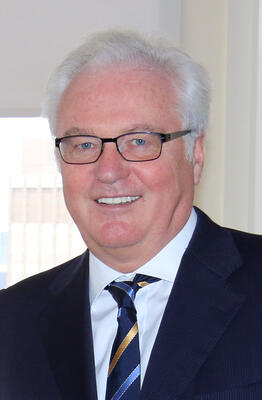

# Vitaly Churkin
Russia's Permanent Representative to the United Nations who died suddenly in New York City in 2017, one day before his 65th birthday. The NYC Medical Examiner initially could not determine cause of death, and the autopsy results were subsequently suppressed under diplomatic immunity at the request of the U.S. State Department.

| Field | Details |
|-------|---------|
| **Full Name** | Vitaly Ivanovich Churkin |
| **Born** | 21 February 1952 |
| **Died** | 20 February 2017 |
| **Age at Death** | 64 |
| **Location of Death** | New York City, USA |
| **Cause of Death** | Officially suppressed; initially attributed to cardiac arrest |
| **Official Ruling** | Cause of death classified under diplomatic immunity |
| **Alleged Intelligence Connection** | Unknown; death occurred during period of multiple suspicious Russian diplomat deaths |
| **Category** | Diplomat |

## Assessment: SUSPICIOUS

Vitaly Churkin's sudden death came during a period in 2016-2017 when at least six Russian diplomats died under unusual circumstances worldwide. While one senior NYC official stated he died of a heart attack with no foul play, the Medical Examiner's office initially said the cause needed "further study" — often indicating toxicology tests — and the autopsy results were then suppressed at the request of the U.S. State Department, citing posthumous diplomatic immunity. The secrecy surrounding his death has fueled speculation.

## Circumstances of Death

On the morning of 20 February 2017, one day before his 65th birthday, Churkin collapsed while at work at the Russian Mission to the United Nations on East 67th Street in Manhattan. He was rushed to New York-Presbyterian Hospital, where he was pronounced dead.

Initial reports attributed his death to cardiac arrest. However, on 21 February, the NYC Medical Examiner's Office stated that the autopsy results were inconclusive and the cause of death required "further study" — language that typically indicates the need for additional toxicology testing. The results were never publicly released.

On 24 February, the U.S. State Department formally requested in writing that the NYC Medical Examiner's Office not release the autopsy results, citing Churkin's diplomatic immunity, which was ruled to extend beyond death. Russia also maintained that the information was private and should not be disclosed, reportedly stating that the results "could hurt his reputation."

## Background

Churkin was one of Russia's most prominent and skilled diplomats. He served as Russia's Permanent Representative to the United Nations from 2006 until his death. His career spanned decades of Soviet and Russian diplomacy, including roles as Deputy Foreign Minister and Special Representative to the Yugoslavia negotiations (1992-1994), Ambassador to Belgium and NATO liaison (1994-1998), and Ambassador to Canada (1998-2003). He was known for his sharp debating skills and frequently clashed with Western representatives at the UN Security Council over Syria, Ukraine, and other issues.

## Intelligence Connections

* Churkin's death occurred during a period of multiple Russian diplomat and intelligence-connected deaths between November 2016 and February 2017
* Russian Ambassador to Turkey Andrei Karlov was assassinated in December 2016
* Russian diplomat Petr Polshikov was found shot dead in his Moscow apartment in December 2016
* Russian ex-KGB chief Oleg Erovinkin was found dead in his car in Moscow in January 2017
* The cluster of deaths was widely noted by media at the time, though no connection between them has been established
* The suppression of Churkin's autopsy results prevented any public determination of whether his death was natural

## Why This Death Raises Questions

- The NYC Medical Examiner initially could not determine cause of death and required further study — this is unusual for a straightforward heart attack
- The U.S. State Department actively suppressed the autopsy results, an extraordinary step
- Russia also opposed disclosure, stating the results could "hurt his reputation" — a cryptic comment that fueled speculation
- His death came during a cluster of at least six Russian diplomat deaths in a four-month period
- The combination of inconclusive autopsy, active suppression by two governments, and the cluster timing make this case inherently suspicious
- No independent review of the medical evidence has ever been conducted

## Key Quotes

> "The cause and manner of death of Ambassador Churkin requires further study." — NYC Medical Examiner's Office, February 21, 2017

> "We have asked the city medical examiner to not release the cause of death, because he had diplomatic immunity." — U.S. State Department, reported by CBS News

> "Disclosing details of the autopsy results could hurt his reputation." — Russian government statement

## See Also

- [Alexander Litvinenko](Alexander_Litvinenko.mdx) — Russian intelligence defector poisoned in London
- [Boris Nemtsov](Boris_Nemtsov.mdx) — Russian opposition leader killed in Moscow
- [Nikolai Glushkov](Nikolai_Glushkov.mdx) — Russian exile found dead in London
- [Vitaly Churkin (Epstein Kill List)](/epstein/Details/Vitaly_Churkin) — Epstein Kill List cross-reference
## Other Shocking Stories

- [Carlos Prats](Carlos_Prats.mdx): Chilean general killed by a DINA car bomb in Buenos Aires. Operation Condor hunted dissidents across continents.
- [Pierre Gemayel](Pierre_Gemayel.mdx): Lebanese anti-Syrian politician shot dead in his car. Part of a wave of assassinations targeting one alliance.
- [Barry Seal](Barry_Seal.mdx): CIA drug pilot turned informant. A judge forced him into an unprotected halfway house. The cartel found him.
- [Dulcie September](Dulcie_September.mdx): ANC representative shot dead in Paris while investigating South African arms deals. Case still unsolved after 38 years.

## Sources

- [Vitaly Churkin — Wikipedia](https://en.wikipedia.org/wiki/Vitaly_Churkin)
- [Russia Ambassador Vitaly Churkin's cause of death won't be released — CBS News](https://www.cbsnews.com/news/russia-ambassador-cause-of-death-wont-be-released/)
- [No Clear Cause for Russian UN Ambassador's Sudden Death — VOA News](https://www.voanews.com/a/no-clear-cause-russian-un-ambassador-vitaly-churkin-sudden-death/3734682.html)
- [Official: No foul play in death of Russian ambassador to UN — CNN](https://www.cnn.com/2017/03/10/world/russian-ambassador-heart-attack)
- [Vitaly Churkin, 64, Russia's Longtime Ambassador to the UN, Dies Suddenly — PassBlue](https://passblue.com/2017/02/20/vitaly-churkin-64-russias-longtime-ambassador-to-the-un-dies-suddenly/)
- [Vitaly I. Churkin, Russian ambassador to the U.N., dies at 64 — Washington Post](https://www.washingtonpost.com/world/vitaly-i-churkin-russian-ambassador-to-the-un-dies-at-64/2017/02/20/6c817be4-f79a-11e6-be05-1a3817ac21a5_story.html)

*This information was built by Grok and Claude AI research.*

**Status:** Deceased (2017)
