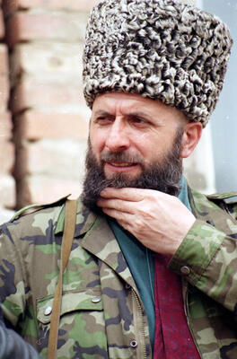

# Zelimkhan Yandarbiyev
Former president of the Chechen Republic of Ichkeria, poet, and father of the Chechen independence movement, assassinated by a car bomb in Doha, Qatar in 2004 — one of the few confirmed cases where Russian military intelligence (GRU) agents were caught, tried, and convicted of an extraterritorial assassination.

| Field | Details |
|-------|---------|
| **Full Name** | Zelimkhan Abdumuslimovich Yandarbiyev |
| **Born** | September 12, 1952, Vydrikha, Kazakh SSR |
| **Died** | February 13, 2004 |
| **Age at Death** | 51 |
| **Location of Death** | Doha, Qatar |
| **Cause of Death** | Car bomb |
| **Official Ruling** | Homicide — GRU agents convicted by Qatari court |
| **Alleged Intelligence Connection** | GRU — confirmed. Qatari court found agents acted on orders from Russian Defense Minister |
| **Category** | Foreign Leader / Dissident |

## Assessment: CONFIRMED

This is one of the most clear-cut cases of a state-sponsored assassination by Russian intelligence. Two GRU agents were arrested, tried, and convicted by a Qatari court, which found they had acted on orders from then-Russian Defense Minister Sergei Ivanov. The agents were sentenced to life imprisonment but were repatriated to Russia under intense diplomatic pressure and received a heroes' welcome in Moscow. They were never imprisoned in Russia. The case established a template that Russia would repeat: carry out an extraterritorial assassination, deny involvement, then use diplomatic leverage to shield the operatives when caught.

## Circumstances of Death

On February 13, 2004, Yandarbiyev left a mosque in the Qatari capital of Doha after Friday prayers with his 13-year-old son Daud. As they got into his Toyota Land Cruiser and began to drive away, a bomb attached to the underside of the vehicle detonated. Yandarbiyev was fatally wounded and died en route to Hamad General Hospital. His son Daud was critically injured — suffering severe burns and shrapnel wounds — but survived after extensive medical treatment.

Qatari security services moved quickly. Within days, they arrested three Russians operating from a villa connected to the Russian Embassy. The Qatari investigation determined the bomb had been assembled at the villa and attached to Yandarbiyev's vehicle while he was inside the mosque. One suspect, first secretary Aleksandr Fetisov, was released due to diplomatic immunity. The remaining two — identified as GRU agents Anatoly Yablochkov (also known as Belashkov) and Vasily Pugachyov (sometimes transliterated Bogachyov) — were charged with assassination, attempted murder of Daud Yandarbiyev, and smuggling weapons into Qatar.

## Background

Zelimkhan Yandarbiyev was a literary scholar, poet, and children's author who became the ideological architect of Chechen independence. In July 1989, he founded the secularist democratic Bart (Unity) Party to campaign for Chechen sovereignty. He is widely regarded as the modern-day father of Chechen independence — in the early 1990s, he was instrumental in establishing independence as the dominant political issue on the Chechen agenda and reportedly persuaded former Soviet Air Force general Dzhokhar Dudayev to take on leadership of the movement.

Yandarbiyev served as vice-president under Dudayev during the First Chechen War (1994-1996). After Dudayev was killed by a Russian guided missile in April 1996, Yandarbiyev assumed the presidency as acting president and served from April 1996 to February 1997. During his presidency, he signed a ceasefire agreement with Russian Security Council Secretary Alexander Lebed in August 1996. He ran for a full presidential term in the January 1997 election but lost to Aslan Maskhadov.

After the Second Chechen War began in 1999 and Russia reasserted control over Chechnya, Yandarbiyev went into exile, eventually settling in Qatar. Russia designated him as a terrorist, accusing him of financing Chechen insurgents. At Russia's request, Yandarbiyev was placed on the UN Security Council's terrorism sanctions list in 2003.

## The Qatar Trial

The trial of the two GRU agents began on April 25, 2004 in a closed Qatari court, with proceedings kept largely secret at Russia's insistence. On June 30, 2004, the court found both defendants guilty and sentenced them to life imprisonment. In passing sentence, the judge stated that the two convicted Russians "had acted on orders from the Russian leadership." Qatari prosecutors specifically concluded that the agents had received their orders from Defense Minister Sergei Ivanov.

Russia denied all involvement and demanded the agents' release, calling the trial illegitimate. The verdict triggered a severe diplomatic crisis between Qatar and Russia. Russia reportedly threatened economic and diplomatic consequences. On December 23, 2004, Qatar agreed to extradite the two agents to Russia under an agreement that they would serve out their life sentences in Russian prisons. The agents were flown to Moscow the same day and received a heroes' welcome upon landing, met by senior officials. They disappeared from public view shortly afterward. In February 2005, Russian prison authorities openly admitted the agents were not in prison, stating that the Qatari sentence was "irrelevant" in Russia.

## Intelligence Connections

* Two GRU agents were arrested, tried, and convicted — making this a judicially confirmed state assassination
* The Qatari court determined the agents had received orders from Russian Defense Minister Sergei Ivanov personally
* A third suspect held diplomatic status as first secretary of the Russian Embassy — indicating the embassy was used as an operational base for the assassination
* The bomb was assembled at the Russian Embassy-connected villa and attached to the vehicle during the target's time at the mosque
* The operation followed a pattern of Russian extraterritorial killings that would continue with [Litvinenko](Alexander_Litvinenko.md) (2006), [Skripal](Sergei_Skripal.md) (2018), and [Khangoshvili](Zelimkhan_Khangoshvili.md) (2019)
* The diplomatic resolution — agents repatriated then freed — established a template Russia would attempt to use in future cases

## Why This Death Raises Questions

- The Qatari court explicitly stated the agents "acted on orders from the Russian leadership," directly implicating the Russian state
- After sentencing to life imprisonment, diplomatic pressure forced Qatar to repatriate the agents to Russia in December 2004
- The agents received a heroes' welcome upon returning to Moscow and were never imprisoned
- Russian prison authorities openly admitted the Qatari sentence was "irrelevant" in Russia — demonstrating contempt for international law
- The case demonstrated that Russia would carry out assassinations on foreign soil and then use diplomatic leverage to protect its operatives from consequences
- Yandarbiyev's 13-year-old son was critically injured in the attack, showing willingness to accept civilian casualties including children
- The use of a Russian Embassy villa as an operational base violated all diplomatic norms and the Vienna Convention on Diplomatic Relations

## The Diplomatic Fallout

The Yandarbiyev case created one of the most significant diplomatic crises between Russia and a Gulf state. Qatar, a small but wealthy nation, found itself caught between its commitment to the rule of law and the reality of Russian power. The trial itself was conducted behind closed doors at Russia's insistence, limiting public scrutiny of the evidence. Despite this concession, the court's verdict was unambiguous in attributing the assassination to orders from Moscow.

Russia's response followed a pattern it would repeat in future cases: deny involvement, attack the legitimacy of the foreign judicial proceedings, apply diplomatic and economic pressure, and ultimately secure the return of its operatives. The December 2004 deal to repatriate the agents was widely seen as Qatar capitulating to Russian pressure. The agents' heroes' welcome in Moscow and their immediate release from any form of imprisonment sent an unmistakable signal: Russia would protect operatives who carried out state-ordered assassinations abroad, regardless of foreign court verdicts.

This precedent loomed over subsequent cases. When Alexander Litvinenko was poisoned in London in 2006, Russia refused to extradite the suspects. When a GRU officer assassinated Zelimkhan Khangoshvili in Berlin in 2019, the German court convicted him but Russia again denied involvement. The Yandarbiyev case was the prototype for this cycle of assassination, denial, and impunity.

## Key Quotes

> The Qatari judge stated that the two convicted Russians "had acted on orders from the Russian leadership" when passing their life sentences on June 30, 2004.

> Russian prison authorities admitted in February 2005 that the convicted agents were not in prison and said the Qatari sentence was "irrelevant" in Russia.

> According to Al Jazeera, the Qatari prosecutors concluded "the suspects had received the order to murder Yandarbiyev from Defence Minister Sergei Ivanov."

## See Also

- [Zelimkhan Khangoshvili](Zelimkhan_Khangoshvili.md) — another Chechen dissident assassinated abroad by Russian intelligence (Berlin, 2019)
- [Alexander Litvinenko](Alexander_Litvinenko.md) — FSB defector poisoned in London, confirmed Russian operation
- [Sergei Skripal](Sergei_Skripal.md) — GRU double agent poisoned in Salisbury, confirmed GRU Unit 29155
- [Boris Nemtsov](Boris_Nemtsov.md) — Russian opposition leader shot dead near the Kremlin, 2015
- [Alexei Navalny](Alexei_Navalny.md) — opposition leader survived FSB poisoning, later died in Arctic prison

## Other Shocking Stories

- [Mark Lombardi](Mark_Lombardi.md): His art mapped CIA, BCCI, and intelligence money networks. Found hanged in his studio. FBI visited after 9/11.
- [Darioush Rezaeinejad](Darioush_Rezaeinejad.md): Iranian engineer shot five times in front of his wife and child. Part of a systematic assassination campaign.
- [Imad Mughniyeh](Imad_Mughniyeh.md): The world's most wanted terrorist. CIA and Mossad finally killed him with a car bomb in Damascus.
- [Salvador Allende](Salvador_Allende.md): Chile's elected president died in a CIA-backed coup. Pinochet took power. The killing never stopped.

## Sources

- [Wikipedia — Assassination of Zelimkhan Yandarbiyev](https://en.wikipedia.org/wiki/Assassination_of_Zelimkhan_Yandarbiyev)
- [Wikipedia — Zelimkhan Yandarbiyev](https://en.wikipedia.org/wiki/Zelimkhan_Yandarbiyev)
- [Al Jazeera — Qatar Finds Russian Agents Guilty of Murder](https://www.aljazeera.com/news/2004/6/30/qatar-finds-russian-agents-guilty-of-murder)
- [Al Jazeera — Russians Tried in Qatari Closed Court](https://www.aljazeera.com/news/2004/4/25/russians-tried-in-qatari-closed-court)
- [Arab News — Qatar to Try Two Russian 'Agents' for Yandarbiyev Murder](https://www.arabnews.com/node/247220)
- [PBS NewsHour — Chechen Leader Killed in Qatar](https://www.pbs.org/newshour/nation/europe-jan-june04-chechen_02-13)
- [Voice of America — Chechen Leader Assassinated in Qatar](https://www.voanews.com/a/a-13-a-2004-02-13-16-chechen/291829.html)
- [Al Jazeera — Profile: Salim Khan Yandarbiyev](https://www.aljazeera.com/news/2004/2/13/profile-salim-khan-yandarbiyev)

*This information was built by Grok and Claude AI research.*

**Status:** Deceased (2004)
